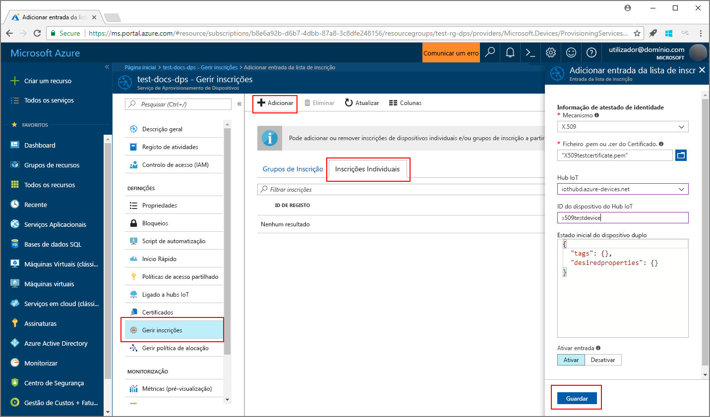
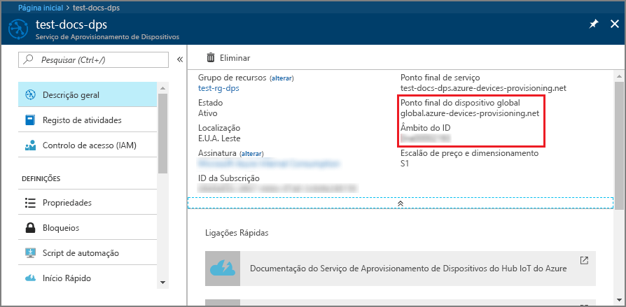

# <a name="create-and-provision-a-simulated-x509-device-using-python-device-sdk-for-iot-hub-device-provisioning-service"></a>Criar e aprovisionar um dispositivo X.509 simulado através do SDK de dispositivo Python com o Serviço Aprovisionamento de Dispositivos no Hub IoT
> [!div class="op_single_selector"]
> * [C](quick-create-simulated-device-x509.md)
> * [Java](quick-create-simulated-device-x509-java.md)
> * [C#](quick-create-simulated-device-x509-csharp.md)
> * [Python](quick-create-simulated-device-x509-python.md)

Estes passos mostram como simular um dispositivo X.509 no seu computador de desenvolvimento que executa o SO Windows e utilizar um código de exemplo Python para ligar esse dispositivo ao Serviço Aprovisionamento de Dispositivos e ao seu hub IoT. 

Certifique-se de que concluir os passos em [Set up IoT Hub Device Provisioning Service with the Azure portal](./quick-setup-auto-provision.md) (Configurar o Serviço Aprovisionamento de Dispositivos com o portal do Azure).


## <a name="prepare-the-environment"></a>Preparar o ambiente 

1. Certifique-se de que tem o [Visual Studio 2015](https://www.visualstudio.com/vs/older-downloads/) ou o [Visual Studio 2017](https://www.visualstudio.com/vs/) instalado no seu computador. Tem de ter a carga de trabalho do "Ambiente de trabalho de desenvolvimento com C++" ativada para a sua instalação do Visual Studio.

1. Transfira e instale o [sistema de compilação CMake](https://cmake.org/download/).

1. Verifique se `git` está instalado no computador e que é adicionado às variáveis de ambiente às quais a janela de comandos pode aceder. Veja as [ferramentas de cliente Git da Software Freedom Conservancy](https://git-scm.com/download/) relativamente à mais recente versão das ferramentas de `git` a instalar, que incluem o **Git Bash**, a aplicação de linha de comandos que pode utilizar para interagir com o seu repositório Git local. 

1. Abra uma linha de comandos ou o Git Bash. Clone o repositório do GitHub para exemplo de código de simulação de dispositivo.
    
    ```cmd/sh
    git clone https://github.com/Azure/azure-iot-sdk-python.git --recursive
    ```

1. Crie uma pasta na sua cópia local deste repositório do GitHub para o processo de compilação CMake. 

    ```cmd/sh
    cd azure-iot-sdk-python/c
    mkdir cmake
    cd cmake
    ```

1. Execute o comando seguinte para criar a solução do Visual Studio para o cliente de aprovisionamento.

    ```cmd/sh
    cmake -Duse_prov_client:BOOL=ON ..
    ```


## <a name="create-a-device-enrollment-entry"></a>Criar uma entrada de inscrição de dispositivos

1. Abra a solução gerada na pasta *cmake* com o nome `azure_iot_sdks.sln` e compile-a no Visual Studio.

1. Clique com o botão direito do rato no projeto **dice\_device\_enrollment**, na pasta **Provision\_Tools** e selecione **Definir como Projeto de Arranque**. Execute a solução. Na janela de saída, introduza `i` para inscrição individual, quando lhe for pedido. A janela de saída apresenta um certificado X.509 gerado localmente para o seu dispositivo simulado. Copie a saída para a área de transferência, começando em *-----BEGIN CERTIFICATE-----* e terminando em *-----END CERTIFICATE-----*, garantindo que também inclui estas duas linhas. 

    
 
1. Crie um ficheiro com o nome **_X509testcertificate.pem_** no seu computador Windows, abra-o num editor à sua escolha e copie os conteúdos da área de transferência para este ficheiro. Guarde o ficheiro. 

1. Inicie sessão no portal do Azure, clique no botão **Todos os recursos**, no menu do lado esquerdo, e abra o seu serviço de aprovisionamento.

1. No painel de resumo do Serviço Aprovisionamento de Dispositivos, selecione **Gerir inscrições**. Selecione o separador **Inscrições Individuais** e clique no botão **Adicionar**, na parte superior. 

1. Em **Adicionar entrada da lista de inscrições**, introduza as informações seguintes:
    - Selecione **X.509** como o *Mecanismo* de atestado de identidades.
    - Em *Ficheiro de certificado .pem ou .cer*, selecione o ficheiro de certificado **_X509testcertificate.pem_** criado nos passos anteriores mediante a utilização do widget *Explorador de Ficheiros*.
    - Opcionalmente, pode fornecer as seguintes informações:
        - Selecione um hub IoT ligado ao seu serviço de aprovisionamento.
        - Introduza um ID de dispositivo exclusivo. Certifique-se de que evita dados confidenciais quando der o nome ao seu dispositivo. 
        - Atualize o **estado inicial do dispositivo duplo** com a configuração inicial pretendida para o dispositivo.
    - Quando tiver terminado, clique no botão **Guardar**. 

      

   Após a instalação bem-sucedida, o seu dispositivo X.509 aparece como **riot-device-cert** na coluna *ID de Registo* do separador *Inscrições Individuais*. 


## <a name="simulate-the-device"></a>Simular o dispositivo

1. No painel de resumo do Serviço Aprovisionamento de Dispositivos, selecione **Descrição geral**. Anote o seu _Âmbito de ID_ e _Ponto Final de Serviço Global_.

    

1. Transfira e instale o [Python 2.x ou 3.x](https://www.python.org/downloads/). Certifique-se de que utiliza a instalação de 32 ou 64 bits, conforme exigido pela sua configuração. Quando lhe for pedido durante a instalação, confirme que adiciona Python às variáveis de ambiente específicas da sua plataforma. Se estiver a utilizar Python 2.x, poderá ter de [instalar ou atualizar o *pip*, o sistema de gestão de pacotes de Python](https://pip.pypa.io/en/stable/installing/).
    - Se estiver a utilizar o SO Windows, o [pacote redistribuível Visual C++](http://www.microsoft.com/download/confirmation.aspx?id=48145), para permitir a utilização de DLLs nativas de Python.

1. Siga [estas instruções](https://github.com/Azure/azure-iot-sdk-python/blob/master/doc/python-devbox-setup.md) para criar os pacotes Python.

    > [!NOTE]
        > Se estiver a utilizar `pip`, certifique-se de que instala também o pacote `azure-iot-provisioning-device-client`.

1. Navegue para a pasta de exemplos.

    ```cmd/sh
    cd azure-iot-sdk-python/provisioning_device_client/samples
    ```

1. Através do IDE Python, edite o script python com o nome **provisioning\_device\_client\_sample.py**. Modifique as variáveis _GLOBAL\_PROV\_URI_ e _ID\_SCOPE_ para os valores anotados previamente.

    ```python
    GLOBAL_PROV_URI = "{globalServiceEndpoint}"
    ID_SCOPE = "{idScope}"
    SECURITY_DEVICE_TYPE = ProvisioningSecurityDeviceType.X509
    PROTOCOL = ProvisioningTransportProvider.HTTP
    ```

1. Execute o exemplo. 

    ```cmd/sh
    python provisioning_device_client_sample.py
    ```

1. A aplicação irá ligar, inscrever o dispositivo e mostrar uma mensagem de inscrição com êxito.

    

1. No portal, navegue para o IoT hub ligado ao seu serviço de aprovisionamento e abra o painel **Explorador de Dispositivos**. Após o aprovisionamento bem-sucedido do dispositivo X.509 simulado no hub, o ID de dispositivo aparece no painel **Explorador de Dispositivos**, com o *ESTADO* **ativado**. Poderá ter de clicar no botão **Atualizar**, na parte superior, se já tiver aberto o painel antes de executar a aplicação de dispositivo de exemplo. 

     

> [!NOTE]
> Se tiver alterado o *estado inicial do dispositivo duplo* face ao valor predefinido na entrada de inscrição do seu dispositivo, este pode extrair o estado pretendido do dispositivo duplo a partir do hub e agir em conformidade. Para obter mais informações, veja [Understand and use device twins in IoT Hub](../iot-hub/iot-hub-devguide-device-twins.md) (Compreender e utilizar dispositivos duplos no Hub IoT).
>


## <a name="clean-up-resources"></a>Limpar recursos

Se quiser continuar a trabalhar e a explorar o exemplo de cliente do dispositivo, não limpe os recursos criados neste Guia Rápido. Se não planear continuar, utilize os passos seguintes para eliminar todos os recursos criados no Guia Rápido.

1. Feche a janela da saída do exemplo de dispositivo cliente no seu computador.
1. No menu do lado esquerdo do portal do Azure, clique em **Todos os recursos** e selecione o seu Serviço Aprovisionamento de Dispositivos. Abra o painel **Gerir Inscrições** para o seu serviço e, em seguida, clique no separador **Inscrições Individuais**. Selecione o *ID DE REGISTO* do dispositivo que inscreveu neste Início Rápido e clique no botão **Eliminar** na parte superior. 
1. No menu do lado esquerdo do portal do Azure, clique em **Todos os recursos** e selecione o seu hub IoT. Abra o painel **Dispositivos IoT** do seu hub, selecione o *ID DE DISPOSITIVO* do dispositivo que registou neste Início Rápido e, em seguida, clique no botão **Eliminar** Na parte superior.

## <a name="next-steps"></a>Passos seguintes

Neste Início Rápido, criou um dispositivo X.509 simulado no seu computador Windows e aprovisionou-o no seu hub IoT com o Serviço Aprovisionamento de Dispositivos no Hub IoT do Azure no portal. Para saber como inscrever o seu dispositivo X.509 programaticamente, continue para o Início Rápido para inscrição programática de dispositivos X.509. 

> [!div class="nextstepaction"]
> [Início rápido do Azure - Inscrever dispositivos X.509 no Serviço de Aprovisionamento de Dispositivos no Hub IoT do Azure](quick-enroll-device-x509-java.md)
