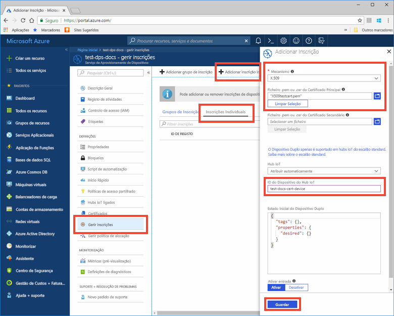

# <a name="quickstart-provision-an-x509-simulated-device-using-the-azure-iot-c-sdk"></a>Início Rápido: Aprovisionar um dispositivo X.509 simulado com o SDK C do Azure IoT

[!INCLUDE [iot-dps-selector-quick-create-simulated-device-x509](../../includes/iot-dps-selector-quick-create-simulated-device-x509.md)]

Neste início rápido, vai aprender a criar e executar um simulador de dispositivos X.509 numa máquina de desenvolvimento do Windows. Vai configurar este dispositivo simulado para ser atribuído a um hub IoT através de uma inscrição numa instância do Serviço de Aprovisionamento de Dispositivos. Será utilizado código de exemplo do [SDK C do Azure IoT](https://github.com/Azure/azure-iot-sdk-c) para simular uma sequência de arranque do dispositivo. O dispositivo será reconhecido com base na inscrição no serviço de aprovisionamento e atribuído ao hub IoT.

Se não estiver familiarizado com o processo de aprovisionamento automático, reveja [Conceitos de aprovisionamento automático](concepts-auto-provisioning.md). Certifique-se também de que executa os passos descritos em [Configurar o Serviço de Aprovisionamento de Dispositivos no Hub IoT com o portal do Azure](./quick-setup-auto-provision.md) antes de continuar este início rápido. 

[!INCLUDE [quickstarts-free-trial-note](../../includes/quickstarts-free-trial-note.md)]


## <a name="prerequisites"></a>Pré-requisitos

* Visual Studio 2015 ou [Visual Studio 2017](https://www.visualstudio.com/vs/) com a carga de trabalho ["Desenvolvimento do ambiente de trabalho em C++"](https://www.visualstudio.com/vs/support/selecting-workloads-visual-studio-2017/) ativada.
* Versão mais recente do [Git](https://git-scm.com/download/) instalada.


<a id="setupdevbox"></a>

## <a name="prepare-a-development-environment-for-the-azure-iot-c-sdk"></a>Preparar um ambiente de desenvolvimento para o SDK C do Azure IoT

Nesta secção, vai preparar um ambiente de desenvolvimento utilizado para criar o [SDK C do Azure IoT](https://github.com/Azure/azure-iot-sdk-c) que inclui o código de exemplo para a sequência de arranque X.509.

1. Transfira a versão mais recente do [sistema de compilação CMake](https://cmake.org/download/). Nessa mesma localização, procure o hash criptográfico para a versão da distribuição binária que escolheu. Verifique o binário transferido com o valor de hash criptográfico correspondente. O exemplo seguinte utilizou o Windows PowerShell para verificar o hash criptográfico para a versão 3.11.4 da distribuição de MSI x64:

    ```PowerShell
    PS C:\Users\wesmc\Downloads> $hash = get-filehash .\cmake-3.11.4-win64-x64.msi
    PS C:\Users\wesmc\Downloads> $hash.Hash -eq "56e3605b8e49cd446f3487da88fcc38cb9c3e9e99a20f5d4bd63e54b7a35f869"
    True
    ```

    É importante que os pré-requisitos do Visual Studio (Visual Studio e a carga de trabalho "Desenvolvimento do ambiente de trabalho em C++") estejam instalados no computador, **antes** de iniciar a instalação de `CMake`. Depois de os pré-requisitos estarem assegurados e a transferência verificada, instale o sistema de compilação CMake.

2. Abra uma linha de comandos ou a shell do Git Bash. Execute o seguinte comando para clonar o [SDK C do Azure IoT](https://github.com/Azure/azure-iot-sdk-c) no repositório do GitHub:
    
    ```cmd/sh
    git clone https://github.com/Azure/azure-iot-sdk-c.git --recursive
    ```
    Atualmente, o tamanho deste repositório é de cerca de 220 MB. Esta operação deve demorar vários minutos a ser concluída.


3. Crie um subdiretório `cmake` no diretório de raiz do repositório git e navegue para essa pasta. 

    ```cmd/sh
    cd azure-iot-sdk-c
    mkdir cmake
    cd cmake
    ```

4. O exemplo de código utiliza um certificado X.509 para fornecer um atestado através da autenticação X.509. Execute o seguinte comando para compilar uma versão do SDK específica da plataforma de cliente de desenvolvimento. Será gerada uma solução do Visual Studio para o dispositivo simulado no diretório `cmake`. 

    ```cmd
    cmake -Duse_prov_client:BOOL=ON ..
    ```
    
    Se `cmake` não encontrar o compilador de C++, poderá obter erros de compilação ao executar o comando acima. Se isto acontecer, tente executar o comando seguinte na [linha de comandos do Visual Studio](https://docs.microsoft.com/dotnet/framework/tools/developer-command-prompt-for-vs). 

    Assim que a compilação for concluída com êxito, as últimas linhas de saída terão um aspeto semelhante ao seguinte:

    ```cmd/sh
    $ cmake -Duse_prov_client:BOOL=ON ..
    -- Building for: Visual Studio 15 2017
    -- Selecting Windows SDK version 10.0.16299.0 to target Windows 10.0.17134.
    -- The C compiler identification is MSVC 19.12.25835.0
    -- The CXX compiler identification is MSVC 19.12.25835.0

    ...

    -- Configuring done
    -- Generating done
    -- Build files have been written to: E:/IoT Testing/azure-iot-sdk-c/cmake
    ```


<a id="portalenroll"></a>

## <a name="create-a-self-signed-x509-device-certificate"></a>Criar um certificado de dispositivo X.509 autoassinado

Nesta secção, vai utilizar um certificado X.509 autoassinado e é importante ter em consideração o seguinte:

* Os certificados autoassinados são apenas para teste e não devem ser utilizados na produção.
* A data de expiração predefinida para um certificado autoassinado é de 1 ano.

Vai utilizar o código de exemplo do SDK C do Azure IoT para criar o certificado a ser utilizado na entrada de inscrição individual do dispositivo simulado.

1. Inicie o Visual Studio e abra o novo ficheiro de solução com o nome `azure_iot_sdks.sln`. Este ficheiro de solução está localizado na pasta `cmake` que criou anteriormente na raiz do repositório git azure-iot-sdk-c.

2. No menu do Visual Studio, selecione **Build** (Compilar)  > **Build Solution** (Compilar Solução) para criar todos os projetos na solução.

3. Na janela *Solution Explorer* (Explorador de Soluções) do Visual Studio, navegue para a pasta **Provision\_Tools**. Clique com o botão direito do rato no projeto **dice\_device\_enrollment** e selecione **Set as Startup Project** (Definir como Projeto de Arranque”). 

4. No menu do Visual Studio, selecione **Debug** (Depurar)  > **Start without debugging** (Iniciar sem depuração) para executar a solução. Na janela de saída, introduza **i** para inscrição individual, quando lhe for pedido. 

    A janela de saída apresenta um certificado X.509 autoassinado gerado localmente para o seu dispositivo simulado. Copie a saída para a área de transferência, começando em **-----BEGIN CERTIFICATE-----** e terminando no primeiro **-----END CERTIFICATE-----**, garantindo que também inclui estas duas linhas. Tenha em atenção que apenas necessita o primeiro certificado na janela de saída.
 
5. Com um editor de texto, guarde o certificado num novo ficheiro com o nome  **_X509testcert.pem_**. 


## <a name="create-a-device-enrollment-entry-in-the-portal"></a>Criar uma entrada de inscrição de dispositivos no portal

1. Inicie sessão no portal do Azure, clique no botão **Todos os recursos**, no menu do lado esquerdo, e abra o Serviço Aprovisionamento de Dispositivos.

2. Selecione o separador **Gerir inscrições** e, em seguida, clique no botão **Adicionar inscrição individual** na parte superior. 

3. Em **Adicionar inscrição**, introduza as seguintes informações e clique no botão **Guardar**.

    - **Mecanismo:** selecione **X.509** como *Mecanismo* de atestado de identidades.
    - **Ficheiro de certificado primário .pem ou .cer:** clique em **Selecionar um ficheiro** para selecionar o ficheiro de certificado, X509testcert.pem, criado anteriormente.
    - **ID do dispositivo do Hub IoT:** introduza **test-docs-cert-device** para atribuir um ID ao dispositivo.

    [](./media/quick-create-simulated-device-x509/individual-enrollment.png#lightbox)

    Após a instalação bem-sucedida, o seu dispositivo X.509 aparece como **riot-device-cert** na coluna *ID de Registo* do separador *Inscrições Individuais*. 


<a id="firstbootsequence"></a>

## <a name="simulate-first-boot-sequence-for-the-device"></a>Simular a sequência de primeiro arranque para o dispositivo

Nesta secção, atualize o código de exemplo para enviar a sequência de arranque do dispositivo para a instância do Serviço de Aprovisionamento de Dispositivos. Esta sequência de arranque fará com que o dispositivo seja reconhecido e atribuído a um hub IoT ligado à instância do Serviço de Aprovisionamento de Dispositivos.


1. No portal do Azure, selecione o separador **Descrição Geral** do Serviço de Aprovisionamento de Dispositivos e anote o valor de **_Âmbito do ID_**.

     

2. Na janela *Solution Explorer* (Explorador de Soluções) do Visual Studio, navegue para a pasta **Provision\_Samples**. Expanda o projeto de exemplo com o nome **prov\_dev\_client\_sample**. Expanda **Source Files** (Ficheiros de Origem) e abra **prov\_dev\_client\_sample.c**.

3. Localize a constante `id_scope` e substitua o valor pelo seu **Âmbito do ID** que copiou anteriormente. 

    ```c
    static const char* id_scope = "0ne00002193";
    ```

4. Localize a definição da função `main()` no mesmo ficheiro. Certifique-se de que a variável `hsm_type` está definida como `SECURE_DEVICE_TYPE_X509` em vez de `SECURE_DEVICE_TYPE_TPM`, conforme mostrado abaixo.

    ```c
    SECURE_DEVICE_TYPE hsm_type;
    //hsm_type = SECURE_DEVICE_TYPE_TPM;
    hsm_type = SECURE_DEVICE_TYPE_X509;
    ```

5. Clique com o botão direito do rato no projeto **prov\_dev\_client\_sample** e selecione **Definir como Projeto de Arranque**. 

6. No menu do Visual Studio, selecione **Debug** (Depurar)  > **Start without debugging** (Iniciar sem depuração) para executar a solução. Na linha de comandos para recriar o projeto, clique em **Yes** (Sim) para recriar o projeto antes da execução.

    A saída seguinte é um exemplo do cliente do dispositivo de aprovisionamento a arrancar e a ligar com êxito à instância do serviço de aprovisionamento para obter informações e registar o hub IoT:

    ```cmd
    Provisioning API Version: 1.2.7

    Registering... Press enter key to interrupt.

    Provisioning Status: PROV_DEVICE_REG_STATUS_CONNECTED
    Provisioning Status: PROV_DEVICE_REG_STATUS_ASSIGNING
    Provisioning Status: PROV_DEVICE_REG_STATUS_ASSIGNING

    Registration Information received from service: 
    test-docs-hub.azure-devices.net, deviceId: test-docs-cert-device    
    ```

7. No portal, navegue para o hub IoT ligado ao seu serviço de aprovisionamento e clique no separador **Dispositivos IoT**. Após o aprovisionamento bem-sucedido do dispositivo X.509 simulado no hub, o ID de dispositivo aparece no painel **Dispositivos IoT**, com o *ESTADO* **ativado**. Tenha em atenção que pode ter de clicar no botão **Atualizar** na parte superior. 

     


## <a name="clean-up-resources"></a>Limpar recursos

Se quiser continuar a trabalhar e a explorar o exemplo de cliente do dispositivo, não limpe os recursos criados neste Guia Rápido. Se não planear continuar, utilize os passos seguintes para eliminar todos os recursos criados no Guia Rápido.

1. Feche a janela da saída do exemplo de dispositivo cliente no seu computador.
1. No menu do lado esquerdo do portal do Azure, clique em **Todos os recursos** e selecione o seu Serviço Aprovisionamento de Dispositivos. Abra **Gerir Inscrições** para o seu serviço e, em seguida, clique no separador **Inscrições Individuais**. Selecione o *ID DE REGISTO* do dispositivo que inscreveu neste Início Rápido e clique no botão **Eliminar** na parte superior. 
1. No menu do lado esquerdo do portal do Azure, clique em **Todos os recursos** e selecione o seu hub IoT. Abra **Dispositivos IoT** para o seu hub, selecione o *ID DE DISPOSITIVO* do dispositivo que registou neste Início Rápido e, em seguida, clique no botão **Eliminar** na parte superior.

## <a name="next-steps"></a>Passos seguintes

e para o hub IoT ligado ao seu serviçNeste Início Rápido, criou um dispositivo X.509 simulado no seu computador Windows e aprovisionou-o no seu hub IoT com o Serviço Aprovisionamento de Dispositivos no Hub IoT do Azure no portal. Para saber como inscrever o seu dispositivo X.509 programaticamente, continue para o Manual de Início Rápido para inscrição programática de dispositivos X.509. 

> [!div class="nextstepaction"]
> [Manual de Início Rápido do Azure - Inscrever dispositivos X.509 no Serviço de Aprovisionamento de Dispositivos no Hub IoT do Azure](quick-enroll-device-x509-java.md)
