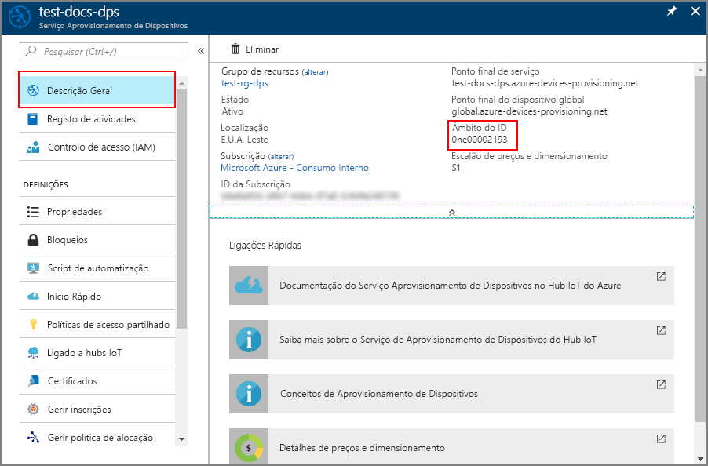

# <a name="create-and-provision-an-x509-simulated-device-using-c-device-sdk-for-iot-hub-device-provisioning-service"></a>Criar e aprovisionar um dispositivo simulado X.509 com o SDK de dispositivo C com o Serviço de Aprovisionamento de Dispositivos no Hub IoT
> [!div class="op_single_selector"]
> * [C](quick-create-simulated-device-x509.md)
> * [Java](quick-create-simulated-device-x509-java.md)
> * [C#](quick-create-simulated-device-x509-csharp.md)
> * [Python](quick-create-simulated-device-x509-python.md)

Estes passos mostram como simular um dispositivo X.509 no seu computador de desenvolvimento que executa o SO Windows e utilizar um código de exemplo para ligar esse dispositivo ao Serviço Aprovisionamento de Dispositivos e ao seu hub IoT. 

Certifique-se de que concluir os passos em [Set up IoT Hub Device Provisioning Service with the Azure portal](./quick-setup-auto-provision.md) (Configurar o Serviço Aprovisionamento de Dispositivos com o portal do Azure).

<a id="setupdevbox"></a>

## <a name="prepare-the-development-environment"></a>Preparar o ambiente de desenvolvimento 

1. Certifique-se de que tem o Visual Studio 2015 ou o [Visual Studio 2017](https://www.visualstudio.com/vs/) instalado no seu computador. Tem de ter a carga de trabalho do ["Ambiente de trabalho de desenvolvimento com C++"](https://www.visualstudio.com/vs/support/selecting-workloads-visual-studio-2017/) ativada para a sua instalação do Visual Studio.

2. Transfira e instale o [sistema de compilação CMake](https://cmake.org/download/). É importante que o Visual Studio com a carga de trabalho "Ambiente de trabalho de desenvolvimento com C++" esteja instalado no computador, **antes** da `cmake` instalação. 

3. Verifique se `git` está instalado no computador e que é adicionado às variáveis de ambiente às quais a janela de comandos pode aceder. Veja as [ferramentas de cliente Git da Software Freedom Conservancy](https://git-scm.com/download/) relativamente à mais recente versão das ferramentas de `git` a instalar, que incluem o **Git Bash**, a aplicação de linha de comandos que pode utilizar para interagir com o seu repositório Git local. 

4. Abra uma linha de comandos ou o Git Bash. Clone o repositório do GitHub para exemplo de código de simulação de dispositivo.
    
    ```cmd
    git clone https://github.com/Azure/azure-iot-sdk-c.git --recursive
    ```

5. Crie uma pasta na sua cópia local deste repositório do GitHub para o processo de compilação CMake. 

    ```cmd
    cd azure-iot-sdk-c
    mkdir cmake
    cd cmake
    ```

6. Execute o comando seguinte para criar a solução do Visual Studio para o cliente de aprovisionamento.

    ```cmd
    cmake -Duse_prov_client:BOOL=ON ..
    ```
    
    Se `cmake` não encontrar o compilador de C++, poderá obter erros de compilação ao executar o comando acima. Se isto acontecer, tente executar o comando seguinte na [linha de comandos do Visual Studio](https://docs.microsoft.com/dotnet/framework/tools/developer-command-prompt-for-vs). 


<a id="portalenroll"></a>

## <a name="create-a-device-enrollment-entry-in-the-device-provisioning-service"></a>Criar uma entrada de inscrição de dispositivos no Serviço de Aprovisionamento de Dispositivos

1. Abra a solução gerada na pasta *cmake* com o nome `azure_iot_sdks.sln` e compile-a no Visual Studio.

2. Clique com o botão direito do rato no projeto **dice\_device\_enrollment**, na pasta **Provision\_Tools** e selecione **Definir como Projeto de Arranque**. Execute a solução. Na janela de saída, introduza **i** para inscrição individual, quando lhe for pedido. A janela de saída apresenta um certificado X.509 gerado localmente para o seu dispositivo simulado. Copie a saída para a área de transferência, começando em *-----BEGIN CERTIFICATE-----* e terminando no primeiro *-----END CERTIFICATE-----*, garantindo que também inclui estas duas linhas. Tenha em atenção que apenas necessita o primeiro certificado na janela de saída.
 
3. Crie um ficheiro com o nome **_X509testcert.pem_** no seu computador Windows, abra-o num editor à sua escolha e copie os conteúdos da área de transferência para este ficheiro. Guarde o ficheiro. 

4. Inicie sessão no portal do Azure, clique no botão **Todos os recursos**, no menu do lado esquerdo, e abra o seu serviço de aprovisionamento.

4. Abra o painel **Gerir inscrições** para o seu serviço. Selecione o separador **Inscrições Individuais** e clique no botão **Adicionar**, na parte superior. 

5. Em **Adicionar entrada da lista de inscrições**, introduza as informações seguintes:
    - Selecione **X.509** como o *Mecanismo* de atestado de identidades.
    - Em *Ficheiro de certificado .pem ou .cer*, selecione o ficheiro de certificado **_X509testcert.pem_** criado nos passos anteriores mediante a utilização do widget *Explorador de Ficheiros*.
    - Opcionalmente, pode fornecer as seguintes informações:
        - Selecione um hub IoT ligado ao seu serviço de aprovisionamento.
        - Introduza um ID de dispositivo exclusivo. Certifique-se de que evita dados confidenciais quando der o nome ao seu dispositivo. 
        - Atualize o **estado inicial do dispositivo duplo** com a configuração inicial pretendida para o dispositivo.
    - Quando tiver terminado, clique no botão **Guardar**. 

      

   Após a instalação bem-sucedida, o seu dispositivo X.509 aparece como **riot-device-cert** na coluna *ID de Registo* do separador *Inscrições Individuais*. 


<a id="firstbootsequence"></a>

## <a name="simulate-first-boot-sequence-for-the-device"></a>Simular a sequência de primeiro arranque para o dispositivo

1. No portal do Azure, selecione o painel **Descrição Geral** do seu Serviço Aprovisionamento de Dispositivos e anote o valor de **_Âmbito do ID_**.

     

2. No Visual Studio no seu computador, navegue para o projeto de exemplo com o nome **prov\_dev\_client\_sample**, na pasta **Provision\_Samples**, e abra o ficheiro **prov\_dev\_client\_sample.c**.

3. Atribua o valor _Âmbito de ID_ à variável `id_scope`. 

    ```c
    static const char* id_scope = "[ID Scope]";
    ```

4. Na função **principal ()** no mesmo ficheiro, certifique-se de que **SECURE_DEVICE_TYPE** está definido como X.509.

    ```c
    SECURE_DEVICE_TYPE hsm_type;
    hsm_type = SECURE_DEVICE_TYPE_X509;
    ```

   Comente ou elimine a instrução `hsm_type = SECURE_DEVICE_TYPE_TPM;` que possa estar presente. 

5. Clique com o botão direito do rato no projeto **prov\_dev\_client\_sample** e selecione **Definir como Projeto de Arranque**. Execute o exemplo. Repare nas mensagens que simulam o arranque e a ligação do dispositivo ao Serviço Aprovisionamento de Dispositivos para obter as informações do seu hub IoT. Procure a mensagem que indica que o registo no hub foi bem-sucedido: *Registration Information received from service: yourhuburl!* (Informações de registo recebidas do serviço: urldoseuhub!). Feche a janela quando lhe for pedido.

6. No portal, navegue para o hub IoT ligado ao seu serviço de aprovisionamento e abra o painel **Dispositivos IoT**. Após o aprovisionamento bem-sucedido do dispositivo X.509 simulado no hub, o ID de dispositivo aparece no painel **Dispositivos IoT**, com o *ESTADO* **ativado**. Tenha em atenção que poderá ter de clicar no botão **Atualizar**, na parte superior, se já tiver aberto o painel antes de executar a aplicação de dispositivo de exemplo. 

     

    Se tiver alterado o *estado inicial do dispositivo duplo* face ao valor predefinido na entrada de inscrição do seu dispositivo, este pode extrair o estado pretendido do dispositivo duplo a partir do hub e agir em conformidade. Para obter mais informações, veja [Understand and use device twins in IoT Hub](../iot-hub/iot-hub-devguide-device-twins.md) (Compreender e utilizar dispositivos duplos no Hub IoT).


> [!IMPORTANT]
> Também pode fazer um *Inscrição de grupo* dos dispositivos X.509, efetuando as seguintes alterações aos passos neste Guia de Introdução:
>    1. Configurar o computador Windows para utilizar a biblioteca **OpenSSL** em vez da predefinição **SChannel** seguindo a secção **WebSockets** no guia [ Configurar um ambiente de desenvolvimento do Windows](https://github.com/Azure/azure-iot-sdk-c/blob/master/doc/devbox_setup.md#windows). Tenha em atenção que os computadores Linux utilizam OpenSSL por predefinição. 
>    2. No passo 2 da secção [Criar uma entrada de inscrição de dispositivos no serviço de aprovisionamento de dispositivos](#portalenroll) acima, introduza **g** para a inscrição de grupo.
>    3. Nos passos 4 e 5 da [mesma secção](#portalenroll), selecione **Grupos de Inscrição** e introduza as informações necessárias para a entrada de grupo.  
>

## <a name="clean-up-resources"></a>Limpar recursos

Se quiser continuar a trabalhar e a explorar o exemplo de cliente do dispositivo, não limpe os recursos criados neste Guia Rápido. Se não planear continuar, utilize os passos seguintes para eliminar todos os recursos criados no Guia Rápido.

1. Feche a janela da saída do exemplo de dispositivo cliente no seu computador.
1. No menu do lado esquerdo do portal do Azure, clique em **Todos os recursos** e selecione o seu Serviço Aprovisionamento de Dispositivos. Abra o painel **Gerir Inscrições** para o seu serviço e, em seguida, clique no separador **Inscrições Individuais**. Selecione o *ID DE REGISTO* do dispositivo que inscreveu neste Manual de Início Rápido e clique no botão **Eliminar** na parte superior. 
1. No menu do lado esquerdo do portal do Azure, clique em **Todos os recursos** e selecione o seu hub IoT. Abra o painel **Dispositivos IoT** do seu hub, selecione o *ID DE DISPOSITIVO* do dispositivo que registou neste Manual de Início Rápido e, em seguida, clique no botão **Eliminar** na parte superior.

## <a name="next-steps"></a>Passos seguintes

Neste Início Rápido, criou um dispositivo X.509 simulado no seu computador Windows e aprovisionou-o no seu hub IoT com o Serviço Aprovisionamento de Dispositivos no Hub IoT do Azure no portal. Para saber como inscrever o seu dispositivo X.509 programaticamente, continue para o Manual de Início Rápido para inscrição programática de dispositivos X.509. 

> [!div class="nextstepaction"]
> [Manual de Início Rápido do Azure - Inscrever dispositivos X.509 no Serviço de Aprovisionamento de Dispositivos no Hub IoT do Azure](quick-enroll-device-x509-java.md)
