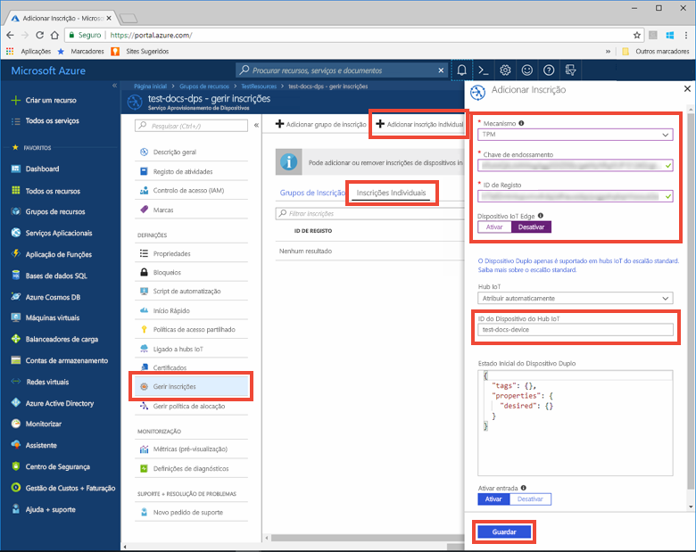
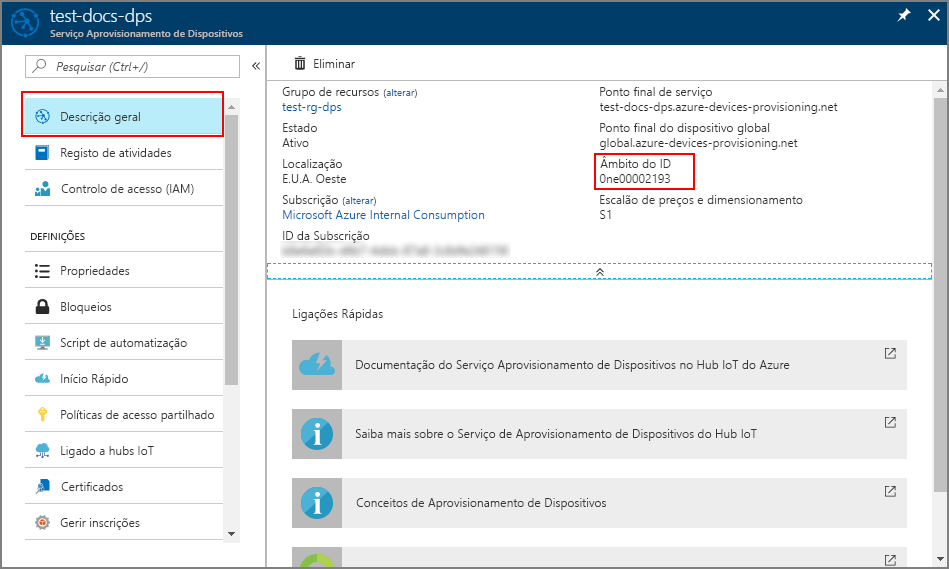
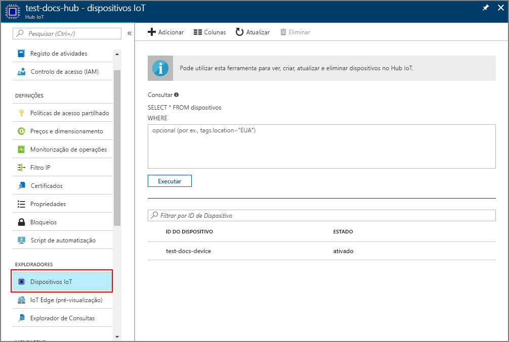

# <a name="create-and-provision-a-simulated-tpm-device-using-c-device-sdk-for-iot-hub-device-provisioning-service"></a>Criar e aprovisionar um dispositivo TPM simulado com o SDK de dispositivo C com o Serviço de Aprovisionamento de Dispositivos no Hub IoT
> [!div class="op_single_selector"]
> * [C](quick-create-simulated-device.md)
> * [Java](quick-create-simulated-device-tpm-java.md)
> * [C#](quick-create-simulated-device-tpm-csharp.md)
> * [Python](quick-create-simulated-device-tpm-python.md)

Estes passos mostram como criar um dispositivo simulado no seu computador de desenvolvimento que executa o SO Windows, executa o simulador Windows TPM como o [Módulo de Segurança de Hardware (HSM)](https://azure.microsoft.com/blog/azure-iot-supports-new-security-hardware-to-strengthen-iot-security/) do dispositivo e utiliza o código de exemplo para ligar esse dispositivo com o Serviço Aprovisionamento de Dispositivos e o seu hub IoT. 

Certifique-se de que concluir os passos em [Set up IoT Hub Device Provisioning Service with the Azure portal](./quick-setup-auto-provision.md) (Configurar o Serviço Aprovisionamento de Dispositivos com o portal do Azure).

<a id="setupdevbox"></a>

## <a name="prepare-the-development-environment"></a>Preparar o ambiente de desenvolvimento 

1. Certifique-se de que tem o Visual Studio 2015 ou o [Visual Studio 2017](https://www.visualstudio.com/vs/) instalado no seu computador. Tem de ter a carga de trabalho do ["Ambiente de trabalho de desenvolvimento com C++"](https://www.visualstudio.com/vs/support/selecting-workloads-visual-studio-2017/) ativada para a sua instalação do Visual Studio.

2. Transfira e instale o [sistema de compilação CMake](https://cmake.org/download/). É importante que o Visual Studio com a carga de trabalho "Ambiente de trabalho de desenvolvimento com C++" esteja instalado no computador, **antes** da `cmake` instalação.

3. Verifique se `git` está instalado no computador e que é adicionado às variáveis de ambiente às quais a janela de comandos pode aceder. Veja as [ferramentas de cliente Git da Software Freedom Conservancy](https://git-scm.com/download/) relativamente à mais recente versão das ferramentas de `git` a instalar, que incluem o **Git Bash**, a aplicação de linha de comandos que pode utilizar para interagir com o seu repositório Git local. 

4. Abra uma linha de comandos ou o Git Bash. Clone o repositório do GitHub para exemplo de código de simulação de dispositivo.
    
    ```cmd/sh
    git clone https://github.com/Azure/azure-iot-sdk-c.git --recursive
    ```

5. Crie uma pasta na sua cópia local deste repositório do GitHub para o processo de compilação CMake. 

    ```cmd/sh
    cd azure-iot-sdk-c
    mkdir cmake
    cd cmake
    ```

6. O exemplo de código utiliza um simulador Windows TPM. Execute o seguinte comando para ativar a autenticação de token SAS. Também gera uma solução do Visual Studio para o dispositivo simulado.

    ```cmd/sh
    cmake -Duse_prov_client:BOOL=ON -Duse_tpm_simulator:BOOL=ON ..
    ```

    Se `cmake` não encontrar o compilador de C++, poderá obter erros de compilação ao executar o comando acima. Se isto acontecer, tente executar o comando seguinte na [linha de comandos do Visual Studio](https://docs.microsoft.com/dotnet/framework/tools/developer-command-prompt-for-vs). 

7. Numa linha de comandos separada, navegue para a pasta de raiz do GitHub e execute o simulador [TPM](https://docs.microsoft.com/windows/device-security/tpm/trusted-platform-module-overview). O simulador escuta através de um socket nas portas 2321 e 2322. Não feche esta janela de comando; terá de manter este simulador em execução até ao fim deste Guia de início rápido. 

   Se está na pasta *cmake*, execute os seguintes comandos:

    ```cmd/sh
    cd..
    .\provisioning_client\deps\utpm\tools\tpm_simulator\Simulator.exe
    ```

<a id="simulatetpm"></a>

## <a name="simulate-tpm-device"></a>Simular dispositivo TPM

1. Abra a solução gerada na pasta *cmake* com o nome `azure_iot_sdks.sln` e compile-a no Visual Studio.

2. No painel *Explorador de Soluções* do Visual Studio, navegue para a pasta **Aprovisionar\_Ferramentas**. Clique com o botão direito do rato no projeto **tpm_device_provision** e selecione **Configurar como Projeto de Arranque**. 

3. Execute a solução. A janela de saída apresenta o **_ID de Registo_** e a **_Chave de Endossamento_** necessários para a inscrição do dispositivo. Anote estes valores. 


<a id="portalenrollment"></a>

## <a name="create-a-device-enrollment-entry-in-the-portal"></a>Criar uma entrada de inscrição de dispositivos no portal

1. Inicie sessão no portal do Azure, clique no botão **Todos os recursos**, no menu do lado esquerdo, e abra o Serviço Aprovisionamento de Dispositivos.

2. No painel de resumo do Serviço Aprovisionamento de Dispositivos, selecione **Gerir inscrições**. Selecione o separador **Inscrições Individuais** e clique no botão **Adicionar**, na parte superior. 

3. Em **Adicionar entrada da lista de inscrições**, introduza as informações seguintes:
    - Selecione **TPM** como o *Mecanismo* de atestado de identidades.
    - Introduza o *ID de Registo* e a *Chave de endossamento* do seu dispositivo TPM.
    - Opcionalmente, pode fornecer as seguintes informações:
        - Selecione um hub IoT ligado ao seu serviço de aprovisionamento.
        - Introduza um ID de dispositivo exclusivo. Certifique-se de que evita dados confidenciais quando der o nome ao seu dispositivo.
        - Atualize o **estado inicial do dispositivo duplo** com a configuração inicial pretendida para o dispositivo.
    - Quando tiver terminado, clique no botão **Guardar**. 

      

   Após a instalação bem-sucedida, o *ID de Registo* do seu dispositivo aparece na lista, no separador *Inscrições Individuais*. 


<a id="firstbootsequence"></a>

## <a name="simulate-first-boot-sequence-for-the-device"></a>Simular a sequência de primeiro arranque para o dispositivo

1. No portal do Azure, selecione o painel **Descrição Geral** do seu Serviço Aprovisionamento de Dispositivos e anote o valor de **_Âmbito do ID_**.

     

2. No *Explorador de Soluções* do Visual Studio da sua máquina, navegue para a pasta **Aprovisionar\_Exemplos**. Selecione o projeto de exemplo com o nome **prov\_dev\_client\_sample** e abra o ficheiro **prov\_dev\_client\_sample.c**.

3. Atribua o valor _Âmbito de ID_ à variável `id_scope`. 

    ```c
    static const char* id_scope = "[ID Scope]";
    ```

4. Na função **principal ()** no mesmo ficheiro, certifique-se de que **SECURE_DEVICE_TYPE** está definido como TPM.

    ```c
    SECURE_DEVICE_TYPE hsm_type;
    hsm_type = SECURE_DEVICE_TYPE_TPM;
    ```

   Comente ou elimine a instrução `hsm_type = SECURE_DEVICE_TYPE_X509;` que está predefinida. 

5. Clique com o botão direito do rato no projeto **prov\_dev\_client\_sample** e selecione **Definir como Projeto de Arranque**. Execute a solução. 

6. Repare nas mensagens que simulam o arranque e a ligação do dispositivo ao Serviço Aprovisionamento de Dispositivos para obter as informações do seu hub IoT. Após o aprovisionamento bem-sucedido do dispositivo simulado no hub IoT que está associado ao seu serviço de aprovisionamento, o ID aparece no painel **IoT Device** do hub. 

     

    Se tiver alterado o *estado inicial do dispositivo duplo* face ao valor predefinido na entrada de inscrição do seu dispositivo, este pode extrair o estado pretendido do dispositivo duplo a partir do hub e agir em conformidade. Para obter mais informações, veja [Understand and use device twins in IoT Hub](../iot-hub/iot-hub-devguide-device-twins.md) (Compreender e utilizar dispositivos duplos no Hub IoT)


## <a name="clean-up-resources"></a>Limpar recursos

Se quiser continuar a trabalhar e a explorar o exemplo de cliente do dispositivo, não limpe os recursos criados neste Guia Rápido. Se não planear continuar, utilize os passos seguintes para eliminar todos os recursos criados no Guia Rápido.

1. Feche a janela da saída do exemplo de dispositivo cliente no seu computador.
1. Feche a janela do simulador TPM no seu computador.
1. No menu do lado esquerdo do portal do Azure, clique em **Todos os recursos** e selecione o seu Serviço Aprovisionamento de Dispositivos. Abra o painel **Gerir Inscrições** para o seu serviço e, em seguida, clique no separador **Inscrições Individuais**. Selecione o *ID DE REGISTO* do dispositivo que inscreveu neste Início Rápido e clique no botão **Eliminar** na parte superior. 
1. No menu do lado esquerdo do portal do Azure, clique em **Todos os recursos** e selecione o seu hub IoT. Abra o painel **Dispositivos IoT** do seu hub, selecione o *ID DE DISPOSITIVO* do dispositivo que registou neste Início Rápido e, em seguida, clique no botão **Eliminar** Na parte superior.

## <a name="next-steps"></a>Passos seguintes

Neste guia de início rápido, criou um dispositivo simulado TPM no seu computador e aprovisionou-o no seu hub IoT com o Serviço Aprovisionamento de Dispositivos no Hub IoT. Para saber como inscrever o seu dispositivo TPM programaticamente, continue para o Manual de Início Rápido para inscrição programática de um dispositivo TPM. 

> [!div class="nextstepaction"]
> [Manual de Início Rápido do Azure - Inscrever o dispositivo TPM no Serviço de Aprovisionamento de Dispositivos no Hub IoT do Azure](quick-enroll-device-tpm-java.md)

