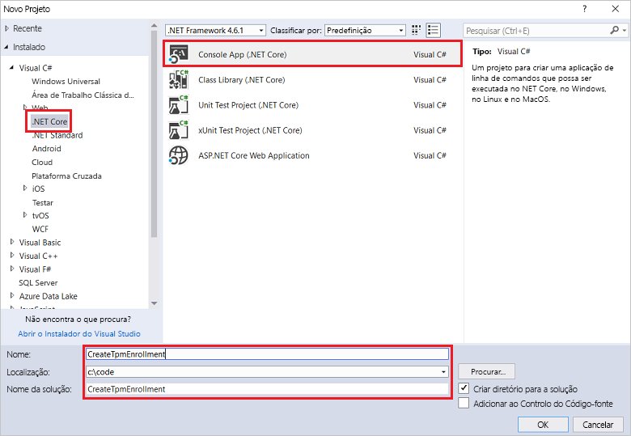
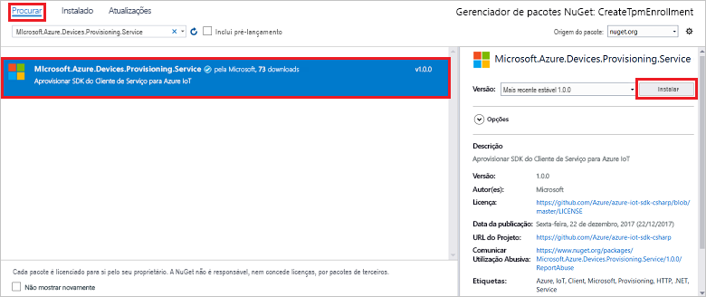
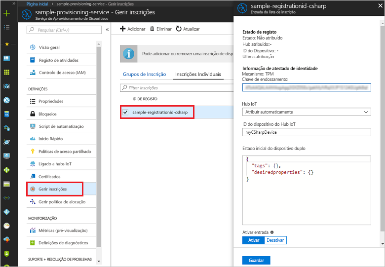

# <a name="enroll-tpm-device-to-iot-hub-device-provisioning-service-using-c-service-sdk"></a>Inscrever o dispositivo TPM no Serviço de Aprovisionamento de Dispositivos no Hub IoT com o SDK do serviço C#

[!INCLUDE [iot-dps-selector-quick-enroll-device-tpm](../../includes/iot-dps-selector-quick-enroll-device-tpm.md)]


Estes passos explicam como criar através de programação uma inscrição individual para um dispositivo TPM no Serviço de Aprovisionamento de Dispositivos no Hub IoT do Azure com o [SDK do Serviço C#](https://github.com/Azure/azure-iot-sdk-csharp) e um exemplo de aplicação C# .NET Core. Opcionalmente, pode inscrever um dispositivo TPM simulado no serviço de aprovisionamento com esta entrada de inscrição individual. Embora estes passos funcionem em computadores Windows e Linux, este artigo utiliza um computador de desenvolvimento Windows.

## <a name="prepare-the-development-environment"></a>Preparar o ambiente de desenvolvimento

1. Certifique-se de que tem o [Visual Studio 2017](https://www.visualstudio.com/vs/) instalado no seu computador. 
2. Certifique-se de que tem o [SDK .Net Core](https://www.microsoft.com/net/download/windows) instalado no computador. 
3. Antes de avançar, certifique-se de que executa os passos descritos em [Configurar o Serviço de Aprovisionamento de Dispositivos no Hub IoT com o portal do Azure](./quick-setup-auto-provision.md).
4. (Opcional) Se pretender inscrever um dispositivo simulado no final deste Manual de Início Rápido, siga os passos em [Criar e aprovisionar um dispositivo TPM simulado com o SDK do dispositivo C#](quick-create-simulated-device-tpm-csharp.md) até ao passo onde pode obter uma chave de endossamento para o dispositivo. Anote a chave de endossamento, o ID de registo e, opcionalmente, o ID do dispositivo, terá de os utilizar mais tarde neste Início Rápido. **Não siga os passos para criar uma inscrição individual com o portal do Azure.**

## <a name="get-the-connection-string-for-your-provisioning-service"></a>Obter a cadeia de ligação para o serviço de aprovisionamento

Para o exemplo neste Início Rápido, precisa da cadeia de ligação para o seu serviço de aprovisionamento.
1. Inicie sessão no portal do Azure, clique no botão **Todos os recursos**, no menu do lado esquerdo, e abra o Serviço de Aprovisionamento de Dispositivos. 
2. Clique em **Políticas de acesso partilhado** e, em seguida, clique na política de acesso que pretende utilizar para abrir as respetivas propriedades. Na janela **Política de Acesso**, copie e tome nota da cadeia de ligação da chave primária. 

    

## <a name="create-the-individual-enrollment-sample"></a>Criar o exemplo de inscrição individual 

Os passos nesta secção mostram como criar uma aplicação de consola .NET Core que adiciona uma inscrição individual para um dispositivo TPM ao seu serviço de aprovisionamento. Com algumas modificações, também pode seguir estes passos para criar uma aplicação de consola [Windows IoT Core](https://developer.microsoft.com/en-us/windows/iot) para adicionar à inscrição individual. Para saber mais sobre como programar com o IoT Core, veja a [Documentação para programadores do Windows IoT Core](https://docs.microsoft.com/windows/iot-core/).
1. No Visual Studio, adicione um projeto de Aplicação de Consola de Visual C# .NET Core a uma solução nova, através do modelo de projeto **Aplicação de Consola (.NET Core)**. Certifique-se de ter a versão 4.5.1 ou superior do .NET Framework. Atribua um nome ao projeto **CreateTpmEnrollment**.

    

2. No Explorador de Soluções, clique com o botão direito do rato no projeto **CreateTpmEnrollment** e, em seguida, clique em **Gerir Pacotes NuGet**.
3. Na janela **Gestor de Pacotes NuGet**, selecione **Procurar**, procure **Microsoft.Azure.Devices.Provisioning.Service**, selecione **Instalar** para instalar o pacote **Microsoft.Azure.Devices.Provisioning.Service** e aceite os termos de utilização. Este procedimento transfere, instala e adiciona uma referência ao pacote NuGet do [SDK de Cliente do Serviço de Aprovisionamento do Azure IoT](https://www.nuget.org/packages/Microsoft.Azure.Devices.Provisioning.Service/) e às respetivas dependências.

    

4. Adicione as seguintes declarações `using` a seguir às outras declarações `using` no início do ficheiro **Program.cs**:
   
   ```csharp
   using System.Threading.Tasks;
   using Microsoft.Azure.Devices.Provisioning.Service;
   ```
    
5. Adicione os seguintes campos à classe **Programa**.  
   - Substitua o valor do marcador de posição **ProvisioningConnectionString** pela cadeia de ligação do serviço de aprovisionamento para o qual pretende criar a inscrição.
   - Opcionalmente, pode alterar o ID do registo, a chave de endossamento, o ID do dispositivo e o estado de aprovisionamento. 
   - Se estiver a utilizar este Início Rápido em conjunto com o Início Rápido [Criar e aprovisionar um dispositivo TPM simulado com o SDK do dispositivo C#](quick-create-simulated-device-tpm-csharp.md) para aprovisionar um dispositivo simulado, substitua a chave de endossamento e o ID de registo com os valores que anotou nesse Início Rápido. Pode substituir o ID do dispositivo pelo valor sugerido nesse Início Rápido, utilizar o seu próprio valor ou utilizar o valor predefinido neste exemplo.
        
   ```csharp
   private static string ProvisioningConnectionString = "{Your provisioning service connection string}";
   private const string RegistrationId = "sample-registrationid-csharp";
   private const string TpmEndorsementKey =
       "AToAAQALAAMAsgAgg3GXZ0SEs/gakMyNRqXXJP1S124GUgtk8qHaGzMUaaoABgCAAEMAEAgAAAAAAAEAxsj2gUS" +
       "cTk1UjuioeTlfGYZrrimExB+bScH75adUMRIi2UOMxG1kw4y+9RW/IVoMl4e620VxZad0ARX2gUqVjYO7KPVt3d" +
       "yKhZS3dkcvfBisBhP1XH9B33VqHG9SHnbnQXdBUaCgKAfxome8UmBKfe+naTsE5fkvjb/do3/dD6l4sGBwFCnKR" +
       "dln4XpM03zLpoHFao8zOwt8l/uP3qUIxmCYv9A7m69Ms+5/pCkTu/rK4mRDsfhZ0QLfbzVI6zQFOKF/rwsfBtFe" +
       "WlWtcuJMKlXdD8TXWElTzgh7JS4qhFzreL0c1mI0GCj+Aws0usZh7dLIVPnlgZcBhgy1SSDQMQ==";
       
   // Optional parameters
   private const string OptionalDeviceId = "myCSharpDevice";
   private const ProvisioningStatus OptionalProvisioningStatus = ProvisioningStatus.Enabled;
   ```
    
6. Adicione o seguinte método à classe **Programa**.  Este código cria uma entrada de inscrição individual e, em seguida, chama o método **CreateOrUpdateIndividualEnrollmentAsync** no **ProvisioningServiceClient** para adicionar a inscrição individual ao serviço de aprovisionamento.
   
   ```csharp
   public static async Task RunSample()
   {
       Console.WriteLine("Starting sample...");

       using (ProvisioningServiceClient provisioningServiceClient =
               ProvisioningServiceClient.CreateFromConnectionString(ProvisioningConnectionString))
       {
           #region Create a new individualEnrollment config
           Console.WriteLine("\nCreating a new individualEnrollment...");
           Attestation attestation = new TpmAttestation(TpmEndorsementKey);
           IndividualEnrollment individualEnrollment =
                   new IndividualEnrollment(
                           RegistrationId,
                           attestation);

           // The following parameters are optional. Remove them if you don't need them.
           individualEnrollment.DeviceId = OptionalDeviceId;
           individualEnrollment.ProvisioningStatus = OptionalProvisioningStatus;
           #endregion

           #region Create the individualEnrollment
           Console.WriteLine("\nAdding new individualEnrollment...");
           IndividualEnrollment individualEnrollmentResult =
               await provisioningServiceClient.CreateOrUpdateIndividualEnrollmentAsync(individualEnrollment).ConfigureAwait(false);
           Console.WriteLine("\nIndividualEnrollment created with success.");
           Console.WriteLine(individualEnrollmentResult);
           #endregion
        
       }
   }
   ```
       
7. Por último, substitua o corpo do método **Principal** pelas seguintes linhas:
   
   ```csharp
   RunSample().GetAwaiter().GetResult();
   Console.WriteLine("\nHit <Enter> to exit ...");
   Console.ReadLine();
   ```
        
8. Compilar a solução.

## <a name="run-the-individual-enrollment-sample"></a>Executar o exemplo de inscrição individual
  
1. Execute o exemplo no Visual Studio para criar a inscrição individual para o seu dispositivo TPM.
 
2. Após a criação com êxito, a janela de comando apresenta as propriedades da nova inscrição individual.

    

3. Para verificar se a inscrição individual foi criada, no painel de resumo do Serviço de Aprovisionamento de Dispositivos no portal do Azure, selecione **Gerir inscrições** e, em seguida, selecione o separador **Inscrições Individuais**. Deverá ver uma nova entrada de inscrição que corresponde ao ID de registo utilizado no exemplo. Clique na entrada para verificar a chave de endossamento e outras propriedades da entrada.

    
 
4. (Opcional) Se tiver seguido os passos seguintes no Início Rápido [Criar e aprovisionar um dispositivo TPM simulado com o SDK do dispositivo C#](quick-create-simulated-device-tpm-csharp.md), pode continuar com os restantes passos desse Início Rápido para inscrever o seu dispositivo simulado. Certifique-se de que ignora os passos para criar uma inscrição individual com o portal do Azure.

## <a name="clean-up-resources"></a>Limpar recursos
Se quiser explorar o exemplo de serviço C#, não limpe os recursos criados neste Início Rápido. Se não planear continuar, utilize os passos seguintes para eliminar todos os recursos criados no Guia Rápido.

1. Feche a janela da saída do exemplo de C# no seu computador.
2. Navegue até ao seu serviço de Aprovisionamento de Dispositivos no portal do Azure, clique em **Gerir inscrições** e, em seguida, selecione o separador **Inscrições Individuais**. Selecione o *ID de Registo* relativo à entrada de inscrição que criou com este Manual de Início Rápido e clique no botão **Eliminar** na parte superior do painel. 
3. Se seguiu os passos no Início Rápido [Criar e aprovisionar um dispositivo TPM simulado com o SDK do dispositivo C#](quick-create-simulated-device-tpm-csharp.md) para criar um dispositivo TPM simulado: 

    1. Feche a janela do simulador TPM e a janela de saída de exemplo para o dispositivo simulado.
    2. No portal do Azure, navegue para o Hub IoT onde o seu dispositivo foi aprovisionado. No menu da esquerda em **Exploradores**, clique em **Dispositivos IoT**, selecione a caixa de verificação junto ao seu dispositivo e, em seguida, clique em **Eliminar** na parte superior da janela.
 
## <a name="next-steps"></a>Passos seguintes
Neste Manual de Início Rápido, criou através de programação uma entrada de inscrição individual para um dispositivo TPM e, opcionalmente, criou um dispositivo simulado TPM no seu computador e aprovisionou-o no seu hub IoT com o Serviço Aprovisionamento de Dispositivos no Hub IoT do Azure. Para ficar a conhecer aprofundadamente o aprovisionamento de dispositivos, prossiga no tutorial para a configuração do Serviço Aprovisionamento de Dispositivos no portal do Azure. 
 
> [!div class="nextstepaction"]
> [Azure IoT Hub Device Provisioning Service tutorials](./tutorial-set-up-cloud.md) (Tutoriais do Serviço Aprovisionamento de Dispositivos no Hub IoT do Azure)

