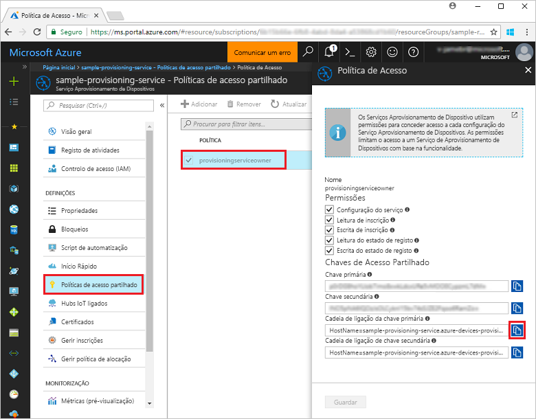
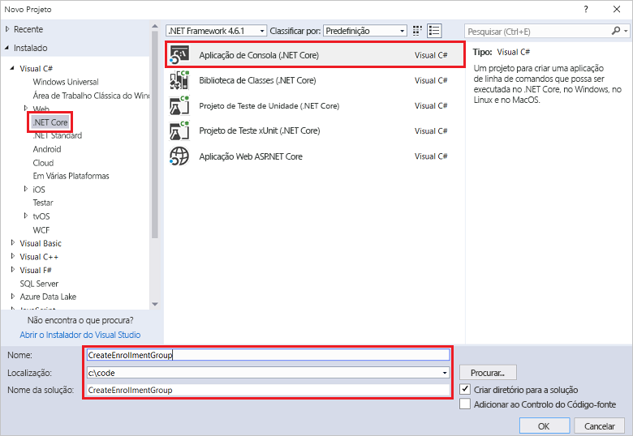
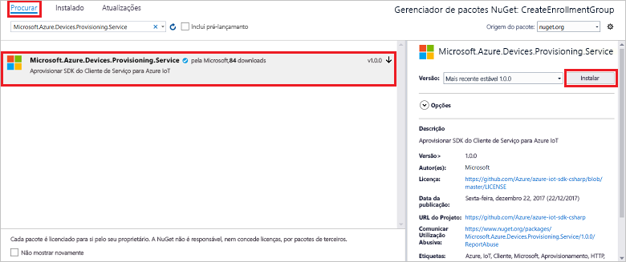
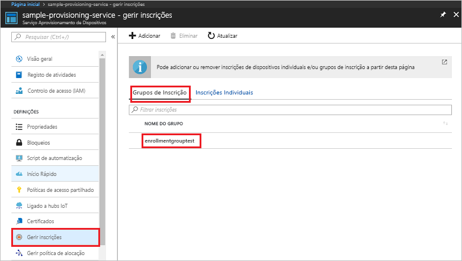

# <a name="enroll-x509-devices-to-iot-hub-device-provisioning-service-using-c-service-sdk"></a>Inscrever dispositivos X.509 no Serviço de Aprovisionamento de Dispositivos no Hub IoT com o SDK de serviço C#

[!INCLUDE [iot-dps-selector-quick-enroll-device-x509](../../includes/iot-dps-selector-quick-enroll-device-x509.md)]


Estes passos explicam como criar programaticamente um grupo de inscrição para um certificado X.509 de AC de raiz ou intermediário com o [SDK de Serviço C#](https://github.com/Azure/azure-iot-sdk-csharp) e um exemplo de aplicação C# .NET Core. Um grupo de inscrição controla o acesso ao serviço de aprovisionamento de dispositivos que partilham um certificado de assinatura comum na respetiva cadeia de certificados. Para saber mais, veja [Controlar o acesso a dispositivos para o serviço de aprovisionamento com certificados X.509](./concepts-security.md#controlling-device-access-to-the-provisioning-service-with-x509-certificates). Para obter mais informações sobre como utilizar a Infraestrutura de Chaves Públicas (PKI) baseada em certificados X.509 com o Hub IoT do Azure e o Serviço de Aprovisionamento de Dispositivos, veja [Descrição geral da segurança do certificado de AC X.509](https://docs.microsoft.com/azure/iot-hub/iot-hub-x509ca-overview). Embora os passos deste artigo funcionem em computadores Windows e Linux, este artigo utiliza um computador de desenvolvimento Windows.

## <a name="prepare-the-development-environment"></a>Preparar o ambiente de desenvolvimento

1. Certifique-se de que tem o [Visual Studio 2017](https://www.visualstudio.com/vs/) instalado no seu computador. 
2. Certifique-se de que tem o [.Net Core SDK](https://www.microsoft.com/net/download/windows) instalado no computador. 
3. Antes de avançar, certifique-se de que executa os passos descritos em [Configurar o Serviço de Aprovisionamento de Dispositivos no Hub IoT com o portal do Azure](./quick-setup-auto-provision.md).
4. Precisa de um ficheiro .pem ou .cer que contenha a parte pública de um certificado X.509 de AC de raiz ou intermediário que tenha sido carregado e verificado com o serviço de aprovisionamento. O [SDK de C do IoT do Azure](https://github.com/Azure/azure-iot-sdk-c) contém as ferramentas que podem ajudar a criar uma cadeia de certificados X.509, carregar um certificado de raiz ou intermediário dessa cadeia e realizar uma prova de posse com o serviço para verificar o certificado. Para utilizar estas ferramentas, transfira o conteúdo da pasta [azure-iot-sdk-c/tools/CACertificates](https://github.com/Azure/azure-iot-sdk-c/tree/master/tools/CACertificates) para uma pasta de trabalho no seu computador e siga os passos em [azure-iot-sdk-c\tools\CACertificates\CACertificateOverview.md](https://github.com/Azure/azure-iot-sdk-c/blob/master/tools/CACertificates/CACertificateOverview.md). Para além das ferramentas no SDK de C, o [Exemplo de verificação do certificado de grupo](https://github.com/Azure/azure-iot-sdk-csharp/tree/master/provisioning/service/samples/GroupCertificateVerificationSample) no **SDK de Serviço C#** mostra como fazer uma prova de posse com um certificado de CA de raiz ou intermediário X.509 existente. 

  > [!IMPORTANT]
  > Os certificados criados com as ferramentas do SDK foram concebidos para serem utilizados apenas para programação. Para saber como obter certificados adequados para código de produção, veja [Como obter um certificado de CA X.509](https://docs.microsoft.com/azure/iot-hub/iot-hub-x509ca-overview#how-to-get-an-x509-ca-certificate) na documentação do Hub IoT do Azure.

## <a name="get-the-connection-string-for-your-provisioning-service"></a>Obter a cadeia de ligação para o serviço de aprovisionamento

Para o exemplo neste Início Rápido, precisa da cadeia de ligação para o seu serviço de aprovisionamento.
1. Inicie sessão no portal do Azure, clique no botão **Todos os recursos**, no menu do lado esquerdo, e abra o Serviço de Aprovisionamento de Dispositivos. 
2. Clique em **Políticas de acesso partilhado** e, em seguida, clique na política de acesso que pretende utilizar para abrir as respetivas propriedades. Na janela **Política de Acesso**, copie e tome nota da cadeia de ligação da chave primária. 

    

## <a name="create-the-enrollment-group-sample"></a>Criar o exemplo do grupo de inscrição 

Os passos nesta secção mostram como criar uma aplicação de consola .NET Core que adiciona um grupo de inscrição ao seu serviço de aprovisionamento. Com algumas modificações, também pode seguir estes passos para criar uma aplicação de consola [Windows IoT Core](https://developer.microsoft.com/en-us/windows/iot) para adicionar o grupo de inscrição. Para saber mais sobre como programar com o IoT Core, veja a [Documentação para programadores do Windows IoT Core](https://docs.microsoft.com/windows/iot-core/).
1. No Visual Studio, adicione um projeto de Aplicação de Consola de Visual C# .NET Core a uma solução nova, através do modelo de projeto **Aplicação de Consola (.NET Core)**. Certifique-se de ter a versão 4.5.1 ou superior do .NET Framework. Dê o nome **CreateEnrollmentGroup** ao projeto.

    

2. No Explorador de Soluções, clique com o botão direito do rato no projeto **CreateEnrollmentGroup** e, em seguida, clique em **Gerir Pacotes NuGet**.
3. Na janela **Gestor de Pacotes NuGet**, selecione **Procurar**, procure **Microsoft.Azure.Devices.Provisioning.Service**, selecione **Instalar** para instalar o pacote **Microsoft.Azure.Devices.Provisioning.Service** e aceite os termos de utilização. Este procedimento transfere, instala e adiciona uma referência ao pacote NuGet do [SDK de Cliente do Serviço de Aprovisionamento do Azure IoT](https://www.nuget.org/packages/Microsoft.Azure.Devices.Provisioning.Service/) e às respetivas dependências.

    

4. Adicione as seguintes declarações `using` a seguir às outras declarações `using` no início do ficheiro **Program.cs**:
   
   ```csharp
   using System.Security.Cryptography.X509Certificates;
   using System.Threading.Tasks;
   using Microsoft.Azure.Devices.Provisioning.Service;
   ```
    
5. Adicione os seguintes campos à classe **Programa**.  
   - Substitua o valor do marcador de posição **ProvisioningConnectionString** pela cadeia de ligação do serviço de aprovisionamento para o qual pretende criar a inscrição.
   - Substitua o valor do marcador de posição **X509RootCertPath** pelo caminho para um ficheiro .pem ou .cer que represente a parte pública de um certificado X.509 de AC intermediário ou de raiz que tenha sido previamente carregado e verificado com o seu serviço de aprovisionamento.
   - Opcionalmente, pode alterar o valor de **EnrollmentGroupId**. A cadeia só pode conter carateres minúsculos e hífenes. 

   > [!IMPORTANT]
   > No código de produção, tenha em atenção as seguintes considerações de segurança:
   >
   > - A pré-programação da cadeia de ligação para o administrador do serviço de aprovisionamento vai contra as melhores práticas de segurança. Em vez disso, a cadeia de ligação deve ser mantida de forma segura, tal como num ficheiro de configuração seguro ou no registo.
   > - Carregue apenas a parte pública do certificado de assinatura. Nunca carregue ficheiros .pfx (PKCS12) ou .pem que contêm chaves privadas para o serviço de aprovisionamento.
        
   ```csharp
   private static string ProvisioningConnectionString = "{Your provisioning service connection string}";
   private static string EnrollmentGroupId = "enrollmentgrouptest";
   private static string X509RootCertPath = @"{Path to a .cer or .pem file for a verified root CA or intermediate CA X.509 certificate}";
   ```
    
6. Adicione o seguinte método à classe **Programa**. Este código cria uma entrada do grupo de inscrição e, em seguida, chama o método **CreateOrUpdateEnrollmentGroupAsync** no **ProvisioningServiceClient** para adicionar o grupo de inscrição ao serviço de aprovisionamento.
   
   ```csharp
   public static async Task RunSample()
   {
       Console.WriteLine("Starting sample...");
 
       using (ProvisioningServiceClient provisioningServiceClient =
               ProvisioningServiceClient.CreateFromConnectionString(ProvisioningConnectionString))
       {
           #region Create a new enrollmentGroup config
           Console.WriteLine("\nCreating a new enrollmentGroup...");
           var certificate = new X509Certificate2(X509RootCertPath);
           Attestation attestation = X509Attestation.CreateFromRootCertificates(certificate);
           EnrollmentGroup enrollmentGroup =
                   new EnrollmentGroup(
                           EnrollmentGroupId,
                           attestation)
                   {
                       ProvisioningStatus = ProvisioningStatus.Enabled
                   };
           Console.WriteLine(enrollmentGroup);
           #endregion
 
           #region Create the enrollmentGroup
           Console.WriteLine("\nAdding new enrollmentGroup...");
           EnrollmentGroup enrollmentGroupResult =
               await provisioningServiceClient.CreateOrUpdateEnrollmentGroupAsync(enrollmentGroup).ConfigureAwait(false);
           Console.WriteLine("\nEnrollmentGroup created with success.");
           Console.WriteLine(enrollmentGroupResult);
           #endregion
 
       }
   }
   ```

7. Por último, substitua o corpo do método **Principal** pelas seguintes linhas:
   
   ```csharp
   RunSample().GetAwaiter().GetResult();
   Console.WriteLine("\nHit <Enter> to exit ...");
   Console.ReadLine();
   ```
        
8. Compilar a solução.

## <a name="run-the-enrollment-group-sample"></a>Executar o exemplo do grupo de inscrição
  
1. Execute o exemplo no Visual Studio para criar o grupo de inscrição.
 
2. Após a criação com êxito, a janela de comando apresenta as propriedades do novo grupo de inscrição.

    

3. Para verificar se o grupo de inscrição foi criado, no painel de resumo do Serviço de Aprovisionamento de Dispositivos no portal do Azure, selecione **Gerir inscrições** e, em seguida, selecione o separador **Grupos de Inscrição**. Deverá ver uma nova entrada de inscrição que corresponde ao ID de registo utilizado no exemplo. Clique na entrada para verificar o thumbprint do certificado e outras propriedades da entrada.

    
 
## <a name="clean-up-resources"></a>Limpar recursos
Se quiser explorar o exemplo de serviço C#, não limpe os recursos criados neste Início Rápido. Se não planear continuar, utilize os passos seguintes para eliminar todos os recursos criados no Guia Rápido.

1. Feche a janela da saída do exemplo de C# no seu computador.
2. Navegue até ao seu serviço de Aprovisionamento de Dispositivos no portal do Azure, clique em **Gerir inscrições** e, em seguida, selecione o separador **Grupos de Inscrição**. Selecione o *ID de Registo* relativo à entrada de inscrição que criou com este Guia Rápido e clique no botão **Eliminar** na parte superior do painel.  
3. No serviço de Aprovisionamento de Dispositivos no portal do Azure, clique em **Certificados**, clique no certificado que carregou para este Guia Rápido e clique no botão **Eliminar** na parte superior da janela  **Detalhes do Certificado**.  
 
## <a name="next-steps"></a>Passos seguintes
Neste Início Rápido, criou um grupo de inscrição para um certificado de AC de raiz ou intermediário X.509 com o Serviço de Aprovisionamento de Dispositivos no Hub IoT do Azure. Para ficar a conhecer aprofundadamente o aprovisionamento de dispositivos, prossiga no tutorial para a configuração do Serviço Aprovisionamento de Dispositivos no portal do Azure. 
 
> [!div class="nextstepaction"]
> [Azure IoT Hub Device Provisioning Service tutorials](./tutorial-set-up-cloud.md) (Tutoriais do Serviço Aprovisionamento de Dispositivos no Hub IoT do Azure)
