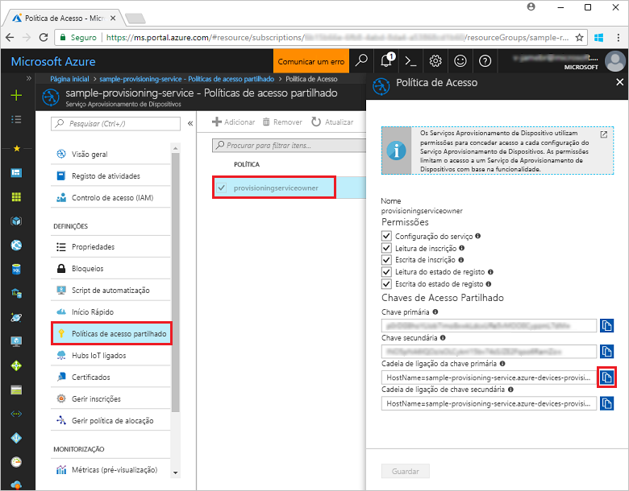
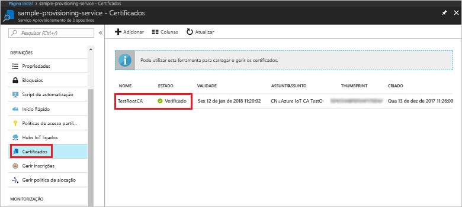
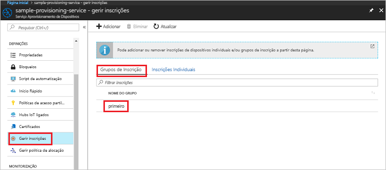

# <a name="enroll-x509-devices-to-iot-hub-device-provisioning-service-using-nodejs-service-sdk"></a>Inscrever dispositivos X.509 no Serviço de Aprovisionamento de Dispositivos no Hub IoT com o SDK do serviço Node.js
> [!div class="op_single_selector"]
> * [Java](quick-enroll-device-x509-java.md)
> * [Node.js](quick-enroll-device-x509-node.md)

Estes passos explicam como criar programaticamente um grupo de inscrição para um certificado X.509 AC de raiz ou intermediário com o [SDK de Serviço do Node.js](https://github.com/Azure/azure-iot-sdk-node) e um exemplo do Node.js. Embora estes passos funcionem em computadores Windows e Linux, este artigo utiliza um computador de desenvolvimento Windows.
 

## <a name="prerequisites"></a>Pré-requisitos

- Certifique-se de que executa os passos descritos em [Set up the IoT Hub Device Provisioning Service with the Azure portal (Configurar o Serviço de Aprovisionamento de Dispositivos no Hub IoT com o portal do Azure)](./quick-setup-auto-provision.md). 

 
- Certifique-se de que tem o [Node.js v4.0 ou superior](https://nodejs.org) instalado no seu computador.


- Precisa de um ficheiro .pem que contém um certificado X.509 AC de raiz ou intermediário que foi carregado e verificado com o serviço de aprovisionamento. O **SDK c do Azure IoT** contém as ferramentas que podem ajudar a criar uma cadeia de certificados X.509, carregar um certificado de raiz ou intermediário dessa cadeia e realizar uma prova de posse com o serviço para verificar o certificado. Para utilizar estas ferramentas, clone o [SDK c do Azure IoT](https://github.com/Azure/azure-iot-sdk-c) e siga os passos em [azure-iot-sdk-c\tools\CACertificates\CACertificateOverview.md](https://github.com/Azure/azure-iot-sdk-c/blob/master/tools/CACertificates/CACertificateOverview.md) no seu computador.

## <a name="create-the-enrollment-group-sample"></a>Criar o exemplo do grupo de inscrição 

 
1. A partir de uma janela de comando na sua pasta de trabalho, execute:
  
     ```cmd\sh
     npm install azure-iot-provisioning-service
     ```  

2. Com um editor de texto, crie um ficheiro **create_enrollment_group.js** na sua pasta de trabalho. Adicione o seguinte código ao ficheiro e guarde:

    ```
    'use strict';
    var fs = require('fs');

    var provisioningServiceClient = require('azure-iot-provisioning-service').ProvisioningServiceClient;

    var serviceClient = provisioningServiceClient.fromConnectionString(process.argv[2]);

    var enrollment = {
      enrollmentGroupId: 'first',
      attestation: {
        type: 'x509',
        x509: {
          signingCertificates: {
            primary: {
              certificate: fs.readFileSync(process.argv[3], 'utf-8').toString()
            }
          }
        }
      },
      provisioningStatus: 'disabled'
    };

    serviceClient.createOrUpdateEnrollmentGroup(enrollment, function(err, enrollmentResponse) {
      if (err) {
        console.log('error creating the group enrollment: ' + err);
      } else {
        console.log("enrollment record returned: " + JSON.stringify(enrollmentResponse, null, 2));
        enrollmentResponse.provisioningStatus = 'enabled';
        serviceClient.createOrUpdateEnrollmentGroup(enrollmentResponse, function(err, enrollmentResponse) {
          if (err) {
            console.log('error updating the group enrollment: ' + err);
          } else {
            console.log("updated enrollment record returned: " + JSON.stringify(enrollmentResponse, null, 2));
          }
        });
      }
    });
    ````

## <a name="run-the-enrollment-group-sample"></a>Executar o exemplo do grupo de inscrição
 
1. Para executar o exemplo, precisa da cadeia de ligação para o seu serviço de aprovisionamento. 
    1. Inicie sessão no portal do Azure, clique no botão **Todos os recursos**, no menu do lado esquerdo, e abra o Serviço Aprovisionamento de Dispositivos. 
    2. Clique em **Políticas de acesso partilhado** e, em seguida, clique na política de acesso que pretende utilizar para abrir as respetivas propriedades. Na janela **Política de Acesso**, copie e tome nota da cadeia de ligação da chave primária. 

     


3. Conforme indicado nos [Pré-requisitos](#prerequisites), também precisa de um ficheiro .pem que contém certificado AC de raiz ou intermediário X.509 que foi anteriormente carregado e verificado com o serviço de aprovisionamento. Para verificar que o certificado foi carregado e confirmado, na página de resumo do Serviço de Aprovisionamento de Dispositivos no portal do Azure, clique em **Certificados**. Encontre o certificado que pretende utilizar para a inscrição do grupo e certifique-se de que o valor do estado é *verificado*.

     

1. Para criar um grupo de inscrição individual para o seu certificado, execute o seguinte comando (inclua as aspas à volta dos argumentos do comando):
 
     ```cmd\sh
     node create_enrollment_group.js "<the connection string for your provisioning service>" "<your certificate's .pem file>"
     ```
 
3. Após a criação com êxito, a janela de comando apresenta as propriedades do novo grupo de inscrição.

     

4. Certifique-se de que o grupo de inscrição foi criado. No portal do Azure, no painel de resumo do Serviço de Aprovisionamento de Dispositivos, selecione **Gerir inscrições**. Selecione o separador **Grupos de Inscrição** e certifique-se de que a nova entrada de inscrição (*primeiro*) está presente.

     
 
## <a name="clean-up-resources"></a>Limpar recursos
Se quiser explorar os exemplos do serviço Node.js, não limpe os recursos criados neste Início Rápido. Se não planear continuar, utilize os passos seguintes para eliminar todos os recursos do Azure criados no Guia Rápido.
 
1. Feche a janela da saída do exemplo de Node.js no seu computador.
2. Navegue até ao seu serviço de Aprovisionamento de Dispositivos no portal do Azure, clique em **Gerir inscrições** e, em seguida, selecione o separador **Grupos de Inscrição**. Selecione o *ID de Registo* relativo à entrada de inscrição que criou com este Guia Rápido e clique no botão **Eliminar** na parte superior do painel.  
3. No serviço de Aprovisionamento de Dispositivos no portal do Azure, clique em **Certificados**, clique no certificado que carregou para este Guia Rápido e clique no botão **Eliminar** na parte superior da janela  **Detalhes do Certificado**.  
 
## <a name="next-steps"></a>Passos seguintes
Este Guia Rápido, criou uma inscrição de grupo para um certificado de AC de raiz ou intermediário X.509 com o Serviço de Aprovisionamento de Dispositivos no Hub IoT do Azure. Para ficar a conhecer aprofundadamente o aprovisionamento de dispositivos, prossiga no tutorial para a configuração do Serviço Aprovisionamento de Dispositivos no portal do Azure. 
 
> [!div class="nextstepaction"]
> [Azure IoT Hub Device Provisioning Service tutorials](./tutorial-set-up-cloud.md) (Tutoriais do Serviço Aprovisionamento de Dispositivos no Hub IoT do Azure)