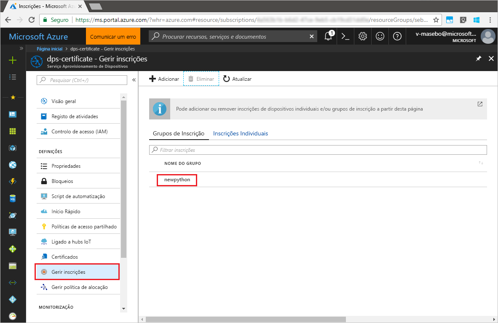

# <a name="quickstart-enroll-x509-devices-to-the-device-provisioning-service-using-python"></a>Início Rápido: Inscrever dispositivos X.509 no Serviço de Aprovisionamento de Dispositivos com Python

[!INCLUDE [iot-dps-selector-quick-enroll-device-x509](../../includes/iot-dps-selector-quick-enroll-device-x509.md)]

Os dispositivos são inscritos numa instância do serviço de aprovisionamento através da criação de um [Grupo de inscrição](concepts-service.md#enrollment-group) ou [Inscrição individual](concepts-service.md#individual-enrollment). Este início rápido mostra como utilizar o Python para criar programaticamente um [Grupo de inscrição](concepts-service.md#enrollment-group) que utiliza certificados X.509 de AC de raiz ou intermediários. Um grupo de inscrição controla o acesso ao serviço de aprovisionamento de dispositivos que partilham um certificado de assinatura comum na respetiva cadeia de certificados. O grupo de inscrição é criado com o [SDK do Serviço de Aprovisionamento Python](https://github.com/Azure/azure-iot-sdk-python/tree/master/provisioning_service_client) e uma aplicação Python de exemplo. A criação de inscrições Individuais através do 7*SDK do Serviço de Aprovisionamento Python* é ainda um trabalho em curso. Para saber mais, veja [Controlar o acesso a dispositivos para o serviço de aprovisionamento com certificados X.509](./concepts-security.md#controlling-device-access-to-the-provisioning-service-with-x509-certificates). Para obter mais informações sobre como utilizar a Infraestrutura de Chaves Públicas (PKI) baseada em certificados X.509 com o Hub IoT do Azure e o Serviço de Aprovisionamento de Dispositivos, veja [Descrição geral da segurança do certificado de AC X.509](https://docs.microsoft.com/azure/iot-hub/iot-hub-x509ca-overview). 

Este início rápido espera que já tenha criado um hub IoT e a instância do Serviço de Aprovisionamento de Dispositivos. Se ainda não tiver criado estes recursos, conclua o início rápido [Configurar o Serviço de Aprovisionamento de Dispositivos no Hub IoT com o portal do Azure](./quick-setup-auto-provision.md) antes de avançar neste artigo.

Embora os passos deste artigo funcionem em computadores Windows e Linux, este artigo foi concebido para um computador de desenvolvimento Windows.

[!INCLUDE [quickstarts-free-trial-note](../../includes/quickstarts-free-trial-note.md)]


## <a name="prerequisites"></a>Pré-requisitos

- Instale o [Python 2.x ou 3.x](https://www.python.org/downloads/). Certifique-se de que utiliza a instalação de 32 ou 64 bits, conforme exigido pela sua configuração. Quando lhe for pedido durante a instalação, confirme que adiciona Python às variáveis de ambiente específicas da sua plataforma.
- [Instale ou atualize o *pip*, o sistema de gestão de pacotes Python](https://pip.pypa.io/en/stable/installing/).
- Instale o [Git](https://git-scm.com/download/).


## <a name="prepare-test-certificates"></a>Preparar os certificados de teste

Neste início rápido, precisa de ter um ficheiro .pem ou .cer com a parte pública de um certificado X.509 de AC de raiz ou intermediário. Este certificado tem de ser carregado para o serviço de aprovisionamento e verificado pelo serviço. 

O [SDK de C do IoT do Azure](https://github.com/Azure/azure-iot-sdk-c) contém as ferramentas de teste que podem ajudar a criar uma cadeia de certificados X.509, carregar um certificado de raiz ou intermediário dessa cadeia e realizar uma prova de posse com o serviço para verificar o certificado. Os certificados criados com as ferramentas do SDK foram concebidos para serem utilizados **apenas para testes de desenvolvimento**. Estes certificados **não podem ser utilizados em produção**. Contêm palavras-passe hard-coded ("1234") que expiram após 30 dias. Para saber como obter certificados adequados para utilização de produção, veja [Como obter um certificado X.509 de AC](https://docs.microsoft.com/azure/iot-hub/iot-hub-x509ca-overview#how-to-get-an-x509-ca-certificate) na documentação do Hub IoT do Azure.

Para utilizar estas ferramentas de teste para gerar certificados, execute os seguintes passos: 
 
1. Abra uma linha de comandos ou shell do Git Bash e mude para uma pasta de trabalho no seu computador. Execute o seguinte comando para clonar o [SDK C do Azure IoT](https://github.com/Azure/azure-iot-sdk-c) no repositório do GitHub:
    
  ```cmd/sh
  git clone https://github.com/Azure/azure-iot-sdk-c.git --recursive
  ```

  Atualmente, o tamanho deste repositório é de cerca de 220 MB. Esta operação deve demorar vários minutos a ser concluída.

  As ferramentas de teste estão localizada em *azure-iot-sdk-c/tools/CACertificates* do repositório que clonou.    

2. Siga os passos em [Gerir certificados de AC de teste para exemplos e tutoriais](https://github.com/Azure/azure-iot-sdk-c/blob/master/tools/CACertificates/CACertificateOverview.md). 


## <a name="modify-the-python-sample-code"></a>Modificar o código de exemplo do Python

Esta secção mostra como adicionar os detalhes de aprovisionamento do seu dispositivo X.509 ao código de exemplo. 

1. Num editor de texto, crie um novo ficheiro **EnrollmentGroup.py**.

1. Adicione as seguintes `import` afirmações e variáveis no início do ficheiro **EnrollmentGroup.py**. Em seguida, substitua `dpsConnectionString` pela sua cadeia de ligação, que se encontra nas **Políticas de acesso partilhadas** no seu **Serviço de Aprovisionamento de Dispositivos** no **Portal do Azure**. Substitua o marcador de posição do certificado pelo certificado criado anteriormente em [Preparar os certificados de teste](quick-enroll-device-x509-python.md#prepare-test-certificates). Por fim, crie um `registrationid` exclusivo e certifique-se de que este consiste apenas em carateres alfanuméricos em minúsculas e hífenes.  
   
    ```python
    from provisioningserviceclient import ProvisioningServiceClient
    from provisioningserviceclient.models import EnrollmentGroup, AttestationMechanism

    CONNECTION_STRING = "{dpsConnectionString}"

    SIGNING_CERT = """-----BEGIN CERTIFICATE-----
    XXXXXXXXXXXXXXXXXXXXXXXXXXXXXXXXXXXXXXXXXXXXXXXXXXXXXXXXXXXXXXXX
    XXXXXXXXXXXXXXXXXXXXXXXXXXXXXXXXXXXXXXXXXXXXXXXXXXXXXXXXXXXXXXXX
    XXXXXXXXXXXXXXXXXXXXXXXXXXXXXXXXXXXXXXXXXXXXXXXXXXXXXXXXXXXXXXXX
    XXXXXXXXXXXXXXXXXXXXXXXXXXXXXXXXXXXXXXXXXXXXXXXXXXXXXXXXXXXXXXXX
    XXXXXXXXXXXXXXXXXXXXXXXXXXXXXXXXXXXXXXXXXXXXXXXXXXXXXXXXXXXXXXXX
    XXXXXXXXXXXXXXXXXXXXXXXXXXXXXXXXXXXXXXXXXXXXXXXXXXXXXXXXXXXXXXXX
    XXXXXXXXXXXXXXXXXXXXXXXXXXXXXXXXXXXXXXXXXXXXXXXXXXXXXXXXXXXXXXXX
    XXXXXXXXXXXXXXXXXXXXXXXXXXXXXXXXXXXXXXXXXXXXXXXXXXXXXXXXXXXXXXXX
    XXXXXXXXXXXXXXXXXXXXXXXXXXXXXXXXXXXXXXXXXXXXXXXXXXXXXXXXXXXXXXXX
    XXXXXXXXXXXXXXXXXXXXXXXXXXXXXXXXXXXXXXXXXXXXXXXXXXXXXXXXXXXXXXXX
    XXXXXXXXXXXXXXXXXXXXXXXXXXXXXXXXXXXXXXXXXXXXXXXXXXXXXXXXXXXXXXXX
    XXXXXXXXXXXXXXXXXXXXXXXXXXXXXXXXXXXXXXXXXXXXXXXXXXXXXXXXXXXXXXXX
    XXXXXXXXXXXXXXXXXXXXXXXXXXXXXXXXXXXXXXXXXXXXXXXXXXXXXXXXXXXXXXXX
    XXXXXXXXXXXXXXXXXXXXXXXXXXXXXXXXXXXXXXXXXXXXXXXXXXXXXXXXXXXXXXXX
    XXXXXXXXXXXXXXXXXXXXXXXXXXXXXXXXXXXXXXXXXXXXXXXXXXXXXXXX
    -----END CERTIFICATE-----"""

    GROUP_ID = "{registrationid}"
    ```

1. Adicione a seguinte função e chamada de função para implementar a criação de inscrição em grupos:
   
    ```python
    def main():
        print ( "Initiating enrollment group creation..." )

        psc = ProvisioningServiceClient.create_from_connection_string(CONNECTION_STRING)
        att = AttestationMechanism.create_with_x509_signing_certs(SIGNING_CERT)
        eg = EnrollmentGroup.create(GROUP_ID, att)

        eg = psc.create_or_update(eg)
    
        print ( "Enrollment group created." )

    if __name__ == '__main__':
        main()
    ```

1. Guarde e feche o ficheiro **EnrollmentGroup.py**.
 

## <a name="run-the-sample-group-enrollment"></a>Executar a inscrição de grupo de exemplo

1. Abra uma linha de comandos e execute o seguinte comando para instalar o [azure-iot-provisioning-device-client](https://pypi.org/project/azure-iot-provisioning-device-client.)

    ```cmd/sh
    pip install azure-iothub-provisioningserviceclient    
    ```

2. Na linha de comandos, execute o script.

    ```cmd/sh
    python EnrollmentGroup.py
    ```

3. Observe a saída para ver se a inscrição foi executada com êxito.

4. Navegue até ao serviço de aprovisionamento no portal do Azure. Clique em **Gerir inscrições**. Repare que o seu grupo de dispositivos X.509 é apresentado no separador **Grupos de Inscrição**, com o nome `registrationid` criado anteriormente. 

      


## <a name="clean-up-resources"></a>Limpar recursos
Se quiser explorar o exemplo de serviço Java, não limpe os recursos criados neste Manual de Início Rápido. Se não planear continuar, utilize os passos seguintes para eliminar todos os recursos criados no Guia Rápido.

1. Feche a janela da saída do exemplo de Java no seu computador.
1. Feche a janela do _X509 Cert Generator_ no seu computador.
1. Navegue até ao seu serviço de Aprovisionamento de Dispositivos no portal do Azure, clique em **Gerir inscrições** e, em seguida, selecione o separador **Grupos de Inscrição**. Selecione o *NOME DE GRUPO* dos dispositivos X.509 que inscreveu com este Manual de Início Rápido e clique no botão **Eliminar** na parte superior do painel.  


## <a name="next-steps"></a>Passos seguintes
Neste Manual de Início Rápido, inscreveu um grupo de dispositivos X.509 no seu serviço de Aprovisionamento de Dispositivos. Para ficar a conhecer aprofundadamente o aprovisionamento de dispositivos, prossiga no tutorial para a configuração do Serviço Aprovisionamento de Dispositivos no portal do Azure. 

> [!div class="nextstepaction"]
> [Azure IoT Hub Device Provisioning Service tutorials](./tutorial-set-up-cloud.md) (Tutoriais do Serviço Aprovisionamento de Dispositivos no Hub IoT do Azure)
