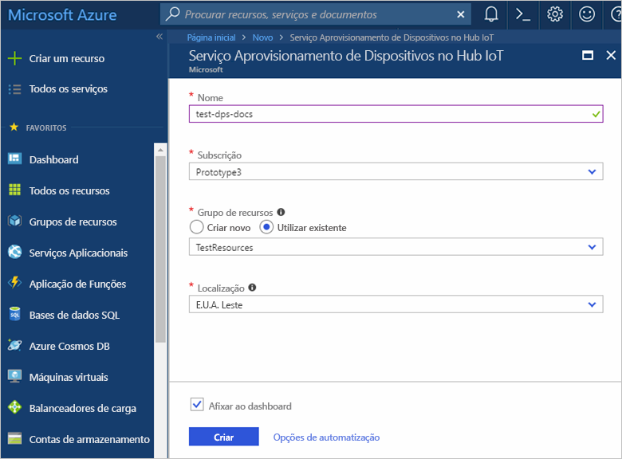
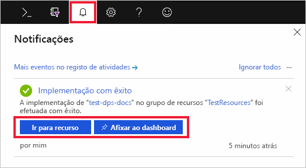
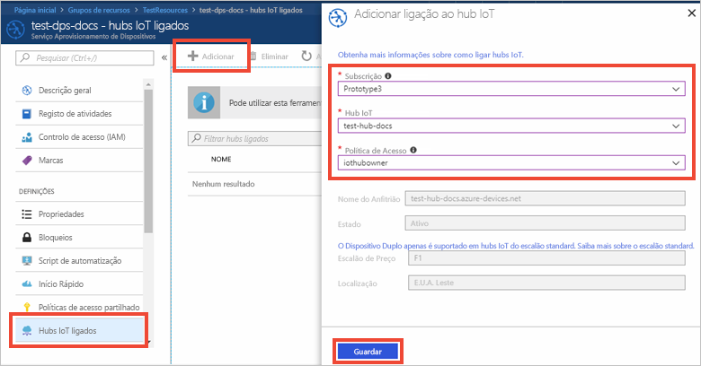

# Configurar o Serviço Aprovisionamento de Dispositivos no Hub IoT com o portal do Azure

Estes passos mostram como configurar os recursos da cloud do Azure no portal para aprovisionar os seus dispositivos. Este artigo inclui passos para: criar o hub IoT, criar um novo Serviço de Aprovisionamento de Dispositivos no Hub IoT e ligar os dois serviços. 

Se não tiver uma subscrição do Azure, crie uma [conta gratuita](https://azure.microsoft.com/free/?WT.mc_id=A261C142F) antes de começar.

## Criar um hub IoT

[!INCLUDE [iot-hub-quickstarts-create-hub](../../includes/iot-hub-quickstarts-create-hub.md)]

## Criar uma instância nova do Serviço Aprovisionamento de Dispositivos no Hub IoT

1. Clique no botão **Criar um recurso**, no canto superior esquerdo do portal do Azure.

2. *Procure no Marketplace* o **Serviço Aprovisionamento de Dispositivos**. Selecione **Serviço Aprovisionamento de Dispositivos no Hub IoT** e clique no botão **Criar**. 

3. Apresente as seguintes informações para a sua nova instância do serviço Aprovisionamento de Dispositivos e clique em **Criar**.

    * **Nome**: indique um nome exclusivo para a nova instância do serviço Aprovisionamento de Dispositivos. Se o nome introduzido estiver disponível, aparece uma marca de verificação verde.
    * **Subscrição**: escolha a subscrição que quer utilizar para criar a instância do serviço Aprovisionamento de Dispositivos.
    * **Grupo de recursos**: este campo permite criar um novo grupo de recursos ou selecionar um já existente para conter a nova instância. Selecione o mesmo grupo de recursos que contém o hub Iot que criou acima, por exemplo, **TestResources**. Ao colocar todos os recursos relacionados num grupo, pode geri-los em conjunto. Por exemplo, eliminar o grupo de recursos elimina todos os recursos que se encontram nesse grupo. Para obter mais informações, veja [Utilizar grupos de recursos para gerir os recursos do Azure](../azure-resource-manager/resource-group-portal.md).
    * **Localização**: selecione a localização mais próxima dos seus dispositivos.

      

4. Clique no botão de notificação para monitorizar a criação da instância do recurso. Assim que o serviço é implementado com êxito, clique em **Afixar ao dashboard** e, em seguida **Ir para recurso**.

    

## Ligar o hub IoT e o seu Serviço Aprovisionamento de Dispositivos

Nesta secção, vai adicionar uma configuração à instância do Serviço de Aprovisionamento de Dispositivos. Esta configuração define o hub IoT para o qual os dispositivos serão aprovisionados.

1. Clique no botão **Todos os recursos**, no menu do lado esquerda do portal do Azure. Selecione a instância do serviço Aprovisionamento de Dispositivos que criou na secção anterior.  

2. No painel de resumo do Serviço Aprovisionamento de Dispositivos, selecione **Hubs IoT ligados**. Clique no botão **+ Adicionar**, na parte superior. 

3. Na página **Adicionar ligação ao hub IoT**, forneça as seguintes informações para ligar a nova instância do serviço Aprovisionamento de Dispositivos a um hub IoT. Em seguida, clique em **Guardar**. 

    * **Subscrição**: selecione a subscrição que contém o hub IoT que quer ligar à nova instância do Serviço Aprovisionamento de Dispositivos.
    * **Hub IoT**: selecione o hub IoT a ligar à nova instância do serviço Aprovisionamento de Dispositivos.
    * **Política de Acesso**: selecione **iothubowner** como as credenciais para estabelecer a ligação ao hub IoT.  

      

3. Agora, deverá ver o hub selecionado no painel **Hubs IoT ligados**. Poderá ter de clicar em **Atualizar** para mostrar os **Hubs IoT ligados**.

## Limpar recursos

Outros Guias de Introdução desta coleção têm por base este Guia de Introdução. Se pretender continuar a trabalhar com Inícios Rápidos subsequentes ou com os tutoriais, não limpe os recursos criados neste Início Rápido. Se não quiser continuar, utilize os passos seguintes para eliminar todos os recursos criados por este Início Rápido no portal do Azure.

1. No menu do lado esquerdo do portal do Azure, clique em **Todos os recursos** e selecione o seu Serviço Aprovisionamento de Dispositivos. Na parte superior do painel **Todos os recursos**, clique em **Eliminar**.  
2. No menu do lado esquerdo do portal do Azure, clique em **Todos os recursos** e selecione o seu hub IoT. Na parte superior do painel **Todos os recursos**, clique em **Eliminar**.  

## Passos seguintes

Neste Início Rápido, implementou um hub do IoT e uma instância do serviço Aprovisionamento de Dispositivos e ligou ambos os recursos. Para saber como utilizar esta configuração para aprovisionar um dispositivo simulado, avance para o Início Rápido para a criação de dispositivos simulados.

> [!div class="nextstepaction"]
> [Quickstart to create simulated device](./quick-create-simulated-device.md) (Início rápido para criar dispositivos simulados)
