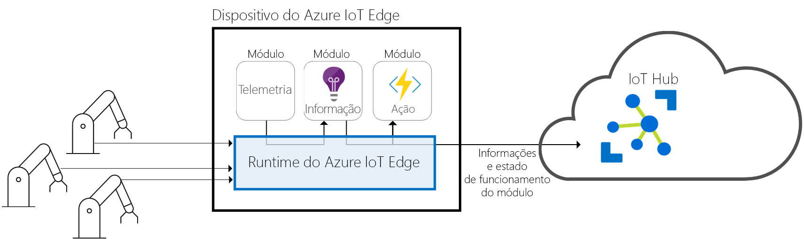
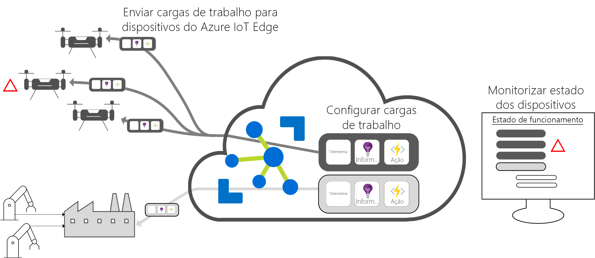

# O que é o Hub IoT Edge

O Azure IoT Edge move as análises e a lógica empresarial personalizada da cloud para os dispositivos, para que a sua organização se possa dedicar às informações relevantes e não à gestão de dados. Permita que a sua solução se dimensione verdadeiramente ao configurar o seu software IoT, implementá-lo nos dispositivos através de contentores padrão e monitorizá-lo a partir da cloud.

>[!NOTE]
>O Azure IoT Edge está disponível no escalão gratuito e standard do Hub IoT. O escalão gratuito destina-se apenas a testes e avaliação. Para obter mais informações sobre os escalões básico e standard, veja [How to choose the right IoT Hub tier](../iot-hub/iot-hub-scaling.md) (Como escolher o escalão do Hub IoT certo).

Nas soluções IoT, o valor empresarial é impulsionado pelas análises, mas nem todas as análises têm de estar na cloud. Se quiser que um dispositivo responda a emergências o mais depressa possível, pode realizar uma deteção de anomalias no próprio dispositivo. Da mesma forma, se pretender reduzir os custos de largura de banda e evitar terabytes de transferências de dados não processados, pode fazer a limpeza e a agregação de dados localmente. Depois, envie as informações para a cloud. 

O Azure IoT Edge é composto por três componentes:
* Módulos do IoT Edge são contentores que executam serviços do Azure, serviços de terceiros ou seu próprio código. Módulos são implementados em dispositivos do IoT Edge e executados localmente nesses dispositivos. 
* O runtime do IoT Edge é executado em cada dispositivo IoT Edge e gere os módulos implementados em cada um deles. 
* Uma interface baseada na cloud permite-lhe monitorizar e gerir dispositivos IoT Edge.

## Módulos do IoT Edge

Os módulos do IoT Edge são unidades de execução, atualmente implementadas como contentores compatíveis do Docker, e que executam a sua lógica de negócio na periferia. Podem ser configurados vários módulos para comunicarem entre si, criando um pipeline para processamento de dados. Pode desenvolver módulos personalizados ou empacotar determinados serviços do Azure em módulos que disponibilizam informações offline e na periferia. 

### Inteligência Artificial na periferia

O Azure IoT Edge permite-lhe implementar processamento de eventos complexo, machine learning, reconhecimento de imagens e outro elevado valor sem ter de escrevê-lo internamente. Serviços do Azure, como as funções do Azure, Azure Stream Analytics e o Azure Machine Learning, podem ser executado no local através do Azure IoT Edge, mas não está limitado aos serviços do Azure. Qualquer pessoa pode criar módulos de IA e disponibilizá-los para utilização por parte da comunidade. 

### Traga o seu próprio código

E se quiser implementar o seu próprio código nos seus dispositivos, o Azure IoT Edge também o suporta. O Azure IoT Edge tem o mesmo modelo de programação dos serviços do Azure IoT. O mesmo código pode ser executado num dispositivo ou na cloud. O Azure IoT Edge suporta o Linux e o Windows, para que possa programar para uma plataforma à sua escolha. Suporta Java, .NET Core 2.0, node. js, C e Python, para que os seus programadores possam programar numa linguagem que já conheçam e utilizam lógica empresarial já existente.

## Runtime do IoT Edge

O runtime do Azure IoT Edge permite lógica personalizada e da cloud nos dispositivos IoT Edge. Encontra-se no dispositivo IoT Edge e faz operações de gestão e comunicação. O runtime realiza várias funções:

* Instalar e atualizar as cargas de trabalho no dispositivo.
* Manter as normas de segurança do Azure IoT Edge no dispositivo.
* Certifique-se de que módulos do IoT Edge estão sempre em execução.
* Comunicar o estado de funcionamento do módulo para a cloud para monitorização remota.
* Gerir a comunicação entre os dispositivos de folha a jusante e um dispositivo IoT Edge, entre módulos num dispositivo IoT Edge e entre um dispositivo IoT Edge e a cloud.

Como utilizar um dispositivo Azure IoT Edge cabe a. O tempo de execução é frequentemente utilizado para implementar a ia nos gateways que agregam e processam dados de vários outros dispositivos no local, no entanto, este modelo de implementação é somente uma opção. Os dispositivos de folha também podem ser dispositivos Azure IoT Edge, independentemente de estarem ligados a um gateway ou diretamente à cloud.

O runtime do Azure IoT Edge é executado num vasto conjunto de dispositivos IoT, para que possa ser utilizado de muitas e diversas formas. Ele oferece suporte a sistemas operativos Linux e Windows e abstrai detalhes do hardware. Utilize um dispositivo mais pequeno do que um Raspberry Pi 3, se não estiver a processar o volume de dados ou utilizar um servidor industrializado para executar cargas de trabalho com muitos recursos.

## Interface na cloud do IoT Edge

Gerir o ciclo de vida do software dos dispositivos da empresa é complicado. E gerir o ciclo de vida de milhões de dispositivos IoT heterogéneos é ainda mais difícil. As cargas de trabalho têm de ser criadas e configuradas para um determinado tipo de dispositivos, implementadas em escala em milhões de dispositivos na sua solução e monitorizadas para detetar dispositivos que possam estar a funcionar mal. Estas atividades não podem ser feitas individualmente por dispositivo; têm de o ser em escala.

O Azure IoT Edge integra-se facilmente com os aceleradores de soluções do Azure IoT para proporcionar um plano de controlo para as necessidades da sua solução. Serviços cloud permitem-lhe:

* Criem e configurem cargas de trabalho para serem executadas num tipo de dispositivo específico.
* Enviem cargas de trabalho para um conjunto de dispositivos.
* Monitorizem as cargas de trabalho em execução em dispositivos no terreno.

## Passos Seguintes

Experimente estes conceitos ao [implementar o IoT Edge num dispositivo simulado](quickstart.md).

 
