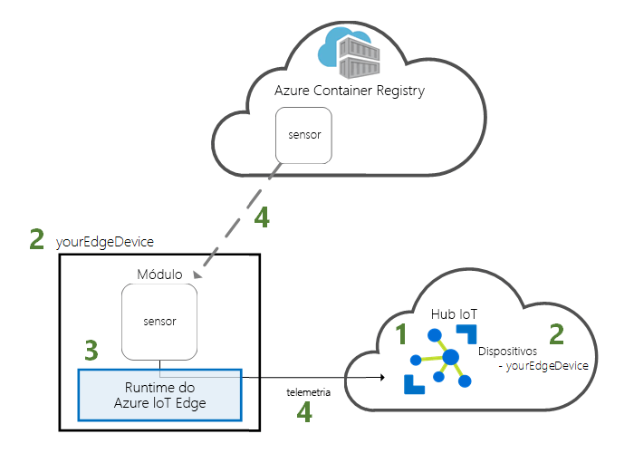
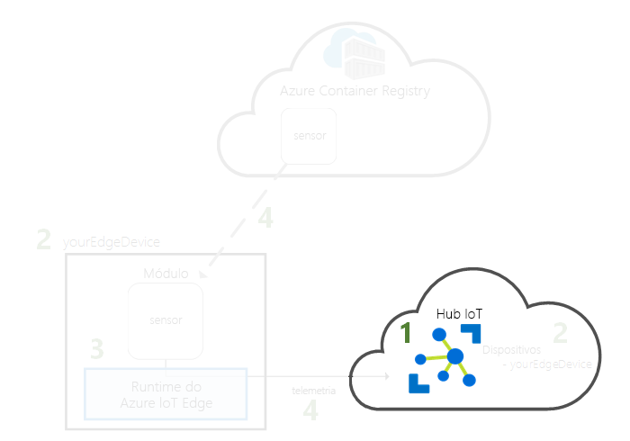
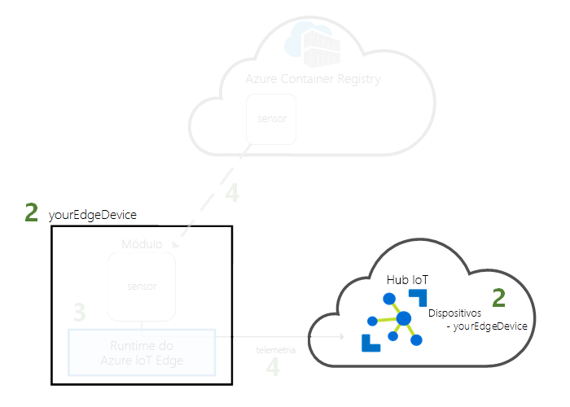
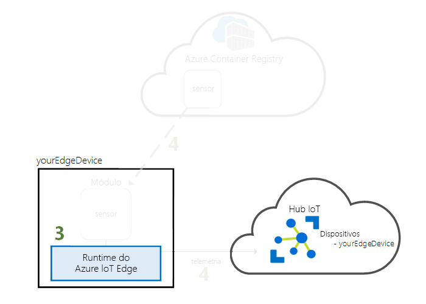
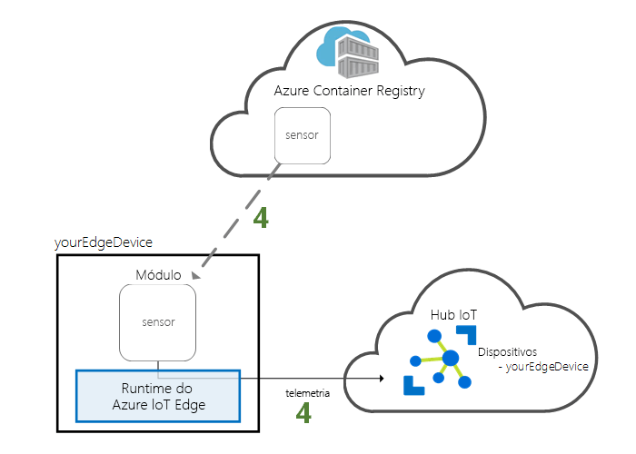

# <a name="quickstart-deploy-your-first-iot-edge-module-to-a-linux-x64-device"></a>Início rápido: Implementar o seu primeiro módulo do IoT Edge num dispositivo de Linux x64

O Azure IoT Edge move o poder da cloud para os seus dispositivos de Internet das Coisas. Neste guia de início rápido, irá aprender a utilizar a interface da cloud para implementar código pré-construído remotamente num dispositivo IoT Edge.

Neste início rápido, vai aprender a:

1. Criar um Hub IoT.
2. Registar um dispositivo IoT Edge no seu hub IoT.
3. Instalar e iniciar o runtime do IoT Edge no seu dispositivo.
4. Implementar remotamente um módulo num dispositivo IoT Edge.



Este início rápido transforma o seu computador Linux ou máquina virtual num dispositivo IoT Edge. Em seguida, pode implementar um módulo a partir do portal do Azure no seu dispositivo. O módulo que vai implementar neste início rápido é um sensor simulado que gera dados de temperatura, humidade e pressão. Os outros tutoriais do Azure IoT Edge tiram partido do seu trabalho aqui realizado, ao implementar módulos que analisam os dados simulados de informações empresariais.

Se não tiver uma subscrição ativa do Azure, crie uma [conta gratuita](https://azure.microsoft.com/free) antes de começar.

[!INCLUDE [cloud-shell-try-it.md](../../includes/cloud-shell-try-it.md)]

Vai utilizar a CLI do Azure para concluir muitos dos passos neste início rápido e o IoT do Azure tem uma extensão para ativar funcionalidades adicionais. 

Adicione a extensão do IoT do Azure à instância da shell da cloud.

   ```azurecli-interactive
   az extension add --name azure-cli-iot-ext
   ```

## <a name="prerequisites"></a>Pré-requisitos

Recursos da cloud: 

* Um grupo de recursos para gerir todos os recursos que utilizar neste início rápido. 

   ```azurecli-interactive
   az group create --name IoTEdgeResources --location westus2
   ```

Dispositivo IoT Edge

* Um dispositivo ou máquina virtual do Linux que funcione como o seu dispositivo IoT Edge. É recomendado para utilizar o Microsoft fornecido [do Azure IoT Edge no Ubuntu](https://azuremarketplace.microsoft.com/en-us/marketplace/apps/microsoft_iot_edge.iot_edge_vm_ubuntu) máquina virtual, que será pré-instalar o runtime do IoT Edge. Crie esta máquina virtual com o seguinte comando:

   ```azurecli-interactive
   az vm create --resource-group IoTEdgeResources --name EdgeVM --image microsoft_iot_edge:iot_edge_vm_ubuntu:ubuntu_1604_edgeruntimeonly:latest --admin-username azureuser --generate-ssh-keys --size Standard_DS1_v2
   ```

   Quando cria uma nova máquina virtual, anote o **publicIpAddress**, que é fornecido como parte da saída do comando de criar. Utilizará este endereço IP público para ligar à máquina virtual mais tarde no início rápido.

* Se preferir executar o tempo de execução do Azure IoT Edge no sistema local, siga as instruções em [instalar o runtime do Azure IoT Edge no Linux (x64)](how-to-install-iot-edge-linux.md).

* Se gostaria de utilizar um dispositivo de ARM32 com base, como o Raspberry Pi, siga as instruções em [tempo de execução de instalar o Azure IoT Edge no Linux (ARM32v7/armhf)](how-to-install-iot-edge-linux-arm.md).

## <a name="create-an-iot-hub"></a>Criar um hub IoT

Inicie o guia de introdução ao criar um hub IoT com a CLI do Azure.



O nível gratuito do Hub IoT funciona para este início rápido. Se tiver utilizado o Hub IoT anteriormente e já tiver um hub gratuito criado, pode utilizar esse hub IoT. Cada subscrição só pode ter um Hub IoT gratuito. 

O código seguinte cria um hub **F1** gratuito no grupo de recursos **IoTEdgeResources**. Substitua *{hub_name}* por um nome exclusivo para o hub IoT.

   ```azurecli-interactive
   az iot hub create --resource-group IoTEdgeResources --name {hub_name} --sku F1 
   ```

   Se obtiver um erro porque já existe um hub gratuito na sua subscrição, altere o SKU para **S1**. Se obtiver um erro que o nome do IoT Hub não está disponível, significa que outra pessoa já tenha um concentrador com esse nome. Experimente um novo nome. 

## <a name="register-an-iot-edge-device"></a>Registar um dispositivo do IoT Edge

Registe um dispositivo do IoT Edge no seu hub IoT recentemente criado.


Crie uma identidade de dispositivo para o seu dispositivo simulado para que este consiga comunicar com o seu hub IoT. A identidade do dispositivo reside na cloud e verá uma cadeia de ligação do dispositivo única para associar um dispositivo físico a uma identidade do dispositivo. 

Uma vez que os dispositivos do IoT Edge se comportar e podem ser geridos de forma diferente do que os dispositivos de IoT típicos, declarar esta identidade para um dispositivo IoT Edge com o `--edge-enabled` sinalizador. 

1. No Azure Cloud Shell, introduza o comando seguinte para criar um dispositivo com o nome **myEdgeDevice** no seu hub.

   ```azurecli-interactive
   az iot hub device-identity create --hub-name {hub_name} --device-id myEdgeDevice --edge-enabled
   ```

   Se obtiver um erro sobre iothubowner chaves da política, certifique-se de que o cloud shell está a executar a versão mais recente da extensão do azure-cli-iot-ext. 

2. Obtenha a cadeia de ligação para o seu dispositivo, que liga o dispositivo físico à respetiva identidade do Hub IoT. 

   ```azurecli-interactive
   az iot hub device-identity show-connection-string --device-id myEdgeDevice --hub-name {hub_name}
   ```

3. Copie a cadeia de ligação de saída JSON e guarde-o. Irá utilizar este valor para configurar o runtime do IoT Edge na secção seguinte.

   

## <a name="connect-the-iot-edge-device-to-iot-hub"></a>Ligar o dispositivo do IoT Edge ao IoT Hub

Instalar e iniciar o runtime do Azure IoT Edge no seu dispositivo IoT Edge. 


O runtime do IoT Edge é implementado em todos os dispositivos do IoT Edge. Tem três componentes. O **daemon de segurança do IoT Edge** é iniciado sempre que um dispositivo Edge arranca e arranca o dispositivo ao iniciar o agente do IoT Edge. O **agente do IoT Edge** facilita a implementação e a monitorização de módulos no dispositivo IoT Edge, incluindo o hub do IoT Edge. O **hub do IoT Edge** gere as comunicações entre os módulos no dispositivo do IoT Edge e entre o dispositivo e o Hub IoT. 

Durante a configuração do runtime, apresenta a cadeia de ligação do dispositivo. Utilize a cadeia que obteve na CLI do Azure. Essa cadeia associa o dispositivo físico à identidade do dispositivo IoT Edge no Azure. 

### <a name="set-the-connection-string-on-the-iot-edge-device"></a>Definir a cadeia de ligação no dispositivo IoT Edge

* Se estiver a utilizar o Azure IoT Edge na máquina virtual do Ubuntu, utilize a cadeia de ligação do dispositivo que copiou anteriormente para configurar remotamente o seu dispositivo IoT Edge:

   ```azurecli-interactive
   az vm run-command invoke -g IoTEdgeResources -n EdgeVM --command-id RunShellScript --script '/etc/iotedge/configedge.sh "{device_connection_string}"'
   ```

   Para obter os passos restantes, obter o endereço IP público que estava a saída do comando de criação. Também pode encontrar o endereço IP público na página de descrição geral da sua máquina virtual no portal do Azure. Utilize o seguinte comando para ligar à máquina virtual. Substitua **{publicIpAddress}** com o endereço da sua máquina. 

   ```azurecli-interactive
   ssh azureuser@{publicIpAddress}
   ```

* Se estiver a executar o IoT Edge no seu computador local ou um dispositivo de ARM32, abra o ficheiro de configuração localizado em /etc/iotedge/config.yaml e atualize o **device_connection_string** variável com o valor que copiou anteriormente, em seguida, reiniciar o daemon de segurança de IoT Edge para aplicar as alterações:

   ```bash
   sudo systemctl restart iotedge
   ```

>[!TIP]
>Precisa de privilégios elevados para executar os comandos `iotedge`. Depois de terminar sessão do seu computador e iniciar sessão novamente pela primeira vez depois de instalar o runtime do IoT Edge, as suas permissões são atualizadas automaticamente. Até lá, utilize o **sudo** à frente dos comandos. 

### <a name="view-the-iot-edge-runtime-status"></a>Ver o estado de runtime do IoT Edge

Verifique se o runtime foi instalado e configurado corretamente.

1. Verifique se o Daemon de Segurança do Edge está em execução como serviço de sistema.

   ```bash
   sudo systemctl status iotedge
   ```

   

2. Se precisar de resolver problemas relacionados com o serviço, obtenha os registos do serviço. 

   ```bash
   journalctl -u iotedge
   ```

3. Veja os módulos em execução no seu dispositivo. 

   ```bash
   sudo iotedge list
   ```

   

O seu dispositivo IoT Edge está agora configurado. Está pronto para executar módulos implantados na cloud. 

## <a name="deploy-a-module"></a>Implementar um módulo

Gira o seu dispositivo Azure IoT Edge a partir da cloud para implementar um módulo que irá enviar dados telemétricos para o Hub IoT.


[!INCLUDE [iot-edge-deploy-module](../../includes/iot-edge-deploy-module.md)]

## <a name="view-generated-data"></a>Ver os dados gerados

Neste início rápido, criou um novo dispositivo IoT Edge e instalou o runtime do IoT Edge no mesmo. Depois, utilizou o portal do Azure para emitir um módulo do IoT Edge para ser executado no dispositivo, sem ter de realizar alterações no dispositivo propriamente dito. Neste caso, o módulo que emitiu cria dados ambientais que pode utilizar para os tutoriais.

Abra a linha de comandos no seu dispositivo IoT Edge novamente ou utilize a ligação de SSH do CLI do Azure. Certifique-se de que o módulo implementado a partir da cloud está em execução no seu dispositivo do IoT Edge:

   ```bash
   sudo iotedge list
   ```

   

Veja as mensagens que estão a ser enviadas do módulo tempSensor:

   ```bash
   sudo iotedge logs tempSensor -f
   ```


O módulo do sensor de temperatura poderá estar a aguardar pela ligação ao Hub do Edge se a última linha vista no registo for `Using transport Mqtt_Tcp_Only`. Experimente terminar o módulo e permitir que o Agente do Edge o reinicie. Pode terminá-lo com o comando `sudo docker stop tempSensor`.

Também pode ver as mensagens de chegar ao seu hub IoT utilizando o [extensão de Kit de ferramentas do Azure IoT Hub para o Visual Studio Code](https://marketplace.visualstudio.com/items?itemName=vsciot-vscode.azure-iot-toolkit) (anteriormente conhecido como extensão do Kit de ferramentas do Azure IoT). 

## <a name="clean-up-resources"></a>Limpar recursos

Se quiser avançar para os tutoriais do IoT Edge, pode utilizar o dispositivo que registou e configurou neste início rápido. Caso contrário, pode eliminar os recursos do Azure que criou e remover o runtime do IoT Edge do seu dispositivo.

### <a name="delete-azure-resources"></a>Eliminar recursos do Azure

Se tiver criado a sua máquina virtual e o hub IoT num novo grupo de recursos, pode eliminar esse grupo e todos os recursos associados. Verifique novamente o conteúdo do grupo de recursos para ter certeza de que existem 's nada que quer manter. Se não quiser eliminar todo o grupo, pode eliminar recursos individuais em vez disso.

Remova o grupo de **IoTEdgeResources**.

   ```azurecli-interactive
   az group delete --name IoTEdgeResources 
   ```

### <a name="remove-the-iot-edge-runtime"></a>Remover o runtime do IoT Edge

Se quiser remover as instalações do seu dispositivo, utilize os comandos seguintes.  

Remova o runtime do IoT Edge.

   ```bash
   sudo apt-get remove --purge iotedge
   ```

Quando o runtime do IoT Edge é removido, os contentores que ele criou são parados, mas continuam no seu dispositivo. Veja todos os contentores.

   ```bash
   sudo docker ps -a
   ```

Elimine os contentores criados no seu dispositivo pelo runtime do IoT Edge. Altere o nome do contentor tempSensor, se o tiver chamado de outra forma. 

   ```bash
   sudo docker rm -f tempSensor
   sudo docker rm -f edgeHub
   sudo docker rm -f edgeAgent
   ```

Remova o runtime do contentor.

   ```bash
   sudo apt-get remove --purge moby-cli
   sudo apt-get remove --purge moby-engine
   ```

## <a name="next-steps"></a>Passos Seguintes

Este início rápido é o pré-requisito para todos os tutoriais do IoT Edge. Pode continuar para qualquer um dos outros tutoriais para saber mais sobre como o Azure IoT Edge o pode ajudar a transformar estes dados em informações empresariais no Edge.

> [!div class="nextstepaction"]
> [Filtrar os dados de sensores com uma Função do Azure](tutorial-deploy-function.md)
