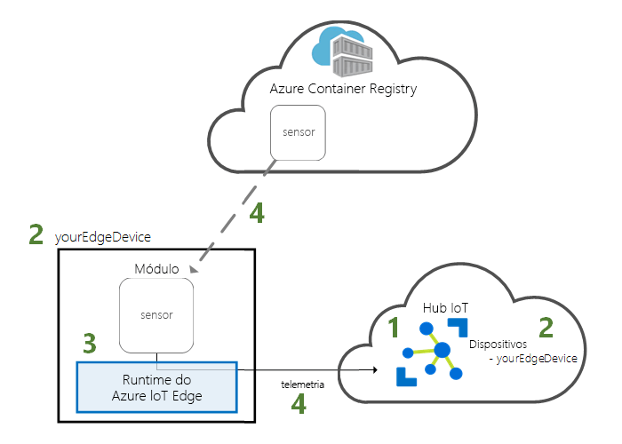
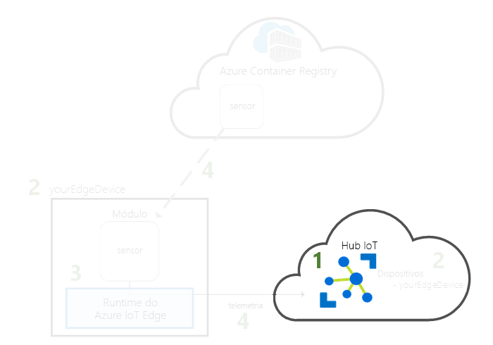
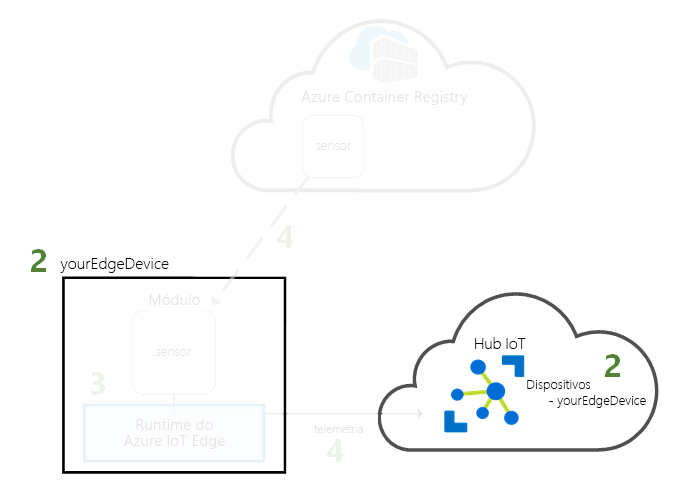
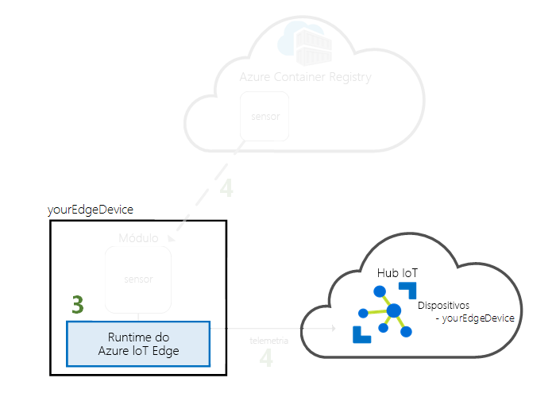
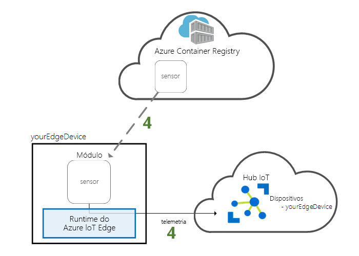

# <a name="quickstart-deploy-your-first-iot-edge-module-from-the-azure-portal-to-a-windows-device---preview"></a>Início rápido: Implementar o seu primeiro módulo do IoT Edge do portal do Azure para um dispositivo de Windows - pré-visualização

Neste guia de início rápido, utilize a interface cloud do Azure IoT Edge para implementar código pré-construído remotamente num dispositivo IoT Edge. Para realizar esta tarefa, primeiro utilize o seu dispositivo do Windows para simular um dispositivo IoT Edge, em seguida, pode implementar um módulo no mesmo.

Neste início rápido, vai aprender a:

1. Criar um Hub IoT.
2. Registar um dispositivo IoT Edge no seu hub IoT.
3. Instalar e iniciar o runtime do IoT Edge no seu dispositivo.
4. Implementar remotamente um módulo num dispositivo IoT Edge e enviar telemetria para o Hub IoT.



O módulo que vai implementar neste início rápido é um sensor simulado que gera dados de temperatura, humidade e pressão. Os outros tutoriais do Azure IoT Edge tiram partido do seu trabalho aqui realizado, ao implementar módulos que analisam os dados simulados de informações empresariais.

>[!NOTE]
>O runtime do IoT Edge no Windows está em [pré-visualização pública](https://azure.microsoft.com/support/legal/preview-supplemental-terms/).

Se não tiver uma subscrição ativa do Azure, crie uma [conta gratuita](https://azure.microsoft.com/free) antes de começar.

[!INCLUDE [cloud-shell-try-it.md](../../includes/cloud-shell-try-it.md)]

Vai utilizar a CLI do Azure para concluir muitos dos passos neste início rápido e o IoT do Azure tem uma extensão para ativar funcionalidades adicionais.

Adicione a extensão do IoT do Azure à instância da shell da cloud.

   ```azurecli-interactive
   az extension add --name azure-cli-iot-ext
   ```

## <a name="prerequisites"></a>Pré-requisitos

Recursos da cloud:

* Um grupo de recursos para gerir todos os recursos que utilizar neste início rápido.

   ```azurecli-interactive
   az group create --name IoTEdgeResources --location westus
   ```

Dispositivo IoT Edge

* Um computador ou uma máquina virtual do Windows que funcione como o seu dispositivo IoT Edge. Utilizar uma versão do Windows suportada:
  * Windows 10 ou IoT Core, com Outubro de 2018 update (compilação 17763)
  * Windows Server 2019
* Ativar a virtualização para que o seu dispositivo pode alojar contentores
   * Se for um computador Windows, ative a funcionalidade de contentores. Na barra de início, navegue até **ou desativar funcionalidades do Windows ative** e selecione a caixa junto a **contentores**.
   * Se for uma máquina virtual, ative [virtualização aninhada](https://docs.microsoft.com/virtualization/hyper-v-on-windows/user-guide/nested-virtualization) e atribuir, pelo menos, 2 GB de memória.

## <a name="create-an-iot-hub"></a>Criar um hub IoT

Inicie o guia de introdução ao criar um hub IoT com a CLI do Azure.



O nível gratuito do Hub IoT funciona para este início rápido. Se tiver utilizado o Hub IoT anteriormente e já tiver um hub gratuito criado, pode utilizar esse hub IoT. Cada subscrição só pode ter um Hub IoT gratuito.

O código seguinte cria um hub **F1** gratuito no grupo de recursos **IoTEdgeResources**. Substitua *{hub_name}* por um nome exclusivo para o hub IoT.

   ```azurecli-interactive
   az iot hub create --resource-group IoTEdgeResources --name {hub_name} --sku F1
   ```

   Se obtiver um erro porque já existe um hub gratuito na sua subscrição, altere o SKU para **S1**. Se obtiver um erro que o nome do IoT Hub não está disponível, significa que outra pessoa já tenha um concentrador com esse nome. Experimente um novo nome. 

## <a name="register-an-iot-edge-device"></a>Registar um dispositivo do IoT Edge

Registe um dispositivo do IoT Edge no seu Hub IoT recentemente criado.


Crie uma identidade de dispositivo para o seu dispositivo simulado para que este consiga comunicar com o seu hub IoT. A identidade do dispositivo reside na cloud e verá uma cadeia de ligação do dispositivo única para associar um dispositivo físico a uma identidade do dispositivo.

Uma vez que os dispositivos do IoT Edge se comportar e podem ser geridos de forma diferente do que os dispositivos de IoT típicos, declarar esta identidade para um dispositivo IoT Edge com o `--edge-enabled` sinalizador. 

1. No Azure Cloud Shell, introduza o comando seguinte para criar um dispositivo com o nome **myEdgeDevice** no seu hub.

   ```azurecli-interactive
   az iot hub device-identity create --device-id myEdgeDevice --hub-name {hub_name} --edge-enabled
   ```

   Se obtiver um erro sobre iothubowner chaves da política, certifique-se de que o cloud shell está a executar a versão mais recente da extensão do azure-cli-iot-ext. 

2. Obtenha a cadeia de ligação para o seu dispositivo, que liga o dispositivo físico à respetiva identidade do Hub IoT.

   ```azurecli-interactive
   az iot hub device-identity show-connection-string --device-id myEdgeDevice --hub-name {hub_name}
   ```

3. Copie a cadeia de ligação de saída JSON e guarde-o. Irá utilizar este valor para configurar o runtime do IoT Edge na secção seguinte.

   

## <a name="install-and-start-the-iot-edge-runtime"></a>Instalar e iniciar o runtime do IoT Edge

Instale o runtime do Azure IoT Edge no dispositivo IoT Edge e configure-o com uma cadeia de ligação de dispositivo.


O runtime do IoT Edge é implementado em todos os dispositivos do IoT Edge. Tem três componentes. O **daemon de segurança de IoT Edge** começa sempre que um dispositivo IoT Edge é iniciado e arrancar o dispositivo ao iniciar o agente do IoT Edge. O **agente do IoT Edge** gere a implementação e monitorização de módulos no dispositivo IoT Edge, incluindo o hub IoT Edge. O **hub do IoT Edge** processa as comunicações entre os módulos no dispositivo IoT Edge e entre o dispositivo e o IoT Hub.

O script de instalação também inclui um mecanismo de contentor chamado Moby que gere as imagens de contentor no seu dispositivo IoT Edge. 

Durante a instalação do runtime, é-lhe pedida a cadeia de ligação do dispositivo. Utilize a cadeia que obteve na CLI do Azure. Essa cadeia associa o dispositivo físico à identidade do dispositivo IoT Edge no Azure.

As instruções nesta secção Configurar o runtime do IoT Edge com contentores do Windows. Se pretender utilizar contentores do Linux, veja [runtime de instalar o Azure IoT Edge no Windows](how-to-install-iot-edge-windows-with-linux.md) desses pré-requisitos e passos de instalação.

### <a name="connect-to-your-iot-edge-device"></a>Ligar ao seu dispositivo IoT Edge

Os passos nesta secção todos os ocorrem no seu dispositivo IoT Edge. Se estiver a utilizar uma máquina virtual ou do hardware secundário, que pretende ligar-se a essa máquina agora através de SSH ou de ambiente de trabalho remoto. Se estiver a utilizar o seu computador como o dispositivo do IoT Edge, pode continuar para a secção seguinte. 

### <a name="download-and-install-the-iot-edge-service"></a>Transferir e instalar o serviço IoT Edge

Utilize o PowerShell para transferir e instalar o runtime IoT Edge. Utilize a cadeia de ligação do dispositivo que obteve no hub IoT para configurar o dispositivo.

1. No seu dispositivo IoT Edge, execute o PowerShell como administrador.

2. Transferir e instalar o serviço IoT Edge no dispositivo.

   ```powershell
   . {Invoke-WebRequest -useb aka.ms/iotedge-win} | Invoke-Expression; `
   Install-SecurityDaemon -Manual -ContainerOs Windows
   ```

3. Quando lhe for pedido **DeviceConnectionString**, indique a cadeia que copiou na secção anterior. Não inclua as aspas à volta da cadeia de ligação.

### <a name="view-the-iot-edge-runtime-status"></a>Ver o estado de runtime do IoT Edge

Verifique se o runtime foi instalado e configurado corretamente.

1. Verifique o estado do serviço IoT Edge.

   ```powershell
   Get-Service iotedge
   ```

2. Se precisar de resolver problemas relacionados com o serviço, obtenha os registos do serviço.

   ```powershell
   # Displays logs from today, newest at the bottom.

   Get-WinEvent -ea SilentlyContinue `
    -FilterHashtable @{ProviderName= "iotedged";
      LogName = "application"; StartTime = [datetime]::Today} |
    select TimeCreated, Message |
    sort-object @{Expression="TimeCreated";Descending=$false} |
    format-table -autosize -wrap
   ```

3. Veja todos os módulos em execução no seu dispositivo IoT Edge. Uma vez que o serviço foi iniciado pela primeira vez, deverá ver apenas o módulo **edgeAgent** em execução. O módulo edgeAgent é executado por predefinição e ajuda a instalar e iniciar quaisquer módulos adicionais que implementar no seu dispositivo.

   ```powershell
   iotedge list
   ```

   

O seu dispositivo IoT Edge está agora configurado. Está pronto para executar módulos implantados na cloud.

## <a name="deploy-a-module"></a>Implementar um módulo

Gerir o seu dispositivo do Azure IoT Edge a partir da cloud para implementar um módulo que envia dados de telemetria para o IoT Hub.


[!INCLUDE [iot-edge-deploy-module](../../includes/iot-edge-deploy-module.md)]

## <a name="view-generated-data"></a>Ver os dados gerados

Neste início rápido, registado um dispositivo IoT Edge e instalado o runtime do IoT Edge. Em seguida, utilizou o portal do Azure para implementar um módulo do IoT Edge para executar no dispositivo, sem ter de efetuar alterações ao dispositivo. 

Neste caso, o módulo que enviou cria dados de exemplo que pode utilizar para fins de teste. O módulo do sensor de temperatura simulada gera dados de ambiente que pode utilizar para fins de teste mais tarde. O sensor simulado está a monitorizar uma máquina e o ambiente em torno da máquina. Por exemplo, este sensor pode ser numa sala de servidor, num chão de fábrica ou numa turbina eólica. A mensagem inclui temperatura ambiente e umidade, temperatura de máquina e pressão e um carimbo. Os tutoriais do IoT Edge utilizam os dados criados por este módulo como dados para análise de teste.

Certifique-se de que o módulo implementado a partir da cloud está em execução no seu dispositivo IoT Edge.

```powershell
iotedge list
```

   

Ver as mensagens do módulo do sensor de temperatura, que está a ser enviadas para a cloud.

```powershell
iotedge logs SimulatedTemperatureSensor -f
```

   >[!TIP]
   >Comandos do IoT Edge diferenciam maiúsculas de minúsculas quando nos Referimos a nomes de módulos.

   

Também pode ver as mensagens de chegar ao seu hub IoT utilizando o [extensão de Kit de ferramentas do Azure IoT Hub para o Visual Studio Code](https://marketplace.visualstudio.com/items?itemName=vsciot-vscode.azure-iot-toolkit) (anteriormente conhecido como extensão do Kit de ferramentas do Azure IoT). 


## <a name="clean-up-resources"></a>Limpar recursos

Se quiser avançar para os tutoriais do IoT Edge, pode utilizar o dispositivo que registou e configurou neste início rápido. Caso contrário, pode eliminar os recursos do Azure que criou e remover o runtime do IoT Edge do seu dispositivo.

### <a name="delete-azure-resources"></a>Eliminar recursos do Azure

Se tiver criado a sua máquina virtual e o hub IoT num novo grupo de recursos, pode eliminar esse grupo e todos os recursos associados. Verifique novamente o conteúdo do grupo de recursos para ter certeza de que existem 's nada que quer manter. Se não quiser eliminar todo o grupo, pode eliminar recursos individuais em vez disso.

Remova o grupo de **IoTEdgeResources**.

   ```azurecli-interactive
   az group delete --name IoTEdgeResources
   ```

### <a name="remove-the-iot-edge-runtime"></a>Remover o runtime do IoT Edge

Se quiser remover as instalações do seu dispositivo, utilize os comandos seguintes.  

Remova o runtime do IoT Edge. Se pretender reinstalar o IoT Edge, omitir os `-DeleteConfig` e `-DeleteMobyDataRoot` parâmetros, para que pode reinstalar com a mesma configuração que acabou de configurar.

   ```powershell
   . {Invoke-WebRequest -useb aka.ms/iotedge-win} | Invoke-Expression; `
   Uninstall-SecurityDaemon -DeleteConfig -DeleteMobyDataRoot
   ```

## <a name="next-steps"></a>Passos Seguintes

Neste início rápido, criou um dispositivo IoT Edge e utilizou a interface de cloud do Azure IoT Edge para implementar o código no dispositivo. Agora tem um dispositivo de teste a gerar dados não processados sobre o seu ambiente.

Pode continuar para qualquer um dos outros tutoriais para saber mais sobre como o Azure IoT Edge o pode ajudar a transformar estes dados em informações empresariais no Edge.

> [!div class="nextstepaction"]
> [Filtrar os dados de sensores com uma Função do Azure](tutorial-deploy-function.md)
