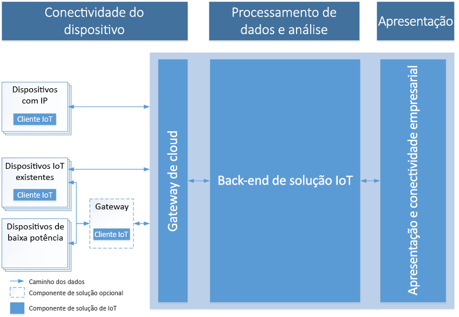

# Introdução ao Azure e à Internet das Coisas

O Azure IoT é composto por três áreas de tecnologias e soluções: soluções, serviços de plataforma e aresta, todos foram concebidos para facilitar o desenvolvimento ponto a ponto da aplicação IoT. Este artigo começa por descrever as características comuns de uma solução IoT na cloud, seguida de uma descrição geral de como o Azure IoT aborda os desafios nos projetos de IoT e por que motivo deve considerar adotar o Azure.

## Arquitetura da solução de IoT

As soluções de IoT necessitam de comunicação bidirecional e segura entre dispositivos, possivelmente com números na casa dos milhões e um back-end de solução. Por exemplo, uma solução poderá utilizar a análise preditiva automatizada para descobrir informações a partir da transmissão de eventos do dispositivo para a cloud. 

O diagrama seguinte mostra os principais elementos de uma arquitetura da solução IoT típica. O diagrama desconhece os detalhes específicos da implementação, como os serviços do Azure utilizados e os sistemas operativos dos dispositivos. Nesta arquitetura, os dispositivos IoT recolhem dados que enviam para um gateway de nuvem. O gateway da cloud disponibiliza os dados para processamento por parte de outros serviços de back-end. Estes serviços de back-end podem fornecer dados para:

* Outras aplicações de linha de negócio.
* Operadores humanos através de um dashboard ou outro dispositivo de apresentação.

> [!NOTE]
> Para um debate aprofundado da arquitetura do IoT, veja [Microsoft Azure IoT Reference Architecture](https://aka.ms/iotrefarchitecture) (Arquitetura de Referência do Microsoft Azure IoT).

### Conectividade dos dispositivos

Numa arquitetura da solução IoT, normalmente os dispositivos enviam telemetria para a cloud, para armazenamento e processamento. Por exemplo, num cenário de manutenção preventiva, o back-end da solução poderá utilizar o fluxo de dados dos sensores para determinar quando uma bomba específica precisa de manutenção. Os dispositivos também podem receber e responder a mensagens da cloud para o dispositivo, lendo as mensagens a partir de um ponto final da cloud. No mesmo exemplo, o back-end da solução poderá enviar mensagens a outras bombas na estação de bombagem para que comecem a reencaminhar os fluxos imediatamente antes do início previsto da manutenção. Este procedimento assegura que o engenheiro de manutenção poderia começar assim que chegasse.

A ligação segura e fiável de dispositivos é, frequentemente, o maior desafio para as soluções IoT. Isto deve-se ao facto de os dispositivos IoT terem características diferentes, em comparação a outros clientes, como browsers e aplicações móveis. Especificamente, os dispositivos IoT:

* São, frequentemente, sistemas incorporados sem nenhum operador humano (ao contrário de um telefone).
* Podem ser implementados em localizações remotas, onde o acesso físico é dispendioso.
* Podem apenas ser acessíveis através do back-end da solução. Não há outro modo de interagir com o dispositivo.
* Podem ter potência e recursos de processamento limitados.
* Podem ter uma conectividade de rede intermitente, lente ou dispendiosa.
* Podem ter de utilizar protocolos de aplicação proprietários, personalizados ou específicos da indústria.
* Podem ser criados utilizando um grande conjunto de plataformas de hardware e software populares.

Além das restrições anteriores, qualquer solução IoT também tem de ser dimensionável, segura e fiável.

Consoante o protocolo de comunicação e a disponibilidade de rede, um dispositivo pode comunicar diretamente ou através de um gateway intermédio com a cloud. As arquiteturas de IoT têm, frequentemente, uma combinação desses dois padrões de comunicação.

### Processamento e análise dos dados

Em soluções IoT modernas, o processamento de dados pode ocorrer na cloud ou do lado do dispositivo. O processamento do lado do dispositivo é referido como *Computação periférica*. A escolha de onde processar os dados depende de fatores como:

* Restrições de rede. Se a largura de banda entre os dispositivos e a cloud for limitada, há um incentivo para fazer mais processamento periférico.
* Tempo de resposta. Se existir um requisito para agir sobre um dispositivo quase em tempo real, poderá ser melhor processar a resposta no próprio dispositivo. Por exemplo, o braço de um robot que tem de ser parado numa emergência.
* Ambiente regulamentar. Alguns dados não podem ser enviados para a cloud.

Em geral, o processamento de dados na periferia e na cloud são uma combinação das seguintes funcionalidades:

* Receber a telemetria à escala dos seus dispositivos e determinar como processar e armazenar esses dados.
* Analisar a telemetria para fornecer informações, quer sejam em tempo real ou após o facto.
* Enviar comandos a partir da cloud ou de um dispositivo de gateway para um dispositivo específico.

Além disso, um back-end da cloud da IoT deve fornecer:

* Capacidades de registo de dispositivos que lhe permitem:
    * Aprovisionar dispositivos.
    * Controlar os dispositivos que estão autorizados a ligar à sua infraestrutura.
* Gestão de dispositivos para controlar o estado dos seus dispositivos e monitorizar as respetivas atividades.

Por exemplo, num cenário de manutenção preditiva, o back-end da cloud armazena os dados de telemetria históricos. A solução utiliza estes dados para identificar potenciais comportamentos anómalos em bombas específicas antes de poderem provocar um problema real. Com a análise de dados, poderá identificar que a solução preventiva deve enviar um comando de volta para o dispositivo, para uma ação corretiva. Este processo gera um ciclo de comentários automatizado entre o dispositivo e a cloud, que aumenta significativamente a eficiência da solução.

### Apresentação e conectividade empresarial

A camada de apresentação e conectividade empresarial permite aos utilizadores finais interagirem com os dispositivos e soluções de IoT. Permite que os utilizadores vejam e analisem os dados recolhidos a partir dos dispositivos. Estas vistas podem ter a forma de dashboards ou de relatórios do BI e podem apresentar dados históricos ou dados quase em tempo real. Por exemplo, um operador pode verificar o estado de uma estação de bombagem específica e ver todos os alertas gerados pelo sistema. Esta camada também permite a integração do back-end da solução IoT com aplicações de linha de negócio existentes para se ligarem a processos empresariais ou fluxos de trabalho da empresa. Por exemplo, uma solução da manutenção preventiva pode ser integrada num sistema de agendamento para marcar a visita de um técnico a uma estação de bombagem quando é identificada uma bomba a precisar de manutenção.

## Porquê o Azure IoT?

O Azure IoT simplifica a complexidade dos projetos de IoT e aborda os desafios, tais como a segurança, a incompatibilidade de infraestrutura e o dimensionamento da sua solução IoT. Veja como:

### Ágil

Acelere o seu percurso na IoT.

* Possível dimensionar: comece por algo pequeno, cresça para qualquer tamanho, em qualquer lugar e em todo o lugar — milhões de dispositivos, terabytes de dados, na maioria das regiões em todo o mundo.

* Aberto: utilize o que tem ou modernize-se para o futuro ao ligar-se a qualquer dispositivo, software ou serviço.

* Híbrido: construa consoante as suas necessidades ao implementar a solução IoT na aresta, na cloud ou em qualquer lugar entre as duas.

* Ritmo: implemente mais rápido, acelere o tempo até ser comercializado e antecipe-se à concorrência como o líder em aceleradores de soluções e no ritmo da inovação no IoT.

### Abrangente

Crie impacto para a sua empresa.

* Completo: a Microsoft é o único fornecedor de soluções IoT com uma plataforma completa que vai desde o dispositivo à cloud, passando pelos macrodados, análise avançada e com serviços geridos.

* Parceiro de êxito: aceda ao poder do maior ecossistema de parceiros do mundo e dê vida à linha de negócio e tecnologia, nos diversos setores e em todo o mundo.

* Orientado por dados: o IoT tem a ver com dados e as melhores soluções IoT reúnem todas as ferramentas necessárias para armazenar, interpretar, transformar, analisar e apresentar os dados para o utilizador correto, no sítio certo, no momento certo.

* Centrado nos dispositivos: o IoT da Microsoft permite-lhe ligar tudo, desde equipamento legado até um vasto ecossistema de hardware certificado e a capacidade de criar os seus próprios dispositivos em sistemas de limite, móveis e incorporados.

### Proteger

Resolva a parte mais difícil da IoT — a segurança.

* Capacitar: com o Microsoft IoT, pode juntar a sua visão, com a tecnologia, as melhores práticas e as capacidades de resolver a parte mais difícil do IoT — a segurança.

* Tomar medidas: proteger os dados de IoT e gerir o risco com a gestão de identidades e de acesso, a proteção de informações e ameaças e gestão de segurança.

* Tranquilidade: garanta a segurança das informações confidenciais em diferentes dispositivos, software, aplicações e serviços cloud, bem como nos ambientes no local.

* Conformidade: a Microsoft tem liderado a indústria na definição de requisitos de segurança que cumpram um conjunto amplo de normas internacionais e específicas da indústria para dados, serviços e dispositivos IoT.

## Passos seguintes

Explore as seguintes áreas de tecnologias e soluções.

**Soluções**

* [Aceleradores de solução IoT](/azure/iot-suite)
* [Centro de IoT](/azure/iot-central)

**Serviços de plataforma**

* [Hub IoT](/azure/iot-hub)
* [Serviço de Aprovisionamento de Dispositivos no Hub IoT](/azure/iot-dps)
* [Azure Maps](/azure/azure-maps/)
* [Time Series Insights](/azure/time-series-insights)

**Edge**

* [Descrição geral do IoT Edge](/azure/iot-edge)
* [O que é o IoT Edge](/azure/how-iot-edge-works)
