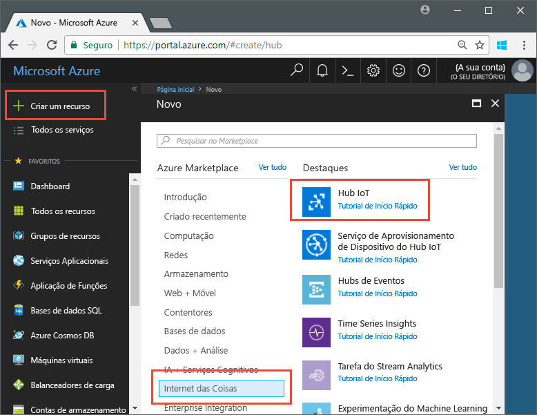
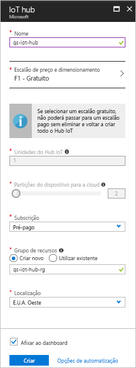

# <a name="send-telemetry-from-a-device-to-an-iot-hub-swift"></a>Enviar telemetria a partir de um dispositivo para um hub IoT (Swift)

O Hub IoT é um serviço do Azure que lhe permite ingerir elevados volumes de telemetria dos seus dispositivos IoT para a cloud para armazenamento ou processamento. Neste artigo, vai enviar telemetria a partir de uma aplicação de dispositivo simulado para o Hub IoT. Em seguida, pode ver os dados de uma aplicação de back-end. 

Este artigo utiliza uma aplicação Swift pré-escrita para enviar a telemetria e um utilitário de CLI para lê-la a partir do Hub IoT. 

[!INCLUDE [cloud-shell-try-it.md](../../includes/cloud-shell-try-it.md)]

Se não tiver uma subscrição do Azure, crie uma [conta gratuita](https://azure.microsoft.com/free/?WT.mc_id=A261C142F) antes de começar.

## <a name="prerequisites"></a>Pré-requisitos

- Transferir o código de exemplo a partir dos [exemplos do Azure](https://github.com/Azure-Samples/azure-iot-samples-ios/archive/master.zip) 
- A versão mais recente do [XCode](https://developer.apple.com/xcode/), com a última versão do SDK do iOS. Este início rápido foi testado com XCode 9.3 e o iOS 11.3.
- A versão mais recente do [CocoaPods](https://guides.cocoapods.org/using/getting-started.html).
- O utilitário da CLI iothub-explorer, que lê telemetria a partir do Hub IoT. Para instalar, instale primeiro o [Node.js](https://nodejs.org) v4.x.x ou superior e, em seguida, execute o seguinte comando: 

   ```sh
   sudo npm install -g iothub-explorer
   ```

## <a name="create-an-iot-hub"></a>Criar um hub IoT

O primeiro passo consiste em utilizar o portal do Azure para criar um hub IoT na sua subscrição. O Hub IoT permite-lhe ingerir elevados volumes de telemetria na cloud a partir de vários dispositivos. Depois, o hub ativa um ou mais serviços de back-end em execução na cloud, para ler e processar essa telemetria.

1. Inicie sessão no [portal do Azure](http://portal.azure.com).

1. Selecione **Criar um recurso** > **Internet das Coisas** > **Hub IoT**. 

   

1. Para criar o seu hub IoT, utilize os valores da tabela seguinte:

    | Definição | Valor |
    | ------- | ----- |
    | Nome | Um nome exclusivo para o hub |
    | Escalão de preço e dimensionamento | F1 Gratuito |
    | Unidades do Hub IoT | 1 |
    | Partições do dispositivo para a cloud | 2 partições |
    | Subscrição | A sua subscrição do Azure. |
    | Grupo de recursos | Crie um novo. Introduza um nome para o grupo de recursos novo. |
    | Localização | A localização mais próxima de si. |
    | Afixar ao dashboard | Sim |

1. Clique em **Criar**.  

   

1. Anote o nome do Hub IoT e dos grupos de recursos. Vai utilizar esses valores mais tarde neste início rápido.

## <a name="register-a-device"></a>Registar um dispositivo

É necessário registar um dispositivo no hub IoT antes de o mesmo se poder ligar. Neste início rápido, vai utilizar a CLI do Azure para registar um dispositivo simulado.

1. Adicione a extensão da CLI do Hub IoT e crie a identidade do dispositivo. Substitua `{YourIoTHubName}` por um nome para o seu hub IoT.

   ```azurecli-interactive
   az extension add --name azure-cli-iot-ext
   az iot hub device-identity create --hub-name {YourIoTHubName} --device-id myiOSdevice
   ```

1. Execute o seguinte comando para obter a _cadeia de ligação do dispositivo_ do dispositivo que acabou de registar:

   ```azurecli-interactive
   az iot hub device-identity show-connection-string --hub-name {YourIoTHubName} --device-id myiOSdevice --output table
   ```

   Anote a cadeia de ligação do dispositivo, que se parece com `Hostname=...=`. Vai utilizar este valor mais tarde no artigo.

1. Também precisa de uma _cadeia de ligação do serviço_ para permitir que as aplicações de back-end se liguem ao hub IoT e obtenham mensagens do dispositivo para acloud. O seguinte comando obtém a cadeia de ligação do serviço do seu hub IoT:

   ```azurecli-interactive
   az iot hub show-connection-string --hub-name {YourIoTHubName} --output table
   ```

   Anote a cadeia de ligação do serviço, que se parece com `Hostname=...=`. Vai utilizar este valor mais tarde no artigo.

## <a name="send-simulated-telemetry"></a>Enviar telemetria simulada

A aplicação de exemplo é executada num dispositivo iOS, que se liga a um ponto final de um dispositivo específico no seu hub IoT e envia a telemetria de humidade e de temperatura simulada. 

### <a name="install-cocoapods"></a>Instalar CocoaPods

O CocoaPods gere dependências para projetos de iOS que utilizam bibliotecas de terceiros.

Numa janela de terminal, navegue para a pasta Azure-IoT-Samples-iOS que transferiu nos pré-requisitos. Depois, navegue para o projeto de exemplo:

```sh
cd quickstart/sample-device
```

Confirme que XCode está fechado e execute o seguinte comando para instalar os CocoaPods que são declarados no ficheiro **podfile**:

```sh
pod install
```

Para além de instalar os pods necessários para o projeto, o comando de instalação também criou um ficheiro de área de trabalho do XCode, que já está configurado para utilizar os pods para dependências. 

### <a name="run-the-sample-application"></a>Executar o exemplo de aplicação 

1. Abra a área de trabalho de exemplo no XCode.

   ```sh
   open "MQTT Client Sample.xcworkspace"
   ```

2. Expanda o projeto **MQTT Client Sample** e, em seguida, expanda a pasta com o mesmo nome.  
3. Abra **ViewController.swift** para edição no XCode. 
4. Procure a variável **connectionString** e atualize o valor com a cadeia de ligação do serviço que anotou anteriormente.
5. Guarde as alterações. 
6. Execute o projeto no emulador do dispositivo com o botão **Build and run** (Compilar e executar) ou a combinação de teclas **comando + r**. 

   

7. Quando o emulador se abrir, selecione **Start** (Iniciar) na aplicação de exemplo.

A captura de ecrã abaixo mostra uma saída de exemplo à medida que a aplicação envia telemetria simulada para o hub IoT:

   

## <a name="read-the-telemetry-from-your-hub"></a>Ler a telemetria a partir do seu hub

A aplicação de exemplo que executou no emulador XCode mostra os dados das mensagens enviadas a partir do dispositivo. Também pode ver os dados através do hub IoT, à medida que são recebidos. O utilitário da CLI `iothub-explorer` liga-se ao ponto final **Events** do lado do serviço no Hub IoT. 

Abra uma janela de terminal nova. Execute o seguinte comando, substituindo {your hub service connection string} com a cadeia de ligação do serviço que obteve no início deste artigo:

```sh
iothub-explorer monitor-events myiOSdevice --login "{your hub service connection string}"
```

A captura de ecrã abaixo mostra o tipo de telemetria que vai ver na janela de terminal:


Se obtiver um erro quando executar o comando iothub-explorer, confirme que está a utilizar a *cadeia de ligação do serviço* do Hub IoT e não a *cadeia de ligação do dispositivo* do dispositivo IoT. Ambas as cadeias de ligação começam por **Hostname={iothubname}**, mas a cadeia de ligação do serviço contém a propriedade **SharedAccessKeyName** ao passo que a cadeia de ligação do dispositivo contém **DeviceID**. 

## <a name="clean-up-resources"></a>Limpar recursos

Se planear continuar a testar o Hub IoT com outros artigos, mantenha o grupo de recursos e o hub IoT para reutilizá-los mais tarde.

Se já não precisar do Hub IoT, elimine-o, bem como ao grupo de recursos, no portal. Para tal, selecione o grupo de recursos que contém o Hub IoT e clique em **Eliminar**.

## <a name="next-steps"></a>Passos seguintes

Neste artigo, configurou um hub IoT, registou um dispositivo, enviou telemetria simulada para o hub a partir de um dispositivo iOS e leu-a no hub. 

Para saber mais sobre como os dispositivos iOS podem funcionar com o Hub IoT, veja [Send cloud-to-device messages with iOS (Swift)](iot-hub-ios-swift-c2d.md) (Enviar mensagens da cloud para o dispositivo com o iOS [Swift])

<!-- Links -->
[lnk-process-d2c-tutorial]: iot-hub-csharp-csharp-process-d2c.md
[lnk-device-management]: iot-hub-node-node-device-management-get-started.md
[lnk-iot-edge]: ../iot-edge/tutorial-simulate-device-linux.md
[lnk-connect-device]: https://azure.microsoft.com/develop/iot/
