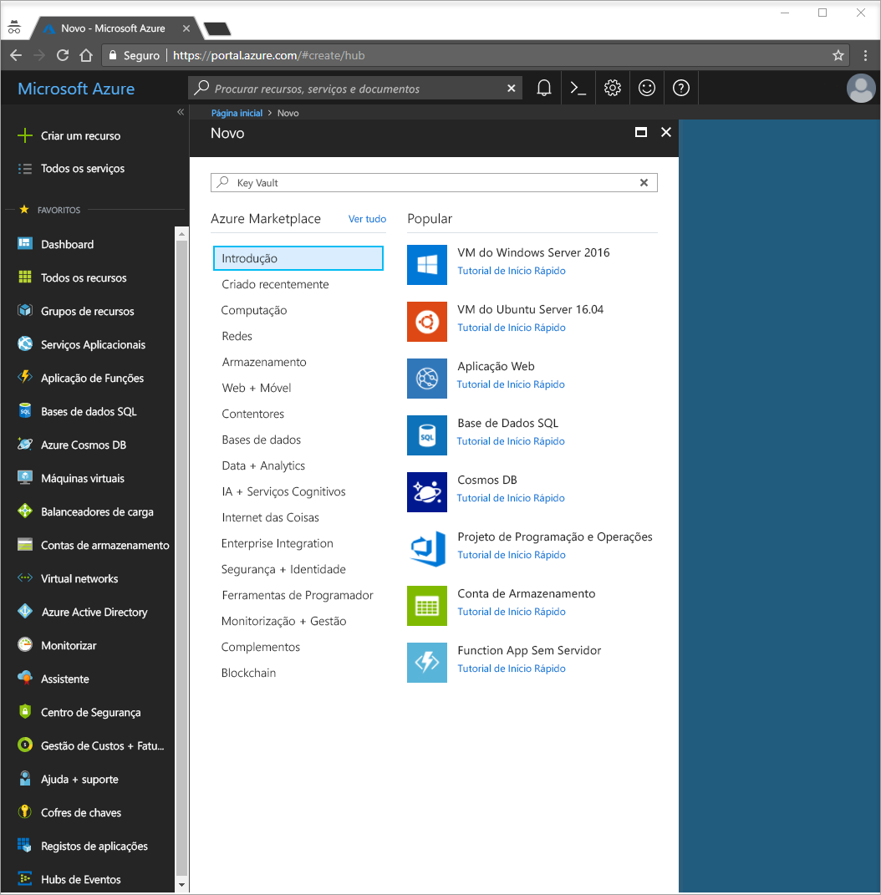
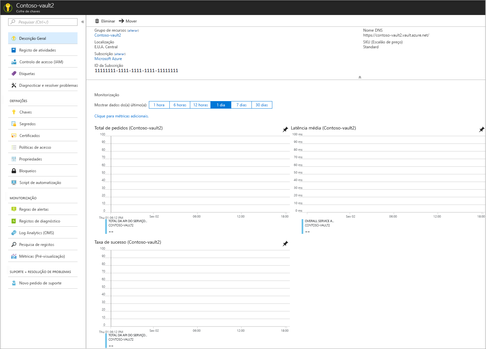
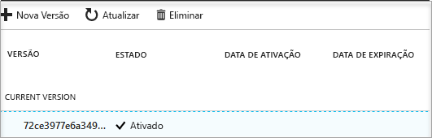

# Início Rápido: Definir e obter um segredo do Azure Key Vault com o portal do Azure

O Azure Key Vault é um serviço cloud que funciona como um arquivo de segredos seguro. Pode armazenar chaves, palavras-passe, certificados e outros segredos em segurança. Para obter mais informações sobre o Key Vault, pode ver a [Descrição Geral](key-vault-overview.md). Os cofres de chaves do Azure podem ser criados e geridos através do portal do Azure. Neste início rápido, vai criar um cofre de chaves. Depois de concluir este passo, irá armazenar um segredo.

Se não tiver uma subscrição do Azure, crie uma [conta gratuita](https://azure.microsoft.com/free/?WT.mc_id=A261C142F) antes de começar.

## Iniciar sessão no Azure

Inicie sessão no portal do Azure em http://portal.azure.com.

## Criar um cofre

1. Selecione a opção **Criar um recurso** no canto superior esquerdo do portal do Azure

    
2. Na caixa Pesquisar, introduza **Key Vault**.
3. Na lista de resultados, selecione **Key Vault**.
4. Na secção Key Vault, selecione **Criar**.
5. Na secção **Criar cofre de chaves**, forneça as seguintes informações:
    - **Nome**: para este início rápido, utilizamos **Contoso-vault2**. Tem de fornecer um nome exclusivo no teste.
    - **Subscrição**: selecione a subscrição que irá utilizar para este início rápido.
    - Em **Grupo de Recursos**, selecione **Criar novo** e introduza um nome de grupo de recursos.
    - No menu pendente **Localização**, selecione uma localização.
    - Marque a caixa de verificação **Afixar ao dashboard**.
    - Deixe as outras opções com os valores predefinidos.
6. Depois de fornecer as informações acima, selecione **Criar**.

Tome nota das duas propriedades listadas abaixo:

* **Nome do Cofre**: no exemplo, o nome é **Contoso-Vault2**. Irá utilizar este nome para outros passos.
* **URI do Cofre**: no exemplo, isto é https://contoso-vault2.vault.azure.net/. As aplicações que utilizam o cofre através da respetiva API têm de utilizar este URI.

Nesta altura, a sua conta do Azure é a única autorizada a realizar quaisquer operações neste novo cofre.

## Adicionar um segredo ao Key Vault

Para adicionar um segredo ao cofre, apenas tem de efetuar alguns passos adicionais. Neste caso, vamos adicionar uma palavra-passe que possa ser utilizada por uma aplicação. A palavra-passe é denominada **ExamplePassword** e armazenamos o valor **Pa$$w0rd** na mesma.

1. Na página de propriedades do Key Vault, selecione **Segredos**.
2. Clique em **Gerar/Importar**.
3. No ecrã **Criar um segredo**, selecione o seguinte:
    - **Opções de carregamento**: Manual.
    - **Nome**: ExamplePassword.
    - **Valor**: Pa$$w0rd.
    - Deixe as outras opções com os valores predefinidos. Clique em **Criar**.

Depois de receber a mensagem de que o segredo foi criado com êxito, pode clicar no mesmo na lista. Em seguida, pode ver algumas das propriedades. Se clicar na versão atual, pode ver o valor que especificou no passo anterior.

## Limpar recursos

Outros inícios rápidos e tutoriais do Key Vault têm por base este início rápido. Se quiser continuar a trabalhar com os inícios rápidos e tutoriais subsequentes, pode manter estes recursos.
Quando já não for necessário, elimine o grupo de recursos e o Key Vault e todos os recursos relacionados serão eliminados. Para eliminar o grupo de recursos através do portal:

1. O nome do grupo de recursos na caixa Pesquisar, na parte superior do portal. Quando vir o grupo de recursos utilizado neste Início Rápido nos resultados da pesquisa, selecione-o.
2. Selecione **Eliminar grupo de recursos**.
3. Na caixa **ESCREVA O NOME DO GRUPO DE RECURSOS:**, escreva o nome do grupo de recursos e selecione **Eliminar**.

## Passos seguintes

Neste início rápido, criou um Key Vault e armazenou um segredo. Para saber mais sobre o Key Vault e como utilizá-lo com as suas aplicações, avance para o tutorial referente às aplicações Web que funcionam com o Key Vault.

> [!div class="nextstepaction"]
> Para saber como ler um segredo a partir do Key Vault através de uma aplicação Web com identidades do serviço gerido, avance para o tutorial[Configurar uma aplicação Web do Azure para ler um segredo a partir do Key Vault](quick-create-net.md).
