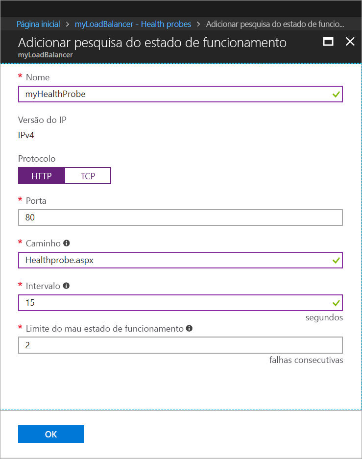
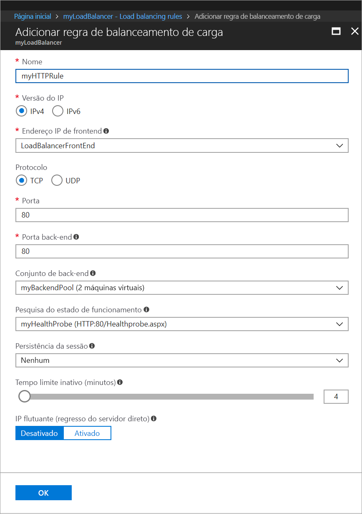
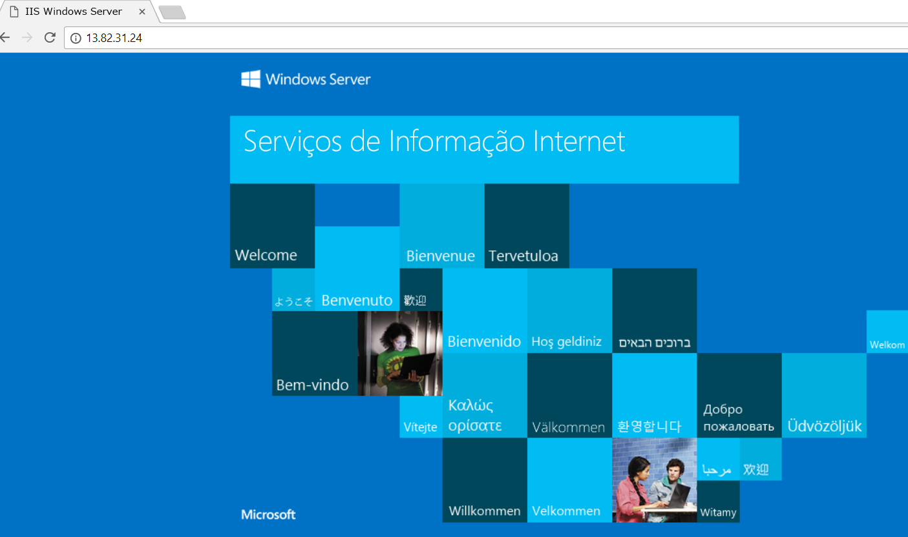

# Início Rápido: Criar um Balanceador de Carga Standard para fazer o balanceamento de carga das VMs com o portal do Azure

O balanceamento de carga oferece um nível mais elevado de disponibilidade e dimensionamento ao propagar os pedidos recebidos por várias máquinas virtuais. Pode utilizar o Portal do Azure para criar um balanceador de carga que faça o balanceamento de carga das máquinas virtuais (VMs). Este início rápido mostra-lhe como fazer o balanceamento de carga de VMs mediante a utilização de um Balanceador de Carga Standard.

Se não tiver uma subscrição do Azure, crie uma [conta gratuita](https://azure.microsoft.com/free/?WT.mc_id=A261C142F) antes de começar. 

## Iniciar sessão no Azure

Inicie sessão no Portal do Azure em [http://portal.azure.com](http://portal.azure.com).

## Criar um balanceador de carga público

Nesta secção, vai criar um balanceador de carga público que ajuda a fazer o balanceamento de carga de máquinas virtuais. O Balanceador de Carga Standard só suporta endereços IP Públicos Standard. Quando cria um Balanceador de Carga Standard, também tem de criar um endereço IP Público Standard novo que seja configurado como o front-end (denominado *LoadBalancerFrontend* por predefinição) para o mesmo. 

1. No canto superior esquerdo do ecrã, clique em **Criar um recurso** > **Rede** > **Balanceador de Carga**.
2. Na página **Criar balanceador de carga**, introduza ou selecione as informações seguintes, aceite as predefinições das definições restantes e selecione **Criar**:

    | Definição                 | Valor                                              |
    | ---                     | ---                                                |
    | Nome                   | *myLoadBalancer*                                   |
    | Tipo          | Público                                        |
    | SKU           | Standard                          |
    | Endereço IP público | Selecione **Criar novo** e escreva *myPublicIP* na caixa de texto. O SKU Standard para o endereço IP Público é selecionado por predefinição. Em **Zona de disponibilidade**, selecione **Com Redundância entre Zonas**. |
    | Subscrição               | Selecione a sua subscrição.    |
    |Grupo de recursos | Selecione **Criar novo** e, em seguida, escreva *myResourceGroupSLB*.    |
    | Localização           | Selecione **Europa Ocidental**.                          |
    

## Criar servidores de back-end

Nesta secção, vai criar uma rede virtual, duas máquinas virtuais para o conjunto de back-end do seu balanceador de carga e, em seguida, instalar o IIS nas máquinas virtuais para o ajudar a testar o balanceador de carga.

### Criar uma rede virtual
1. No canto superior esquerdo do ecrã, clique em **Novo** > **Redes** > **Rede virtual** e introduza estes valores para a rede virtual:
    - *myVnet* - no nome da rede virtual.
    - *myResourceGroupLB* - no nome do grupo de recursos existente.
    - *myBackendSubnet* - no nome da sub-rede.
2. Clique em **Criar** para criar a rede virtual.

    

### Criar máquinas virtuais

1. No canto superior esquerdo do ecrã, clique em **Novo** > **Computação** > **Windows Server 2016 Datacenter** e introduza estes valores para a máquina virtual:
    - *myVM1* - no nome da máquina virtual.        
    - *myResourceGroupSLB* - para o **Grupo de recursos**, selecione **Utilizar existente** e, em seguida, selecione *myResourceGroupSLB*.
2. Clique em **OK**.
3. Selecione **DS1_V2** para o tamanho da máquina virtual e clique em **Selecionar**.
4. Introduza estes valores para as definições de VM:
    1. Certifique-se de que *myVNet* está selecionado para a rede virtual e que *myBackendSubnet* está selecionado como sub-rede.
    2. Para **Endereço IP público**, no painel **Criar endereço IP público**, selecione **Standard** e, em seguida, selecione **OK**.
    3. Para o **Grupo de Segurança de Rede**, selecione **Avançado** e, em seguida, faça o seguinte:
        1. Selecione *Grupo de segurança de rede (firewall) e, na página **Escolher grupo de segurança de rede**, selecione **Criar novo**. 
        2. Na página **Criar grupo de segurança de rede**, para **Nome**, introduza *myNetworkSecurityGroup* e, em seguida, selecione **OK**.
5. Clique em **Desativado** para desativar o diagnóstico de arranque.
6. Clique em **OK**, reveja as definições na página de resumo e, em seguida, clique em **Criar**.
7. Utilize os passos 1 a 6 e crie uma segunda VM, com o nome *VM2* com *myAvailibilityset* como o Conjunto de disponibilidade, *myVnet* como a rede virtual, *myBackendSubnet* como a sub-rede e \**myNetworkSecurityGroup* como o grupo de segurança de rede. 

### Criar regra NSG

Nesta secção, vai criar uma regra de NSG para permitir ligações de entrada através de HTTP.

1. Clique em **Todos os recursos**, no menu da esquerda, e, na lista de recursos, clique em **myNetworkSecurityGroup**, que se encontra no grupo de recursos **myResourceGroupSLB**.
2. Em **Definições**, clique em **Regras de segurança de entrada** e, em seguida, clique em**Adicionar**.
3. Introduza estes valores para a regra de segurança de entrada com o nome *myHTTPRule* para permitir ligações HTTP de entrada através da porta 80:
    - *Service Tag* - na **Origem**.
    - *Internet* - na **Etiqueta do serviço de origem**
    - *80* - nos **Intervalos de portas de destino**
    - *TCP* - no **Protocolo**
    - *Allow* - na **Ação**
    - *100* - na **Prioridade**
    - *myHTTPRule* - no nome
    - *Allow HTTP* - na descrição
4. Clique em **OK**.
 
### Instalar o IIS

1. Clique em **Todos os recursos**, no menu da esquerda e, na lista de recursos, clique em **myVM1**, que se encontra no grupo de recursos *myResourceGroupLB*.
2. Na página **Descrição geral**, clique em **Ligar** para estabelecer o RDP para a VM.
3. Inicie sessão na VM com o nome de utilizador *azureuser*.
4. No ambiente de trabalho do servidor, navegue para **Ferramentas Administrativas do Windows**>**Gestor de Servidor**.
5. No Gestor de Servidor, clique em **Adicionar Funções e Funcionalidades**.
6. No **Assistente Adicionar Funções e Funcionalidades**, utilize os seguintes valores:
    - Na página **Selecionar tipo de instalação**, clique em **Instalação baseada em funções ou baseada em funcionalidades**.
    - Na página **Selecionar servidor de destino**, clique em **myVM1**
    - Na página **Selecionar função de servidor**, clique em **Servidor Web (IIS)**
    - Siga as instruções para concluir o resto do assistente 
7. Repita os passos 1 a 6 para a máquina virtual *myVM2*.

## Criar recursos do balanceador de carga

Nesta secção, irá configurar as definições de balanceador de carga de um conjunto de endereços de back-end e de uma sonda de estado de funcionamento, bem como especificar uma regra do balanceador de carga.

### Criar um conjunto de endereços de back-end

Para distribuir o tráfego pelas VMs, um conjunto de endereços de back-end contém os endereços IP das placas virtuais (NICs) ligadas ao balanceador de carga. Crie o conjunto de endereços de back-end *myBackendPool* de forma a incluir *VM1* e *VM2*.

1. Clique em **Todos os recursos**, no menu da esquerda, e clique em **myLoadBalancer** na lista de recursos.
2. Em **Definições**, clique em **Conjuntos de back-end** e, em seguida, clique em **Adicionar**.
3. Na página **Adicionar um conjunto de back-end**, faça o seguinte:
   - No nome, escreva *myBackendPool* como o nome do conjunto de back-end.
   - Para **Rede virtual**, selecione *myVNet*.
   - Adicione *myVM1* e *myVM2* em **Máquina Virtual** juntamente com os seus endereços IP correspondentes e, em seguida, selecione **Adicionar**.
    - Clique em **OK**.

3. Confirme que a definição do conjunto de back-end do balanceador de carga apresenta ambas as VMs, **VM1** e **VM2**.

### Criar uma sonda de estado de funcionamento

Para permitir ao balanceador de carga monitorizar o estado da aplicação, pode utilizar uma sonda de estado de funcionamento. A sonda de estado de funcionamento adiciona ou remove dinamicamente VMs da rotação do balanceador de carga com base na respetiva resposta às verificações de estado de funcionamento. Crie uma sonda de estado de funcionamento, *myHealthProbe*, para monitorizar o estado de funcionamento das VMs.

1. Clique em **Todos os recursos**, no menu da esquerda, e clique em **myLoadBalancer** na lista de recursos.
2. Em **Definições**, clique em **Sondas de estado de funcionamento** e, em seguida, clique em **Adicionar**.
3. Utilize estes valores para criar a sonda de estado de funcionamento:
    - *myHealthProbe* - no nome da sonda de estado de funcionamento.
    - **HTTP** - no tipo de protocolo.
    - *80* - no número da porta.
    - *Healthprobe. aspx* – para o caminho do URI. Pode substituir este valor com quaisquer outro URI ou mantenha o valor do caminho predefinido de **"\\"** para obter o URI predefinido.
    - *15* - no número do **Intervalo**, em segundos, entre tentativas da sonda.
    - *2* - no número do **Limiar de mau estado de funcionamento** ou das falhas consecutivas da sonda que têm de ocorrer para que uma VM seja considerada como estando em mau estado de funcionamento.
4. Clique em **OK**.

   

### Crie uma regra de balanceador de carga

É utilizada uma regra de balanceador de carga para definir a forma como o tráfego é distribuído pelas VMs. Pode definir a configuração de IP de front-end do tráfego de entrada e o conjunto de IPs de back-end para receber o tráfego, juntamente com a porta de origem e de destino necessárias. Crie uma regra de balanceador de carga *myLoadBalancerRuleWeb* para escutar na porta 80 no front-end *FrontendLoadBalancer* e enviar o tráfego de rede com balanceamento de carga para o conjunto de endereços de back-end *myBackEndPool* também através da porta 80. 

1. Clique em **Todos os recursos**, no menu da esquerda, e clique em **myLoadBalancer** na lista de recursos.
2. Em **Definições**, clique em **Regras de balanceamento de carga** e, em seguida, clique em **Adicionar**.
3. Utilize estes valores para configurar a regra de balanceamento de carga:
    - *myHTTPRule* - no nome da regra de balanceamento de carga.
    - **TCP** - no tipo de protocolo.
    - *80* - no número da porta.
    - *80* - na porta de back-end.
    - *myBackendPool* - no nome do conjunto de back-end.
    - *myHealthProbe* - no nome da sonda de estado de funcionamento.
4. Clique em **OK**.
    
    

## Testar o balanceador de carga
1. Localize o endereço IP público do Balanceador de Carga no ecrã **Descrição geral**. Clique em **Todos os recursos** e, em seguida, clique em **myPublicIP**.

2. Copie o endereço IP público e cole-o na barra de endereço do browser. A página predefinida do servidor Web do IIS é apresentada no browser.

      

## Limpar recursos

Quando já não for necessário, elimine o grupo de recursos, o balanceador de carga e todos os recursos relacionados. Para tal, selecione o grupo de recursos que contém o balanceador de carga e clique em **Eliminar**.

## Passos Seguintes

Neste guia de introdução, criou um Balanceador de Carga Standard, anexou VMs ao mesmo, configurou a regra de tráfego do balanceador de carga, a sonda de estado de funcionamento e, em seguida, testou o balanceador de carga. Para saber mais sobre o Balanceador de Carga do Azure, avance para os tutoriais do Balanceador de Carga do Azure.

> [!div class="nextstepaction"]
> [Tutoriais do Balanceador de Carga do Azure](tutorial-load-balancer-standard-public-zone-redundant-portal.md)
