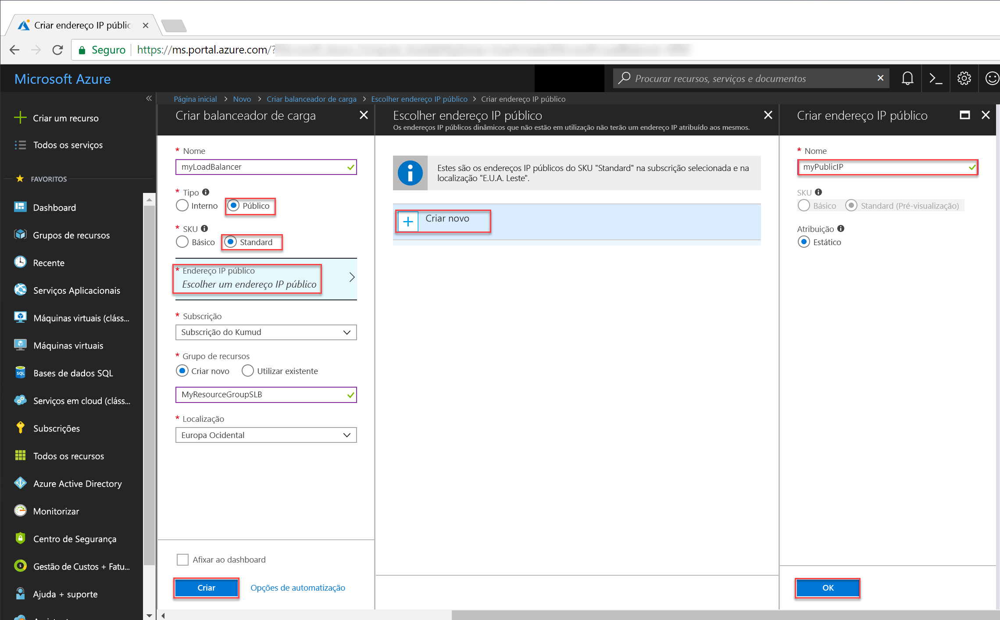

# <a name="tutorial-configure-port-fowarding-in-load-balancer-using-the-azure-portal"></a>Tutorial: Configurar o reencaminhamento de portas no Balanceador de Carga com o portal do Azure

O reencaminhamento de portas com o Balanceador de Carga do Azure permite-lhe ligar remotamente às VMs na rede virtual do Azure com o endereço IP público do Balanceador de Carga através do número de porta. Neste tutorial, irá aprender a configurar o reencaminhamento de portas no Balanceador de Carga do Azure e a aprender a:


> [!div class="checklist"]
> * Criar um balanceador de carga do Azure
> * Criar uma sonda de estado de funcionamento do balanceador de carga
> * Criar regras de tráfego do balanceador de carga
> * Criar máquinas virtuais e instalar o servidor IIS
> * Ligar máquinas virtuais a um balanceador de carga
> * Criar regras NAT de entrada do balanceador de carga
> * Ver o reencaminhamento de portas em ação


Se não tiver uma subscrição do Azure, crie uma [conta gratuita](https://azure.microsoft.com/free/?WT.mc_id=A261C142F) antes de começar. 

## <a name="log-in-to-azure"></a>Iniciar sessão no Azure

Inicie sessão no portal do Azure em [http://portal.azure.com](http://portal.azure.com).

## <a name="create-a-standard-load-balancer"></a>Criar um Balanceador de Carga Standard

Nesta secção, vai criar um balanceador de carga público que ajuda a fazer o balanceamento de carga de máquinas virtuais. O Balanceador de Carga Standard só suporta endereços IP Públicos Standard. Quando cria um Balanceador de Carga Standard, também tem de criar um novo endereço IP Público Standard que seja configurado como o front-end (denominado *LoadBalancerFrontend* por predefinição) para o mesmo. 

1. No canto superior esquerdo do ecrã, clique em **Criar um recurso** > **Rede** > **Balanceador de Carga**.
2. Na página **Criar um balanceador de carga**, introduza estes valores para o balanceador de carga:
    - *myLoadBalancer* - no nome do balanceador de carga.
    - **Standard** - para a versão SKU do balanceador de carga.
    - **Público** - no tipo de balanceador de carga.
    - *myPublicIP* - no IP Público **novo** que criar.
    - *myResourceGroupSLB* - no nome do **novo** grupo de recursos que escolher criar.
    - **westeurope** - na localização.
3. Clique em **Criar** para criar o balanceador de carga.


   
## <a name="create-load-balancer-resources"></a>Criar recursos do balanceador de carga

Nesta secção, irá configurar as definições de balanceador de carga de um conjunto de endereços de back-end e de uma sonda de estado de funcionamento, bem como especificar as regras do balanceador de carga.

### <a name="create-a-backend-address-pool"></a>Criar um conjunto de endereços de back-end

Para distribuir o tráfego pelas VMs, um conjunto de endereços de back-end contém os endereços IP das placas virtuais (NICs) ligadas ao balanceador de carga. Crie o conjunto de endereços de back-end *myBackendPool* de forma a incluir *VM1* e *VM2*.

1. Clique em **Todos os recursos**, no menu da esquerda, e clique em **myLoadBalancer** na lista de recursos.
2. Em **Definições**, clique em **Conjuntos de back-end** e, em seguida, clique em **Adicionar**.
3. Na página **Adicionar um conjunto de back-end**, para o nome, escreva *myBackEndPool*, como o nome do conjunto de back-end e, em seguida, clique em **OK**.

### <a name="create-a-health-probe"></a>Criar uma sonda de estado de funcionamento

Para permitir ao balanceador de carga monitorizar o estado da aplicação, pode utilizar uma sonda de estado de funcionamento. A sonda de estado de funcionamento adiciona ou remove dinamicamente VMs da rotação do balanceador de carga com base na respetiva resposta às verificações de estado de funcionamento. Crie uma sonda de estado de funcionamento, *myHealthProbe*, para monitorizar o estado de funcionamento das VMs.

1. Clique em **Todos os recursos**, no menu da esquerda, e clique em **myLoadBalancer** na lista de recursos.
2. Em **Definições**, clique em **Sondas de estado de funcionamento** e, em seguida, clique em **Adicionar**.
3. Utilize estes valores para criar a sonda de estado de funcionamento:
    - *myHealthProbe* - no nome da sonda de estado de funcionamento.
    - **HTTP** - no tipo de protocolo.
    - *80* - no número da porta.
    - *15* - no número do **Intervalo**, em segundos, entre tentativas da sonda.
    - *2* - no número do **Limiar de mau estado de funcionamento** ou das falhas consecutivas da sonda que têm de ocorrer para que uma VM seja considerada como estando em mau estado de funcionamento.
4. Clique em **OK**.

   

### <a name="create-a-load-balancer-rule"></a>Crie uma regra de balanceador de carga

É utilizada uma regra de balanceador de carga para definir a forma como o tráfego é distribuído pelas VMs. Pode definir a configuração de IP de front-end do tráfego de entrada e o conjunto de IPs de back-end para receber o tráfego, juntamente com a porta de origem e de destino necessárias. Crie uma regra de balanceador de carga *myLoadBalancerRuleWeb* para escutar na porta 80 no front-end *FrontendLoadBalancer* e enviar o tráfego de rede com balanceamento de carga para o conjunto de endereços de back-end *myBackEndPool* também através da porta 80. 

1. Clique em **Todos os recursos**, no menu da esquerda, e clique em **myLoadBalancer** na lista de recursos.
2. Em **Definições**, clique em **Regras de balanceamento de carga** e, em seguida, clique em **Adicionar**.
3. Utilize estes valores para configurar a regra de balanceamento de carga:
    - *myHTTPRule* - no nome da regra de balanceamento de carga.
    - **TCP** - no tipo de protocolo.
    - *80* - no número da porta.
    - *80* - na porta de back-end.
    - *myBackendPool* - no nome do conjunto de back-end.
    - *myHealthProbe* - no nome da sonda de estado de funcionamento.
4. Clique em **OK**.
    
## <a name="create-backend-servers"></a>Criar servidores de back-end

Nesta secção, irá criar uma rede virtual, duas máquinas virtuais para o conjunto de back-end do seu balanceador de carga e, em seguida, instalar o IIS nas máquinas virtuais para ajudar a testar o reencaminhamento de portas com o balanceador de carga.

### <a name="create-a-virtual-network"></a>Criar uma rede virtual
1. No canto superior esquerdo do ecrã, clique em **Novo** > **Redes** > **Rede virtual** e introduza estes valores para a rede virtual:
    - *myVnet* - no nome da rede virtual.
    - *myResourceGroupLB* - no nome do grupo de recursos existente.
    - *myBackendSubnet* - no nome da sub-rede.
2. Clique em **Criar** para criar a rede virtual.

    

### <a name="create-virtual-machines"></a>Criar máquinas virtuais

1. No canto superior esquerdo do ecrã, clique em **Novo** > **Computação** > **Windows Server 2016 Datacenter** e introduza estes valores para a máquina virtual:
    - *myVM1* - no nome da máquina virtual.        
    - *azureuser* - no nome de utilizador do administrador.    
    - *myResourceGroupSLB* - para o **Grupo de recursos**, selecione **Utilizar existente** e, em seguida, selecione *myResourceGroupSLB*.
2. Clique em **OK**.
3. Selecione **DS1_V2** para o tamanho da máquina virtual e clique em **Selecionar**.
4. Introduza estes valores para as definições de VM:
    -  *myVNet* - certifique-se de que está selecionado como a rede virtual.
    - *myBackendSubnet* - certifique-se de que está selecionado como a sub-rede.
    - *myNetworkSecurityGroup* - no nome do novo grupo de segurança de rede (firewall) que tem de criar.
5. Clique em **Desativado** para desativar o diagnóstico de arranque.
6. Clique em **OK**, reveja as definições na página de resumo e, em seguida, clique em **Criar**.
7. Crie outra VM com o nome *VM2* com *myVnet* como a rede virtual, *myBackendSubnet* como a sub-rede e **myNetworkSecurityGroup* como o grupo de segurança de rede (veja os passos 1 a 6). 

### <a name="create-nsg-rules"></a>Criar regras de NSG

Nesta secção, vai criar regras de NSG para permitir ligações de entrada através de HTTP e RDP.

1. Clique em **Todos os recursos**, no menu da esquerda, e, na lista de recursos, clique em **myNetworkSecurityGroup**, que se encontra no grupo de recursos **myResourceGroupSLB**.
2. Em **Definições**, clique em **Regras de segurança de entrada** e, em seguida, clique em**Adicionar**.
3. Introduza estes valores para a regra de segurança de entrada com o nome *myHTTPRule* para permitir ligações HTTP de entrada através da porta 80:
    - *Service Tag* - na **Origem**.
    - *Internet* - na **Etiqueta do serviço de origem**
    - *80* - nos **Intervalos de portas de destino**
    - *TCP* - no **Protocolo**
    - *Allow* - na **Ação**
    - *100* - na **Prioridade**
    - *myHTTPRule* - no nome
    - *Allow HTTP* - na descrição
4. Clique em **OK**.
 
 
5. Repita os passos 2 a 4 para criar outra regra com o nome *myRDPRule* para permitir uma ligação RDP de entrada através da porta 3389 com os seguintes valores:
    - *Service Tag* - na **Origem**.
    - *Internet* - na **Etiqueta do serviço de origem**
    - *3389* - nos **Intervalos de portas de destino**
    - *TCP* - no **Protocolo**
    - *Allow* - na **Ação**
    - *200* - na **Prioridade**
    - *myRDPRule* - no nome
    - *Allow RDP* - na descrição

### <a name="install-iis-on-vms"></a>Instalar o IIS nas VMs

1. Clique em **Todos os recursos** no menu esquerdo e, na lista de recursos, clique em **myVM1**, que se encontra no grupo de recursos *myResourceGroupSLB*.
2. Na página **Descrição geral**, clique em **Ligar** para estabelecer o RDP para a VM.
3. Inicie sessão na VM com o nome de utilizador *azureuser*.
4. No ambiente de trabalho do servidor, navegue para **Ferramentas Administrativas do Windows**>**Windows PowerShell**.
5. Na Janela do PowerShell, execute os seguintes comandos para instalar o servidor IIS, remova o ficheiro iisstart.htm predefinido e, em seguida, adicione um novo ficheiro iisstart.htm que apresenta o nome da VM:

   ```azurepowershell-interactive
    
    # install IIS server role
    Install-WindowsFeature -name Web-Server -IncludeManagementTools
    
    # remove default htm file
     remove-item  C:\inetpub\wwwroot\iisstart.htm
    
    # Add a new htm file that displays server name
     Add-Content -Path "C:\inetpub\wwwroot\iisstart.htm" -Value $("Hello World from" + $env:computername)
   ```
6. Fechar a sessão RDP com *myVM1*.
7. Repita os passos 1 a 6 para instalar o IIS e o ficheiro iisstart.htm atualizado em *myVM2*.

## <a name="add-vms-to-the-backend-address-pool"></a>Adicionar VMs ao conjunto de endereços de back-end

Para distribuir o tráfego pelas VMs, adicione as máquinas virtuais *VM1* e *VM2* ao conjunto de endereços de back-end *myBackendPool* criado anteriormente. O conjunto de back-end contém os endereços IP das placas virtuais (NICs) ligadas ao balanceador de carga.

1. Clique em **Todos os recursos**, no menu da esquerda, e clique em **myLoadBalancer** na lista de recursos.
2. Em **Definições**, clique em **Conjuntos de back-end** e, em seguida, na lista de conjuntos de back-end, clique em **myBackendPool**.
3. Na página **myBackendPool**, faça o seguinte:
    - Clique em **Adicionar uma configuração de IP de rede de destino** para adicionar cada máquina virtual (*myVM1* e *myVM2*) que criou para o conjunto de back-end.
    - Clique em **OK**.
4. Certifique-se de que a definição do conjunto de back-end do balanceador de carga apresenta todas as VMs: **VM1** e **VM2**.

## <a name="create-inbound-nat-rules"></a>Criar regras NAT de entrada
Com o Balanceador de Carga, pode criar uma regra NAT de entrada para fazer o reencaminhamento de portas do tráfego de uma porta específica de um endereço IP de front-end para uma porta específica de uma instância de back-end dentro da rede virtual.

Crie a regra NAT de entrada para fazer o reencaminhamento de portas do tráfego das portas de front-end do balanceador de carga para a porta 3389 das VMs de back-end.

1. Clique em **Todos os recursos**, no menu da esquerda, e clique em **myLoadBalancer** na lista de recursos.
2. Em **Definições**, clique em **Regras NAT de entrada** e, em seguida, na lista de conjuntos de back-end, clique em **myBackendPool**.
3. Na página **Adicionar regra NAT de entrada**, introduza os seguintes valores:
    - Para o nome da regra NAT, escreva *myNATRuleRDPVM1*,
    - Para a porta, escreva *4221*.
    - Para a **Máquina virtual de destino**, no menu pendente, selecione *myVM1*.
    - Para o **Mapeamento de portas**, clique em personalizar e, em seguida, para **Porta de destino**, escreva **3389**.
    - Clique em **OK**.
4. Repita os passos 2 e 3 para criar regras NAT de entrada com o nome *myNATRuleRDPVM2* para as máquinas virtuais *myVM2* com a porta de front-end *4222*.

## <a name="test-the-load-balancer"></a>Testar o balanceador de carga
1. Localize o endereço IP público do Balanceador de Carga no ecrã **Descrição geral**. Clique em **Todos os recursos** e, em seguida, clique em **myPublicIP**.

2. Copie o endereço IP público e cole-o na barra de endereço do browser. A página predefinida do servidor Web do IIS é apresentada no browser.

      

Para ver o balanceador de carga a distribuir tráfego pelas três VMs que estão a executar a aplicação, pode forçar a atualização do browser.

## <a name="test-port-forwarding"></a>Testar o reencaminhamento de portas
Com o reencaminhamento de portas, pode criar uma ligação de ambiente de trabalho remoto às VMs no conjunto de endereços de back-end com o endereço IP do balanceador de carga e o valor de porta de front-end que foram definidos no passo anterior.

1. Localize o endereço IP público do Balanceador de Carga no ecrã **Descrição geral**. Clique em **Todos os recursos** e, em seguida, clique em **myPublicIP**.
2. Utilize o seguinte comando para criar uma sessão de ambiente de trabalho remoto com a VM *myVM2* a partir do computador local. Substitua `<publicIpAddress>` pelo endereço IP devolvido no passo anterior.

    ```
    mstsc /v:<publicIpAddress>:4222
    ```
  
3. Abra o ficheiro RDP transferido. Se lhe for pedido, selecione **Ligar**.

4. Introduza o nome de utilizador e a palavra-passe que especificou ao criar a VM (poderá ter de selecionar **Mais opções** e **Utilizar uma conta diferente** para especificar as credenciais que introduziu quando criou a VM) e, em seguida, selecione **OK**. Poderá receber um aviso de certificado durante o processo de início de sessão. Selecione **Sim** para continuar a ligação.
 
   A ligação RDP é estabelecida com êxito, de acordo com a regra NAT de entrada *myNATRuleRDPVM2*, o tráfego da porta de front-end **4222** do balanceador de carga é configurado para redirecionar para a porta 3389 da máquina virtual *myVM2*.

## <a name="clean-up-resources"></a>Limpar recursos

Quando já não for necessário, elimine o grupo de recursos, o balanceador de carga e todos os recursos relacionados. Para tal, selecione o grupo de recursos que contém o balanceador de carga e clique em **Eliminar**.

## <a name="next-steps"></a>Passos seguintes

Neste tutorial, criou um Balanceador de Carga Standard, ligou VMs ao mesmo, configurou a regra de tráfego do balanceador de carga, a sonda de estado de funcionamento e, por fim, testou o balanceador de carga. Além disso, removeu uma VM do conjunto com balanceamento de carga e adicionou a VM de novo ao conjunto de endereços de back-end. Para saber mais sobre o Balanceador de Carga do Azure, avance para os tutoriais do Balanceador de Carga do Azure.

> [!div class="nextstepaction"]
> [Tutoriais do Balanceador de Carga do Azure](tutorial-load-balancer-standard-public-zone-redundant-portal.md)
