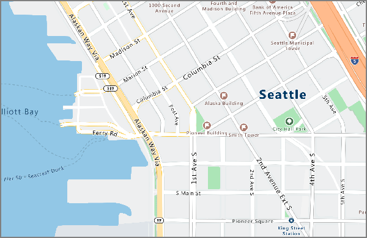
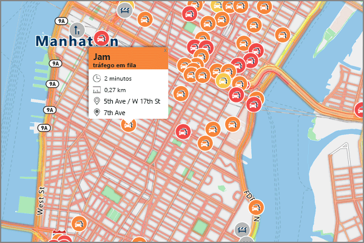

# <a name="an-introduction-to-azure-location-based-services-preview"></a>Introdução ao Azure Location Based Services (pré-visualização)
O Azure Location Based Services é um portefólio de serviços geoespaciais que incluem APIs de serviço para Mapas, Pesquisa, Encaminhamento, Trânsito e Fusos Horários. O portfólio de serviços em conformidade com o Azure OneAPI permite-lhe utilizar ferramentas de programação familiares para programar e dimensionar rapidamente soluções que integram informações de localização nas suas soluções do Azure. O Azure Location Based Services fornece aos programadores de todas as indústrias capacidades geoespaciais poderosas, repletas de dados de mapeamento atualizados, essenciais para dar contexto geográfico a aplicações Web e móveis. O Azure Location Based Services é um conjunto de APIs REST que estão em conformidade com o Azure OneAPI, o qual ainda inclui um controlo de JavaScript baseado na Web para que o desenvolvimento seja fácil, flexível e portátil em vários suportes. 

O Azure Location Based Services é constituído por cinco serviços principais para fortalecer as aplicações do Azure que requerem contexto geográfico. Cada um dos serviços é explicado detalhadamente abaixo.

**Render Service** – Render Service foi concebido para os programadores criarem aplicações Web e móveis baseadas em mapeamento. O serviço utiliza imagens gráficas em padrão de alta qualidade, disponíveis em 19 níveis de zoom ou imagens de mapa de formato de vetor totalmente personalizáveis.



**Route Service** – O Route Service baseia-se em cálculos de geometria de uma infraestrutura robusta do mundo real e múltiplas direções do modo de transporte. O serviço permite aos programadores calcular as direções em vários modos de transporte, como automóvel, camião, bicicleta ou caminhada, bem como em várias entradas, como condições de trânsito, restrições de peso ou transporte de materiais perigosos.


**Search Service** – O Search Service foi concebido para os programadores procurarem endereços, locais, listas de empresas por nome ou categoria e outras informações geográficas. O Search Service também permite aplicar um [geocódigo inverso](https://en.wikipedia.org/wiki/Reverse_geocoding) aos endereços e cruzamentos com base na latitude/longitude. 


**Time Zone Service** – O Time Zone Service permite-lhe consultar as informações de fuso horário atuais, históricas e futuras através de pares de latitude/longitude ou de um [ID IANA](http://www.iana.org/). O serviço Time Zone Service também permite converter IDs de fuso horário do Microsoft Windows para fusos horários IANA, obter um desvio de fuso horário UTC e obter a hora atual num fuso horário específico. Uma resposta JSON típica para uma consulta ao Time Zone Service assemelha-se à seguinte:

```JSON
{
    "Version": "2017c",
    "ReferenceUtcTimestamp": "2017-11-20T23:09:48.686173Z",
    "TimeZones": [{
        "Id": "America/Los_Angeles",
        "ReferenceTime": {
            "Tag": "PST",
            "StandardOffset": "-08:00:00",
            "DaylightSavings": "00:00:00",
            "WallTime": "2017-11-20T15:09:48.686173-08:00",
            "PosixTzValidYear": 2017,
            "PosixTz": "PST+8PDT,M3.2.0,M11.1.0"
        }
    }]
}
```

**Traffic Service** – O Traffic Service é um conjunto de serviços Web concebidos para os programadores criarem aplicações Web e móveis que precisam de dados de tráfego. A oferta é dividida no seguinte:
1. Fluxo de Tráfego – fornece velocidades observadas em tempo real e durações de viagem para todas as principais estradas na rede; e 
2. Incidentes de Tráfego – fornece uma vista exata dos engarrafamentos e incidentes na rede de estradas.



O Azure Location Based Services baseia-se na mobilidade e pode alimentar aplicações de várias plataformas desde que o modelo de programação seja agnóstico e suporte a saída JSON através de APIs REST. Além disso, o Azure LBS disponibiliza um cómodo Controlo de Mapas de JavaScript com um modelo de programação simples para um desenvolvimento fácil e rápido de aplicações Web e móveis. 

O Azure Location Based Services utiliza um esquema de autenticação baseado em chaves, pelo que, para aceder aos serviços, basta navegar para o [portal do Azure](http://portal.azure.com) e criar uma conta do Azure Location Based Services. A conta inclui duas chaves pré-geradas para si. Comece por integrar estas capacidades de localização diretamente nas suas aplicações através das suas chaves nos pedidos ao serviço Azure Location Based Services.

**Relação com o Bing Maps** - tenha em atenção que os Azure Location Based Services descritos neste documento são diferentes dos que são apresentados pelo Bing Maps.  Embora eles partilhem muitas funcionalidades iguais, os serviços são diferentes e não estão relacionados.  Não há nenhum impacto sobre a oferta de produtos ou as previsões do Bing Maps relativamente à disponibilidade deste novo serviço no Azure, que será gerido separadamente.

O objetivo da Microsoft é disponibilizar uma escolha à comunidade de programadores em termos de ofertas de serviços de localização.  Abaixo encontra alguma documentação de orientação rápida para programadores sobre o serviço a utilizar para vários casos de utilização e situações de cliente.  Note que esta documentação de orientação aplica-se atualmente ao Azure LBS, uma vez que está na fase de Pré-visualização Pública e será atualizada assim que atingir Disponibilidade Geral posteriormente em 2018.

| Critérios de cliente | Utilize os Azure Location Based Services Quando... | Utilize o Bing Maps Quando... |
| ------------- | ------------- | ------------- |
| Ambiente de Programação | Compilar ou tirar partido de outros serviços do Azure | Através de uma cloud de terceiros ou outro ambiente de programação |
| Estágio de desenvolvimento  | Como o Azure LBS está atualmente em Pré-visualização Pública, está otimizado para um teste de estágio inicial e desenvolvimento de uma Prova de Conceito | É preciso um SLA de nível empresarial para um ambiente de produção |
| Opções de Preços | As opções preliminares de preços para programadores são suficientes | São precisos preços de nível empresarial personalizados |
| Ambiente de Cenário de Utilização | É precisa a utilização no veículo | Não é precisa a utilização no veículo |
| Cobertura Geográfica | A Índia, a China, o Japão e a Coreia do Sul não são precisos | A cobertura do mapa da Índia, da China, do Japão e da Coreia do Sul são precisos |
| Conteúdo do Mapa | Os mapas de superfície standard são suficientes | As imagens de satélite, com vista aérea e da rua são precisas |
| Origem do mapa subjacente | Os dados de mapeamento do TomTom são preferenciais | Os dados de mapeamento do HERE são preferenciais |

Inscreva-se numa [conta do Azure Location Based Services hoje mesmo!](http://aka.ms/azurelbsportal)

## <a name="next-steps"></a>Passos seguintes

Tem agora uma descrição geral do Azure Location Based Services (pré-visualização). O passo seguinte é experimentar uma aplicação de exemplo que mostra o Location Based Services, bem como criar um cenário ponto a ponto na sua aplicação Web.

> [!div class="nextstepaction"]
> [Iniciar uma pesquisa de mapas interativa de demonstração com o Azure Location Based Services (pré-visualização)](quick-demo-map-app.md)
> [Pesquisar pontos de interesse próximos com o Azure Location Based Services](tutorial-search-location.md)
