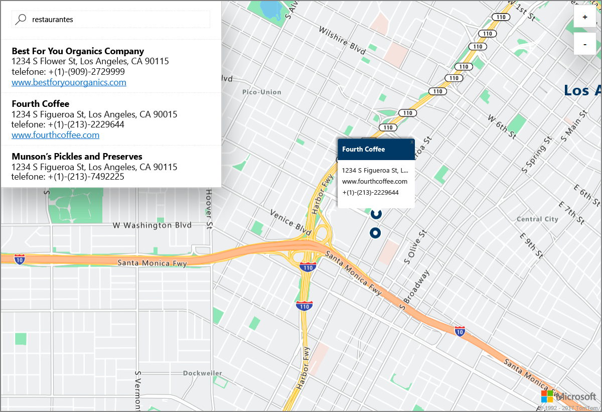

# Iniciar uma pesquisa de mapas interativa de demonstração com o Azure Location Based Services (pré-visualização)

Este artigo demonstra as capacidades do Azure Location Based Services (LBS) para efetuar uma pesquisa interativa. Explica também os passos básicos para criar a sua própria conta do LBS e obter a chave da conta a utilizar na aplicação Web de demonstração. 

Se não tiver uma subscrição do Azure, crie uma [conta gratuita](https://azure.microsoft.com/free/?WT.mc_id=A261C142F) antes de começar.

## Iniciar sessão no portal do Azure

Inicie sessão no [Portal do Azure](https://portal.azure.com/).

## Criar uma conta do Location Based Services e obter a chave da conta

1. No canto superior esquerdo do [portal do Azure](https://portal.azure.com), clique em **Criar um recurso**.
2. Na caixa *Procurar no Marketplace*, escreva **location based services**.
3. Em *Resultados*, clique em **Location Based Services (pré-visualização)**. Clique no botão **Criar** que aparece abaixo do mapa. 
4. Na página **Criar Conta do Location Based Services**, introduza o *Nome* da nova conta, selecione a *Subscrição* a utilizar e introduza o nome de um *Grupo de recursos* novo ou existente. Selecione a localização do grupo de recursos, aceite os *Termos de Pré-visualização* e clique em **Criar**.

    

5. Assim que a conta for criada com êxito, abra-a e navegue para **DEFINIÇÕES**. Clique em **Chaves** para obter as chaves primárias e secundárias da conta do Azure Location Based Services. Copie o valor da **Chave Primária** para a área de transferência local para utilizar na secção seguinte. 

## Transferir a aplicação de demonstração

1. Transfira ou copie o conteúdo do ficheiro [interactiveSearch.html](https://github.com/Azure-Samples/location-based-services-samples/blob/master/src/interactiveSearch.html).
2. Guarde o conteúdo deste ficheiro localmente como **AzureMapDemo.html** e abra-o num editor de texto.
3. Procure a cadeia `<insert-key>` e substitua-a pelo valor da **Chave Primária** obtido na secção anterior. 

## Iniciar a aplicação de demonstração para

1. Abra o ficheiro **AzureMapDemo.html** num browser da sua preferência.
2. Observe o mapa mostrado da cidade de Los Angeles. A cidade é determinada pelo valor do par `[longitude, latitude]` fornecido à variável de JavaScript com o nome **center** no ficheiro *AzureMapDemo.html*. Pode alterar estas coordenadas para qualquer outra cidade à sua escolha. Por exemplo, as coordenadas da cidade de Nova Iorque são *[-74.0060, 40.7128]*.
3. Na caixa de pesquisa no canto superior esquerdo da aplicação Web de demonstração, introduza qualquer tipo de localização ou endereço que quer procurar. 
4. Mova o rato sobre a lista de endereços/localizações apresentados abaixo da caixa de pesquisa e repare como o pin correspondente no mapa faz aparecer informações sobre essa localização. Por exemplo, uma execução de exemplo desta aplicação Web e uma pesquisa de *restaurantes* levam ao seguinte. Tenha em atenção que, por motivos de privacidade das empresas privadas, são apresentados nomes e endereços fictícios. 

    

## Limpar recursos

Os tutoriais fornecem detalhes sobre como utilizar e configurar o Azure Location Based Services para a sua conta. Se quiser continuar a trabalhar com os tutoriais, não limpe os recursos criados neste Início Rápido. Se não planear continuar, utilize os passos seguintes para eliminar todos os recursos criados no Guia Rápido.

1. Feche o browser que está a executar a aplicação Web **AzureMapDemo.html**.
2. No menu do lado esquerdo do portal do Azure, clique em **Todos os recursos** e selecione a conta do LBS. Na parte superior do painel **Todos os recursos**, clique em **Eliminar**.

## Passos seguintes

Neste Início rápido, criou a sua conta do Azure LBS e iniciou uma aplicação de demonstração através da mesma. Para saber como criar a sua própria aplicação com as APIs do Azure Location Based Services, avance para o tutorial seguinte.

> [!div class="nextstepaction"]
> [Tutorial para utilizar o Azure Maps e Pesquisa](./tutorial-search-location.md)
