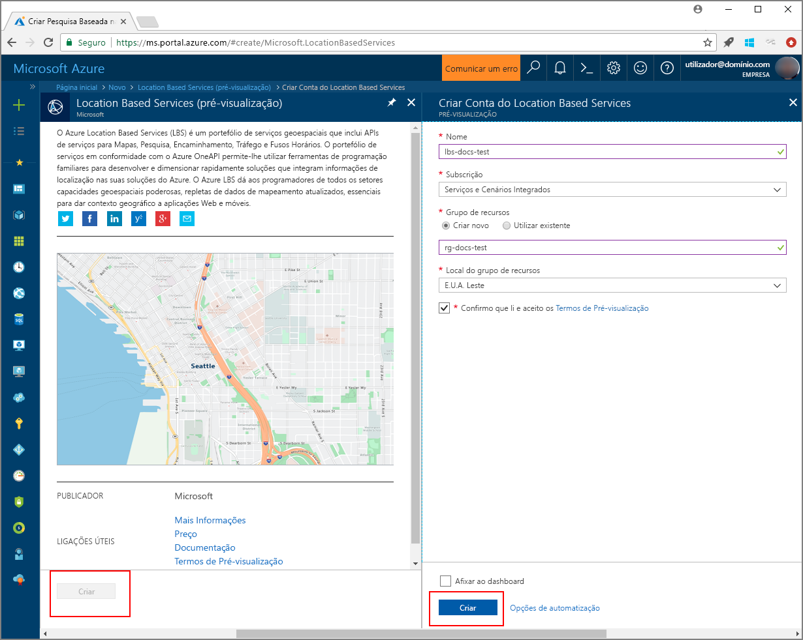

# <a name="search-nearby-points-of-interest-using-azure-location-based-services"></a>Procurar pontos de interesse nas proximidades com o Azure Location Based Services

Este tutorial mostra como configurar uma conta com o Azure Location Based Services e, em seguida, utilizar as APIs fornecidas para procurar um ponto de interesse. Neste tutorial, ficará a saber como:

> [!div class="checklist"]
> * Criar uma conta com o Azure Location Based Services
> * Conhecer a chave primária para a sua conta do Azure Location Based Services
> * Criar uma nova página Web com a API de Controlo de Mapas
> * Utilizar o Search Service para localizar um ponto de interesse nas proximidades

Se não tiver uma subscrição do Azure, crie uma [conta gratuita](https://azure.microsoft.com/free/) antes de começar.

## <a name="log-in-to-the-azure-portal"></a>Iniciar sessão no portal do Azure
Inicie sessão no [Portal do Azure](https://portal.azure.com).

<a id="createaccount"></a>

## <a name="create-an-account-with-azure-location-based-services"></a>Criar uma conta com o Azure Location Based Services

Siga estes passos para criar uma nova conta do Location Based Services.

1. No canto superior esquerdo do [portal do Azure](https://portal.azure.com), clique em **Criar um recurso**.
2. Na caixa *Procurar no Marketplace*, escreva **location based services**.
3. Em *Resultados*, clique em **Location Based Services (pré-visualização)**. Clique no botão **Criar** que aparece abaixo do mapa. 
4. Na página **Criar Conta do Location Based Services**, introduza os seguintes valores:
    - O *Nome* da nova conta. 
    - A *Subscrição* que quer utilizar para esta conta.
    - O nome do *Grupo de recursos* para esta conta. Pode optar por *Criar um grupo de recursos novo* ou *Utilizar um grupo de recursos existente*.
    - Selecione a *Localização do grupo de recursos*.
    - Leia os *Termos da pré-visualização* e marque a caixa de verificação para aceitar os termos. 
    - Por último, clique no botão **Criar**.
   
    


<a id="getkey"></a>

## <a name="get-the-primary-key-for-your-account"></a>Obter a chave primária para a sua conta

Assim que a sua conta do Location Based Services for criada com êxito, siga os passos para ligá-la às respetivas APIs de pesquisa de mapas:

1. Abra a sua conta do Location Based Services no portal.
2. Navegue até às **DEFINIÇÕES** da conta e selecione **Chaves**.
3. Copie a **Chave primária** para a área de transferência. Guarde-a localmente para utilizar nos passos seguintes. 

    


<a id="createmap"></a>

## <a name="create-new-web-page-using-azure-map-control-api"></a>Criar uma nova página Web com a API de Controlo de Mapas do Azure
A API de Controlo de Mapas do Azure é uma biblioteca de cliente conveniente que lhe permite integrar facilmente o Azure Location Based Services na sua aplicação Web. Oculta a complexidade das chamadas de serviço REST bare e aumenta a produtividade com componentes personalizáveis, cujo estilo pode ser definido. Os passos seguintes mostram como criar uma página HTML estática incorporada com a API de Controlo de Mapas do Location Based Services. 

1. No seu computador local, crie um novo ficheiro e dê-lhe o nome **MapSearch.html**. 
2. Adicione os seguintes componentes HTML ao ficheiro:

    ```HTML
    <!DOCTYPE html>
    <html lang="en">

    <head>
        <meta charset="utf-8" />
        <meta name="viewport" content="width=device-width, user-scalable=no" />
        <title>Map Search</title>

        <link rel="stylesheet" href="https://atlas.microsoft.com/sdk/css/atlas.min.css?api-version=1.0" type="text/css" />
        <script src="https://atlas.microsoft.com/sdk/js/atlas.min.js?api-version=1.0"></script>

        <style>
            html,
            body {
                width: 100%;
                height: 100%;
                padding: 0;
                margin: 0;
            }

            #map {
                width: 100%;
                height: 100%;
            }
        </style>
    </head>

    <body>
        <div id="map"></div>
        <script>
            // Embed Map Control JavaScript code here
        </script>
    </body>

    </html>
    ``` 
    Repare que o cabeçalho HTML inclui os ficheiros de recursos CSS e JavaScript alojados pela biblioteca de Controlo de Mapas do Azure. Tenha em atenção o segmento de *script* adicionado ao *corpo* do ficheiro HTML. Este segmento irá conter o código JavaScript inline para aceder às APIs do Azure Location Based Services.
 
3.  Adicione o seguinte código JavaScript ao bloco *script* do ficheiro HTML. Utilize a chave primária da sua conta do Location Based Services no script. 

    ```JavaScript
    // Instantiate map to the div with id "map"
    var LBSAccountKey = "<_your account key_>";
    var map = new atlas.Map("map", {
        "subscription-key": LBSAccountKey
    });
    ```
    Este segmento inicia a API de Controlo de Mapas para a sua chave de conta do Azure Location Based Services. **Atlas** é o espaço de nomes que contém a API de Controlo de Mapas do Azure e os componentes visuais relacionados. **atlas.Map** fornece o controlo para um mapa Web interativo e visual. Pode observar o aspeto do mapa, abrindo a página HTML no browser. 

4. Adicione o seguinte código JavaScript ao bloco de *script*, para adicionar uma camada de marcadores de pesquisa ao Controlo de Mapas:

    ```JavaScript
    // Initialize the pin layer for search results to the map
    var searchLayerName = "search-results";
    map.addPins([], {
        name: searchLayerName,
        cluster: false,
        icon: "pin-round-darkblue"
    });
    ```

5. Guarde o ficheiro no seu computador. 


<a id="usesearch"></a>

## <a name="use-search-service-to-find-nearby-point-of-interest"></a>Utilizar o Search Service para localizar pontos de interesse nas proximidades

Esta secção mostra como utilizar a API do Search Service do Azure Location Based Services para localizar um ponto de interesse no seu mapa. É uma API RESTful concebida para os programadores procurarem endereços, pontos de interesse e outras informações geográficas. O Search Service atribui uma informação de latitude e longitude a um endereço especificado. 

1. Abra o ficheiro **MapSearch.html**, criado na secção anterior, e adicione o seguinte código JavaScript ao bloco de *script*, para ilustrar o Search Service. 
    ```JavaScript
    // Perform a request to the search service and create a pin on the map for each result
    var xhttp = new XMLHttpRequest();
    xhttp.onreadystatechange = function () {
        var searchPins = [];

        if (this.readyState === 4 && this.status === 200) {
            var response = JSON.parse(this.responseText);

            var poiResults = response.results.filter((result) => { return result.type === "POI" }) || [];

            searchPins = poiResults.map((poiResult) => {
                var poiPosition = [poiResult.position.lon, poiResult.position.lat];
                return new atlas.data.Feature(new atlas.data.Point(poiPosition), {
                    name: poiResult.poi.name,
                    address: poiResult.address.freeformAddress,
                    position: poiResult.position.lat + ", " + poiResult.position.lon
                });
            });

            map.addPins(searchPins, {
                name: searchLayerName
            });

            var lons = searchPins.map((pin) => { return pin.geometry.coordinates[0] });
            var lats = searchPins.map((pin) => { return pin.geometry.coordinates[1] });

            var swLon = Math.min.apply(null, lons);
            var swLat = Math.min.apply(null, lats);
            var neLon = Math.max.apply(null, lons);
            var neLat = Math.max.apply(null, lats);

            map.setCameraBounds({
                bounds: [swLon, swLat, neLon, neLat],
                padding: 50
            });
        }
    };
    ```
    Este fragmento de código cria um [XMLHttpRequest](https://xhr.spec.whatwg.org/) e adiciona um processador de eventos para analisar a resposta recebida. Para uma resposta com êxito, recolhe os endereços, os nomes e as informações de latitude e longitude para cada localização devolvida, na variável `searchPins`. Por fim, adiciona esta coleção de pontos de localização ao controlo `map` como marcadores. 

2. Adicione o seguinte código ao bloco de *script* para enviar o XMLHttpRequest para o Search Service do Azure Location Based Services:

    ```JavaScript
    var url = "https://atlas.microsoft.com/search/fuzzy/json?";
    url += "&api-version=1.0";
    url += "&query=gasoline%20station";
    url += "&subscription-key=" + LBSAccountKey;
    url += "&lat=47.6292";
    url += "&lon=-122.2337";
    url += "&radius=100000";

    xhttp.open("GET", url, true);
    xhttp.send();
    ``` 
    Este fragmento utiliza a API de pesquisa básica do Search Service, denominada **Fuzzy Search**. Processa as entradas mais difusas que lidam com qualquer combinação de endereço ou tokens *POI*. Procura o **posto de gasolina** nas proximidades para o endereço indicado na latitude e longitude e dentro do raio especificado. Utiliza a chave primária da sua conta fornecida anteriormente no ficheiro de exemplo, para fazer a chamada para o Location Based Services. Devolve os resultados como pares latitude/longitude para as localizações encontradas. Pode observar os marcadores de pesquisa, abrindo a página HTML no browser. 

3. Adicione as seguintes linhas ao bloco de *script*, para criar pop-ups para os pontos de interesse devolvidos pelo Search Service:

    ```JavaScript
    // Add a popup to the map which will display some basic information about a search result on hover over a pin
    var popup = new atlas.Popup();
    map.addEventListener("mouseover", searchLayerName, (e) => {
        var popupContentElement = document.createElement("div");
        popupContentElement.style.padding = "5px";

        var popupNameElement = document.createElement("div");
        popupNameElement.innerText = e.features[0].properties.name;
        popupContentElement.appendChild(popupNameElement);

        var popupAddressElement = document.createElement("div");
        popupAddressElement.innerText = e.features[0].properties.address;
        popupContentElement.appendChild(popupAddressElement);

        var popupPositionElement = document.createElement("div");
        popupPositionElement.innerText = e.features[0].properties.position;
        popupContentElement.appendChild(popupPositionElement);

        popup.setPopupOptions({
            position: e.features[0].geometry.coordinates,
            content: popupContentElement
        });

        popup.open(map);
    });
    ```
    A API **atlas.Popup** fornece uma janela de informações ancorada na posição necessária no mapa. Este fragmento de código define o conteúdo e a posição para o pop-up, e adiciona uma escuta de eventos ao controlo `map`, que aguarda que o _rato_ paire sobre o pop-up. 

4. Guarde o ficheiro e abra o ficheiro **MapSearch.html** num browser à escolha e veja o resultado. Neste momento, o mapa no browser mostra pop-ups de informações quando paira o rato sobre qualquer um dos marcadores de pesquisa apresentados, semelhantes aos seguintes. 

    


## <a name="next-steps"></a>Passos seguintes
Neste tutorial, ficou a saber como:

> [!div class="checklist"]
> * Criar uma conta com o Azure Location Based Services
> * Obter a chave primária para a sua conta
> * Criar uma nova página Web com a API de Controlo de Mapas
> * Utilizar o Search Service para localizar pontos de interesse nas proximidades

Avance para o tutorial [Encaminhar para um ponto de interesse com o Azure Location Based Services](./tutorial-route-location.md) para saber como utilizar o Azure Location Based Services para encaminhar para o ponto de interesse. 
