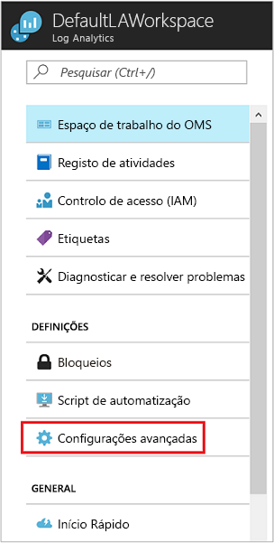
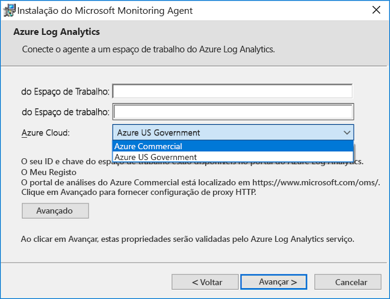
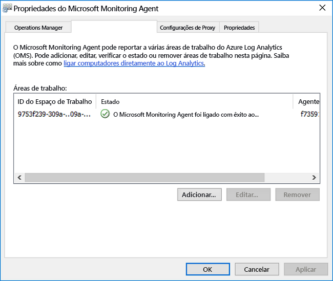

# <a name="connect-windows-computers-to-the-log-analytics-service-in-azure"></a>Ligar computadores Windows para o serviço de análise de registos do Azure

Para monitorizar e gerir máquinas virtuais ou de computadores físicos no seu centro de dados local ou outro ambiente de nuvem com a análise de registos, terá de implementar o Microsoft Monitoring Agent (MMA) e configurá-la para que reportem a um ou mais áreas de trabalho de análise de registos.  O agente também suporta a função Runbook Worker híbrido para automatização do Azure.  

Num computador Windows monitorizado, o agente está listado como o serviço Microsoft Monitoring Agent. O serviço Microsoft Monitoring Agent recolhe os eventos em ficheiros de registo e registo de eventos do Windows, dados de desempenho e outra telemetria. Mesmo quando o agente não consegue comunicar com o serviço de análise de registos que qual reporta, o agente continua a ser executado e coloca em fila os dados recolhidos no disco do computador monitorizado. Quando a ligação é restaurada, o serviço Microsoft Monitoring Agent envia os dados recolhidos para o serviço.

O agente pode ser instalado utilizando um dos seguintes métodos. A maioria das instalações utilizam uma combinação destes métodos para instalar diferentes conjuntos de computadores, conforme apropriado.

* Instalação manual. A configuração está a executar manualmente no computador utilizando o Assistente de configuração, na linha de comandos, ou implementadas através de uma ferramenta de distribuição de software existente.
* Configuração de estado (DSC) do pretendido de automatização do Azure. Utilizar o DSC na automatização do Azure com um script para computadores Windows já implementadas no seu ambiente.  
* Script do PowerShell.
* Modelo do Resource Manager para máquinas virtuais com Windows no local na pilha do Azure.  

Para compreender os requisitos de rede e do sistema para implementar o agente do Windows, consulte [recolher dados do seu ambiente com o Log Analytics do Azure](log-analytics-concept-hybrid.md#prerequisites).

## <a name="obtain-workspace-id-and-key"></a>Obter o ID e a chave da área de trabalho
Antes de instalar o agente Microsoft Monitoring para Windows, precisa do ID e da chave da área de trabalho do Log Analytics.  Esta informação é necessária durante a configuração de cada método de instalação para configurar o agente e certifique-se de que consegue comunicar com êxito com a análise de registos de corretamente.  

1. No portal do Azure, clique em **Mais serviços**, que se encontra no canto inferior esquerdo. Na lista de recursos, escreva **Log Analytics**. À medida que começa a escrever, a lista filtra com base na sua entrada. Selecione **Log Analytics**.
2. Na lista de áreas de trabalho de análise de registos, selecione a área de trabalho que pretende configurar o agente para comunicar ao.
3. Selecione **Definições avançadas**.<br><br> <br><br>  
4. Selecione **Origens Ligadas** e, em seguida, selecione **Servidores Windows**.   
5. O valor à direita de **ID da Área de Trabalho** e **Chave Primária**. Copie e cole ambos no seu editor favorito.   
   
## <a name="install-the-agent-using-setup"></a>Instalar o agente utilizando a configuração
Os passos seguintes instalam e configuram o agente para o Log Analytics no Azure e na cloud do Azure Government mediante a utilização do Microsoft Monitoring Agent no seu computador.  O programa de configuração para o agente está contido num ficheiro transferido e deve ser extraído para 

1. Na página **Servidores Windows**, selecione a versão **Transferir Agente do Windows** adequada para transferir consoante a arquitetura do processador do sistema operativo Windows.
2. Execute a Configuração para instalar o agente no seu computador.
2. Na página **Bem-vindo**, clique em **Seguinte**.
3. Na página **Termos de Licenciamento**, leia a licença e clique em **Aceito**.
4. Na página **Pasta de Destino**, altere ou mantenha a pasta de instalação predefinida e clique em **Seguinte**.
5. Na página **Opções de Configuração do Agente** , escolha ligar o agente ao Azure Log Analytics (OMS) e clique em **Seguinte**.   
6. Na página **Azure Log Analytics**, faça o seguinte:
   1. Cole o **ID da Área de Trabalho** e a **Chave da Área de Trabalho (Chave Primária)** que copiou anteriormente.  Caso o computador deva reportar a uma área de trabalho do Log Analytics na cloud do Azure Government, selecione **Azure US Government**, na lista pendente **Cloud do Azure**.  
   2. Se o computador tiver de comunicar através de um servidor proxy com o serviço do Log Analytics, clique em **Avançadas** e forneça o URL e o número da porta do servidor proxy.  Se o seu servidor proxy precisar de autenticação, escreva o nome de utilizador e a palavra-passe para autenticação no mesmo e clique em **Seguinte**.  
7. Depois de indicar as definições de configuração necessárias, clique em **Seguinte**.<br><br> <br><br>
8. Na página **Pronto para Instalar**, reveja as suas opções e clique em **Instalar**.
9. Na página **Configuração Concluída com Êxito**, clique em **Concluir**.

Quando terminar, o **Microsoft Monitoring Agent** aparece no **Painel de Controlo**. Para confirmar que está a comunicar ao Log Analytics, reveja [Verifique a conectividade de agente à análise de registos](#verify-agent-connectivity-to-log-analytics). 

## <a name="install-the-agent-using-the-command-line"></a>Instalar o agente utilizando a linha de comandos
O ficheiro transferido para o agente é um pacote de instalação autónomo criado com IExpress.  O programa de configuração para o agente e os ficheiros de suporte estão contidos no pacote e tem de ser extraído para instalar corretamente o utilizando a linha de comandos ilustrada nos exemplos seguintes.  Este método suporta a configuração do agente para comunicar ao Azure comercial e nuvem de US Government.  

>[!NOTE]
>Se pretender atualizar um agente, terá de utilizar a API de scripting de análise de registos. Consulte o tópico [gerir e manter o agente de análise de registos para o Windows e Linux](log-analytics-agent-manage.md) para obter mais informações.

A tabela seguinte realça os parâmetros de análise de registos específicos suportados pelo programa de configuração para o agente, incluindo quando implementado a utilizar o DSC de automatização.

|Opções de MMA específico                   |Notas         |
|---------------------------------------|--------------|
|ADD_OPINSIGHTS_WORKSPACE               | 1 = configurar o agente para reportar a uma área de trabalho                |
|OPINSIGHTS_WORKSPACE_ID                | Id da área de trabalho (guid) para a área de trabalho para adicionar                    |
|OPINSIGHTS_WORKSPACE_KEY               | Chave de área de trabalho utilizada para autenticar inicialmente com área de trabalho |
|OPINSIGHTS_WORKSPACE_AZURE_CLOUD_TYPE  | Especificar o ambiente de nuvem onde está localizada a área de trabalho <br> 0 = em nuvem comerciais do azure (predefinição) <br> 1 = azure Government |
|OPINSIGHTS_PROXY_URL               | URI de proxy a utilizar |
|OPINSIGHTS_PROXY_USERNAME               | Nome de utilizador para aceder a um proxy autenticado |
|OPINSIGHTS_PROXY_PASSWORD               | Palavra-passe para aceder a um proxy autenticado |

1. Para extrair os ficheiros de instalação do agente, a partir de uma linha de comandos elevada, execute `extract MMASetup-<platform>.exe` e que irá solicitar que o caminho extrair ficheiros para.  Em alternativa, pode especificar o caminho transferindo os argumentos `extract MMASetup-<platform>.exe /c:<Path> /t:<Path>`.  Para obter mais informações sobre a linha de comandos swtiches suportado pelo IExpress, consulte [comutadores da linha de comandos para IExpress](https://support.microsoft.com/help/197147/command-line-switches-for-iexpress-software-update-packages) e, em seguida, atualize o exemplo de acordo com as suas necessidades.
2. Silenciosamente instalar o agente e configurá-la para que reportem a uma área de trabalho do Azure em nuvem comerciais, da pasta que extraiu os ficheiros de configuração para o tipo: 
   
     ```dos
    setup.exe /qn ADD_OPINSIGHTS_WORKSPACE=1 OPINSIGHTS_WORKSPACE_AZURE_CLOUD_TYPE=0 OPINSIGHTS_WORKSPACE_ID=<your workspace id> OPINSIGHTS_WORKSPACE_KEY=<your workspace key> AcceptEndUserLicenseAgreement=1
    ```

   ou, para configurar o agente para reportar a nuvem do Azure US Government, escreva: 

     ```dos
    setup.exe /qn ADD_OPINSIGHTS_WORKSPACE=1 OPINSIGHTS_WORKSPACE_AZURE_CLOUD_TYPE=1 OPINSIGHTS_WORKSPACE_ID=<your workspace id> OPINSIGHTS_WORKSPACE_KEY=<your workspace key> AcceptEndUserLicenseAgreement=1
    ```

## <a name="install-the-agent-using-dsc-in-azure-automation"></a>Instalar o agente utilizando DSC na automatização do Azure

Pode utilizar o seguinte exemplo de script para instalar o agente utilizando o Automation DSC do Azure.   Se não tiver uma conta de automatização, consulte [introdução à automatização do Azure](../automation/automation-offering-get-started.md) para compreender os requisitos e passos para criar uma conta de automatização necessária antes de utilizar o DSC de automatização.  Se não estiver familiarizado com o DSC de automatização, reveja [introdução Automation DSC](../automation/automation-dsc-getting-started.md).

O exemplo seguinte instala o agente de 64 bits, identificado pelo `URI` valor. Também pode utilizar a versão de 32 bits, substituindo o valor URI. O URI para ambas as versões são:

- O agente de 64 bits do Windows - https://go.microsoft.com/fwlink/?LinkId=828603
- O agente de 32 bits do Windows - https://go.microsoft.com/fwlink/?LinkId=828604


>[!NOTE]
>Este procedimento e o script de exemplo não suporta a atualizar o agente já implementado num computador Windows.

As versões de 32 bits e 64 bits do pacote de agente tem códigos de produto diferente e novas versões lançadas tem também um valor exclusivo.  O código de produto é um GUID que é a identificação de uma aplicação ou produto principal e é representado pelo Windows Installer **ProductCode** propriedade.  O `ProductId value` no **MMAgent.ps1** script tem de corresponder ao código de produto do pacote de instalador de agente de 32 bits ou 64 bits.

Para obter o código de produto a partir do pacote de instalação do agente diretamente, pode utilizar Orca.exe do [Windows componentes para o Windows Installer programadores do SDK](https://msdn.microsoft.com/library/windows/desktop/aa370834%27v=vs.85%28.aspx) que é um componente do Kit de desenvolvimento de Software do Windows ou utilizando o PowerShell seguinte um [script de exemplo](http://www.scconfigmgr.com/2014/08/22/how-to-get-msi-file-information-with-powershell/) escrito por um Microsoft importantes Professional (MVP).

1. Módulo de importação do DSC xPSDesiredStateConfiguration da [http://www.powershellgallery.com/packages/xPSDesiredStateConfiguration](http://www.powershellgallery.com/packages/xPSDesiredStateConfiguration) na automatização do Azure.  
2.  Criar recursos de variável de automatização do Azure para *OPSINSIGHTS_WS_ID* e *OPSINSIGHTS_WS_KEY*. Definir *OPSINSIGHTS_WS_ID* para o ID da área de trabalho de análise de registos e o conjunto *OPSINSIGHTS_WS_KEY* para a chave primária da sua área de trabalho.
3.  Copie o script e guarde-o como MMAgent.ps1

    ```PowerShell
    Configuration MMAgent
    {
        $OIPackageLocalPath = "C:\Deploy\MMASetup-AMD64.exe"
        $OPSINSIGHTS_WS_ID = Get-AutomationVariable -Name "OPSINSIGHTS_WS_ID"
        $OPSINSIGHTS_WS_KEY = Get-AutomationVariable -Name "OPSINSIGHTS_WS_KEY"

        Import-DscResource -ModuleName xPSDesiredStateConfiguration

        Node OMSnode {
            Service OIService
            {
                Name = "HealthService"
                State = "Running"
                DependsOn = "[Package]OI"
            }

            xRemoteFile OIPackage {
                Uri = "https://go.microsoft.com/fwlink/?LinkId=828603"
                DestinationPath = $OIPackageLocalPath
            }

            Package OI {
                Ensure = "Present"
                Path  = $OIPackageLocalPath
                Name = "Microsoft Monitoring Agent"
                ProductId = "8A7F2C51-4C7D-4BFD-9014-91D11F24AAE2"
                Arguments = '/C:Deploy"setup.exe /qn ADD_OPINSIGHTS_WORKSPACE=1 OPINSIGHTS_WORKSPACE_ID=' + $OPSINSIGHTS_WS_ID + ' OPINSIGHTS_WORKSPACE_KEY=' + $OPSINSIGHTS_WS_KEY + ' AcceptEndUserLicenseAgreement=1"'
                DependsOn = "[xRemoteFile]OIPackage"
            }
        }
    }

    ```

4. [Importar o script de configuração MMAgent.ps1](../automation/automation-dsc-getting-started.md#importing-a-configuration-into-azure-automation) na sua conta de automatização. 
5. [Atribuir um computador Windows ou o nó](../automation/automation-dsc-getting-started.md#onboarding-an-azure-vm-for-management-with-azure-automation-dsc) para a configuração. Em 15 minutos, o nó verifica a respetiva configuração e o agente é enviado para o nó.

## <a name="verify-agent-connectivity-to-log-analytics"></a>Verifique a conectividade de agente à análise de registos

Após a conclusão da instalaltion do agente, verificar se está ligado com êxito e relatórios podem ser conseguido de duas formas.  

No computador no **painel de controlo**, localizar o item **Microsoft Monitoring Agent**.  Selecione-o e, no **análise de registos do Azure (OMS)** separador, o agente deve apresentar uma mensagem a indicar: **o Microsoft Monitoring Agent foi ligado com êxito para o serviço do Microsoft Operations Management Suite.**<br><br> 

Também pode efetuar uma pesquisa de registo simples no portal do Azure.  

1. No portal do Azure, clique em **Mais serviços**, que se encontra no canto inferior esquerdo. Na lista de recursos, escreva **Log Analytics**. À medida que começa a escrever, a lista filtra com base na sua entrada. Selecione **Log Analytics**.  
2. Na página da área de trabalho de análise de registos, selecione a área de trabalho de destino e, em seguida, selecione o **pesquisa registo** mosaico. 
2. No painel de pesquisa de registo, no tipo de campo de consulta:  

    ```
    search * 
    | where Type == "Heartbeat" 
    | where Category == "Direct Agent" 
    | where TimeGenerated > ago(30m)  
    ```

Nos resultados da pesquisa devolveu, deverá ver registos de heartbeat para o computador que indica que está ligada e relatórios para o serviço.   

## <a name="next-steps"></a>Passos seguintes

Reveja [gerir e manter o agente de análise de registos para o Windows e Linux](log-analytics-agent-manage.md) para saber mais sobre como gerir o agente durante o ciclo de vida de implementação no seu máquinas.  