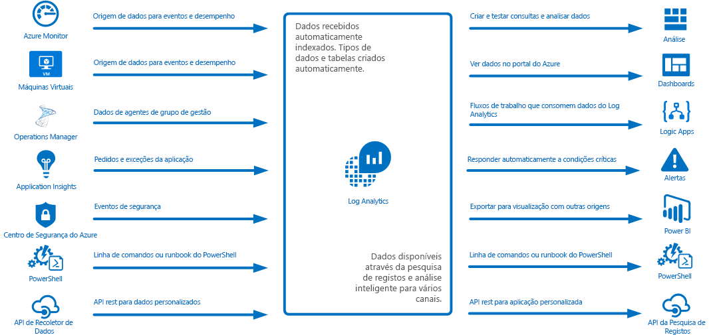
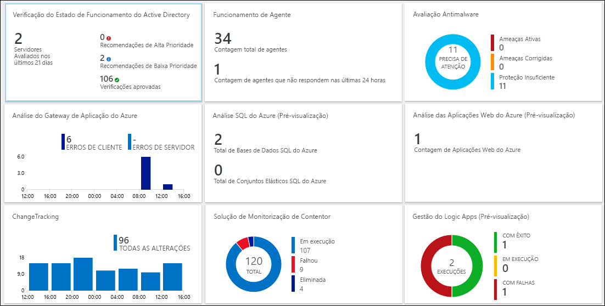
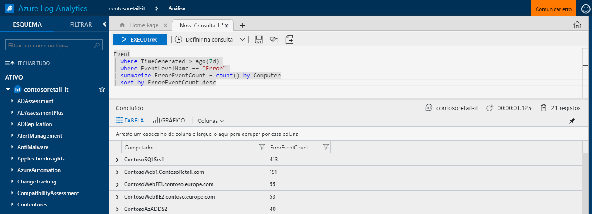
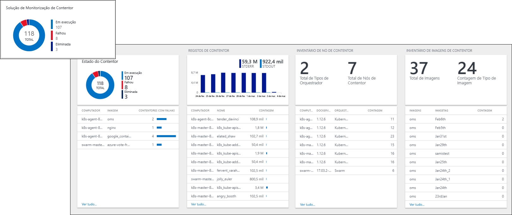
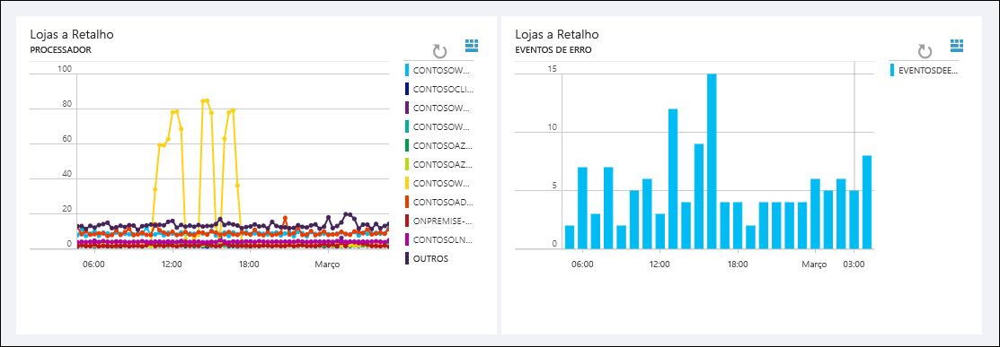
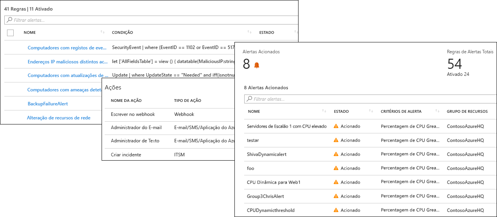
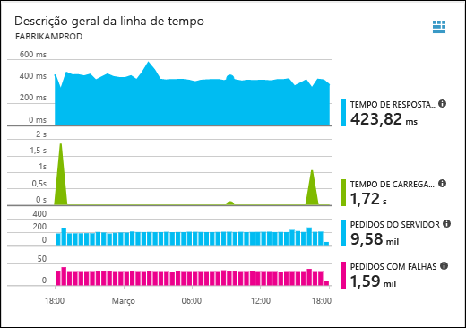
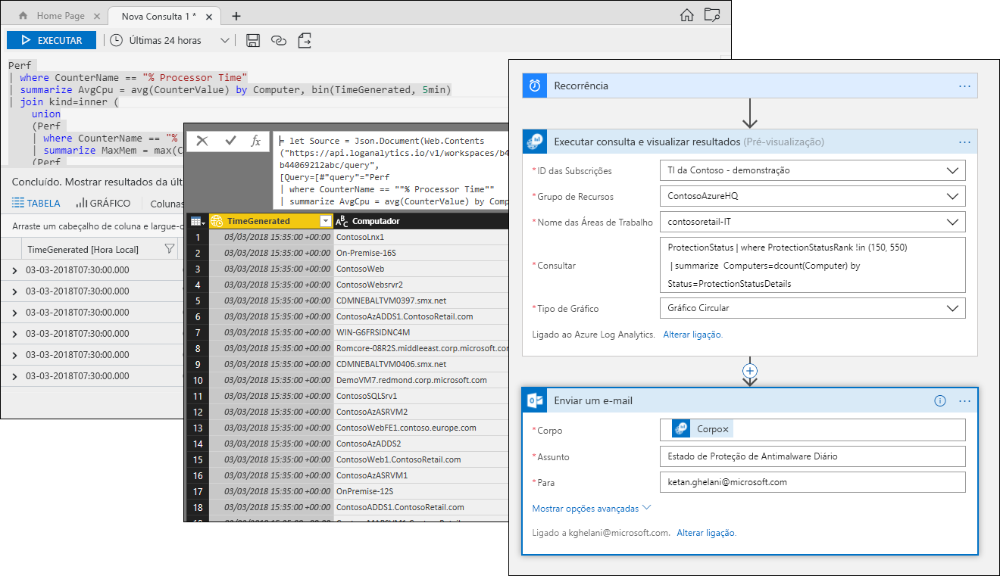

# O que é o Azure Log Analytics?
O Log Analytics desempenha um papel fundamental na gestão do Azure ao recolher dados telemétricos e de outros tipos a partir de várias origens e ao fornecer um motor de análise e linguagem de consulta que lhe dá informações sobre o funcionamento das suas aplicações e recursos.  Pode interagir diretamente com os dados do Log Analytics através de vistas e pesquisas de registos ou pode utilizar ferramentas de análise noutros serviços do Azure que armazenam os seus dados no Log Analytics, como o Application Insights ou o Centro de Segurança do Azure.  

O Log Analytics requer configuração mínima e já está integrado noutros serviços do Azure.  Apenas terá de criar uma área de trabalho para ativar a recolha.  Em seguida, pode instalar agentes em máquinas virtuais para inclui-los na área de trabalho e ativar as soluções de gestão que incluem lógica para fornecer informações adicionais sobre diferentes aplicações.  Em segundo plano, os tipos de dados estão pré-definidos ou são criados automaticamente à medida que os dados são recolhidos.

## Função de monitorização

Os diferentes serviços de monitorização no Azure estão descritos em [Monitorizar aplicações e recursos do Azure](../monitoring-and-diagnostics/monitoring-overview.md).  O Log Analytics desempenha um papel fundamental ao consolidar a monitorização de dados a partir de diferentes origens e ao fornecer uma poderosa linguagem de consulta para consolidação e análise.  

No entanto, o Log Analytics não está limitado à monitorização de recursos do Azure.  Pode recolher dados a partir de recursos que estão no local ou noutras clouds para criar um ambiente de monitorização híbrido e pode ligar diretamente ao System Center Operations Manager para recolher dados telemétricos de agentes existentes.  As ferramentas de análise do Log Analytics, como pesquisas de registos, vistas e soluções de gestão, funcionam face a todos os dados recolhidos, com a capacidade de analisar de forma centralizada todo o seu ambiente.

## Recolha de dados
O Log Analytics recolhe dados de várias origens.  Depois de recolhidos, os dados são organizados em tabelas separadas para cada tipo de dados, que permite que todos os dados sejam analisados em conjunto, independentemente da respetiva origem.

Os métodos para recolher dados para o Log Analytics incluem os seguintes:

- Configure o Azure Monitor para copiar as [métricas e os registos](../monitoring/monitoring-data-collection.md#types-of-monitoring-data) que recolhe dos recursos do Azure.
- Recolha telemetria escrita no [Armazenamento do Azure](log-analytics-azure-storage-iis-table.md).
- Os agentes em máquinas virtuais [Windows](log-analytics-windows-agent.md) e [Linux](log-analytics-linux-agents.md) enviam os dados telemétricos do sistema operativo convidado e das aplicações para o Log Analytics de acordo com as [Origens de Dados](log-analytics-data-sources.md) que configurar. Os agentes podem ser ligados diretamente, faça-o através de um [OMS Gateway](log-analytics-oms-gateway.md) quando não tiverem acesso através de firewall ou através de um [grupo de gestão do System Center Operations Manager](log-analytics-om-agents.md).
- Os serviços do Azure, como o [Application Insights](https://docs.microsoft.com/azure/application-insights/) e o [Centro de Segurança do Azure](https://docs.microsoft.com/azure/security-center/), armazenam os dados diretamente no Log Analytics sem qualquer configuração.
- Escreva os dados a partir da linha de comandos do PowerShell ou do [runbook de Automatização do Azure](../automation/automation-runbook-types.md) com os cmdlets do Log Analytics.
- Se tem requisitos personalizados, pode utilizar a [API de Recoletor de Dados HTTP](log-analytics-data-collector-api.md) para escrever dados no Log Analytics a partir de qualquer cliente de API REST ou de uma [Aplicação do Azure Logic ](https://docs.microsoft.com/azure/logic-apps/) para escrever dados a partir de um fluxo de trabalho personalizado.

## Adicionar funcionalidade com soluções de gestão
As [soluções de gestão](log-analytics-add-solutions.md) fornecem lógica pré-embalada para um produto ou cenário específico.  Podem recolher dados adicionais para o Log Analytics ou processar os dados já recolhidos.  Normalmente, incluem uma vista para ajudar a analisar estes dados adicionais.  Estão disponíveis soluções para diversas funções e são constantemente adicionadas novas.  Pode procurar facilmente as soluções disponíveis e [adicioná-las à sua área de trabalho](log-analytics-add-solutions.md), a partir do Azure Marketplace.  

## Linguagem da consulta

O Log Analytics inclui uma [linguagem de consulta avançada](http://docs.loganalytics.io) para obter, consolidar e analisar rapidamente os dados recolhidos.  Pode criar e testar consultas através dos [portais de Pesquisa de Registos ou Análise Avançada](log-analytics-log-search-portals.md) e, em seguida, analisar diretamente os dados através destas ferramentas ou guardar as consultas para utilização em visualizações e alertas ou exportar para outras ferramentas, como o Power BI ou o Excel.

A linguagem de consulta do Log Analytics é adequada para pesquisas de registos simples, mas também inclui funcionalidades avançadas, como agregações, associações e análises inteligentes. Pode aprender rapidamente a linguagem de consulta através dos [vários tutoriais](https://docs.loganalytics.io/docs/Learn/Tutorials) disponíveis.  É fornecida orientação específica para os utilizadores que já estejam familiarizados com [SQL](https://docs.loganalytics.io/docs/Learn/References/SQL-to-Azure-Log-Analytics) e [Splunk](https://docs.loganalytics.io/docs/Learn/References/Splunk-to-Azure-Log-Analytics).

## Visualizar os dados do Log Analytics

As [vistas no Log Analytics](log-analytics-view-designer.md) apresentam visualmente os dados a partir de pesquisas de registos.  Cada vista inclui uma combinação de visualizações, como gráficos de barras e linhas, além de listas que resumem os dados críticos.  As [soluções de gestão](#add-functionality-with-management-solutions) incluem vistas que resumem os dados para uma aplicação específica e pode criar as suas próprias vistas para apresentar os dados a partir de qualquer pesquisa de registos do Log Analytics.

Também pode afixar os resultados de uma consulta do Log Analytics a um [dashboard do Azure](../azure-portal/azure-portal-dashboards.md), que lhe permite combinar mosaicos de diferentes serviços do Azure.  Pode ainda afixar uma vista do Log Analytics a um dashboard.

## Criar alertas a partir de dados do Log Analytics

Utilize [Alertas do Azure](../monitoring-and-diagnostics/monitoring-overview-unified-alerts.md) para ser notificado proativamente das condições nos dados do Log Analytics que são importantes para si.  A consulta é executada automaticamente em intervalos agendados e é criado um alerta se os resultados corresponderem a critérios específicos.  Isto permite combinar os alertas do Log Analytics com outras origens, como alertas quase em tempo real do [Azure Monitor](../monitoring-and-diagnostics/monitoring-near-real-time-metric-alerts.md), exceções de aplicações do [Application Insights](../application-insights/app-insights-alerts.md) e partilhar [Grupos de ação](../monitoring-and-diagnostics/monitoring-action-groups.md) para resposta às condições de alerta.

## Utilizar os dados do Log Analytics noutros serviços
Serviços como o Application Insights e o Centro de Segurança do Azure armazenam os dados no Log Analytics.  Normalmente, irá interagir com as ferramentas de análise avançada fornecidas por estes serviços, mas também pode utilizar as consultas do Log Analytics para aceder aos respetivos dados e potencialmente combiná-los com dados de outros serviços.  

Por exemplo, a vista seguinte é do Application Insights.  Se clicar no ícone na parte superior direita, é iniciada a consola de análise do Log Analytics com as consultas utilizadas pelo gráfico.

## Exportar os dados do Log Analytics

O Log Analytics também disponibiliza os dados fora do Azure.  Pode configurar o [Power BI](log-analytics-powerbi.md) para importar os resultados de uma consulta em intervalos agendados, o que lhe permite tirar partido das respetivas funcionalidades, como combinar dados de diferentes origens e partilhar relatórios na Web e em dispositivos móveis.  Também pode tirar partido da [API de Pesquisas de Registos](log-analytics-log-search-api.md) para criar soluções personalizadas que se baseiem nos dados do Log Analytics ou para integrar noutros sistemas.

Pode utilizar o [Logic Apps](../logic-apps/logic-apps-overview.md) no Azure para criar fluxos de trabalho personalizados com base nos dados do Log Analytics.  Para uma lógica mais complexa com base no PowerShell, pode utilizar [runbooks na Automatização do Azure](../automation/automation-runbook-types.md).

## Passos seguintes
- Comece por [recolher dados de VMs do Azure](log-analytics-quick-collect-azurevm.md).
- Siga um [tutorial sobre como analisar dados do Log Analytics com uma consulta simples](log-analytics-tutorial-viewdata.md).
* [Procure as soluções disponíveis](log-analytics-add-solutions.md) para adicionar funcionalidades ao Log Analytics.

