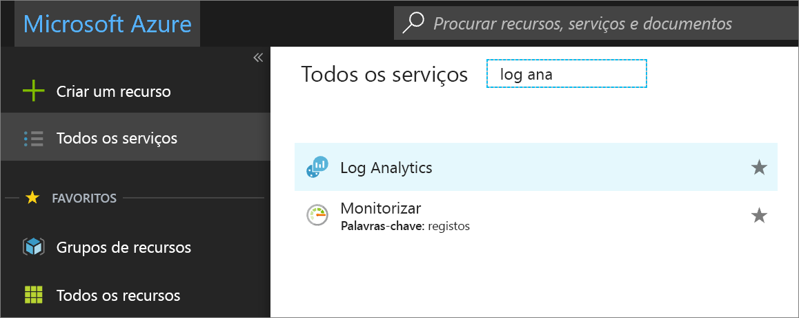
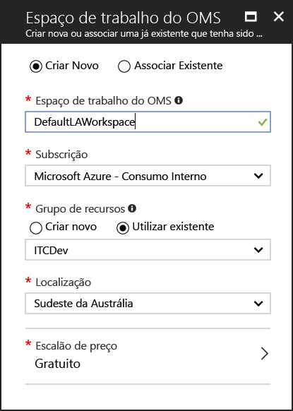
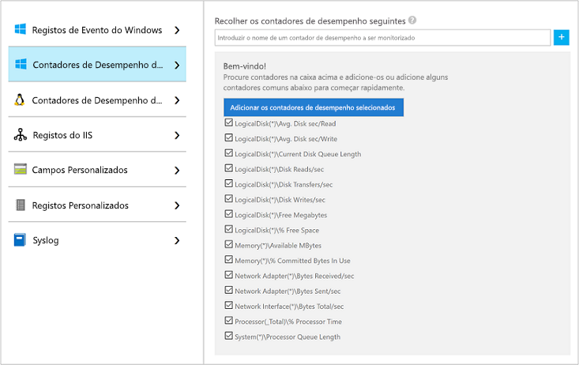
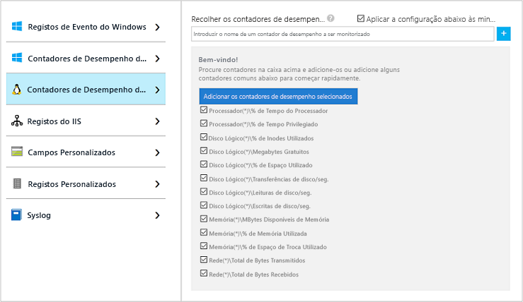
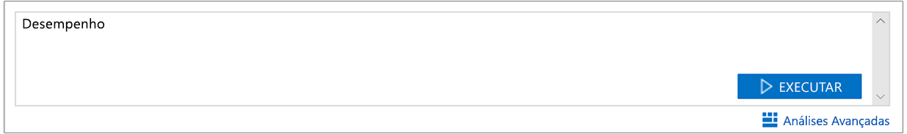
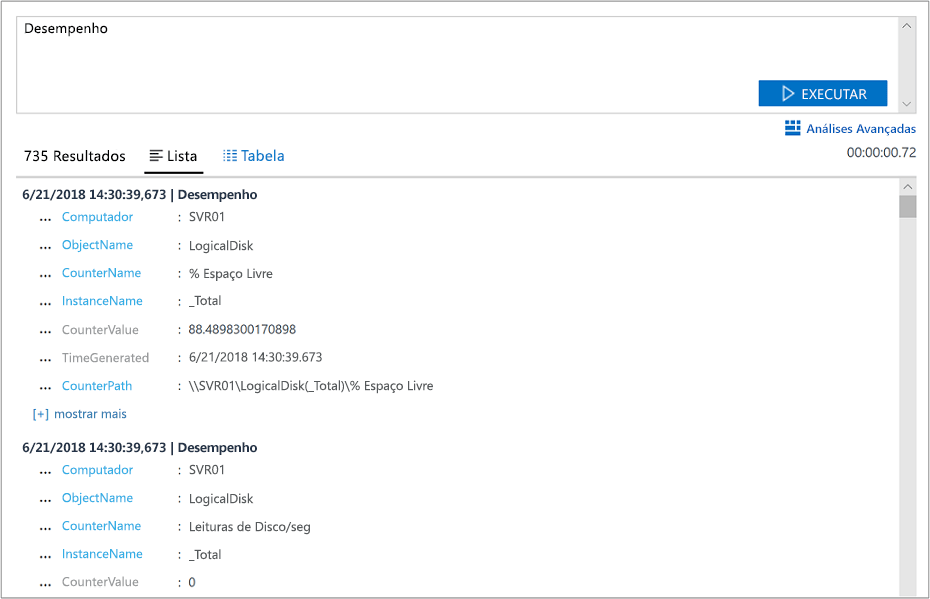
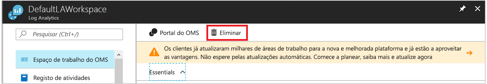

# Recolher dados sobre Máquinas Virtuais do Azure
O [Azure Log Analytics](log-analytics-overview.md) pode recolher dados diretamente das máquinas virtuais do Azure e de outros recursos no seu ambiente para um único repositório para análise e correlação detalhadas.  Este início rápido mostra como configurar e recolher dados das VMs do Linux e Windows do Azure em alguns passos simples.  
 
Este início rápido pressupõe que tem uma máquina virtual do Azure. Se não for o caso, pode [criar uma VM do Windows](../virtual-machines/windows/quick-create-portal.md) ou [criar uma VM do Linux](../virtual-machines/linux/quick-create-cli.md) ao seguir os nossos inícios rápidos de VM.

## Iniciar sessão no portal do Azure
Inicie sessão no portal do Azure em [https://portal.azure.com](https://portal.azure.com). 

## Criar uma área de trabalho
1. No portal do Azure, clique em **Mais serviços**, que se encontra no canto inferior esquerdo. Na lista de recursos, escreva **Log Analytics**. À medida que começa a escrever, a lista filtra com base na sua entrada. Selecione **Log Analytics**.     
2. Clique em **Criar** e, em seguida, selecione as opções para os seguintes itens:

  * Indique um nome para a nova **Área de Trabalho do OMS**, como *DefaultLAWorkspace*. 
  * Selecione uma **Subscrição** à qual ligar ao escolher na lista pendente se a predefinição selecionada não é adequada.
  * Para **Grupo de Recursos**, selecione um grupo de recursos existente que contenha uma ou mais máquinas virtuais do Azure.  
  * Selecione a **Localização** para onde as VMs devem ser implementadas.  Para obter mais informações, veja em que [regiões está disponível o Log Analytics](https://azure.microsoft.com/regions/services/).
  * Pode escolher de entre três **escalões de preço** diferentes no Log Analytics, mas para este início rápido, vai selecionar o escalão **gratuito**.  Para obter informações adicionais sobre os escalões específicos, veja [Detalhes de Preços do Log Analytics](https://azure.microsoft.com/pricing/details/log-analytics/).

           
3. Depois de fornecer as informações necessárias no painel **Área de Trabalho do OMS**, clique em **OK**.  

Enquanto as informações são confirmadas e a área de trabalho criada, pode acompanhar o progresso em **Notificações**, no menu. 

## Ativar a Extensão de VM do Log Analytics
Para máquinas virtuais do Windows e Linux já implementadas no Azure, instale o agente do Log Analytics com a Extensão de VM do Log Analytics.  A utilização da extensão simplifica o processo de instalação e configura automaticamente o agente para enviar dados para a área de trabalho do Log Analytics que especificar. O agente é também atualizado automaticamente e assegura que tem as funcionalidades e correções mais recentes.

>[!NOTE]
>O agente do OMS para Linux não pode ser configurado para reportar a mais do que uma área de trabalho do Log Analytics. 

Se criou uma área de trabalho na cloud do Azure Government, poderá reparar na faixa na parte superior da página de recursos do Log Analytics no portal a convidá-lo a atualizar.  A atualização não é necessária para os objetivos deste início rápido. 

.    
1. No portal do Azure, clique em **Mais serviços**, que se encontra no canto inferior esquerdo. Na lista de recursos, escreva **Log Analytics**. À medida que começa a escrever, a lista filtra com base na sua entrada. Selecione **Log Analytics**.
2. Na lista de áreas de trabalho do Log Analytics, selecione *DefaultLAWorkspace*, criada anteriormente.
3. No menu esquerdo, em Origens de Dados da Área de Trabalho, clique em **Máquinas virtuais**.  
4. Na lista de **Máquinas virtuais**, selecione uma máquina virtual na qual quer instalar o agente. Tenha em atenção que o **Estado de ligação do OMS** da VM indica **Não ligado**.
5. Nos detalhes da máquina virtual, selecione **Ligar**. O agente é instalado e configurado automaticamente para a área de trabalho do Log Analytics. Este processo demora alguns minutos, enquanto o **Estado** está **A ligar**.
6. Depois de instalar e ligar o agente, o **Estado de ligação do OMS** será atualizado para **Esta área de trabalho**.

## Recolher dados de eventos e de desempenho
O Log Analytics pode recolher eventos de registos do Windows ou do Linux Syslog e contadores de desempenho que especificar para análises e relatórios a longo prazo e efetuar ações quando é detetada uma determinada condição.  Siga estes passos para configurar a recolha de eventos do registo do sistema do Windows e do Linux Syslog e vários contadores de desempenho comuns para começar.  

### Recolha de dados da VM do Windows
1. Selecione **Definições avançadas**.    
3. Selecione **Dados** e, em seguida, selecione **Registos de Eventos do Windows**.  
4. Adicione um registo de eventos ao escrever o nome do registo.  Escreva **System** e, em seguida, clique no sinal de adição **+**.  
5. Na tabela, verifique as gravidades **Erro** e **Aviso**.   
6. Clique em **Guardar** no início da página para guardar a configuração.
7. Selecione **Dados de Desempenho do Windows** para ativar a recolha de contadores de desempenho num computador Windows. 
8. Quando configurar os contadores de desempenho do Windows pela primeira vez para uma nova área de trabalho do Log Analytics, é-lhe dada a opção de criar rapidamente vários contadores comuns. São listados com uma caixa de verificação junto a cada um.  .  Clique em **Adicionar os contadores de desempenho selecionados**.  Estes são adicionados e predefinidos com um intervalo de amostra de recolha de dez segundo.  
9. Clique em **Guardar** no início da página para guardar a configuração.

### Recolha de dados da VM do Linux

1. Selecione **Syslog**.  
2. Adicione um registo de eventos ao escrever o nome do registo.  Escreva **Syslog** e, em seguida, clique no sinal de adição **+**.  
3. Na tabela, desmarque as gravidades **Informações**, **Aviso** e **Depurar**. 
4. Clique em **Guardar** no início da página para guardar a configuração.
5. Selecione **Dados de Desempenho do Linux** para ativar a recolha de contadores de desempenho num computador Windows. 
6. Quando configurar os contadores de desempenho do Linux pela primeira vez para uma nova área de trabalho do Log Analytics, é-lhe dada a opção de criar rapidamente vários contadores comuns. São listados com uma caixa de verificação junto a cada um.  .  Clique em **Adicionar os contadores de desempenho selecionados**.  Estes são adicionados e predefinidos com um intervalo de amostra de recolha de dez segundo.  
7. Clique em **Guardar** no início da página para guardar a configuração.

## Ver os dados recolhidos
Agora que ativou a recolha de dados, vamos executar um exemplo de pesquisa de registo simples para ver alguns dados a partir das VMs de destino.  

1. No portal do Azure, navegue até Log Analytics e selecione a área de trabalho criada anteriormente.
2. Clique no mosaico **Pesquisa de Registos**, no painel Pesquisa de Registos, no tipo de campo de consulta `Perf` e, em seguida, prima Enter ou clique no botão de pesquisa à direita do campo de consulta.    

   >[!NOTE]
   >Se a sua área de trabalho é criada na cloud do Azure Government, irá utilizar a consulta `Type=Perf`.  
   >

Por exemplo, a consulta na imagem seguinte devolveu 78.000 registos de desempenho.  Os resultados serão significativamente menos.  

## Limpar recursos
Quando já não for necessária, elimine a área de trabalho do Log Analytics. Para tal, selecione a área de trabalho do Log Analytics criada anteriormente e clique em **Eliminar** na página de recursos.  

## Passos seguintes
Agora que está a recolher dados operacionais e de desempenho das máquinas virtuais do Windows e Linux, pode começar facilmente a explorar, analisar e efetuar ações nos dados recolhidos *gratuitamente*.  

Para saber como ver e analisar os dados, avance para o tutorial.   

> [!div class="nextstepaction"]
> [Ver ou analisar dados no Log Analytics](log-analytics-tutorial-viewdata.md)
