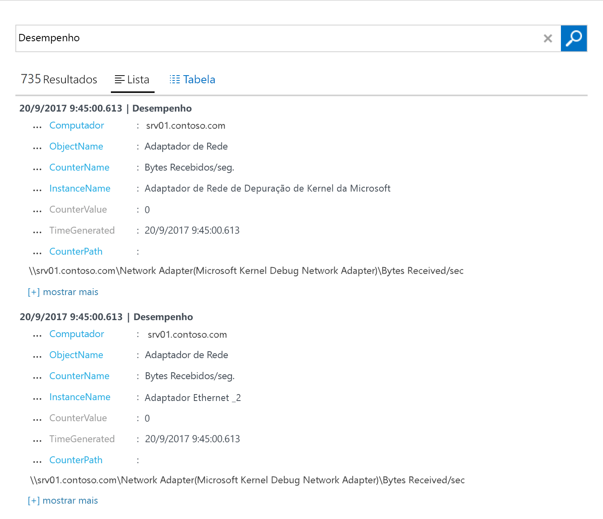

# Configurar o agente do Log Analytics para computadores Windows num ambiente híbrido
O [Azure Log Analytics](log-analytics-overview.md) pode recolher dados diretamente do seu computador Windows físico ou virtual no seu datacenter ou noutro ambiente na cloud para um único repositório, para análise e correlação detalhadas.  Este início rápido mostra-lhe como configurar e recolher dados do seu computador Windows em alguns passos simples.  Para as VMs do Windows do Azure, veja o tópico seguinte [Collect data about Azure Virtual Machines](log-analytics-quick-collect-azurevm.md) (Recolher dados sobre as Máquinas Virtuais do Azure).  

Para compreender a configuração suportada, consulte [sistemas operativos Windows suportados](log-analytics-concept-hybrid.md#supported-windows-operating-systems) e [configuração de firewall de rede](log-analytics-concept-hybrid.md#network-firewall-requirements).
 
Se não tiver uma subscrição do Azure, crie uma [conta gratuita](https://azure.microsoft.com/free/?WT.mc_id=A261C142F) antes de começar.

## Iniciar sessão no portal do Azure
Inicie sessão no portal do Azure em [https://portal.azure.com](https://portal.azure.com). 

## Criar uma área de trabalho
1. No portal do Azure, clique em **All services** (Todos os serviços). Na lista de recursos, escreva **Log Analytics**. À medida que começa a escrever, a lista filtra com base na sua entrada. Selecione **Log Analytics**.       
2. Clique em **Criar** e, em seguida, selecione as opções para os seguintes itens:

  * Indique um nome para a nova **Área de Trabalho do Log Analytics**, como *DefaultLAWorkspace*. 
  * Selecione uma **Subscrição** à qual ligar ao escolher na lista pendente se a predefinição selecionada não é adequada.
  * Para **Grupo de Recursos**, selecione um grupo de recursos existente que contenha uma ou mais máquinas virtuais do Azure.  
  * Selecione a **Localização** para onde as VMs devem ser implementadas.  Para obter mais informações, veja em que [regiões está disponível o Log Analytics](https://azure.microsoft.com/regions/services/).  
  * Se estiver a criar uma área de trabalho numa subscrição nova criada depois de 2 de abril de 2018, a mesma utilizará automaticamente o plano de preços *Por GB* e a opção para selecionar um escalão de preços não estará disponível.  Se estiver a criar uma área de trabalho para uma subscrição já existente criada antes de 2 de abril ou para uma subscrição que estava associada a uma inscrição EA já existente, selecione o seu escalão de preço preferido.  Para obter informações adicionais sobre os escalões específicos, veja [Detalhes de Preços do Log Analytics](https://azure.microsoft.com/pricing/details/log-analytics/).

           

3. Depois de dar as informações necessárias no painel **Área de Trabalho do Log Analytics**, clique em **OK**.  

Enquanto as informações são confirmadas e a área de trabalho criada, pode acompanhar o progresso em **Notificações**, no menu. 

## Obter o ID e a chave da área de trabalho
Antes de instalar o agente Microsoft Monitoring para Windows, precisa do ID e da chave da área de trabalho do Log Analytics.  O assistente de configuração precisa desta informação para configurar corretamente o agente e assegurar que consegue comunicar com êxito com o Log Analytics.  

1. No portal do Azure, clique em **Todos os serviços**, que se encontra no canto superior esquerdo. Na lista de recursos, escreva **Log Analytics**. À medida que começa a escrever, a lista filtra com base na sua entrada. Selecione **Log Analytics**.
2. Na lista de áreas de trabalho do Log Analytics, selecione *DefaultLAWorkspace*, criada anteriormente.
3. Selecione **Definições avançadas**.       
4. Selecione **Origens Ligadas** e, em seguida, selecione **Servidores Windows**.   
5. O valor à direita de **ID da Área de Trabalho** e **Chave Primária**. Copie e cole ambos no seu editor favorito.   

## Instalar o agente para Windows
Os passos seguintes instalam e configuram o agente para o Log Analytics no Azure e na cloud do Azure Government mediante a utilização do Microsoft Monitoring Agent no seu computador.  

1. Na página **Servidores Windows**, selecione a versão **Transferir Agente do Windows** adequada para transferir consoante a arquitetura do processador do sistema operativo Windows.
2. Execute a Configuração para instalar o agente no seu computador.
2. Na página **Bem-vindo**, clique em **Seguinte**.
3. Na página **Termos de Licenciamento**, leia a licença e clique em **Aceito**.
4. Na página **Pasta de Destino**, altere ou mantenha a pasta de instalação predefinida e clique em **Seguinte**.
5. Na página **Opções de Configuração do Agente** , escolha ligar o agente ao Azure Log Analytics e clique em **Seguinte**.   
6. Na página **Azure Log Analytics**, faça o seguinte:
   1. Cole o **ID da Área de Trabalho** e a **Chave da Área de Trabalho (Chave Primária)** que copiou anteriormente.  Caso o computador deva reportar a uma área de trabalho do Log Analytics na cloud do Azure Government, selecione **Azure US Government**, na lista pendente **Cloud do Azure**.  
   2. Se o computador tiver de comunicar através de um servidor proxy com o serviço do Log Analytics, clique em **Avançadas** e forneça o URL e o número da porta do servidor proxy.  Se o seu servidor proxy precisar de autenticação, escreva o nome de utilizador e a palavra-passe para autenticação no mesmo e clique em **Seguinte**.  
7. Depois de indicar as definições de configuração necessárias, clique em **Seguinte**.     
8. Na página **Pronto para Instalar**, reveja as suas opções e clique em **Instalar**.
9. Na página **Configuração Concluída com Êxito**, clique em **Concluir**.

Quando terminar, o **Microsoft Monitoring Agent** aparece no **Painel de Controlo**. Pode rever a configuração e confirmar que o agente está ligado ao Log Analytics. Quando estiver ligado, no separador **Azure Log Analytics**, o agente apresenta uma mensagem que diz: **O Microsoft Monitoring Agent ligou-se com êxito ao serviço Microsoft Log Analytics.**   

## Recolher dados de eventos e de desempenho
O Log Analytics pode recolher eventos do registo do Windows e de contadores de desempenho que especificar para análises e relatórios a longo prazo e efetuar ações quando é detetada uma determinada condição.  Siga estes passos para configurar a recolha de eventos a partir do registo de eventos do Windows e de vários contadores de desempenho comuns para começar.  

1. No portal do Azure, clique em **Mais serviços**, que se encontra no canto inferior esquerdo. Na lista de recursos, escreva **Log Analytics**. À medida que começa a escrever, a lista filtra com base na sua entrada. Selecione **Log Analytics**.
2. Selecione **Definições avançadas**.      
3. Selecione **Dados** e, em seguida, selecione **Registos de Eventos do Windows**.  
4. Adicione um registo de eventos ao escrever o nome do registo.  Escreva **System** e, em seguida, clique no sinal de adição **+**.  
5. Na tabela, verifique as gravidades **Erro** e **Aviso**.   
6. Clique em **Guardar** no início da página para guardar a configuração.
7. Selecione **Dados de Desempenho do Windows** para ativar a recolha de contadores de desempenho num computador Windows. 
8. Quando configurar os contadores de desempenho do Windows pela primeira vez para uma nova área de trabalho do Log Analytics, é-lhe dada a opção de criar rapidamente vários contadores comuns. São listados com uma caixa de verificação junto a cada um.  .  Clique em **Adicionar os contadores de desempenho selecionados**.  Estes são adicionados e predefinidos com um intervalo de amostra de recolha de dez segundo.  
9. Clique em **Guardar** no início da página para guardar a configuração.

## Ver os dados recolhidos
Agora que ativou a recolha de dados, vamos executar um exemplo de pesquisa de registo simples para ver alguns dados a partir do computador de destino.  

1. No portal do Azure, na área de trabalho selecionada, clique no mosaico **Pesquisa de Registos**.  
2. No painel Pesquisa de Registos, no tipo de campo de consulta, escreva `Perf` e prima Enter ou clique no botão de pesquisa à direita do campo de consulta.      Por exemplo, a consulta na imagem seguinte devolveu 735 registos de desempenho.   

## Limpar recursos
Quando já não for necessário, pode remover o agente do computador Windows e eliminar a área de trabalho do Log Analytics.  

Para remover o agente, efetue os passos seguintes.

1. Abra o **Painel de Controlo**.
2. Abra **Programas e Funcionalidades**.
3. Em **Programas e Funcionalidades**, selecione **Microsoft Monitoring Agent** e clique em **Desinstalar**.

Para eliminar a área de trabalho, selecione a área de trabalho do Log Analytics criada anteriormente e clique em **Eliminar** na página de recursos.   

## Passos seguintes
Agora que está a recolher dados operacionais e de desempenho do computador com Linux no local, pode começar facilmente a explorar, analisar e efetuar ações nos dados recolhidos *gratuitamente*.  

Para saber como ver e analisar os dados, avance para o tutorial.   

> [!div class="nextstepaction"]
> [Ver ou analisar dados no Log Analytics](log-analytics-tutorial-viewdata.md)
