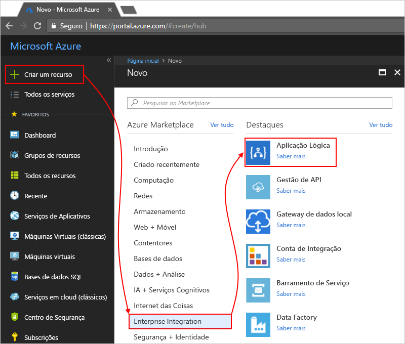

# Monitorizar aplicações lógicas com o Azure Log Analytics

Para monitorizar e obter os detalhes de depuração mais avançadas sobre as aplicações lógicas, ative [do Azure Log Analytics](../log-analytics/log-analytics-overview.md) quando criar a sua aplicação lógica. O log Analytics disponibiliza diagnósticos de registo e monitorização para as aplicações lógicas ao instalar a solução de gestão do Logic Apps no portal do Azure. Esta solução também fornece informações agregadas para a aplicação lógica é executado com detalhes específicos, tais como Estado, o tempo de execução, o estado de ressubmissão e o IDs de correlação. Este artigo mostra como ativar o Log Analytics, para que pode ver eventos de tempo de execução e dados para a aplicação lógica é executada.

Para ativar o Azure Log Analytics para o logic apps existentes, siga estes passos para [ativar o registo de diagnósticos e enviar dados de tempo de execução de aplicação lógica para o Log Analytics](../logic-apps/logic-apps-monitor-your-logic-apps.md#azure-diagnostics).

> [!NOTE]
> Passos para saber como realizar estas tarefas com o Microsoft Operations Management Suite (OMS), que é descrito anteriormente, esta página [extinguir em Janeiro de 2019](../log-analytics/log-analytics-oms-portal-transition.md), substitui esses passos com o Azure Log Analytics em vez disso. 

## Pré-requisitos

Antes de começar, terá de uma área de trabalho do Log Analytics. Saiba mais [como criar uma área de trabalho do Log Analytics](../log-analytics/log-analytics-quick-create-workspace.md). 

## Ativar o registo de diagnóstico durante a criação de aplicações lógicas

1. Na [portal do Azure](https://portal.azure.com), criar uma aplicação lógica. Escolher **criar um recurso** > **integração** > **aplicação lógica**.

   

1. Sob **Criar aplicação lógica**, realizar estas tarefas, conforme mostrado:

   1. Forneça um nome para a aplicação lógica e selecione a sua subscrição do Azure. 

   1. Crie ou selecione um grupo de recursos do Azure.

   1. Definir **do Log Analytics** ao **no**. 

   1. Na lista de área de trabalho do Log Analytics de lista, selecione a área de trabalho onde pretende enviar dados para a aplicação lógica é executada. 

      

      Depois de concluir este passo, o Azure cria a aplicação lógica, que agora é associado à sua área de trabalho do Log Analytics. 
      Além disso, este passo instala também automaticamente a solução de gestão do Logic Apps em sua área de trabalho.

   1. Quando tiver terminado, escolha **Create** (Criar).

1. Para ver a sua aplicação lógica é executada, [continuar com estes passos](#view-logic-app-runs-oms).

## Instalar a solução de gestão do Logic Apps

Se já ativou o Log Analytics quando criou a sua aplicação lógica, ignore este passo. Já tem a solução de gestão do Logic Apps instalada.

1. No [portal do Azure](https://portal.azure.com), selecione **Todos os serviços**. Na caixa de pesquisa, encontre "log analytics" e selecione **do Log Analytics**.

   

1. Sob **do Log Analytics**, localize e selecione a sua área de trabalho do Log Analytics. 

   

1. Sob **introdução ao Log Analytics** > **configurar soluções de monitorização**, escolha **ver soluções**.

   

1. Na página Descrição geral, escolha **Add**, que abre o **soluções de gestão** lista. A partir dessa lista, selecione **gestão do Logic Apps**. 

   

   Se não conseguir encontrar a solução, na parte inferior da lista, escolha **carregar mais** até que apareça a solução.

1. Escolher **Create**, confirme a área de trabalho do Log Analytics onde pretende instalar a solução e, em seguida, escolha **criar** novamente.   

   

   Se não pretender utilizar uma área de trabalho existente, também pode criar uma nova área de trabalho neste momento.

   Quando tiver terminado, a solução de gestão do Logic Apps é apresentada na página de descrição geral. 

## Aplicação de lógica de exibição executar informações

Após a execução da sua aplicação lógica, pode ver o estado e a contagem para essas execuções no **gestão do Logic Apps** mosaico. 

1. Vá para a área de trabalho do Log Analytics e abrir a página de descrição geral. Escolher **gestão do Logic Apps**. 

   

   Aqui, as execuções de aplicação lógica são agrupadas por nome ou por Estado de execução. 
   Esta página também mostra detalhes sobre falhas de ações ou acionadores para execuções de aplicação lógica.

   
   
1. Para ver todas as execuções de aplicação de lógica específica ou num Estado, selecione a linha para um Estado ou de uma aplicação lógica.

   Eis um exemplo que mostra todas as execuções para uma aplicação de lógica específica:

   

   Esta página tem estas opções avançadas:

   * **Propriedades controladas:**

     Esta coluna mostra propriedades controladas, as quais estão agrupadas por ações, a aplicação lógica. Para ver as propriedades controladas, escolha **vista**. 
     Para procurar as propriedades controladas, utilize o filtro de coluna.
   
     

     Quaisquer propriedades controladas adicionadas recentemente poderão demorar 10 a 15 minutos antes de serem apresentados pela primeira vez. Saiba mais [como adicionar propriedades controladas à sua aplicação lógica](logic-apps-monitor-your-logic-apps.md#azure-diagnostics-event-settings-and-details).

   * **Volte a submeter:** pode submeter novamente um ou mais execuções da aplicação lógica que falhou, foi concluída com êxito, ou são ainda em execução. Selecione as caixas de verificação para as execuções que pretende submeter novamente e escolha **volte a submeter**. 

     

1. Para filtrar esses resultados, pode realizar a filtragem do lado do cliente e servidor.

   * **Filtro do lado do cliente**: para cada coluna, selecione os filtros que pretende, por exemplo:

     

   * **Filtro do lado do servidor**: escolher uma janela de tempo específico ou para limitar o número de execuções que aparecem, utilize o controlo de âmbito na parte superior da página. Por predefinição, apenas 1000 registos são apresentados ao mesmo tempo.
   
     
 
1. Para ver todas as ações e os respetivos detalhes para uma execução específica, selecione uma linha para uma execução da aplicação lógica.

   Eis um exemplo que mostra todas as ações de uma execução da aplicação lógica específica:

   
   
1. Em qualquer página de resultados, para ver a consulta por trás os resultados ou para ver todos os resultados, escolha **ver todos os**, que abre a página de pesquisa de registos.
   
   
   
   Na página de pesquisa de registos,

   * Para ver os resultados da consulta numa tabela, escolha **tabela**.

   * Para alterar a consulta, pode editar a cadeia de consulta na barra de pesquisa. 
   Para uma melhor experiência, escolha **Advanced Analytics**.

     
     
     Na página do Log Analytics do Azure, pode atualizar consultas e ver os resultados da tabela. Esta consulta utiliza [linguagem de consulta de Kusto](https://aka.ms/LogAnalyticsLanguageReference), que pode editar se desejar exibir resultados diferentes. 

     

## Passos Seguintes

* [Monitorizar mensagens B2B](../logic-apps/logic-apps-monitor-b2b-message.md)