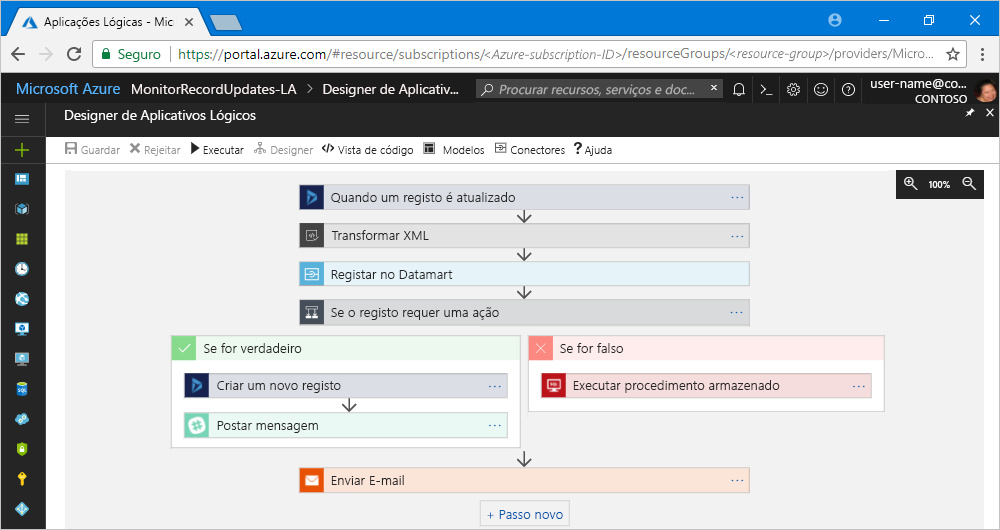

# O que é o Azure Logic Apps?

O [Logic Apps](https://azure.microsoft.com/services/logic-apps) ajuda a criar, agendar e automatizar os processos como [fluxos de trabalho](#logic-app-concepts), para que possa integrar aplicações, dados, sistemas e serviços em empresas ou organizações. O Logic Apps simplifica a forma como estrutura e cria soluções dimensionáveis para integração de aplicações, integração de dados, integração de sistemas, integração de aplicações empresariais (EAI) e comunicação empresa-empresa (B2B), na cloud, no local ou ambos.

Por exemplo, seguem-se algumas cargas de trabalho que pode automatizar com as aplicações lógicas:

* Processar e encaminhar encomendas em sistemas no local e serviços cloud.
* Mover ficheiros carregados de um servidor FTP para o Armazenamento do Azure. 
* Monitorizar tweets sobre um assunto específico, analisar sentimentos e criar alertas ou tarefas para itens que precisam de revisão.

Para criar soluções de integração com as aplicações lógicas, escolha entre uma galeria crescente de [200 conectores incorporados](../connectors/apis-list.md), como a Base de Dados SQL, os serviços do Azure, o Office 365, Salesforce, Google e muito mais. Estes [conectores](#logic-app-concepts) fornecem [acionadores](#logic-app-concepts), [ações](#logic-app-concepts) ou ambos para criar aplicações lógicas que acedem aos dados em segurança e os processam em tempo real.

> [!VIDEO https://channel9.msdn.com/Blogs/Azure/Introducing-Azure-Logic-Apps/player]

## Como funciona o Logic Apps? 

Cada fluxo de trabalho de aplicação lógica começa com um acionador, que é acionado quando um evento específico ocorre ou quando novos dados disponíveis cumprem critérios específicos. Muitos acionadores incluem capacidades básicas de agendamento, para que possa especificar com que regularidade as suas cargas de trabalho são executadas. Para obter mais cenários de agendamento personalizados, inicie os fluxos de trabalho com o Acionador de agenda. Saiba mais sobre [como criar fluxos de trabalho baseados no agendamento](../logic-apps/tutorial-build-schedule-recurring-logic-app-workflow.md).

Sempre que o acionador é acionado, o motor do Logic Apps cria uma instância da aplicação lógica que executa as ações do fluxo de trabalho. Estas ações também podem incluir conversões de dados e controlos de fluxo, como instruções condicionais, instruções switch, ciclos e ramificações. Por exemplo, esta aplicação lógica começa com um acionador do Dynamics 365 com os critérios “Quando um registo é atualizado” incorporados. Se o acionador detetar um evento que corresponde a este critério, o acionador é acionado e executa as ações do fluxo de trabalho. Neste exemplo, estas ações incluem transformação XML, atualizações de dados, ramificação de decisões e notificações por e-mail.

Pode criar as aplicações lógicas visualmente com o Estruturador de Aplicações Lógicas, disponível no portal do Azure através do browser e no Visual Studio. Para aplicações lógicas mais personalizadas, pode criar ou editar as definições das aplicações lógicas em JavaScript Object Notation (JSON), ao trabalhar no modo “vista de código”. Também pode utilizar comandos do Azure PowerShell e modelos do Azure Resource Manager para tarefas selecionadas. O Logic apps é implementado e executado na cloud no Azure. Para uma introdução mais detalhada, veja este vídeo: [Utilização do Azure Enterprise Integration Services para executar aplicações cloud à escala](https://channel9.msdn.com/Events/Connect/2017/T119/)

## Porquê utilizar o Logic Apps?

Com a passagem das empresas para o mundo digital, as aplicações lógicas ajudam-no a ligar sistemas legados e sistemas modernos e de vanguarda, de forma mais fácil e rapidamente, ao fornecer APIs pré-criadas como conectores geridos pela Microsoft. Dessa forma, poder concentrar-se na lógica de negócio e na funcionalidade das suas aplicações. Não tem de se preocupar com a criação, alojamento, dimensionamento, gestão, manutenção e monitorização das aplicações. O Logic Apps trata destas questões por si. Além disso, paga apenas o que utilizar, com base num [modelo de preços](../logic-apps/logic-apps-pricing.md) de consumo. 

Em muitos casos, não terá de escrever código. No entanto, se tiver de escrever algum código, pode criar fragmentos de código com as [Funções do Azure](../azure-functions/functions-overview.md) e executar esse código a pedido, a partir das aplicações lógicas. Além disso, se as suas aplicações lógicas tiverem de interagir com eventos de serviços do Azure, aplicações personalizadas ou soluções de terceiros, pode utilizar o [Azure Event Grid](../event-grid/overview.md) com as aplicações lógicas para monitorização, encaminhamento e publicação de eventos.

O Logic Apps, as Funções e o Event Grid são totalmente geridos pelo Microsoft Azure, libertando-o de preocupações relacionadas com a criação, alojamento, dimensionamento, gestão e monitorização das suas soluções. Com a capacidade de criar [aplicações e soluções “sem servidor”](../logic-apps/logic-apps-serverless-overview.md), pode concentrar-se apenas na lógica de negócio. Estes serviços dimensionam automaticamente para responder às suas necessidades, agilizam as integrações e ajudam-no a criar aplicações cloud robustas, com o mínimo de código. Além disso, paga apenas o que utilizar, com base num [modelo de preços](../logic-apps/logic-apps-pricing.md) de consumo. 

Para saber como as empresas melhoraram a agilidade e aumentaram o foco nos negócios principais ao combinarem o Logic Apps com outros serviços do Azure e produtos da Microsoft, veja estas [histórias de clientes](https://aka.ms/logic-apps-customer-stories).

Seguem-se mais detalhes sobre as capacidades e vantagens que obtém com o Logic Apps:

* **Criar fluxos de trabalho visualmente, com ferramentas de fácil utilização**

  Poupar tempo e simplificar processos complexos com ferramentas de design visual. 
  Criar aplicações lógicas do início ao fim, utilizando o Estruturador de Aplicações Lógicas através do browser no portal do Azure ou no Visual Studio. Iniciar o fluxo de trabalho com um acionador e adicionar qualquer número de ações da [galeria de conectores](../connectors/apis-list.md).

* **Começar a produzir mais depressa com os modelos de aplicações lógicas**

  Crie soluções frequentemente utilizadas mais rapidamente, escolhendo fluxos de trabalho predefinidos da [galeria de modelos](../logic-apps/logic-apps-create-logic-apps-from-templates.md). 
  Os modelos vão desde a conectividade simples para aplicações software como um serviço (SaaS) até soluções avançadas de B2B, além de modelos “apenas por divertimento”. Saiba como [criar aplicações lógicas a partir de modelos pré-criados](../logic-apps/logic-apps-create-logic-apps-from-templates.md).

* **Ligar sistemas díspares entre ambientes diferentes**

  Alguns padrões e fluxos de trabalho são fáceis de descrever mas difíceis de implementar em código. 
  As aplicações lógicas ajudam a ligar sistemas díspares no local e ambientes cloud de forma totalmente integrada. Por exemplo, pode ligar uma solução de marketing na cloud a um sistema de faturação no local ou centralizar o processamento de mensagens através de APIs e sistemas, com um Enterprise Service Bus. As aplicações lógicas proporcionam uma forma rápida, fiável e consistente de fornecer soluções reutilizáveis e reconfiguráveis nestes cenários.

* **Suporte de primeira classe para integração empresarial e cenários B2B**

  As empresas e organizações comunicam eletronicamente entre si através da utilização de protocolos e formatos de mensagem norma da indústria mas que são diferentes, como o EDIFACT, AS2 e X12. 
  Com as funcionalidades do [Enterprise Integration Pack (EIP)](../logic-apps/logic-apps-enterprise-integration-overview.md), pode criar aplicações lógicas que transformam os formatos de mensagem utilizados pelos seus parceiros em formatos que os sistemas da sua organização conseguem interpretar e processar. As aplicações lógicas processam estas trocas de forma fácil e segura, com a encriptação e assinaturas digitais.

  Comece por algo pequeno com os seus sistemas e serviços atuais, e aumente progressivamente ao seu ritmo. Quando estiver pronto, o Logic Apps e o EIP ajudam-no a implementar e dimensionar para cenários de integração mais maduros, ao fornecer estas capacidades e muito mais:

  * Criar estes produtos e serviços: 
    * [Microsoft BizTalk Server](https://docs.microsoft.com/biztalk/core/introducing-biztalk-server) 
    * [Gestão de API](../api-management/api-management-key-concepts.md) 
    * [Funções do Azure](../azure-functions/functions-overview.md) 
    * [Azure Service Bus](../service-bus-messaging/service-bus-messaging-overview.md)
  * Processar [mensagens XML](../logic-apps/logic-apps-enterprise-integration-xml.md)
  * Processar [ficheiros simples](../logic-apps/logic-apps-enterprise-integration-flatfile.md)
  * Trocar mensagens com protocolos [EDIFACT](../logic-apps/logic-apps-enterprise-integration-edifact.md), [AS2](../logic-apps/logic-apps-enterprise-integration-as2.md) e [X12](../logic-apps/logic-apps-enterprise-integration-x12.md)
  * Armazenar e gerir estes artefactos B2B e muito mais num local, com [contas de integração](../logic-apps/logic-apps-enterprise-integration-accounts.md):
    * [Parceiros](../logic-apps/logic-apps-enterprise-integration-partners.md)
    * [Contratos](../logic-apps/logic-apps-enterprise-integration-agreements.md) 
    * [Mapas para a transformação XML](../logic-apps/logic-apps-enterprise-integration-maps.md)
    * [Esquemas para a validação XML](../logic-apps/logic-apps-enterprise-integration-schemas.md)

* **Escreva uma vez, reutilize frequentemente**

  Crie as aplicações lógicas como modelos, de modo a que possa [implementar e reconfigurar as aplicações](../logic-apps/logic-apps-create-deploy-template.md) em vários ambientes e regiões.

* **Extensibilidade incorporada**

  Se não encontrar o conector que quer ou precisa para executar código personalizado, pode expandir as aplicações lógicas ao criar e chamar os seus próprios fragmentos de código a pedido através das [Funções do Azure](../azure-functions/functions-overview.md). 
  Crie as suas próprias [APIs](../logic-apps/logic-apps-create-api-app.md) e [conectores personalizados](../logic-apps/custom-connector-overview.md) aos quais pode ligar a partir das aplicações lógicas.

* **Paga apenas o que utilizar**
  
  O Logic Apps utiliza [preços e medição](../logic-apps/logic-apps-pricing.md) baseados no consumo, a não ser que tenha aplicações lógicas criadas anteriormente com planos do Serviço de Aplicações.

Saiba mais sobre o Logic Apps com estes vídeos introdutórios:
* [Integração com o Logic Apps - expanda os seus conhecimentos](https://channel9.msdn.com/Events/Build/2017/C9R17)
* [Integração empresarial com o Microsoft Azure Logic Apps](https://channel9.msdn.com/Events/Ignite/Microsoft-Ignite-Orlando-2017/BRK2188)
* [Criar processos empresariais avançados com o Logic Apps](https://channel9.msdn.com/Events/Ignite/Microsoft-Ignite-Orlando-2017/BRK3179)

## Termos-chave

* **Fluxo de trabalho**: visualize, estruture, crie, automatize e implemente os processos empresariais como uma série de passos.

* **Conectores geridos**: as suas aplicações lógicas precisam de aceder a dados, serviços e sistemas. Pode utilizar conectores pré-criados geridos pela Microsoft, que foram concebidos para criar, aceder e trabalhar com os seus dados. Veja [Conectores para o Azure Logic Apps](../connectors/apis-list.md)

* **Acionadores**: vários conectores geridos pela Microsoft fornecem acionadores que são acionados quando eventos ou novos dados cumprem condições específicas. Por exemplo, um evento poderá estar a receber um e-mail ou a detetar alterações na sua conta de Armazenamento do Azure. Sempre que o acionador é acionado, o motor do Logic Apps cria uma nova instância da aplicação lógica que executa o fluxo de trabalho.

* **Ações**: as ações são todos os passos que ocorrem após o acionador. Normalmente, cada ação mapeia para uma operação que está definida por um conector gerido, uma API personalizada ou um conector personalizado.

* **Enterprise Integration Pack** - para cenários de integração mais avançados, o Logic Apps inclui capacidades do BizTalk Server. O Enterprise Integration Pack fornece conectores que ajudam as aplicações lógicas a efetuar facilmente a validação, transformação, etc.

## Em que o Logic Apps difere de Funções, WebJobs e Flow?

Todos os estes serviços ajudam a “colar” e ligar sistemas diferentes. Cada serviço tem vantagens e benefícios, pelo que combinar as respetivas capacidades é a melhor forma de criar rapidamente um sistema de integração dimensionável e completo. Para obter mais informações, veja [Escolher entre Flow, Logic Apps, Funções e WebJobs](../azure-functions/functions-compare-logic-apps-ms-flow-webjobs.md).

## Introdução 

O Logic Apps é um dos muitos serviços alojados no Microsoft Azure. Por isso, antes de começar, precisa de uma subscrição do Azure. Se não tiver uma subscrição, <a href="https://azure.microsoft.com/free/" target="_blank">inscreva-se numa conta do Azure gratuita</a>. 

Se tiver uma subscrição do Azure, experimente este [início rápido para criar a sua primeira aplicação lógica](../logic-apps/quickstart-create-first-logic-app-workflow.md), que monitoriza o novo conteúdo num site através de um feed RSS e envia um e-mail quando aparecer novo conteúdo.

## Suporte e comentários

* Relativamente a dúvidas, visite o [fórum do Azure Logic Apps](https://social.msdn.microsoft.com/Forums/en-US/home?forum=azurelogicapps).
* Para submeter ou votar em ideias para funcionalidades, visite o [site de comentários dos utilizadores do Logic Apps](http://aka.ms/logicapps-wish).

## Passos seguintes

* [Verificar o tráfego com uma aplicação lógica baseada numa agenda](../logic-apps/tutorial-build-schedule-recurring-logic-app-workflow.md)
* Saiba mais sobre as [soluções sem servidor com o Azure](../logic-apps/logic-apps-serverless-overview.md)
* Saiba mais sobre a [integração B2B no Enterprise Integration Pack](../logic-apps/logic-apps-enterprise-integration-overview.md)