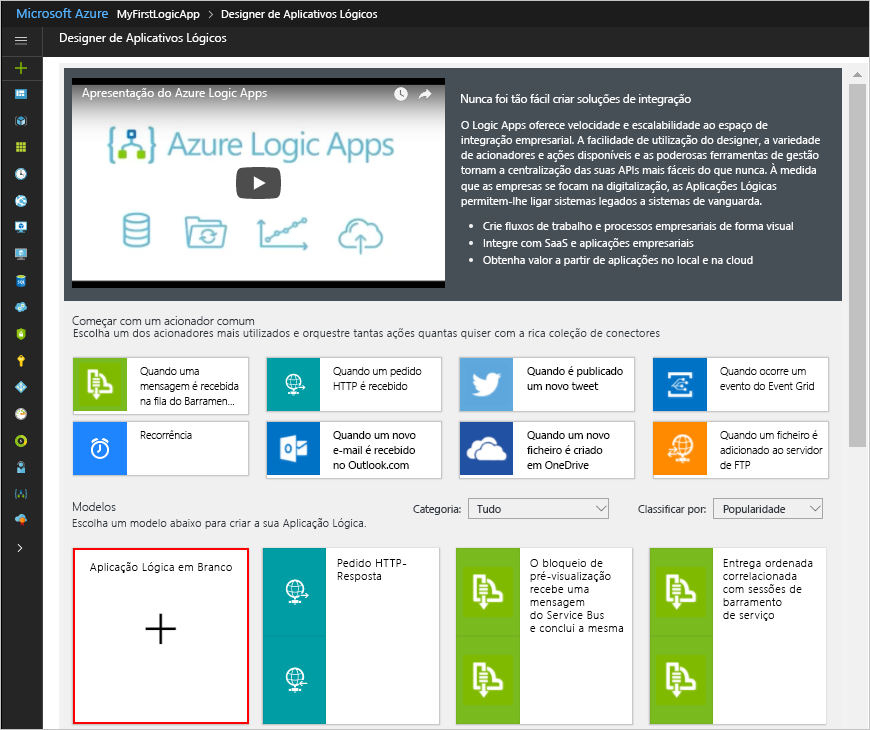

# <a name="process-emails-and-attachments-with-a-logic-app"></a>Processos e-mails e anexos com uma aplicação lógica

Aplicações lógicas do Azure ajuda a automatizar fluxos de trabalho e integrar os dados através de serviços do Azure, os serviços Microsoft, as outras aplicações do software-como-um-serviço (SaaS) e sistemas no local. Este tutorial mostra como pode criar um [aplicação lógica](../logic-apps/logic-apps-overview.md) que processa receber e-mails e quaisquer anexos. Este processos de aplicação lógica esse conteúdo, guarda o conteúdo para o armazenamento do Azure e envia notificações de revisão esse conteúdo. 

Neste tutorial, ficará a saber como:

> [!div class="checklist"]
> * Configurar [storage do Azure](../storage/common/storage-introduction.md) e Explorador de armazenamento para a verificação guardados e-mails e anexos.
> * Criar um [função do Azure](../azure-functions/functions-overview.md) HTML que remove os e-mails. Este tutorial inclui o código que pode utilizar para esta função.
> * Criar uma aplicação lógica em branco.
> * Adicione um acionador que monitoriza os e-mails para anexos.
> * Adicione uma condição que verifica se os e-mails têm anexos.
> * Adicione uma ação que chama a função do Azure, quando uma mensagem de e-mail tem de anexos.
> * Adicione uma ação que cria os blobs de armazenamento para e-mails e anexos.
> * Adicione uma ação que envia notificações por correio eletrónico.

Quando tiver terminado, a aplicação lógica aspeto este fluxo de trabalho a um alto nível:


Se não tiver uma subscrição do Azure, <a href="https://azure.microsoft.com/free/" target="_blank">inscreva-se numa conta do Azure gratuita</a> antes de começar. 

## <a name="prerequisites"></a>Pré-requisitos

* Uma conta de e-mail de um fornecedor de correio eletrónico suportado pelo Logic Apps, tais como o Outlook do Office 365, Outlook.com ou Gmail. Para outros fornecedores, [rever os conectores listam aqui](https://docs.microsoft.com/connectors/).

  Esta aplicação lógica utiliza uma conta do Outlook do Office 365. 
  Se utilizar uma conta de correio eletrónico diferente, os passos gerais permanecem o mesmo, mas a sua IU pode aparecer ligeiramente diferente.

* Transfira e instale o <a href="http://storageexplorer.com/" target="_blank">livre Explorador de armazenamento do Microsoft Azure</a>. Esta ferramenta ajuda-o a verificar que o contentor de armazenamento está corretamente configurado.

## <a name="sign-in-to-the-azure-portal"></a>Iniciar sessão no portal do Azure

Iniciar sessão para o <a href="https://portal.azure.com" target="_blank">portal do Azure</a> com as suas credenciais de conta do Azure.

## <a name="set-up-storage-to-save-attachments"></a>Configurar o armazenamento para guardar anexos

Pode guardar receber e-mails e anexos como blobs um [contentor de armazenamento do Azure](../storage/common/storage-introduction.md). 

1. Antes de poder criar um contentor de armazenamento, [criar uma conta de armazenamento](../storage/common/storage-create-storage-account.md#create-a-storage-account) com estas definições:

   | Definição | Valor | Descrição | 
   | ------- | ----- | ----------- | 
   | **Nome** | attachmentstorageacct | O nome para a sua conta de armazenamento | 
   | **Modelo de implementação** | Gestor de recursos | O [modelo de implementação](../azure-resource-manager/resource-manager-deployment-model.md) para gerir a implementação de recursos | 
   | **Tipo de conta** | Fins gerais | O [tipo de conta de armazenamento](../storage/common/storage-introduction.md#types-of-storage-accounts) | 
   | **Performance** | Standard | Esta definição especifica o suportadas os tipos de dados e suportes de dados para armazenar dados. Consulte [tipos de contas do storage](../storage/common/storage-introduction.md#types-of-storage-accounts). | 
   | **Replicação** | Armazenamento localmente redundante (LRS) | Esta definição especifica como os dados são copiados, armazenados, geridos e sincronizados. Consulte [replicação](../storage/common/storage-introduction.md#replication). | 
   | **Transferência segura necessária** | Desativado | Esta definição especifica a segurança necessária para pedidos de ligações. Consulte [requerem a transferência segura](../storage/common/storage-require-secure-transfer.md). | 
   | **Subscrição** | <*your-Azure-subscription-name*> | O nome da sua subscrição do Azure | 
   | **Grupo de recursos** | LA-Tutorial-RG | O nome para o [grupo de recursos do Azure](../azure-resource-manager/resource-group-overview.md) utilizados para organizar e gerir recursos relacionados. <p>**Nota:** existe um grupo de recursos dentro de uma região específica. Embora os itens neste tutorial poderão não estar disponível em todas as regiões, tente utilizar a mesma região sempre que possível. | 
   | **Localização** | EUA Leste 2 | A região onde pretende armazenar informações sobre a sua conta de armazenamento | 
   | **Configurar redes virtuais** | Desativado | Para este tutorial, mantenha o **desativado** definição. | 
   |||| 

   Também pode utilizar [Azure PowerShell](../storage/common/storage-quickstart-create-storage-account-powershell.md) ou [CLI do Azure](../storage/common/storage-quickstart-create-storage-account-cli.md).
  
2. Depois de Azure implementa a sua conta do storage, obter chave de acesso da sua conta de armazenamento:

   1. No seu armazenamento conta menu, em **definições**, escolha **chaves de acesso**. 
   2. Localizar **chave1** em **predefinido chaves** e o nome da sua conta de armazenamento.

      

   Também pode utilizar [Azure PowerShell](https://docs.microsoft.com/powershell/module/azurerm.storage/get-azurermstorageaccountkey) ou [CLI do Azure](https://docs.microsoft.com/cli/azure/storage/account/keys?view=azure-cli-latest.md#az_storage_account_keys_list). 

3. Crie um contentor de armazenamento para os anexos de e-mail.
   
   1. No menu de conta do storage, no **descrição geral** painel, escolha **Blobs** em **serviços**, em seguida, escolha **+ contentor**.

   2. Introduza "os anexos" como o nome do contentor. Em **nível de acesso público**, selecione **contentor (acesso de leitura anónimo para contentores e blobs)**e escolha **OK**.

   Também pode utilizar [Azure PowerShell](https://docs.microsoft.com/powershell/module/azure.storage/new-azurestoragecontainer), ou [CLI do Azure](https://docs.microsoft.com/cli/azure/storage/container?view=azure-cli-latest#az_storage_container_create). 
   Quando tiver terminado, pode encontrar o contentor de armazenamento na sua conta de armazenamento aqui no portal do Azure:

   

Em seguida, ligue o Explorador de armazenamento à sua conta de armazenamento.

## <a name="set-up-storage-explorer"></a>Configurar o Explorador de armazenamento

Agora, estabelecer a ligação Explorador de armazenamento à sua conta de armazenamento para que possa confirmar que a sua aplicação lógica corretamente guarda anexos que os blobs no contentor de armazenamento.

1. Abra o Explorador de armazenamento do Microsoft Azure. Quando o Explorador de armazenamento pede-lhe uma ligação ao armazenamento do Azure, escolha **utilizar um nome de conta de armazenamento e a chave** > **seguinte**.
Não se aparecer nenhum aviso, escolha **adicionar conta** na barra de ferramentas explorer.

2. Em **anexar com o nome e chave**, introduza o nome da sua conta de armazenamento e a chave de acesso que guardou anteriormente. Escolha **seguinte** > **ligar**.

3. Verifique se a conta de armazenamento e de contentores são apresentados corretamente no Explorador de armazenamento:

   1. Em **Explorer**, expanda **(locais e anexadas)** > 
    **contas do Storage** > **attachmentstorageaccount** > 
    **Contentores de BLOBs**.

   2. Certifique-se de que o contentor "anexos" aparece. 
   Por exemplo:

      

Em seguida, crie um [função do Azure](../azure-functions/functions-overview.md) HTML que remove receber correio eletrónico.

## <a name="create-a-function-to-clean-html"></a>Criar uma função para limpar HTML

Agora, utilize o fragmento de código fornecido por estes passos para criar uma função do Azure que remove o e-mail cada entrada HTML. Dessa forma, o conteúdo de e-mail é limpeza e mais fáceis de processo. Em seguida, pode chamar esta função da sua aplicação lógica.

1. Antes de poder criar uma função, [criar uma aplicação de função](../azure-functions/functions-create-function-app-portal.md) com estas definições:

   | Definição | Valor | Descrição | 
   | ------- | ----- | ----------- | 
   | **Nome da aplicação**  | CleanTextFunctionApp | Um nome globalmente único e descritivo para a sua aplicação de função | 
   | **Subscrição** | <*your-Azure-subscription-name*> | A mesma subscrição do Azure que utilizou anteriormente | 
   | **Grupo de Recursos** | LA-Tutorial-RG | O mesmo grupo de recursos do Azure que utilizou anteriormente | 
   | **Plano de alojamento** | Plano de Consumo | Esta definição determina como alocar e recursos de escala, por exemplo, energia, para executar a sua aplicação de função de computação. Consulte [alojamento planos de comparação](../azure-functions/functions-scale.md). | 
   | **Localização** | EUA Leste 2 | A mesma região que utilizou anteriormente | 
   | **Armazenamento** | cleantextfunctionstorageacct | Crie uma conta de armazenamento para a sua aplicação de função. Utilize apenas letras minúsculas e números. <p>**Nota:** esta conta de armazenamento contém as aplicações de função e é diferente da sua conta de armazenamento criado anteriormente para anexos de e-mail. | 
   | **Application Insights** | Desativado | Ativa a monitorização de aplicações com [Application Insights](../application-insights/app-insights-overview.md), mas para este tutorial, mantenha o **desativar** definição. | 
   |||| 

   Se a sua aplicação de função não abrir automaticamente após a implementação, localizar a sua aplicação no <a href="https://portal.azure.com" target="_blank">portal do Azure</a>. No menu principal do Azure, escolha **serviços aplicacionais**e selecione a sua aplicação de função.

   

   Se **serviços aplicacionais** não são apresentados no menu do Azure, aceda a **mais serviços** em vez disso. Na caixa de pesquisa, localize e selecione **aplicações de função**. Para obter mais informações, consulte [criar a sua função](../azure-functions/functions-create-first-azure-function.md).

   Também pode utilizar [CLI do Azure](../azure-functions/functions-create-first-azure-function-azure-cli.md), ou [modelos do PowerShell e do Resource Manager](../azure-resource-manager/resource-group-template-deploy.md).

2. Em **aplicações de função**, expanda **CleanTextFunctionApp**e selecione **funções**. Na barra de ferramentas funções, escolha **+ nova função**.

   

3. Em **escolher um modelo abaixo ou vá para o guia de introdução**, selecione o **HttpTrigger - c#** modelo de função.

   

4. Em **nome da função**, introduza ```RemoveHTMLFunction```. Em **acionador HTTP** > **nível de autorização**, mantenha a predefinição **função** valor e escolha **criar**.

   

5. Depois de abre o editor, substitua o código de modelo com este código, o que remove o HTML e devolve resultados para o autor da chamada:

   ``` CSharp
   using System.Net;
   using System.Text.RegularExpressions;

   public static async Task<HttpResponseMessage> Run(HttpRequestMessage req, TraceWriter log)
   {
      log.Info($"HttpWebhook triggered");

      // Parse query parameter
      string emailBodyContent = await req.Content.ReadAsStringAsync();

      // Replace HTML with other characters
      string updatedBody = Regex.Replace(emailBodyContent, "<.*?>", string.Empty);
      updatedBody = updatedBody.Replace("\\r\\n", " ");
      updatedBody = updatedBody.Replace(@"&nbsp;", " ");

      // Return cleaned text
      return req.CreateResponse(HttpStatusCode.OK, new { updatedBody });

   }
   ```

6. Quando tiver terminado, escolha **guardar**. Para testar a sua função, escolha **testar** na seta (**<**) ícone na margem direita do editor. 

   

7. No **teste** painel, em **corpo do pedido**, introduza esta linha e escolha **executar**.

   ```json
   {"name": "<p><p>Testing my function</br></p></p>"}
   ```

   

   O **saída** janela mostra este resultado da função:

   ```json
   {"updatedBody":"{\"name\": \"Testing my function\"}"}
   ```

Após verificar que a sua função funciona, crie a sua aplicação lógica. Embora este tutorial mostra como criar uma função de HTML que remove os e-mails, as Logic Apps também tem um **HTML para texto** conector.

## <a name="create-your-logic-app"></a>Criar a sua aplicação lógica

1. No menu principal do Azure, escolha **novo** > **integração empresarial com** > **aplicação lógica**.

   

2. Em **Criar aplicação de lógica**, forneça estas informações sobre a sua aplicação lógica, como mostrado e descrito. Quando tiver terminado, escolha **Afixar ao dashboard** > **Criar**.

   

   | Definição | Valor | Descrição | 
   | ------- | ----- | ----------- | 
   | **Nome** | LA-ProcessAttachment | O nome para a sua aplicação lógica | 
   | **Subscrição** | <*your-Azure-subscription-name*> | A mesma subscrição do Azure que utilizou anteriormente | 
   | **Grupo de recursos** | LA-Tutorial-RG | O mesmo grupo de recursos do Azure que utilizou anteriormente |
   | **Localização** | EUA Leste 2 | A mesma região que utilizou anteriormente | 
   | **Log Analytics** | Desativado | Para este tutorial, mantenha o **desativar** definição. | 
   |||| 

3. Depois de Azure implementa a aplicação, o Designer de aplicações lógica abre e apresenta uma página com uma introdução em vídeo e modelos para padrões comuns da aplicação lógica. Em **Modelos**, escolha **Aplicação Lógica em Branco**.

   

Em seguida, adicione um [acionador](../logic-apps/logic-apps-overview.md#logic-app-concepts) que escuta para receber e-mails com anexos. Cada aplicação lógica tem de começar com um acionador, o que acontece é desencadeado quando um evento específico ou quando novos dados cumprem uma condição específica. Para obter mais informações, consulte [criar a sua primeira aplicação de lógica](../logic-apps/quickstart-create-first-logic-app-workflow.md).

## <a name="monitor-incoming-email"></a>Monitorizar a receber correio eletrónico

1. No estruturador, introduza "quando os e-mails são recebidos" na caixa de pesquisa. Selecione este acionador para o seu fornecedor de e-mail:  **< *fornecedor o e-mail*> - quando um novo e-mail chega**, por exemplo:

   

   * Relativamente a contas escolares ou profissionais do Azure, selecione Office 365 Outlook (Outlook do Office 365). 
   * Quanto a contas Microsoft pessoais, selecione Outlook.com. 

2. Se estiver a pedido de credenciais, inicie sessão na sua conta de e-mail para que as Logic Apps possam ligar à sua conta de e-mail.

3. Fornece os critérios que utiliza o acionador para filtrar correio eletrónico de novo.

   1. Especifique a pasta, intervalo e frequência para a verificação de mensagens de correio eletrónico.

      

      | Definição | Valor | Descrição | 
      | ------- | ----- | ----------- | 
      | **Pasta** | Pasta a receber | A pasta de correio eletrónico para verificar | 
      | **Interval** | 1 | O número de intervalos de espera entre as verificações | 
      | **Frequência** | Minuto | Verifica a unidade de tempo para cada intervalo entre | 
      |  |  |  | 
  
   2. Escolha **Mostrar opções avançadas** e especificar estas definições:

      | Definição | Valor | Descrição | 
      | ------- | ----- | ----------- | 
      | **Possui anexo** | Sim | Obter apenas os e-mails com anexos. <p>**Nota:** o acionador não remove quaisquer mensagens de correio eletrónico da sua conta, a verificação apenas novas mensagens e processamento apenas mensagens de correio eletrónico que correspondem ao filtro do requerente. | 
      | **Incluir anexos** | Sim | Obter os anexos como entrada para o fluxo de trabalho, em vez de procurar apenas anexos. | 
      | **Filtro de assunto** | ```Business Analyst 2 #423501``` | O texto a localizar no assunto do e-mail | 
      |  |  |  | 

4. Para ocultar os detalhes do accionador por agora, clique no interior da barra de título o acionador.

   

5. Guarde a sua aplicação lógica. Na barra de ferramentas do estruturador, escolha **Guardar**.

   A aplicação lógica está agora em direto mas não nada outros verificar a sua e-mails. 
   Em seguida, adicione uma condição que especifique critérios para continuar o fluxo de trabalho.

## <a name="check-for-attachments"></a>Verifique a existência de anexos

1. Sob o acionador, escolha **+ novo passo** > **adicionar uma condição**.

   Quando a forma de condição for apresentada, por predefinição, a lista de parâmetros ou a lista de conteúdo dinâmica é apresentado e mostra todos os parâmetros do passo anterior, que pode incluir como entradas de fluxo de trabalho. 
   A largura do seu browser determina que lista aparece.

2. Mudar o nome da condição com uma descrição melhor.

   1. Na barra de título a condição, escolha **reticências** (**...** ) botão > **mudar o nome**.

      Por exemplo, se o seu browser está na vista estreito:

      

      Se o seu browser está na vista ampla e a lista de conteúdo dinâmico bloquear o acesso para o botão de reticências, feche a lista ao escolher **adicionar conteúdo dinâmico** dentro a condição. 
      
      

   2. Mudar o nome da condição com esta descrição:```If email has attachments and key subject phrase```

3. Descrevem a condição, fornecendo uma expressão. 

   1. Dentro de forma a condição, escolha **editar no modo avançado**.

      

   2. Na caixa de texto, introduza esta expressão:

      ```@equals(triggerBody()?['HasAttachment'], bool('true'))```

      Esta expressão compara o **HasAttachment** valor da propriedade do corpo do acionador, que é o e-mail neste tutorial, com o objeto booleano ```True```. 
      Se ambos os valores são iguais, a mensagem de e-mail tem pelo menos um anexo, transmite condição, e continua o fluxo de trabalho.

      A condição agora parece que este exemplo:

      

   3. Escolha **editar no modo básico**. A expressão agora resolve conforme mostrado aqui:

      

      > [!NOTE]
      > Para criar manualmente uma expressão, tem de funcionar no modo de básico e tiverem a lista dinâmica de abrir, de modo a que possa trabalhar com o construtor de expressão. Em **expressão**, pode selecionar as funções. Em **conteúdo dinâmico**, pode selecionar os campos de parâmetro a utilizar essas funções.
      > Este tutorial mostra mais tarde como manualmente compilar expressões.

4. Guarde a sua aplicação lógica.

### <a name="test-your-condition"></a>Testar a condição

Agora, pode teste se a condição funciona corretamente:

1. Se a sua aplicação lógica não está já em execução, escolha **executar** na barra de ferramentas estruturador.

   Este passo manualmente inicia a sua aplicação lógica sem ter de aguardar até que transmite o intervalo especificado. 
   No entanto, nada acontece até que o e-mail de teste chega na pasta a receber. 

2. Se envie uma mensagem de e-mail que cumpra estes critérios:

   * Assunto do e-mail tem o texto que especificou no acionador **filtro requerente**:```Business Analyst 2 #423501```

   * Correio eletrónico tem um anexo. 
   Por agora, crie um ficheiro de texto vazia e anexar esse ficheiro para o seu correio eletrónico.

   Quando os e-mails são recebidos, a aplicação lógica verifica a existência de anexos e o texto do requerente especificado.
   Se a condição ser aprovado, o acionador desencadeado e faz com que o motor de Logic Apps criar uma instância de aplicação lógica e iniciar o fluxo de trabalho. 

3. Para verificar que o desencadeou o acionador e a aplicação lógica foi executada com êxito, no menu de aplicação lógica, escolha **descrição geral**.

   

   Se a sua aplicação lógica não acionar ou executar, apesar de um acionador com êxito, consulte o artigo [resolver problemas da aplicação lógica](../logic-apps/logic-apps-diagnosing-failures.md).

Em seguida, definir as ações o **se for verdadeiro** ramo. Para guardar o e-mail, juntamente com quaisquer anexos, remova qualquer HTML do corpo da mensagem, em seguida, criar os blobs no contentor de armazenamento para o e-mail e anexos.

> [!NOTE]
> A aplicação lógica não têm de fazer nada, uma o **se for FALSO** sucursal quando uma mensagem de e-mail não tem os anexos. Como um exercício bónus depois de concluir este tutorial, pode adicionar qualquer ação adequada que pretende efetuar a **se for FALSO** ramo.

## <a name="call-the-removehtmlfunction"></a>Chamar o RemoveHTMLFunction

1. No menu de aplicação lógica, escolha **Designer de aplicação lógica**. No **se for verdadeiro** sucursal, escolha **adicionar uma ação**.

2. Procure "as funções do azure" e selecionar esta ação: **das funções do Azure – escolha de uma função do Azure**

   

3. Selecione a sua aplicação de função criado anteriormente: **CleanTextFunctionApp**

   

4. Agora, selecione a função: **RemoveHTMLFunction**

   

5. Mudar o nome a forma da função com esta descrição:```Call RemoveHTMLFunction to clean email body``` 

6. A forma da função, introduza a entrada para a função processar. Especifique o corpo de e-mail como mostrado e descrito aqui:

   

   1. Em **corpo do pedido**, introduza este texto: 
   
      ```{ "emailBody": ``` 

      Depois de concluir esta entrada nos passos, aparece um erro sobre JSON inválido.
      Quando anteriormente testado esta função, a entrada especificada para esta função utilizada JavaScript Object Notation (JSON). 
      Por isso, o corpo do pedido tem de utilizar o mesmo formato demasiado. 

   2. Na lista de parâmetros ou a lista de conteúdo dinâmica, selecione o **corpo** campo em **quando chega um novo e-mail**.
   Depois do **corpo** campo, adicione a chaveta de fecho:```}```

      

      A definição da aplicação lógica, esta entrada é apresentado neste formato:

      ```{ "emailBody": "@triggerBody()?['Body']" }```

7. Guarde a sua aplicação lógica.

Em seguida, adicione uma ação que cria um blob no contentor de armazenamento para guardar o corpo da mensagem.

## <a name="create-blob-for-email-body"></a>Criar o blob para o corpo da mensagem

1. Sob a forma da função do Azure, escolha **adicionar uma ação**. 

2. Em **escolher uma ação**, procure "blob" e selecionar esta ação: **o Blob Storage do Azure – criar blob**

   

3. Se não tiver uma ligação a uma conta de armazenamento do Azure, crie uma ligação à sua conta de armazenamento com estas definições como o mostrado e descrito aqui. Quando tiver terminado, escolha **criar**.

   

   | Definição | Valor | Descrição | 
   | ------- | ----- | ----------- | 
   | **Nome da Ligação** | AttachmentStorageConnection | Um nome descritivo para a ligação | 
   | **Conta de armazenamento** | attachmentstorageacct | O nome da conta do storage que criou anteriormente para guardar anexos | 
   |||| 

4. Mudar o nome de **criar blob** ação com esta descrição:```Create blob for email body```

5. No **criar blob** ação, fornecer esta informação e selecione estes parâmetros para criar o blob, como mostrado e descritas:

   

   | Definição | Valor | Descrição | 
   | ------- | ----- | ----------- | 
   | **Caminho da pasta** | /Attachments | O caminho e nome do contentor que criou anteriormente. Também pode procurar e selecione um contentor. | 
   | **Nome do blob** | **De** campo | Passar o nome do remetente de e-mail como nome do blob. Na lista de parâmetros ou lista de conteúdo dinâmica, selecione **de** em **quando chega um novo e-mail**. | 
   | **Conteúdo de blob** | **Conteúdo** campo | Passar no corpo do e-mail HTML-livre como o conteúdo de blob. Na lista de parâmetros ou lista de conteúdo dinâmica, selecione **corpo** em **chamar RemoveHTMLFunction para limpar o corpo da mensagem**. |
   |||| 

6. Guarde a sua aplicação lógica. 

### <a name="check-attachment-handling"></a>Verifique o processamento de anexos

Agora teste se a sua aplicação lógica processa mensagens de correio eletrónico da forma que especificou:

1. Se a sua aplicação lógica não está já em execução, escolha **executar** na barra de ferramentas estruturador.

2. Se envie uma mensagem de e-mail que cumpra estes critérios:

   * Assunto do e-mail tem o texto que especificou no acionador **filtro requerente**:```Business Analyst 2 #423501```

   * Correio eletrónico tem pelo menos um anexo. 
   Por agora, crie um ficheiro de texto vazia e anexar esse ficheiro para o seu correio eletrónico.

   * Correio eletrónico tem algum conteúdo de teste no corpo do, por exemplo: 

     ```
     Testing my logic app
     ```

   Se a sua aplicação lógica não acionar ou executar, apesar de um acionador com êxito, consulte o artigo [resolver problemas da aplicação lógica](../logic-apps/logic-apps-diagnosing-failures.md).

3. Certifique-se de que a sua aplicação lógica guardados o e-mail para o contentor de armazenamento correta. 

   1. No Explorador de armazenamento, expanda **(locais e anexadas)** > 
    **contas do Storage** > **attachmentstorageacct (externo)** > 
    **Contentores de BLOBs** > **anexos**.

   2. Verifique o **anexos** contentor para o correio eletrónico. 

      Neste momento, apenas o e-mail é apresentado no contentor porque a aplicação lógica não processar ainda os anexos.

      

   3. Quando tiver terminado, elimine o e-mail no Explorador de armazenamento.

4. Opcionalmente, para testar o **se for FALSO** ramo, que does nothing neste momento, pode enviar uma mensagem de e-mail que não cumpre os critérios.

Em seguida, adicione um ciclo para processar todos os anexos de e-mail.

## <a name="process-attachments"></a>Processo de anexos

Esta aplicação lógica utiliza um **para cada** ciclo para processar cada anexo numa mensagem de correio eletrónico.

1. Sob o **criar blob para o corpo da mensagem** formam, escolha **... Mais**e selecione este comando: **adicionar um para cada**

   

2. Mudar o nome do seu ciclo com esta descrição:```For each email attachment```

3. Agora, especifique os dados do ciclo de processamento. Clique no interior do **selecionar uma saída dos passos anteriores** caixa. Na lista de parâmetros ou a lista de conteúdo dinâmica, selecione **anexos**. 

   

   O **anexos** campo passa uma matriz que contém todos os anexos incluídos com uma mensagem de e-mail. 
   O **para cada** ciclo repete ações em cada item que é transmitido com a matriz.

4. Guarde a sua aplicação lógica.

Em seguida, adicione a ação que guarda cada anexo como um blob na sua **anexos** contentor de armazenamento.

## <a name="create-blobs-for-attachments"></a>Criar blobs para anexos

1. No **para cada** cíclicas, escolha **adicionar uma ação** , pelo que pode especificar a tarefa para executar em cada anexo encontrado.

   

2. Em **escolher uma ação**, procure "blob", em seguida, selecione esta ação: **o Blob Storage do Azure – criar blob**

   

3. Mudar o nome de **blob criar 2** ação com esta descrição:```Create blob for each email attachment```

4. No **blob criar para cada anexo de correio eletrónico** ação, fornecer esta informação e selecione os parâmetros para criar cada blob como mostrado e descritas:

   

   | Definição | Valor | Descrição | 
   | ------- | ----- | ----------- | 
   | **Caminho da pasta** | /Attachments | O caminho e nome do contentor que criou anteriormente. Também pode procurar e selecione um contentor. | 
   | **Nome do blob** | **Nome** campo | Na lista de parâmetros ou lista de conteúdo dinâmica, selecione **nome** para transmitir o nome do anexo para o nome do blob. | 
   | **Conteúdo de blob** | **Conteúdo** campo | Na lista de parâmetros ou lista de conteúdo dinâmica, selecione **conteúdo** para transmitir o conteúdo de anexo para o conteúdo de blob. |
   |||| 

5. Guarde a sua aplicação lógica. 

### <a name="check-attachment-handling"></a>Verifique o processamento de anexos

Em seguida, teste se a sua aplicação lógica processa os anexos de forma que especificou:

1. Se a sua aplicação lógica não está já em execução, escolha **executar** na barra de ferramentas estruturador.

2. Se envie uma mensagem de e-mail que cumpra estes critérios:

   * Assunto do e-mail tem o texto que especificou no acionador **filtro requerente**:```Business Analyst 2 #423501```

   * Correio eletrónico tem, pelo menos, dois anexos. 
   Por agora, crie dois ficheiros de texto vazio e ligar esses ficheiros ao seu e-mail.

   Se a sua aplicação lógica não acionar ou executar, apesar de um acionador com êxito, consulte o artigo [resolver problemas da aplicação lógica](../logic-apps/logic-apps-diagnosing-failures.md).

3. Certifique-se de que a sua aplicação lógica guardado o e-mail e anexos para o contentor de armazenamento correta. 

   1. No Explorador de armazenamento, expanda **(locais e anexadas)** > 
    **contas do Storage** > **attachmentstorageacct (externo)** > 
    **Contentores de BLOBs** > **anexos**.

   2. Verifique o **anexos** contentor para o e-mail e os anexos.

      

   3. Quando tiver terminado, elimine o e-mail e anexos no Explorador de armazenamento.

Em seguida, adicione uma ação para que a sua aplicação lógica envia e-mail para rever os anexos.

## <a name="send-email-notifications"></a>Enviar notificações por e-mail

1. No **se for verdadeiro** sucursal, no **para cada anexo de correio eletrónico** cíclicas, escolha **adicionar uma ação**. 

   

2. Em **escolher uma ação**, procure "enviar e-mail", em seguida, selecione a ação "enviar correio eletrónico" para o fornecedor de e-mail que quiser. Para filtrar a lista de ações para um serviço específico, pode selecionar o conector pela primeira vez em **conectores**.

   

   * Relativamente a contas escolares ou profissionais do Azure, selecione Office 365 Outlook (Outlook do Office 365). 
   * Quanto a contas Microsoft pessoais, selecione Outlook.com. 

3. Se estiver a pedido de credenciais, inicie sessão na sua conta de e-mail para que as Logic Apps cria uma ligação à sua conta de e-mail.

4. Mudar o nome de **enviar um e-mail** ação com esta descrição:```Send email for review```

5. Forneça as informações para esta ação e selecionar os campos que pretende incluir na mensagem de correio eletrónico como mostrado e descrito. Para adicionar linhas em branco a uma caixa de edição, prima Shift + Enter.  

   Por exemplo, se estiver a trabalhar com a lista de conteúdo dinâmica:

   

   Se não conseguir encontrar um campo esperado na lista, selecione **ver mais** junto a **quando chega um novo e-mail** na lista de conteúdo dinâmica ou no final da lista de parâmetros.

   | Definição | Valor | Notas | 
   | ------- | ----- | ----- | 
   | **Para** | <*recipient-email-address*> | Para fins de teste, pode utilizar o seu próprio endereço de e-mail. | 
   | **Assunto**  | ```ASAP - Review applicant for position: ```**Requerente** | Assunto do e-mail que pretende incluir. Na lista de parâmetros ou lista de conteúdo dinâmica, selecione o **requerente** campo em **quando chega um novo e-mail**. | 
   | **Corpo** | ```Please review new applicant:``` <p>```Applicant name: ```**Do** <p>```Application file location: ```**Caminho** <p>```Application email content: ```**Corpo** | O conteúdo do corpo da mensagem. Na lista de parâmetros ou lista de conteúdo dinâmica, selecione estes campos: <p>-O **de** campo em **quando chega um novo e-mail** </br>-O **caminho** campo em **criar blob para o corpo da mensagem** </br>-O **corpo** campo em **chamar RemoveHTMLFunction para limpar o corpo da mensagem** | 
   |||| 

   Se ocorrer selecionar um campo que contém uma matriz, tais como **conteúdo**, que é uma matriz que contenha os anexos, o estruturador adiciona automaticamente um ciclo "para cada" em torno a ação que faça referência a esse campo. 
   Desta forma, a sua aplicação lógica pode realizar essa ação em cada item da matriz. 
   Para remover o ciclo, remova o campo para a matriz, mover a ação de referência para fora do ciclo, selecione as reticências (**...** ) no título do ciclo barra e escolha **eliminar**.
     
6. Guarde a sua aplicação lógica. 

Em seguida, teste a sua aplicação lógica, que agora é semelhante a este exemplo:


## <a name="run-your-logic-app"></a>Execute a sua aplicação lógica

1. Se envie uma mensagem de e-mail que cumpra estes critérios:

   * Assunto do e-mail tem o texto que especificou no acionador **filtro requerente**:```Business Analyst 2 #423501```

   * Tem o seu e-mail de anexos de uma ou mais. 
   Pode reutilizar um ficheiro de texto vazio do teste anterior. 
   Num cenário mais realistas, anexe um ficheiro de retoma.

   * O corpo da mensagem tem este texto, o que pode copiar e colar:

     ```
     Name: Jamal Hartnett   
     
     Street address: 12345 Anywhere Road   
     
     City: Any Town   
     
     State or Country: Any State   
     
     Postal code: 00000   
     
     Email address: jamhartnett@outlook.com   
     
     Phone number: 000-000-0000   
     
     Position: Business Analyst 2 #423501   

     Technical skills: Dynamics CRM, MySQL, Microsoft SQL Server, JavaScript, Perl, Power BI, Tableau, Microsoft Office: Excel, Visio, Word, PowerPoint, SharePoint, and Outlook   

     Professional skills: Data, process, workflow, statistics, risk analysis, modeling; technical writing, expert communicator and presenter, logical and analytical thinker, team builder, mediator, negotiator, self-starter, self-managing  
     
     Certifications: Six Sigma Green Belt, Lean Project Management   
     
     Language skills: English, Mandarin, Spanish   
     
     Education: Master of Business Administration   
     ```

2. Execute a sua aplicação lógica. Se tiver êxito, a aplicação lógica envia uma mensagem de e-mail que se pareça com este exemplo:

   

   Se não obtiver quaisquer mensagens de correio eletrónico, verifique a pasta lixo do seu e-mail. 
   O filtro de lixo de correio eletrónico pode redirecionar estes tipos de mensagens de correio eletrónico. 
   Caso contrário, se não tiver a certeza de que a aplicação lógica foi executada corretamente, veja [Troubleshoot your logic app](../logic-apps/logic-apps-diagnosing-failures.md) (Resolver problemas da sua aplicação lógica).

Parabéns, ter agora criado e executar uma aplicação lógica que automatiza tarefas entre os diferentes serviços do Azure e chama algum código personalizado.

## <a name="clean-up-resources"></a>Limpar recursos

Quando já não é necessário, elimine o grupo de recursos que contém a sua aplicação lógica e os recursos relacionados. No menu principal do Azure, aceda a **grupos de recursos**e selecione o grupo de recursos para a sua aplicação lógica. Escolha **eliminar grupo de recursos**. Introduza o nome do grupo de recursos como confirmação e escolha **eliminar**.


## <a name="get-support"></a>Obter suporte

* Relativamente a dúvidas, visite o [fórum do Azure Logic Apps](https://social.msdn.microsoft.com/Forums/en-US/home?forum=azurelogicapps).
* Para submeter ou votar em ideias para funcionalidades, visite o [site de comentários dos utilizadores do Logic Apps](http://aka.ms/logicapps-wish).

## <a name="next-steps"></a>Passos Seguintes

Neste tutorial, criou uma aplicação lógica que processa e armazena os anexos de e-mail através da integração de serviços do Azure, como o Storage do Azure e as funções do Azure. Agora, saiba mais sobre outros conectores que pode utilizar para criar logic apps.

> [!div class="nextstepaction"]
> [Saiba mais sobre os conectores para aplicações lógicas](../connectors/apis-list.md)