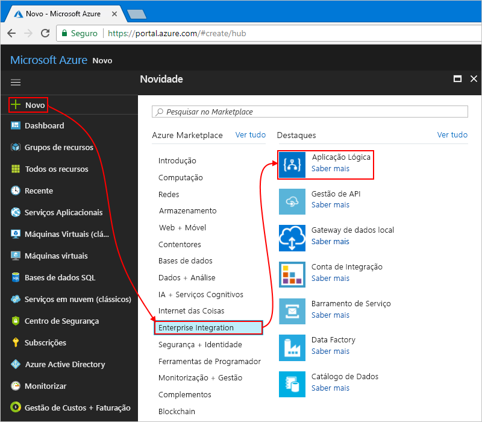

# <a name="manage-mailing-list-requests-with-a-logic-app"></a>Gerir pedidos de lista de mailing com uma aplicação lógica

Aplicações lógicas do Azure ajuda a automatizar fluxos de trabalho e integrar os dados através de serviços do Azure, os serviços Microsoft, as outras aplicações do software-como-um-serviço (SaaS) e sistemas no local. Este tutorial mostra como pode criar um [aplicação lógica](../logic-apps/logic-apps-overview.md) que processa os pedidos de subscrição para obter uma lista de mailing geridos pelo [MailChimp](https://mailchimp.com/) serviço.
Esta aplicação lógica monitoriza uma conta de e-mail para esses pedidos, envia estes pedidos de aprovação e adiciona os membros aprovados à lista mailing.

Neste tutorial, ficará a saber como:

> [!div class="checklist"]
> * Criar uma aplicação lógica em branco.
> * Adicione um acionador que monitoriza os e-mails para pedidos de subscrição.
> * Adicione uma ação que envia mensagens de correio eletrónico para aprovar ou rejeitar estes pedidos.
> * Adicione uma condição que verifica a resposta de aprovação.
> * Adicione uma ação que adiciona os membros aprovados à lista mailing.
> * Adicione uma condição que verifica se estes membros associados com êxito a lista.
> * Adicione uma ação que envia mensagens de correio eletrónico confirmar se estes membros associados com êxito a lista.

Quando tiver terminado, a aplicação lógica aspeto este fluxo de trabalho a um alto nível:


Se não tiver uma subscrição do Azure, <a href="https://azure.microsoft.com/free/" target="_blank">inscreva-se numa conta do Azure gratuita</a> antes de começar.

## <a name="prerequisites"></a>Pré-requisitos

* Uma conta do MailChimp. Crie uma lista com o nome de "teste-membros-ML" em que a aplicação lógica pode adicionar endereços de correio eletrónico para os membros aprovados. Se não tiver uma conta, [inscrever-se numa conta gratuita](https://login.mailchimp.com/signup/) e saiba [como criar uma lista](https://us17.admin.mailchimp.com/lists/#). 

* Uma conta de e-mail com o Outlook do Office 365 ou Outlook.com, que suporta fluxos de trabalho de aprovação. Este artigo utiliza o Outlook do Office 365. Se utilizar uma conta de correio eletrónico diferente, os passos gerais permanecem o mesmo, mas a sua IU pode aparecer ligeiramente diferente.

## <a name="sign-in-to-the-azure-portal"></a>Iniciar sessão no portal do Azure

Iniciar sessão para o <a href="https://portal.azure.com" target="_blank">portal do Azure</a> com as suas credenciais de conta do Azure.

## <a name="create-your-logic-app"></a>Criar a sua aplicação lógica

1. No menu principal do Azure, escolha **Nova** > **Integração Empresarial** > **Aplicação Lógica**.

   

2. Em **Criar aplicação de lógica**, forneça estas informações sobre a sua aplicação lógica, como mostrado e descrito. Quando tiver terminado, escolha **Afixar ao dashboard** > **Criar**.

   

   | Definição | Valor | Descrição | 
   | ------- | ----- | ----------- | 
   | **Nome** | LA-MailingList | O nome para a sua aplicação lógica | 
   | **Subscrição** | <*your-Azure-subscription-name*> | O nome da sua subscrição do Azure | 
   | **Grupo de recursos** | LA-MailingList-RG | O nome para o [grupo de recursos do Azure](../azure-resource-manager/resource-group-overview.md) utilizados para organizar os recursos relacionados | 
   | **Localização** | EUA Leste 2 | A região onde pretende armazenar informações sobre a sua aplicação lógica | 
   | **Log Analytics** | Desativado | Manter o **desativar** a definição de registo de diagnóstico. | 
   |||| 

3. Depois de Azure implementa a aplicação, o Designer de aplicações lógica abre e apresenta uma página com uma introdução em vídeo e modelos para padrões comuns da aplicação lógica. Em **Modelos**, escolha **Aplicação Lógica em Branco**.

   

Em seguida, adicione um [acionador](../logic-apps/logic-apps-overview.md#logic-app-concepts) que escuta de correio eletrónico recebidos com pedidos de subscrição.
Cada aplicação lógica tem de começar com um acionador, o que acontece é desencadeado quando um evento específico ou quando novos dados cumprem uma condição específica. Para obter mais informações, consulte [criar a sua primeira aplicação de lógica](../logic-apps/quickstart-create-first-logic-app-workflow.md).

## <a name="add-trigger-to-monitor-emails"></a>Adicionar acionador para monitorizar as mensagens de correio eletrónico

1. No estruturador, introduza "quando os e-mails são recebidos" na caixa de pesquisa. Selecione o acionador para o seu fornecedor de e-mail:  **< *fornecedor o e-mail*> - quando é recebido um novo e-mail**
   
   

   * Relativamente a contas escolares ou profissionais do Azure, selecione Office 365 Outlook (Outlook do Office 365).
   * Quanto a contas Microsoft pessoais, selecione Outlook.com.

2. Se estiver a pedido de credenciais, inicie sessão na sua conta de e-mail para que as Logic Apps podem criar uma ligação à sua conta de e-mail.

3. Agora, especifique os critérios que verifica o acionador em todos os e-mails de novo.

   1. Especifique a pasta, intervalo e frequência para a verificação de mensagens de correio eletrónico.

      

      | Definição | Valor | Descrição | 
      | ------- | ----- | ----------- | 
      | **Pasta** | Pasta a receber | A pasta de correio eletrónico para monitorizar | 
      | **Interval** | 1 | O número de intervalos de espera entre as verificações | 
      | **Frequência** | Hora | Verifica a unidade de tempo para cada intervalo entre  | 
      |  |  |  | 

   2. Escolha **Mostrar opções avançadas**. No **requerente filtro** box, introduza este texto para o acionador encontrar no assunto do e-mail:```subscribe-test-members-ML```

      

4. Para ocultar os detalhes do accionador por agora, clique na barra de título o acionador.

   

5. Guarde a sua aplicação lógica. Na barra de ferramentas do estruturador, escolha **Guardar**.

   A aplicação lógica está agora em direto, mas não faz nada diferente verificação receber correio eletrónico. 
   Por isso, adicione uma ação que responde quando o acionador é acionado.

## <a name="send-approval-email"></a>Enviar mensagem de e-mail de aprovação

Agora que tem um acionador, adicione um [ação](../logic-apps/logic-apps-overview.md#logic-app-concepts) que envia uma mensagem de e-mail para aprovar ou rejeitar o pedido. 

1. Sob o acionador, escolha **+ novo passo** > **adicionar uma ação**. Procure "aprovação" e selecionar esta ação:  **< *fornecedor o e-mail*>-enviar e-mail de aprovação**

   

2. Fornece informações para esta ação, como mostrado e descritas: 

   

   | Definição | Valor | Descrição | 
   | ------- | ----- | ----------- | 
   | **Para** | <*approver-email-address*> | Endereço de correio eletrónico o aprovador. Para fins de teste, pode utilizar o seu próprio endereço. | 
   | **Opções de utilizador** | Aprovar, Rejeitar | As opções de resposta que pode escolher o aprovador. Por predefinição, pode escolher o aprovador ou "aprovar" ou "Rejeitar" como a respetiva resposta. | 
   | **Assunto** | Aprovar pedido de membro para ML de membros de teste | Um assunto do e-mail descritivo | 
   |  |  |  | 

   Por agora, ignore o dinâmica conteúda ou lista inline parâmetro que é apresentada quando clica no interior de caixas de edição específico. 
   Esta lista permite-lhe selecionar os parâmetros do anteriores ações que pode utilizar como entradas no fluxo de trabalho. 
   A largura do seu browser determina que lista aparece. 
 
4. Guarde a sua aplicação lógica.

Em seguida, adicione uma condição para verificar resposta o aprovador de escolhida.

## <a name="check-approval-response"></a>Verificar a resposta de aprovação

1. Sob o **enviar e-mail de aprovação** ação, escolha **+ novo passo** > **adicionar uma condição**.

   É apresentada a forma de condição, juntamente com quaisquer parâmetros disponíveis que pode incluir como entrada para o fluxo de trabalho. 

2. Mudar o nome da condição com uma descrição melhor.

   1. Na barra de título a condição, escolha **reticências** (**...** ) botão > **mudar o nome**.

      Por exemplo, se o seu browser está na vista estreito:

      

      Se o seu browser está na vista ampla e a lista de conteúdo dinâmico bloquear o acesso para o botão de reticências, feche a lista ao escolher **adicionar conteúdo dinâmico** dentro a condição.

   2. Mudar o nome da condição com esta descrição:```If request approved```

3. Criar uma condição que verifica se o aprovador seleccionados **aprovar**:

   1. Dentro de condição, clique dentro da **escolha um valor** caixa, que está à esquerda (vista largas) ou na parte superior (vista estreitas).
   Na lista de parâmetros ou a lista de conteúdo dinâmica, selecione o **SelectedOption** campo em **enviar e-mail de aprovação**.

      Por exemplo, se estiver a trabalhar na vista de grande, a condição aspeto neste exemplo:

      

   2. Na caixa de operador de comparação, selecione este operador: **é igual a**

   3. O direito (wide vista) ou inferior (vista estreito) **escolha um valor** box, introduza este valor:```Approve```

      Quando tiver terminado, a condição aspeto neste exemplo:

      

4. Guarde a sua aplicação lógica.

Em seguida, especifique a ação que executa a sua aplicação lógica quando o revisor aprova o pedido. 

## <a name="add-member-to-mailchimp-list"></a>Adicionar membros à lista de MailChimp

Agora, adicione uma ação que adiciona o membro aprovado à sua lista de mailing.

1. Dentro da condição **se for verdadeiro** sucursal, escolha **adicionar uma ação**.
Procure "mailchimp" e selecionar esta ação: **MailChimp - adicionar membros à lista**

   

3. Se estiver a pedido para iniciar sessão na sua conta do MailChimp, inicie sessão com as suas credenciais do MailChimp.

4. Fornece informações para esta ação, como mostrado e descrito aqui:

   

   | Definição | Valor | Descrição | 
   | ------- | ----- | ----------- | 
   | **Id de lista** | test-members-ML | O nome da sua lista de mailing MailChimp | 
   | **Estado** | subscrito | O estado da subscrição para o novo membro. Para obter mais informações, consulte <a href="https://developer.mailchimp.com/documentation/mailchimp/guides/manage-subscribers-with-the-mailchimp-api/" target="_blank">gerir subscritores com a API do MailChimp</a>. | 
   | **Endereço de correio eletrónico** | <*new-member-email-address*> | Na lista de parâmetros ou lista de conteúdo dinâmica, selecione **de** em **quando chega um novo correio**, que passa o endereço de e-mail para o novo membro. 
   |  |  |  | 

5. Guarde a sua aplicação lógica.

Em seguida, adicione uma condição, para que possa verificar se o novo membro associado com êxito a sua lista de mailing. Dessa forma, a aplicação lógica notifica-o se esta operação é concluída com êxito ou falha.

## <a name="check-for-success-or-failure"></a>Verifique a existência de êxito ou falha

1. No **se for verdadeiro** sucursal, no **adicionar membros à lista** ação, escolha **mais...**   >  **Adicionar uma condição**.

2. Mudar o nome da condição com esta descrição:```If add member succeeded```

3. Crie uma condição que verifica se o membro aprovado com êxito ou falha na associação a sua lista de mailing:

   1. Dentro de condição, clique dentro da **escolha um valor** caixa, que está à esquerda (vista largas) ou na parte superior (vista estreitas).
   Na lista de parâmetros ou a lista de conteúdo dinâmica, selecione o **estado** campo em **adicionar membros à lista**.

      Por exemplo, se estiver a trabalhar na vista de grande, a condição aspeto neste exemplo:

      

   2. Na caixa de operador de comparação, selecione este operador: **é igual a**

   3. O direito (wide vista) ou inferior (vista estreito) **escolha um valor** box, introduza este valor:```subscribed```

   Quando tiver terminado, a condição aspeto neste exemplo:

   

Em seguida, configure as mensagens de correio eletrónico para enviar quando o membro aprovado com êxito ou falha na associação a sua lista de mailing.

## <a name="send-email-if-member-added"></a>Enviar correio eletrónico se membro adicionado

1. No **se for verdadeiro** ramo para a condição **se adicionar membro foi concluída com êxito**, escolha **adicionar uma ação**.

   

2. Procure "enviar e-mail de outlook" e selecionar esta ação:  **< *fornecedor o e-mail*>-enviar uma mensagem de e-mail**

   

3. Mudar o nome de ação com esta descrição:```Send email on success```

4. Fornece informações para esta ação, como mostrado e descritas:

   

   | Definição | Valor | Descrição | 
   | ------- | ----- | ----------- | 
   | **Para** | <*your-email-address*> | O endereço de e-mail para onde enviar o e-mail de êxito. Para fins de teste, pode utilizar o seu próprio endereço de e-mail. | 
   | **Assunto** | <*subject-for-success-email*> | O requerente para o e-mail de êxito. Para este tutorial, introduza este texto e selecione o campo especificado em **adicionar membros à lista** na lista de parâmetro ou lista de conteúdo dinâmica: <p>"Êxito! Membros adicionados à 'teste-membros-ML': **endereço de correio eletrónico**" | 
   | **Corpo** | <*body-for-success-email*> | O conteúdo do corpo do e-mail com êxito. Para este tutorial, introduza este texto e selecione os campos especificados em **adicionar membros à lista** na lista de parâmetro ou lista de conteúdo dinâmica:  <p>"Aderiu ao novo membro de 'teste-membros-ML': **endereço de correio eletrónico**"</br>"Estado de optar ativamente por participar no membro: **estado**" | 
   | | | | 

5. Guarde a sua aplicação lógica.

## <a name="send-email-if-member-not-added"></a>Enviar correio eletrónico se não adicionar membro

1. No **se for FALSO** ramo para a condição **se adicionar membro foi concluída com êxito**, escolha **adicionar uma ação**.

   

2. Procure "enviar e-mail de outlook" e selecionar esta ação:  **< *fornecedor o e-mail*>-enviar uma mensagem de e-mail**

   

3. Mudar o nome de ação com esta descrição:```Send email on failure```

4. Fornece informações para esta ação, como mostrado e descrito aqui:

   

   | Definição | Valor | Descrição | 
   | ------- | ----- | ----------- | 
   | **Para** | <*your-email-address*> | O endereço de e-mail para onde enviar o e-mail de falha. Para fins de teste, pode utilizar o seu próprio endereço de e-mail. | 
   | **Assunto** | <*subject-for-failure-email*> | O requerente para o e-mail de falha. Para este tutorial, introduza este texto e selecione o campo especificado em **adicionar membros à lista** na lista de parâmetro ou lista de conteúdo dinâmica: <p>"Falha, membro não adicionado ao 'teste-membros-ML': **endereço de correio eletrónico**" | 
   | **Corpo** | <*body-for-failure-email*> | O conteúdo do corpo do e-mail de falha. Para este tutorial, introduza este texto: <p>"Membro poderá já existir. Verifique a sua conta do MailChimp." | 
   | | | | 

5. Guarde a sua aplicação lógica. 

Em seguida, teste a sua aplicação lógica, que agora semelhante para este exemplo:

 

## <a name="run-your-logic-app"></a>Execute a sua aplicação lógica

1. Se envie um pedido de correio eletrónico para associar a sua lista de mailing.
Aguarde que o pedido a aparecer na sua pasta a receber.

3. Para iniciar manualmente a sua aplicação lógica, na barra de ferramentas do estruturador, escolha **Executar**. 

   Se o seu correio eletrónico tem um requerente que corresponde ao filtro de assunto o acionador, a sua aplicação lógica envia que e-mail para aprovar o pedido de subscrição.

4. No e-mail de aprovação, escolha **aprovar**.

5. Se o endereço de correio eletrónico do subscritor não existir na sua lista de mailing, a sua aplicação lógica adiciona o endereço de correio eletrónico essa pessoa e envia-lhe uma mensagem de e-mail com este exemplo:

   

   Se a sua aplicação lógica não é possível adicionar o subscritor, receberá um e-mail com este exemplo:

   

   Se não obtiver quaisquer mensagens de correio eletrónico, verifique a pasta lixo do seu e-mail. 
   O filtro de lixo de correio eletrónico pode redirecionar estes tipos de mensagens de correio eletrónico. 
   Caso contrário, se não tiver a certeza de que a aplicação lógica foi executada corretamente, veja [Troubleshoot your logic app](../logic-apps/logic-apps-diagnosing-failures.md) (Resolver problemas da sua aplicação lógica).

Parabéns, criou agora e executar uma aplicação lógica que integra-se informações pelos serviços do Azure, da Microsoft e outras aplicações SaaS.

## <a name="clean-up-resources"></a>Limpar recursos

Quando já não é necessário, elimine o grupo de recursos que contém a sua aplicação lógica e os recursos relacionados. No menu principal do Azure, aceda a **grupos de recursos**e selecione o grupo de recursos para a sua aplicação lógica. Escolha **eliminar grupo de recursos**. Introduza o nome do grupo de recursos como confirmação e escolha **eliminar**.


## <a name="get-support"></a>Obter suporte

* Relativamente a dúvidas, visite o [fórum do Azure Logic Apps](https://social.msdn.microsoft.com/Forums/en-US/home?forum=azurelogicapps).
* Para submeter ou votar em ideias para funcionalidades, visite o [site de comentários dos utilizadores do Logic Apps](http://aka.ms/logicapps-wish).

## <a name="next-steps"></a>Passos Seguintes

Neste tutorial, criou uma aplicação lógica que gere aprovações para pedidos de mailing lista. Agora, saiba como compilar uma aplicação lógica que processa e armazena os anexos de e-mail através da integração de serviços do Azure, como o Storage do Azure e as funções do Azure.

> [!div class="nextstepaction"]
> [Anexos de e-mail do processo](../logic-apps/tutorial-process-email-attachments-workflow.md)