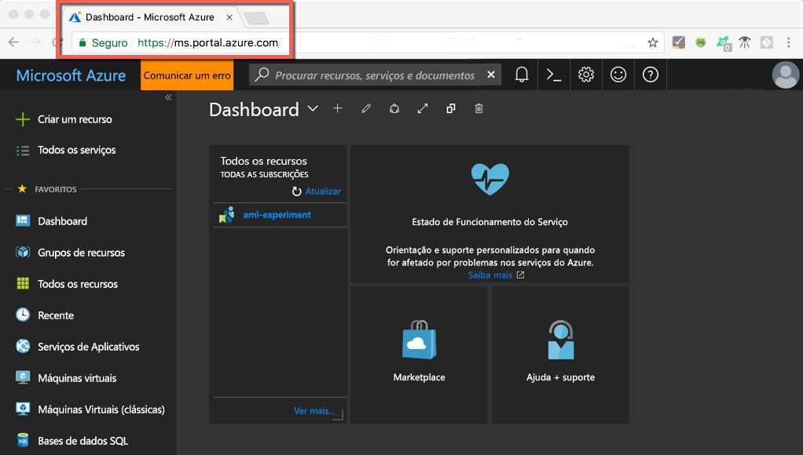
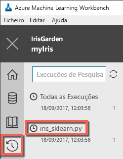
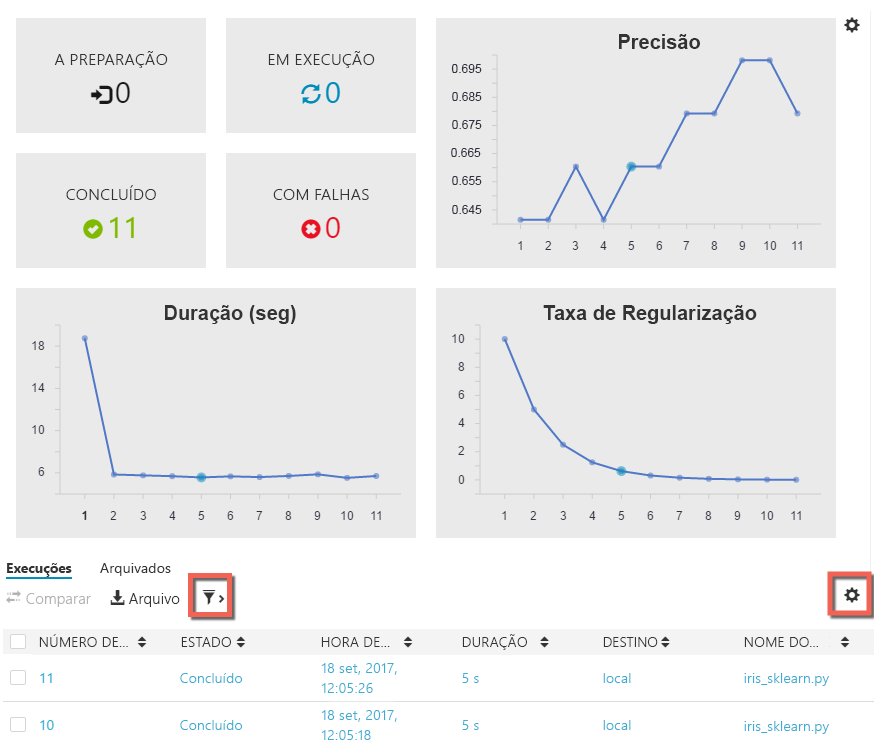

# <a name="quickstart-install-and-get-started-with-azure-machine-learning-services"></a>Início rápido: Instalar e começar a utilizar os serviços do Azure Machine Learning
Os serviços do Azure Machine Learning (pré-visualização) são uma solução de análise avançada e de ciência de dados integrada e completa. Ajudam os cientistas de dados profissionais a preparar dados, desenvolver experimentações e implementar modelos à escala da cloud.

Este manual de início rápido mostra-lhe como:

* Criar contas de serviço para os serviços do Azure Machine Learning
* Instalar e iniciar sessão no Azure Machine Learning Workbench
* Criar um projeto no Workbench
* Executar um script nesse projeto  
* Aceder à interface de linha de comandos (CLI)


Enquanto parte do portefólio do Microsoft Azure, os serviços do Azure Machine Learning requerem uma subscrição do Azure. Se não tiver uma subscrição do Azure, crie uma [conta gratuita](https://azure.microsoft.com/free/?WT.mc_id=A261C142F) antes de começar.

Além disso, tem de ter permissões adequadas para criar recursos, tais como Grupos de Recursos, Máquinas Virtuais, entre outros. 

<a name="prerequisites"></a>Pode instalar a aplicação Azure Machine Learning Workbench nos seguintes sistemas operativos:
- Windows 10 ou Windows Server 2016
- macOS Sierra ou High Sierra

## <a name="create-azure-machine-learning-services-accounts"></a>Criar contas de serviço do Azure Machine Learning
Utilize o portal do Azure para aprovisionar as contas do Azure Machine Learning: 
1. Inicie sessão no [portal do Azure](https://portal.azure.com/) com as credenciais da subscrição do Azure que vai utilizar. Se não tiver uma subscrição do Azure, crie uma [conta gratuita](https://azure.microsoft.com/free/?WT.mc_id=A261C142F) agora. 

   

1. Selecione o botão (+) **Criar um recurso**, no canto superior esquerdo do portal.

   

1. Introduza **Machine Learning** na barra de pesquisa. Selecione o resultado da pesquisa com o nome **Experimentação do Machine Learning**. 

   

1. No painel **Experimentação do Machine Learning**, desloque-se para baixo e selecione **Criar** para começar a definir a conta de experimentação.  

   

1. No painel **Experimentação do ML**, configure a conta de Experimentação do Machine Learning. 

   Definição|Valor sugerido para o tutorial|Descrição
   ---|---|---
   Nome da conta de Experimentação | _Nome exclusivo_ |Introduza um nome exclusivo que identifique a sua conta. Pode utilizar o seu nome ou o nome de um departamento ou projeto, aquele que melhor identifique a experimentação. O nome deve ter entre 2 e 32 carateres. Deve incluir apenas carateres alfanuméricos e o caráter de travessão (–). 
   Subscrição | _A sua subscrição_ |Escolha a subscrição do Azure que quer utilizar para a experimentação. Se tiver múltiplas subscrições, escolha a subscrição adequada na qual o recurso é cobrado.
   Grupo de recursos | _O seu grupo de recursos_ | Utilize um grupo de recursos já existente na sua subscrição ou introduza um nome para criar um grupo de recursos novo para esta conta de experimentação. 
   Localização | _A região mais próxima dos seus utilizadores_ | Escolha a localização que esteja mais próxima dos seus utilizadores e dos recursos de dados.
   Número de utilizadores | 2 | Introduza o número de utilizadores. Saiba como [o número de utilizadores influencia os preços](https://azure.microsoft.com/pricing/details/machine-learning/).<br/><br/>Neste início rápido, só precisa de dois utilizadores. É possível adicionar ou remover utilizadores no portal do Azure, conforme necessário.
   Conta de armazenamento | _Nome exclusivo_ | Selecione **Criar nova** e indique um nome para criar uma [conta de armazenamento do Azure](https://docs.microsoft.com/en-us/azure/storage/common/storage-quickstart-create-account?tabs=portal). Em alternativa, selecione **Utilizar existente** e selecione a conta de armazenamento existente na lista pendente. A conta de armazenamento é necessária e é utilizada para armazenar artefactos de projetos e dados do histórico de execuções. 
   Área de Trabalho para a conta de Experimentação | IrisGarden<br/>(nome utilizado nos tutoriais) | Indique um nome para uma área de trabalho nesta conta. O nome deve ter entre 2 e 32 carateres. Deve incluir apenas carateres alfanuméricos e o caráter de travessão (–). Esta área de trabalho contém as ferramentas de que precisa para criar, gerir e publicar experimentações.
   Atribuir proprietário à área de trabalho | _A sua conta_ | Selecione a sua própria conta como o proprietário da área de trabalho.
   Criar conta de Gestão de Modelos | **selecionar** |Crie uma conta de Gestão de Modelos agora, para que este recurso esteja disponível quando quiser implementar e gerir os seus modelos como serviços Web em tempo real. <br/><br/>Embora seja opcional, recomendamos que crie a conta de Gestão de Modelos ao mesmo tempo que a conta de Experimentação.
   Nome da conta | _Nome exclusivo_ | Escolha um nome exclusivo que identifique a sua conta de Gestão de Modelos. Pode utilizar o seu nome ou o nome de um departamento ou projeto, aquele que melhor identifique a experimentação. O nome deve ter entre 2 e 32 carateres. Deve incluir apenas carateres alfanuméricos e o caráter de travessão (–). 
   Escalão de preços da Gestão de Modelos | **DEV/TEST** | Selecione **Nenhum escalão de preço selecionado** para especificar o escalão de preço da sua conta de Gestão de Modelos nova. Para poupar nos custos, selecione o escalão de preço **DEVTEST** se estiver disponível na sua subscrição (disponibilidade limitada). Caso contrário, selecione o escalão S1, para beneficiar de uma poupança nos custos. Clique em **Selecionar** para guardar a escolha do escalão de preço. 
   Afixar ao dashboard | _selecionar_ | Selecione a opção **Afixar ao dashboard** para permitir uma fácil monitorização da conta de Experimentação do Machine Learning na página de rosto do dashboard do portal do Azure.

   

5. Selecione **Criar** para começar o processo de criação da conta de Experimentação, juntamente com a conta de Gestão de Modelos.

   

   A criação das contas pode demorar alguns minutos. Pode clicar na campainha na barra de ferramentas do portal do Azure para verificar o estado do processo de implementação.
   
   


## <a name="install-and-log-in-to-workbench"></a>Instalar e iniciar sessão no Workbench

Azure Machine Learning Workbench está disponível para Windows ou macOS. Veja a lista de [plataformas suportadas](#prerequisites).

>[!WARNING]
>A conclusão da instalação pode demorar cerca de 30 minutos. 

1. Transfira e inicie o programa de instalação mais recente do Workbench. 
   >[!IMPORTANT]
   >Transfira o instalador completamente para o disco e execute-o aí. Não o execute diretamente a partir do widget de transferência do browser.

   **No Windows:** 

   &nbsp;&nbsp;&nbsp;&nbsp;A. Transfira [AmlWorkbenchSetup.msi](https://aka.ms/azureml-wb-msi).  <br/>
   &nbsp;&nbsp;&nbsp;&nbsp;B. Faça duplo clique no programa de instalação que transferiu no Explorador de Ficheiros.

   **Em macOS:** 

   &nbsp;&nbsp;&nbsp;&nbsp;A. Transfira [AmlWorkbench.dmg](https://aka.ms/azureml-wb-dmg). <br/>
   &nbsp;&nbsp;&nbsp;&nbsp;B. Faça duplo clique no programa de instalação que transferiu no Finder.<br/><br/>

1. Siga as instruções no ecrã do programa de instalação para concluir. 

   **A conclusão da instalação pode demorar cerca de 30 minutos.**  
   
   | |Caminho de instalação do Azure Machine Learning Workbench|
   |--------|------------------------------------------------|
   |Windows|C:\Users\<user>\AppData\Local\AmlWorkbench|
   |macOS|/Applications/Azure ML Workbench.app|

   O instalador transferiu e configurou todas as dependências necessárias, tais como o Python, o Miniconda e outras bibliotecas associadas.    Esta instalação também inclui a ferramenta de linha de comandos multiplataforma do Azure, também denominada CLI do Azure.

  
1. Inicie o Workbench ao selecionar o botão **Iniciar o Workbench** no último ecrã do programa de instalação. 

   Se tiver fechado o programa de instalação, não há problema. 
   + No Windows, utilize o atalho do ambiente de trabalho **Machine Learning Workbench** para iniciá-lo. 
   + No macOS, selecione **Azure ML Workbench** no Launchpad.

1. No primeiro ecrã, selecione **Iniciar sessão** para autenticar com o Azure Machine Learning Workbench. Utilize as mesmas credenciais que utilizou no portal do Azure para criar as contas de Experimentação e de Gestão de Modelos. 

   Quando tiver sessão iniciada, o Workbench utiliza a primeira conta de Experimentação que encontra nas suas subscrições do Azure.  O Workbench utiliza a primeira conta de Experimentação que encontra e mostra todas as áreas de trabalho e todos os projetos associados à mesma. 

   >[!TIP]
   > Pode mudar para outra conta de Experimentação ao utilizar o ícone no canto inferior esquerdo da janela de aplicação do Workbench.

## <a name="create-a-project-in-workbench"></a>Criar um projeto no Workbench

No Azure Machine Learning, os projetos são os contentores lógicos para todos os trabalhos que estão ser realizados para resolver um problema. Mapeiam para uma pasta de ficheiro individual no disco local e pode adicionar ficheiros ou sub-pastas à mesma. 

Aqui, estamos a criar um projeto do Workbench novo com um modelo que inclui o [conjunto de dados de flor de Íris](https://en.wikipedia.org/wiki/iris_flower_data_set). Os tutoriais que se seguem a este início rápido dependem destes dados para criar um modelo que prevê o tipo de íris com base em algumas das suas características físicas.  

1. Com o Azure Machine Learning Workbench aberto, selecione o sinal de adição (+) no painel **PROJETOS** e escolha **Novo Projeto**.  

   

1. Preencha os campos do formulário e selecione o botão **Criar** para criar um novo projeto no Workbench.

   Campo|Valor sugerido para o tutorial|Descrição
   ---|---|---
   Nome do projeto | myIris |Introduza um nome exclusivo que identifique a sua conta. Pode utilizar o seu nome ou o nome de um departamento ou projeto, aquele que melhor identifique a experimentação. O nome deve ter entre 2 e 32 carateres. Deve incluir apenas carateres alfanuméricos e o caráter de travessão (–). 
   Diretório do projeto | c:\Temp\ | Especifique o diretório no qual é criado o projeto.
   Descrição do projeto | _deixar em branco_ | Campo opcional útil para descrever os projetos.
   Visualstudio.com |_deixar em branco_ | Campo opcional. Um projeto pode, opcionalmente, ser associado a um repositório do Git no Visual Studio Team Services para controlo de código fonte e colaboração. [Saiba como configurar essa opção.](https://docs.microsoft.com/en-us/azure/machine-learning/preview/using-git-ml-project#step-3-set-up-a-machine-learning-project-and-git-repo) 
   Área de trabalho | IrisGarden (se existir) | Escolha uma área de trabalho que tenha criado para a sua conta de Experimentação no portal do Azure. <br/>Se seguiu o Início Rápido, deve ter uma área de trabalho com o nome IrisGarden. Caso contrário, selecione a que criou quando criou a conta de Experimentação ou qualquer outra que queira utilizar.
   Modelo de projeto | Classifying Iris | Os modelos contêm scripts e dados que pode utilizar para explorar o produto. Este modelo contém os scripts e dados de que precisa para este início rápido e para outros tutoriais neste site de documentação. 

   
 
 É criado um novo projeto e o dashboard do projeto abre com esse projeto. Neste momento, pode explorar a home page, as origens de dados, os blocos de notas e os ficheiros de código de origem do projeto. 

>[!TIP]
>Pode configurar o Workbench para trabalhar com um IDE de Python e, assim, beneficiar de uma experiência de desenvolvimento de ciência de dados uniforme. Depois, pode interagir com o projeto no IDE. [Saiba como](how-to-configure-your-IDE.md). 

## <a name="run-a-python-script"></a>Executar um script de Python

Agora, pode executar o script **iris_sklearn.py** no seu computador local. Este script é incluído por predefinição com o modelo de projeto **Classifying Iris**. O script cria um modelo com o algoritmo de [regressão logística](https://en.wikipedia.org/wiki/logistic_regression) da popular biblioteca de Python [scikit-learn](http://scikit-learn.org/stable/index.html).

1. Na barra de comandos, na parte superior da página **Dashboard do Projeto**, selecione **local** como o destino da execução e selecione **iris_sklearn.py** como o script a ser executado. Estes valores estão pré-selecionados por predefinição. 

   O exemplo inclui outros ficheiros que pode ver mais tarde. No entanto, para este início rápido, só nos interessa **iris_sklearn.py**. 

   

1. Na caixa de texto **Argumentos**, introduza **0,01**. Este número é utilizado no script para definir a taxa de regularização. É um valor utilizado para configurar a forma como é preparado o modelo de regressão linear. 

1. Selecione **Executar** para iniciar a execução do script no seu computador. O trabalho **iris_sklearn** aparece imediatamente no painel **Trabalhos**, no lado direito, para que possa monitorizar a execução do script.

   Parabéns! Executou com êxito um script de Python no Azure Machine Learning Workbench.

1. Repita os passos 2 e 3 várias vezes com valores de argumentos diferentes, que variem entre **0,001** e **10**. Cada trabalho de execução é apresentado no painel **Trabalhos**.

1. Selecione a vista **Execuções** e **iris_sklearn.py** na lista Execuções para ver o histórico de execuções deste script. 

   

   Mostra todas as execuções que foram executadas em **iris_sklearn.py**. O dashboard do histórico de execuções também mostra as principais métricas, um conjunto de gráficos predefinidos e uma lista de métricas para cada execução. 

1. Pode personalizar esta vista ao ordenar, filtrar e ajustar as configurações com os ícones de engrenagem ou de filtro.

   

3. Selecione uma execução concluída no painel Trabalhos para ver uma vista detalhada dessa execução específica. Os detalhes incluem métricas adicionais, os ficheiros que foram produzidos e outros registos potencialmente úteis.

## <a name="start-the-cli"></a>Iniciar a CLI

A interface de linha de comandos (CLI) do Azure Machine Learning também é instalada. A interface da CLI permite-lhe aceder e interagir com os serviços do Azure Machine Learning através de comandos `az` para executar todas as tarefas necessárias para fluxos de trabalho de ciências de dados completos. [Saiba mais.](tutorial-iris-azure-cli.md)

Pode utilizar **Ficheiro --> Abrir Linha de Comandos** para iniciar a CLI azure-cli-ml a partir da barra de ferramentas do Workbench.

Pode utilizar o argumento --help para obter ajuda para os comandos da CLI azure-cli-ml.

```az ml --help```

## <a name="clean-up-resources"></a>Limpar recursos

[!INCLUDE [aml-delete-resource-group](../../../includes/aml-delete-resource-group.md)]

## <a name="next-steps"></a>Passos seguintes
Acabou de criar as contas do Azure Machine Learning necessárias e de instalar a aplicação Azure Machine Learning Workbench. Nessa aplicação, criou um projeto, executou um script e explorou o histórico de execuções desse script.

Para obter uma experiência mais aprofundada para este fluxo de trabalho, incluindo como implementar o seu modelo de Íris, siga o tutorial *Classificar Íris* completo. O tutorial contém os passos detalhados para [preparação de dados](tutorial-classifying-iris-part-1.md), [experimentação](tutorial-classifying-iris-part-2.md) e [gestão de modelos](tutorial-classifying-iris-part-3.md). 

> [!div class="nextstepaction"]
> [Tutorial: Classificar Íris (Parte 1)](tutorial-classifying-iris-part-1.md)

>[!NOTE]
> Embora já tenha a conta de gestão de modelos, o seu ambiente ainda não está configurado para implementar serviços Web.  Saiba como configurar o [ambiente de implementação](deployment-setup-configuration.md).