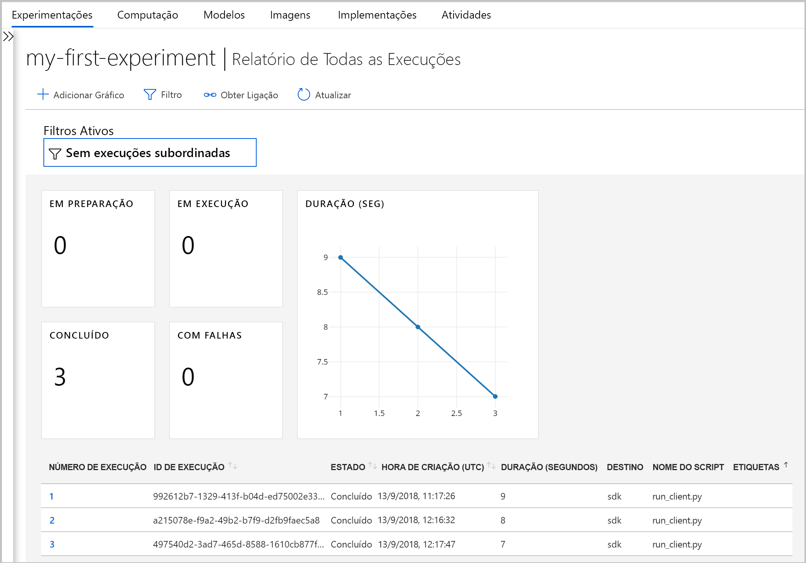
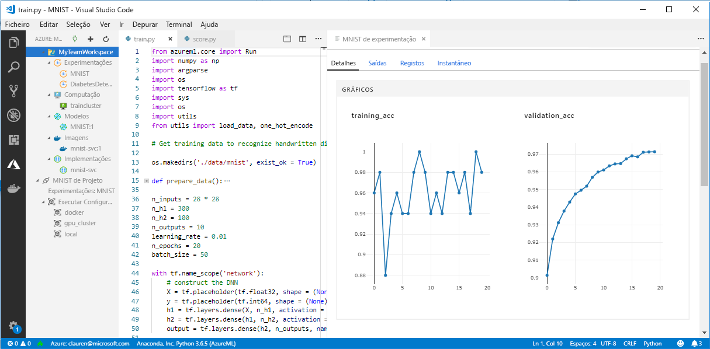

# O que acontece à Bancada de trabalho no serviço Azure Machine Learning?

A aplicação Workbench e alguns outros recursos antecipados foram preteridos e substituídos na versão de Setembro de 2018 para tornar a forma de uma melhor [arquitetura](concept-azure-machine-learning-architecture.md). A versão contém várias atualizações importantes baseadas no feedback dos clientes para melhorar a sua experiência. A funcionalidade principal das execuções experimentais para a implementação de modelos não foi alterada, mas agora pode utilizar um <a href="https://aka.ms/aml-sdk" target="_blank">SDK</a> e uma [CLI](reference-azure-machine-learning-cli.md) robustos para concluir tarefas e pipelines de machine learning.  

Neste artigo, aprenderá sobre o que foi alterado e como ele afeta o seu trabalho preexistente com o Azure Machine Learning Workbench e das respetivas APIs.

## O que mudou?

A versão mais recente do serviço do Azure Machine Learning inclui o seguinte:
+ Um [modelo de recursos do Azure simplificado](concept-azure-machine-learning-architecture.md)
+ [Nova IU do portal](how-to-track-experiments.md) para gerir as suas experimentações e destinos de computação
+ Um novo <a href="https://aka.ms/aml-sdk" target="_blank">SDK</a> de Python mais abrangente
+ Uma nova [extensão da CLI do Azure](reference-azure-machine-learning-cli.md) expandida para machine learning

A [arquitetura](concept-azure-machine-learning-architecture.md) foi redefinida tendo em conta a facilidade de utilização. Em vez de vários recursos e contas do Azure, precisa apenas de uma [Área de Trabalho do serviço do Azure Machine Learning](concept-azure-machine-learning-architecture.md#workspace).  Pode criar áreas de trabalho rapidamente no [portal do Azure](quickstart-get-started.md).  Uma área de trabalho pode ser utilizada por vários utilizadores para armazenar destinos de computação de preparação e implementação, experimentações de modelos, imagens do Docker, modelos implementados, entre outros.

Embora existam novos clientes de CLI e SDK melhorados na versão atual, a própria aplicação Workbench de ambiente de trabalho foi descontinuada. Agora, pode monitorizar as suas experimentações no [dashboard de área de trabalho do portal Web do Azure](how-to-track-experiments.md#view-the-experiment-in-the-azure-portal). Utilize o dashboard para obter o histórico de experimentações, gerir os destinos de computação associados à sua área de trabalho, gerir os seus modelos e imagens do Docker e até implementar serviços Web.

## Como posso migrar?

A maioria dos artefactos criados na versão anterior do serviço Azure Machine Learning é armazenada no seu próprio local ou no armazenamento da cloud. Estes artefactos nunca irão desaparecer. Para migrar, terá de registar novamente os artefactos com o serviço Azure Machine Learning atualizado. Saiba o que pode migrar e como o pode fazer neste [artigo sobre a migração](how-to-migrate.md).

## Linha cronológica de suporte

Pode continuar a utilizar as suas contas de experimentação e gestão de modelos, bem como a aplicação Workbench, durante mais algum tempo depois de setembro de 2018. O suporte para os seguintes recursos será removido progressivamente nos 3 a 4 meses que se seguem após esse lançamento. Pode ainda encontrar a documentação relativa às funcionalidades antigas na [secção Recursos](../desktop-workbench/tutorial-classifying-iris-part-1.md), na parte inferior do índice.

|Extinção&nbsp;fase|Detalhes de suporte para funcionalidades anteriores|
|:---:|----------------|
|4 de Dezembro de 2018|A capacidade de criar _conta de experimentação do Azure Machine Learning_ e _conta de gestão de modelos_ terminou no portal do Azure e a partir da CLI. A capacidade de criar ambientes de computação do ML a partir da CLI também terminou. Se tiver uma conta existente, a CLI e o Workbench no ambiente de trabalho continuam a funcionar nesta fase.|
|9 de Janeiro de 2019|Suporte para todo o resto, incluindo o restante APIs e as extremidades da bancada de trabalho desktop nesta data.|

[Comece a migrar](how-to-migrate.md) hoje mesmo. Todas as mais recentes capacidades estão disponíveis com os novos <a href="https://aka.ms/aml-sdk" target="_blank">SDK</a>, [CLI](reference-azure-machine-learning-cli.md) e [portal](quickstart-get-started.md).

## E em relação aos históricos de execução?

Os históricos de execução permanecerão acessíveis durante algum tempo. Quando estiver pronto para mudar para a versão atualizada do serviço Azure Machine Learning, poderá exportar estes históricos de execução, caso pretenda guardar uma cópia.

Os históricos de execução são agora denominados _experimentações_ na versão atual. Pode recolher as experimentações do seu modelo e explorá-las com o SDK, a CLI ou o portal Web.

O dashboard de área de trabalho do portal é suportado apenas nos browsers Microsoft Edge, Chrome e Firefox.

[  ] (./media/overview-what-happened-to-workbench/image001.png#lightbox)

## Ainda posso preparar os dados?

Os seus ficheiros de preparação de dados já existentes não são portáteis para a versão mais recente, uma vez que já não disponibilizamos o Workbench. No entanto, pode continuar a preparar os seus dados de modelação.  

Com conjuntos de dados mais pequenos, pode utilizar o <a href="https://aka.ms/aml-sdk" target="_blank">SDK de Preparação de Dados do Azure Machine Learning</a> para preparar rapidamente os seus dados antes da modelação. 

Pode utilizar este mesmo <a href="https://aka.ms/aml-sdk" target="_blank">SDK</a> para conjuntos de dados maiores ou o Azure Databricks para preparar grandes conjuntos de dados. 

## Os projetos serão mantidos?

Não irá perder qualquer código ou trabalho. Na versão mais antiga, os projetos são entidades na cloud com um diretório local. Na versão mais recente, pode associar diretórios locais à Área de Trabalho do serviço do Azure Machine Learning através de um ficheiro de configuração local. [Veja um diagrama da arquitetura mais recente](concept-azure-machine-learning-architecture.md).

Uma vez que grande parte do conteúdo do projeto já se encontrava no seu computador local, basta criar um ficheiro de configuração nesse diretório e referi-lo no código para ligar à sua área de trabalho. [Saiba como migrar os seus projetos existentes.](how-to-migrate.md#projects)

Saiba como começar a utilizar o [Python com o SDK principal](quickstart-get-started.md).

## E em relação aos meus modelos e imagens de registos?
 
Os modelos que registou no seu registo do modelo antigo devem ser migrados para nova área de trabalho, se quiser continuar a utilizá-los. Pode fazê-lo ao [transferir os modelos e ao registá-los novamente](how-to-migrate.md) na sua nova área de trabalho. 

As imagens que criou no seu registo de imagens antigo têm de ser recriadas na nova área de trabalho para continuar a utilizá-las. Pode fazê-lo ao seguir a [configurar e criar a imagem](how-to-deploy-and-where.md#configureimage) secções. 

## E em relação aos serviços Web implementados?

Os modelos que implementou como serviços Web com a sua conta de Gestão de Modelos irão continuar a funcionar, desde que o Azure Container Service (ACS) seja suportado. Esses serviços Web irão funcionar inclusivamente após o fim do suporte para contas de Gestão de Modelos. No entanto, quando o suporte para a antiga CLI terminar, terminará também a capacidade para gerir esses serviços Web.

Na versão mais recente, os modelos são implementados como serviços da web para clusters Instances(ACI) de contentor do Azure ou do Azure Kubernetes Service (AKS). Também pode implementar para FPGAs e para o IoT edge. Para obter mais informações, consulte a [como implementar e, em que](how-to-deploy-and-where.md) documento. Pode implementar novamente os modelos com o SDK ou a CLI novos, sem ter de alterar qualquer um dos seus ficheiros, dependências e esquemas de classificação. 

## E em relação ao SDK e à CLI antigos?

Sim, eles continuarão a funcionar até Janeiro (consulte a [linha cronológica](#timeline) acima). Recomendamos que comece a criar as suas experimentações e modelos novos com o SDK e/ou a CLI mais recentes.

Na versão mais recente, o novo SDK de Python permite-lhe interagir com o serviço Azure Machine Learning em qualquer ambiente de Python. Saiba como instalar a versão o <a href="https://aka.ms/aml-sdk" target="_blank">SDK</a> mais recente.  Também pode utilizar a [extensão de machine learning da CLI do Azure atualizada](reference-azure-machine-learning-cli.md) com o conjunto avançado de `az ml` comandos para interagir com o serviço em qualquer ambiente de linha de comandos, incluindo o Cloud Shell do portal do Azure.

## E o Azure Machine Learning para Visual Studio Code?

Com esta versão mais recente, Azure Machine Learning para o código do Visual Studio (VS) foi expandido e melhorado para funcionar com os novos recursos acima.

[  ] (. / media/overview-what-happened-to-workbench/vscode-big.png#lightbox)

## E em relação aos pacotes de domínios?

Os pacotes de domínios para [Imagem Digitalizada, Análise de Texto e Previsão](../desktop-workbench/reference-python-package-overview.md) não podem ser utilizados com a versão mais recente do Azure Machine Learning. No entanto, pode continuar a criar e preparar os modelos de imagem digitalizada, texto e previsão com o <a href="https://aka.ms/aml-sdk" target="_blank">SDK</a> de Python do Azure Machine Learning mais recente. Para saber como migrar os modelos já existentes criados com os pacotes de Imagem Digitalizada, Análise de Texto e Previsão, contacte-nos através do endereço de e-mail [AML-Packages@microsoft.com](mailto:AML-Packages@microsoft.com).

## Passos Seguintes

Saiba mais sobre [a arquitetura mais recente do serviço Azure Machine Learning](concept-azure-machine-learning-architecture.md) e experimente um dos guias de início rápido ou tutoriais:

* [O que é o serviço Azure Machine Learning?](overview-what-is-azure-ml.md)
* [Guia de Início Rápido: criar uma área de trabalho com Python](quickstart-get-started.md)
* [Tutorial: preparar um modelo](tutorial-train-models-with-aml.md)
