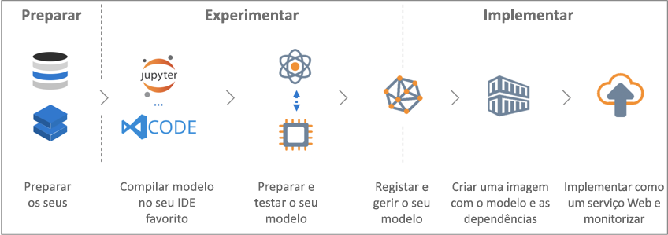

# O que é o serviço Azure Machine Learning (pré-visualização)?

O serviço Azure Machine Learning (pré-visualização) é um serviço cloud que pode utilizar para criar e implementar modelos de machine learning. Ao utilizar o serviço Azure Machine Learning, pode controlar os seus modelos à medida que os cria, prepara, implementa e gere, tudo à escala abrangente que a cloud disponibiliza.

## O que é o Machine Learning?

A aprendizagem automática é uma técnica da ciência de dados que permite aos computadores utilizar dados existentes para prever futuros comportamentos, resultados e tendências. Ao utilizarem a aprendizagem automática, os computadores aprendem sem serem explicitamente programados.

As previsões ou predições da aprendizagem automática podem tornar as aplicações e os dispositivos mais inteligentes. Por exemplo, quando faz compras online, o machine learning recomenda outros produtos que poderá gostar com base nos que já comprou. Quando o seu cartão de crédito é utilizado, o machine learning compara a transação com uma base de dados de transações e ajuda a detetar fraudes. Quando o robô aspirador limpa uma sala, o machine learning ajuda-o a decidir se a tarefa está concluída.

## O que é o serviço Azure Machine Learning?

O serviço Azure Machine Learning fornece um ambiente baseado na cloud que pode utilizar para criar, preparar, testar, implementar, gerir e controlar os modelos de machine learning.

[  ] (./media/overview-what-is-azure-ml/aml.png#lightbox)

O serviço Azure Machine Learning suporta totalmente tecnologias de open source, pelo que pode utilizar dezenas de milhares de pacotes Python de open source com componentes de machine learning, como o TensorFlow e o scikit-learn.
Ferramentas avançadas, como o [Jupyter Notebook](http://jupyter.org) ou o [Visual Studio Code Tools for AI](https://visualstudio.microsoft.com/downloads/ai-tools-vscode/), tornam mais fácil explorar dados interativamente, transformá-los e, em seguida, criar e testar modelos.
O serviço Azure Machine Learning também inclui funcionalidades que [automatizam a otimização e a geração de modelos](tutorial-auto-train-models.md) para ajudá-lo a criar modelos com facilidade, eficiência e precisão.

O serviço Azure Machine Learning permite-lhe começar a preparar o seu computador local e, em seguida, aumentar horizontalmente para a cloud. Com o suporte nativo do [Azure Batch AI](https://azure.microsoft.com/services/batch-ai/) e [serviços de otimização avançada de hiperparâmetros](how-to-tune-hyperparameters.md), pode criar melhores modelos mais rapidamente através da tecnologia da cloud. 

Quando tiver o modelo certo, pode implementá-lo facilmente num contentor, como o Docker. Isto significa que é simples implementar no [Azure Container Instances](how-to-deploy-to-aci.md) ou no [Azure Kubernetes Service](how-to-deploy-to-aks.md). Em alternativa, pode utilizar o contentor nas suas próprias implementações, no local ou na cloud.
Pode gerir os modelos implementados e controlar várias execuções à medida que experimenta para encontrar a melhor solução.

[!INCLUDE [aml-preview-note](../../../includes/aml-preview-note.md)]

## O que posso fazer com o serviço Azure Machine Learning?

O serviço Azure Machine Learning consegue gerar e otimizar automaticamente um modelo.
Para obter um exemplo, veja [Tutorial: Automatically train a classification model with Azure Automated Machine Learning](tutorial-auto-train-models.md) (Tutorial: preparar automaticamente um modelo de classificação com o Azure Automated Machine Learning).

Ao utilizar o <a href="http://aka.ms/aml-sdk" target="_blank">SDK</a> do Azure Machine Learning para Python, juntamente com pacotes Python de open source, pode criar e preparar modelos de machine learning e aprendizagem aprofundada de alta precisão numa área de trabalho do serviço do Azure Machine Learning.
Pode escolher de entre vários componentes de machine learning disponíveis em pacotes Python de open source, como os seguintes:

- <a href="http://scikit-learn.org/stable/" target="_blank">Scikit-learn</a>
- <a href="https://www.tensorflow.org" target="_blank">Tensorflow</a>
- <a href="https://pytorch.org" target="_blank">PyTorch</a>
- <a href="https://www.microsoft.com/en-us/cognitive-toolkit/" target="_blank">CNTK</a>
- <a href="http://mxnet.io" target="_blank">MXNet</a>

Depois de ter um modelo, pode utilizá-lo para criar um contentor (por exemplo, o Docker) que pode ser implementado localmente para fins de teste e, em seguida, como um serviço Web de produção no [Azure Container Instances](how-to-deploy-to-aci.md) ou no [Azure Kubernetes Service](how-to-deploy-to-aks.md).

Em seguida, pode gerir os modelos implementados através do [portal do Azure](https://portal.azure.com/) ou da [extensão da CLI do Azure Machine Learning](https://review.docs.microsoft.com/azure/machine-learning/service/reference-azure-machine-learning-cli).
Pode avaliar as métricas do modelo, voltar a preparar e implementar novas versões do modelo, tudo enquanto controla as experimentações do modelo.

Para começar a utilizar o serviço Azure Machine Learning, veja os [Passos seguintes](#next-steps) que estão abaixo.

## Qual é a diferença entre o serviço Azure Machine Learning e o Azure Machine Learning Studio?

O Azure Machine Learning Studio é uma área de trabalho visual de colaboração de arrastar e largar onde pode criar, testar e implementar soluções de machine learning sem a necessidade de escrever código. Utiliza algoritmos de machine learning pré-criados e pré-configurados e módulos de processamento de dados.

Utilize o Machine Learning Studio quando quiser experimentar modelos de machine learning de forma rápida e fácil, e quando os algoritmos de machine learning incorporados forem suficientes para as suas soluções.

Utilize o serviço Machine Learning se trabalhar num ambiente Python, quiser mais controlo sobre os algoritmos de machine learning ou quiser utilizar bibliotecas de machine learning de open source.

> [!NOTE]
> Os modelos criados no Azure Machine Learning Studio não podem ser implementados nem geridos pelo serviço Azure Machine Learning.

## Avaliação gratuita
Se não for um subscritor, pode [abrir uma conta do Azure gratuitamente](https://azure.microsoft.com/pricing/free-trial/?WT.mc_id=A261C142F). Receberá créditos para gastar em serviços do Azure. Depois de serem utilizados, pode manter a conta e utilizar os [serviços gratuitos do Azure](https://azure.microsoft.com/free/). O seu cartão de crédito não será cobrado, a menos que altere explicitamente as suas definições e peça para ser cobrado. Como alternativa, pode [ativar os benefícios de subscritor do MSDN](https://azure.microsoft.com/pricing/member-offers/msdn-benefits-details/?WT.mc_id=A261C142F): a sua subscrição do MSDN dá-lhe créditos todos os meses que pode utilizar em serviços pagos do Azure.

## Passos seguintes

- Crie uma área de trabalho do serviço de machine learning com o artigo [Utilizar o Portal do Azure para começar](quickstart-get-started.md)
 
- Siga o tutorial completo, [Train an image classification model with Azure Machine Learning](tutorial-train-models-with-aml.md) (Preparar um modelo de classificação de imagens com o Azure Machine Learning), para saber como preparar e implementar modelos com o serviço Azure Machine Learning

- Para obter informações sobre como dar permissão ao Azure Machine Learning para gerar e otimizar automaticamente o seu modelo, veja [Tutorial: Automatically train a classification model with Azure Automated Machine Learning](tutorial-auto-train-models.md) (Tutorial: preparar automaticamente um modelo de classificação com o Azure Automated Machine Learning)

- Para uma visão aprofundada e técnica do serviço, veja [Arquitetura e conceitos do serviço Azure Machine Learning](concept-azure-machine-learning-architecture.md)

- Para obter mais informações sobre outros produtos de machine learning da Microsoft, veja [Outros produtos de machine learning da Microsoft](./overview-more-machine-learning.md)

<!-- 

An intro to AML or an end-to-end quickstart video could go here.

In this 9-minute video, learn how you can benefit your app. You'll learn about key features and what a typical workflow looks like. 

>[!VIDEO https://channel9.msdn.com/Events/Connect/2016/138/player]
 
+ 0-3 minutes covers key features and use-cases.
+ 3-4 minutes covers service provisioning. 
+ 4-6 minutes covers Import Data wizard used to create an index using the built-in real estate dataset.

-->
