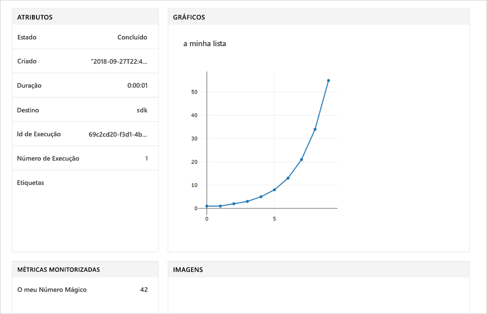

# <a name="quickstart-use-the-python-sdk-to-get-started-with-azure-machine-learning"></a>Início rápido: Utilizar o Python SDK para começar a utilizar com o Azure Machine Learning

Neste artigo, vai utilizar o Azure Machine Learning SDK para Python para criar e, em seguida, utilizar um serviço do Azure Machine Learning [área de trabalho](concept-azure-machine-learning-architecture.md). A área de trabalho é o bloco fundamental na cloud que utilizar para testar, preparar e implementar modelos de aprendizagem automática com o Machine Learning. 

Começar através da configuração de seu próprio ambiente de Python e o servidor de bloco de notas do Jupyter. Para executá-lo sem instalação, consulte [início rápido: Utilizar o portal do Azure para começar a utilizar com o Azure Machine Learning](quickstart-get-started.md).

> [!VIDEO https://www.microsoft.com/en-us/videoplayer/embed/RE2G9N6]

Neste artigo, irá:
* Instale o SDK de Python.
* Criar uma área de trabalho na sua subscrição do Azure.
* Criar um ficheiro de configuração para essa área de trabalho, para utilização posterior noutros blocos de notas e scripts.
* Escrever código que regista os valores dentro da área de trabalho.
* Ver os valores registados na área de trabalho.

Criar uma área de trabalho e um ficheiro de configuração para utilizar como pré-requisitos para outros tutoriais de Machine Learning e artigos de instruções. Tal como acontece com outros serviços do Azure, determinados limites e quotas estão associadas com Machine Learning. [Saiba mais sobre quotas e como pedir mais.](how-to-manage-quotas.md)

Os seguintes recursos do Azure são adicionados automaticamente à sua área de trabalho quando estiverem disponíveis regionalmente:
 
- [Azure Container Registry](https://azure.microsoft.com/services/container-registry/)
- [Armazenamento do Azure](https://azure.microsoft.com/services/storage/)
- [Azure Application Insights](https://azure.microsoft.com/services/application-insights/) 
- [Cofre de Chaves do Azure](https://azure.microsoft.com/services/key-vault/)

Se não tiver uma subscrição do Azure, crie uma conta gratuita antes de começar. Experimente o [uma versão gratuita ou paga do serviço Azure Machine Learning](http://aka.ms/AMLFree) hoje mesmo.

## <a name="install-the-sdk"></a>Instalar o SDK

> [!IMPORTANT]
> Ignore esta secção se utilizar uma máquina de virtual de ciência de dados criada após a 27 de Setembro de 2018.
> Máquinas de virtuais do ciência de dados criadas após esta data vêm com o SDK de Python pré-instalado.

O código neste artigo requer o Azure Machine Learning SDK versão 1.0.2 ou posterior.

Antes de instalar o SDK, recomendamos que crie um ambiente Python isolado. Embora este artigo usa [Miniconda](https://conda.io/docs/user-guide/install/index.html), também pode utilizar completo [Anaconda](https://www.anaconda.com/) instalado ou [Python virtualenv](https://virtualenv.pypa.io/en/stable/).

### <a name="install-miniconda"></a>Instalar o Miniconda

[Baixe e instale o Miniconda](https://conda.io/miniconda.html). Selecione Python 3.7 ou posterior. Não selecione o Python 2.x.

### <a name="create-an-isolated-python-environment"></a>Criar um ambiente Python isolado 

1. Abra uma janela da linha de comandos e, em seguida, crie um novo ambiente de conda com o nome *myenv* com o Python 3.6.

    ```shell
    conda create -n myenv -y Python=3.6
    ```

1. Ative o ambiente.

    ```shell
    conda activate myenv
    ```

### <a name="install-the-sdk"></a>Instalar o SDK

No ambiente conda ativado, instale o SDK. Este código instala os componentes principais do SDK de Machine Learning. Também instala um servidor de bloco de notas do Jupyter no ambiente de conda. A instalação demora alguns minutos para concluir com base na configuração do seu computador.

```sh
# Install Jupyter
conda install nb_conda

# Install the base SDK and Jupyter Notebook
pip install azureml-sdk[notebooks]
```

Pode utilizar palavras-chave adicional para instalar outros componentes do SDK:

```sh
# Install the base SDK and auto ml components
pip install azureml-sdk[automl]

# Install the base SDK and the model explainability component
pip install azureml-sdk[explain]

# Install the base SDK and experimental components
pip install azureml-sdk[contrib]
```

No ambiente do Azure Databricks, utilize o seguinte comando de instalação em vez disso:

```
# Install the base SDK and automl components in the Azure Databricks environment.
# For more information, see https://github.com/Azure/MachineLearningNotebooks/tree/master/databricks.
pip install azureml-sdk[databricks]
```


## <a name="create-a-workspace"></a>Criar uma área de trabalho

1. Para iniciar o bloco de notas do Jupyter, introduza este comando:

    ```shell
    jupyter notebook
    ```

1. Na janela do browser, crie um novo bloco de notas com o kernel `Python 3` predefinido. 

1. Para apresentar a versão do SDK, introduza e, em seguida, execute o seguinte código de Python numa célula de bloco de notas:

   [!code-python[](~/aml-sdk-samples/ignore/doc-qa/quickstart-create-workspace-with-python/quickstart.py?name=import)]

1. Encontrar um valor para o `<azure-subscription-id>` parâmetro na [lista de subscrições no portal do Azure](https://ms.portal.azure.com/#blade/Microsoft_Azure_Billing/SubscriptionsBlade). Utilize qualquer subscrição em que a sua função seja proprietário ou contribuidor.

   ```python
   from azureml.core import Workspace
   ws = Workspace.create(name='myworkspace',
                         subscription_id='<azure-subscription-id>', 
                         resource_group='myresourcegroup',
                         create_resource_group=True,
                         location='eastus2' # Or other supported Azure region   
                        )
   ```

   Quando executar o código, poderá ser-lhe pedido para iniciar sessão na sua conta do Azure. Depois de iniciar sessão, o token de autenticação ficará em cache localmente.

1. Para viewe os detalhes da área de trabalho, como o armazenamento associado, o registo de contentor e o Cofre de chaves, introduza o seguinte código:

    [!code-python[](~/aml-sdk-samples/ignore/doc-qa/quickstart-create-workspace-with-python/quickstart.py?name=getDetails)]


## <a name="write-a-configuration-file"></a>Escrever um ficheiro de configuração

Guarde os detalhes da sua área de trabalho num arquivo de configuração para o diretório atual. Este ficheiro é chamado *aml_config\config.json*.  

Este ficheiro de configuração da área de trabalho torna mais fácil carregar a mesma área de trabalho mais tarde. Pode carregá-la com outros blocos de notas e scripts no mesmo diretório ou num subdiretório. 

[!code-python[](~/aml-sdk-samples/ignore/doc-qa/quickstart-create-workspace-with-python/quickstart.py?name=writeConfig)]

A chamada à API `write_config()` cria o ficheiro de configuração no diretório atual. O *config* arquivo contém o seguinte script:

```json
{
    "subscription_id": "<azure-subscription-id>",
    "resource_group": "myresourcegroup",
    "workspace_name": "myworkspace"
}
```

## <a name="use-the-workspace"></a>Utilizar a área de trabalho

Escreva algum código que utiliza as APIs básicas do SDK para monitorizar as execuções da experimentação.

[!code-python[](~/aml-sdk-samples/ignore/doc-qa/quickstart-create-workspace-with-python/quickstart.py?name=useWs)]

## <a name="view-logged-results"></a>Ver resultados registados
Quando a execução for concluída, pode ver a execução da experimentação no portal do Azure. Para imprimir um URL que navega para os resultados para a última execução, utilize o seguinte código:

```python
print(run.get_portal_url())
```

Utilize a ligação para ver os valores registados no portal do Azure no seu browser.



## <a name="clean-up-resources"></a>Limpar recursos 
>[!IMPORTANT]
>Pode usar os recursos que criou aqui como pré-requisitos para outros tutoriais de Machine Learning e referência artigos.

Se não planeja usar os recursos que criou neste artigo, eliminá-los para evitar incorrer em quaisquer custos.

[!code-python[](~/aml-sdk-samples/ignore/doc-qa/quickstart-create-workspace-with-python/quickstart.py?name=delete)]

## <a name="next-steps"></a>Passos Seguintes

Neste artigo, criou os recursos que necessários para experimentar e implementar modelos. Executou o código num bloco de notas e explorou o histórico de execução para o código na sua área de trabalho na cloud.

Para utilizar o código com os tutoriais de Machine Learning, terá de alguns pacotes mais no seu ambiente.

1. No browser, feche o bloco de notas.
1. Na janela da linha de comandos, selecione Ctrl + C para parar o servidor de bloco de notas do Jupyter.
1. Instale os pacotes adicionais.

    ```shell
    conda install -y cython matplotlib scikit-learn pandas numpy
    pip install azureml-sdk[automl]
    ```

Depois de instalar estes pacotes, continue com os tutoriais para preparar e implementar um modell. 

> [!div class="nextstepaction"]
> [Tutorial: Preparar um modelo de classificação de imagem](tutorial-train-models-with-aml.md)

Também pode explorar [exemplos mais avançados no GitHub](https://aka.ms/aml-notebooks).