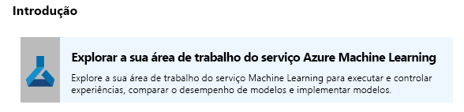
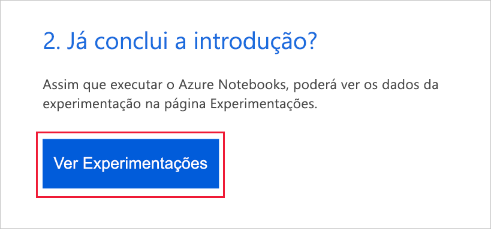
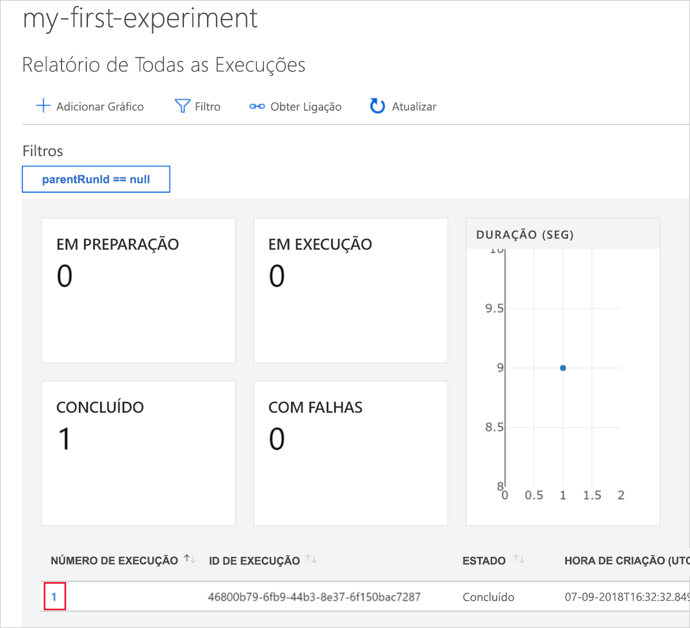
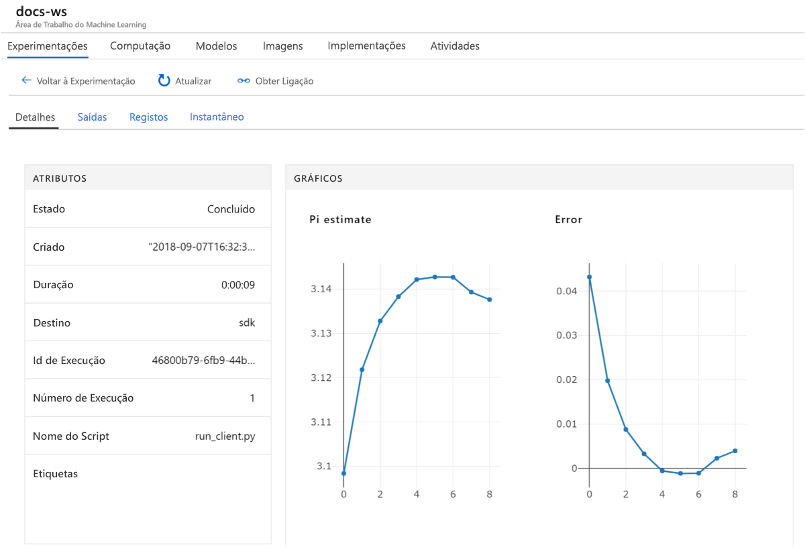

# Início Rápido: Utilizar o portal do Azure para começar a trabalhar com o Azure Machine Learning

Neste início rápido, vai utilizar o portal do Azure para criar uma área de trabalho do Azure Machine Learning. Esta área de trabalho é o pilar na cloud que utiliza para experimentar, preparar e implementar modelos de machine learning com Machine Learning. Este início rápido utiliza recursos na cloud e não requer qualquer instalação. Para configurar o seu próprio servidor de blocos de notas do Jupyter em vez disso, veja [Início Rápido: utilizar o Python para começar a utilizar o Azure Machine Learning](quickstart-create-workspace-with-python.md).

> [!VIDEO https://www.microsoft.com/en-us/videoplayer/embed/RE2F9Ad]

Neste início rápido, irá:

* Criar uma área de trabalho na sua subscrição do Azure.
* Faça um teste com o Python num bloco de notas do Azure e registe os valores em várias iterações.
* Ver os valores registados na área de trabalho.

Os seguintes recursos do Azure são adicionados automaticamente à sua área de trabalho quando estiverem disponíveis regionalmente:

  - [Azure Container Registry](https://azure.microsoft.com/services/container-registry/)
  - [Armazenamento do Azure](https://azure.microsoft.com/services/storage/)
  - [Azure Application Insights](https://azure.microsoft.com/services/application-insights/) 
  - [Cofre de Chaves do Azure](https://azure.microsoft.com/services/key-vault/)

Os recursos que criar podem ser utilizados como pré-requisitos para outros tutoriais e artigos de procedimentos do serviço Machine Learning. Como com outros serviços do Azure, existem limites em certos recursos associados com o Machine Learning, como tamanho de cluster de computação. Saiba mais sobre [os limites predefinidos e como aumentar a quota](how-to-manage-quotas.md).

Se não tiver uma subscrição do Azure, crie uma [conta gratuita](https://aka.ms/AMLfree) antes de começar.

## Criar uma área de trabalho 

[!INCLUDE [aml-create-portal](../../../includes/aml-create-in-portal.md)]

Na página da área de trabalho, selecione `Explore your Azure Machine Learning service workspace`.

 

## Utilizar a área de trabalho

Veja agora como uma área de trabalho ajuda-o a gerir os seus scripts de aprendizagem automática. Nesta secção, pode:

* Abrir um bloco de notas no Azure Notebooks.
* Executar código que cria alguns valores registados.
* Ver os valores registados na área de trabalho.

Este exemplo mostra como a área de trabalho pode ajudá-lo a manter o controlo das informações geradas num script. 

### Abrir um bloco de notas 

O Azure Notebooks oferece uma plataforma na cloud gratuita para blocos de notas do Jupyter que são pré-configurados com tudo o que precisa para executar o Machine Learning.  

Selecione `Open Azure Notebooks` para realizar a sua primeira experimentação.

 

A sua organização poderá precisar de [consentimento de administrador](https://notebooks.azure.com/help/signing-up/work-or-school-account/admin-consent) antes de poder iniciar sessão.

Depois de iniciar sessão, é aberto um novo separador e um aviso `Clone Library` é apresentado. Selecione `Clone`.

### Executar o bloco de notas

Juntamente com dois blocos de notas, verá um ficheiro `config.json`. Este ficheiro de configuração contém informações sobre a área de trabalho que criou.  

Selecione `01.run-experiment.ipynb` para abrir o bloco de notas.

Para executar as células uma de cada vez, utilize `Shift`+`Enter`. Ou selecione `Cells` > `Run All` para executar o bloco de notas completo. Quando vir um asterisco [*] junto de uma célula, significa que está em execução. Após o código para essa célula terminar, é apresentado um número. 

Depois de concluir a execução de todas as células no bloco de notas, pode ver os valores registados na sua área de trabalho.

## Ver valores registados

Depois da executar todas as células no bloco de notas, regresse à página do portal.  

Selecione `View Experiments`.

Feche o pop-up `Reports`.

Selecione `my-first-experiment`.

Veja as informações sobre a execução que acabou de efetuar. Desloque a página para baixo para encontrar a tabela de execuções. Selecione a ligação do número de execução.

 

Verá os gráficos que foram criados automaticamente dos valores registados. Sempre que registar vários valores com o mesmo parâmetro de nome, é automaticamente gerado um desenho.

   

Uma vez que o código para obter uma estimativa do pi utiliza valores aleatórios, os seus gráficos irão mostrar valores diferentes.  

## Limpar recursos 

[!INCLUDE [aml-delete-resource-group](../../../includes/aml-delete-resource-group.md)]

Também pode manter o grupo de recursos mas eliminar uma área de trabalho única. Apresente as propriedades de área de trabalho e selecione **Eliminar**.

## Passos Seguintes

Criou os recursos necessários para experimentar e implementar modelos. Também executou algum código num bloco de notas. E explorou o histórico de execuções desse código na sua área de trabalho na cloud.

Para obter uma experiência aprofundada de fluxo de trabalho, siga o tutorial de Machine Learning para preparar e implementar um modelo.  

> [!div class="nextstepaction"]
> [Tutorial: Preparar um modelo de classificação de imagens](tutorial-train-models-with-aml.md)
