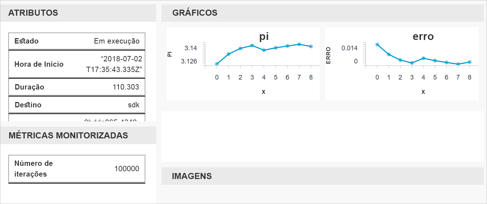

# Início rápido: Utilizar o portal do Azure para começar a utilizar com o Azure Machine Learning

Utilize o portal do Azure para criar uma área de trabalho do Azure Machine Learning. Esta área de trabalho é o pilar na cloud que utiliza para experimentar, preparar e implementar modelos de machine learning com Machine Learning. Este início rápido utiliza recursos na cloud e não requer qualquer instalação. Para configurar o seu próprio servidor de blocos de notas do Jupyter em vez disso, consulte [início rápido: Utilizar Python para começar a utilizar com o Azure Machine Learning](quickstart-create-workspace-with-python.md).  
 
Neste início rápido, efetuar as seguintes ações:

* Criar uma área de trabalho na sua subscrição do Azure.
* Faça um teste com o Python num valores de registo e o bloco de notas do Jupyter através de várias iterações.
* Ver os valores registados na área de trabalho.

Os seguintes recursos do Azure são adicionados automaticamente à sua área de trabalho quando estiverem disponíveis regionalmente:

  - [Azure Container Registry](https://azure.microsoft.com/services/container-registry/)
  - [Armazenamento do Azure](https://azure.microsoft.com/services/storage/)
  - [Azure Application Insights](https://azure.microsoft.com/services/application-insights/) 
  - [Cofre de Chaves do Azure](https://azure.microsoft.com/services/key-vault/)

Os recursos que criar podem ser utilizados como pré-requisitos para outros tutoriais e artigos de procedimentos do serviço Machine Learning. Tal como noutros serviços do Azure, existem limites em certos recursos associados com Machine Learning. Um exemplo é o tamanho do cluster de computação. Saiba mais sobre o [limites e como aumentar a quota padrão](how-to-manage-quotas.md).

Se não tiver uma subscrição do Azure, crie uma conta gratuita antes de começar. Experimente o [uma versão gratuita ou paga do serviço Azure Machine Learning](http://aka.ms/AMLFree) hoje mesmo.

## Criar uma área de trabalho 

[!INCLUDE [aml-create-portal](../../../includes/aml-create-in-portal.md)]

## Utilizar a área de trabalho

> [!VIDEO https://www.microsoft.com/en-us/videoplayer/embed/RE2F9Ad]

Agora, saiba como uma área de trabalho ajuda-o a gerir os seus scripts do machine learning. Nesta secção, siga os passos seguintes:

* Abrir um bloco de notas no Azure Notebooks.
* Executar código que cria alguns valores registados.
* Ver os valores registados na área de trabalho.

Este exemplo mostra como a área de trabalho pode ajudá-lo a manter o controlo das informações geradas num script. 

### Abrir um bloco de notas 

Blocos de notas do Azure fornece uma plataforma de cloud gratuitos para blocos de notas do Jupyter que é pré-configurado com tudo o que precisa para executar o Machine Learning. Na área de trabalho, pode iniciar esta plataforma para começar a utilizar a sua área de trabalho do serviço do Azure Machine Learning.

1. Na página de área de trabalho, selecione **Explore sua área de trabalho de serviço do Azure Machine Learning**.

 

1. Selecione **aberto blocos de notas do Azure** para experimentar a sua primeira experiência em blocos de notas do Azure.  Blocos de notas do Azure é um serviço separado, que permite que execute blocos de notas Jupyter gratuitamente na cloud.  Quando utiliza esta ligação para o serviço, informações sobre como ligar à sua área de trabalho serão adicionadas à biblioteca de que criar em blocos de notas do Azure.

 

1. Inicie sessão em blocos de notas do Azure.  Certifique-se de que iniciar sessão com a mesma conta utilizada para iniciar sessão no portal do Azure. A sua organização poderá precisar de [consentimento de administrador](https://notebooks.azure.com/help/signing-up/work-or-school-account/admin-consent) antes de poder iniciar sessão.

1. Depois de iniciar sessão, é aberto um novo separador e um aviso `Clone Library` é apresentado. Clonar esta biblioteca carregará um conjunto de blocos de notas e outros ficheiros na sua conta de blocos de notas do Azure.  Estes ficheiros ajudam a explorar os recursos do Azure Machine Learning.

1. Desmarque **público** para que não a partilhar as informações da sua área de trabalho com outras pessoas.

1. Selecione **Clone**.

 

1. Se vir que o status do projeto é parado, clique em **executado na computação gratuita** para utilizar o servidor de bloco de notas gratuito.

    

### Executar o bloco de notas

Na lista de ficheiros para este projeto, verá um `config.json` ficheiro. Este ficheiro de configuração contém informações sobre a área de trabalho que criou no portal do Azure.  Este ficheiro permite que seu código ligar a e adicione informações na área de trabalho.

1. Selecione **01.run experiment.ipynb** para abrir o bloco de notas.

1. A área de status informa ao aguardar até que o kernel foi iniciado.  A mensagem desaparecerá depois do kernel está pronto.

    

1. Depois de iniciado o kernel, execute as células um a um momento, utilizando **Shift + Enter**. Ou selecione **células** > **executar todos** para executar o bloco de notas completo. Quando vir um asterisco __*__, junto a uma célula, a célula ainda está em execução. Após o código para essa célula terminar, é apresentado um número. 

1. Siga as instruções no bloco de notas para autenticar a sua subscrição do Azure.

Depois de terminar a executar todas as células no bloco de notas, pode ver os valores com sessão iniciada na sua área de trabalho.

## Ver valores registados

1. A saída do `run` célula contém uma ligação para o portal do Azure para ver os resultados da experimentação na sua área de trabalho. 

    

1. Clique nas **ligação para o Portal do Azure** para ver informações sobre a execução na sua área de trabalho.  Esta ligação abre-se a sua área de trabalho no portal do Azure.

1. Os gráficos de valores com sessão iniciada, que verá automaticamente foram criados na área de trabalho. Sempre que registar vários valores com o mesmo parâmetro de nome, é automaticamente gerado um desenho.

   

Uma vez que o código para pi aproximado utiliza valores aleatórios, seus gráficos irão mostrar valores diferentes.  

## Limpar recursos 

[!INCLUDE [aml-delete-resource-group](../../../includes/aml-delete-resource-group.md)]

Também pode manter o grupo de recursos mas eliminar uma área de trabalho única. Apresentar as propriedades de área de trabalho e selecione **eliminar**.

## Passos Seguintes

Criou os recursos necessários para experimentar e implementar modelos. Também executou algum código num bloco de notas. E explorou o histórico de execuções desse código na sua área de trabalho na cloud.

Para obter uma experiência de fluxo de trabalho detalhados, siga os tutoriais de Machine Learning para preparar e implementar um modelo:  

> [!div class="nextstepaction"]
> [Tutorial: Preparar um modelo de classificação de imagem](tutorial-train-models-with-aml.md)
