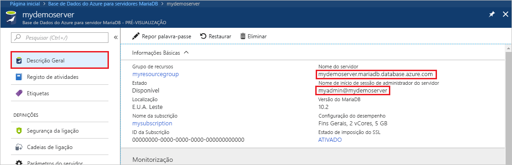
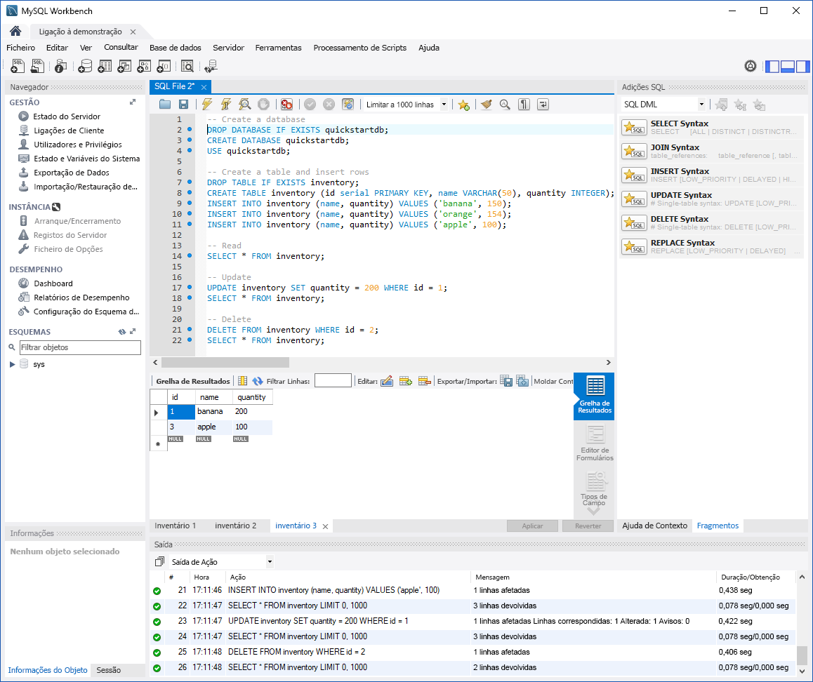

# <a name="azure-database-for-mariadb-use-mysql-workbench-to-connect-and-query-data"></a>Azure Database for MariaDB: Utilizar MySQL Workbench para se ligar e consultar dados

Este início rápido demonstra como ligar a uma instância do Azure Database for MariaDB através do MySQL Workbench. 

## <a name="prerequisites"></a>Pré-requisitos

Este início rápido utiliza os recursos criados em qualquer um dos guias seguintes como ponto de partida:

- [Criar um servidor do Azure Database for MariaDB com o portal do Azure](./quickstart-create-mariadb-server-database-using-azure-portal.md)
- [Criar um servidor do Azure Database for MariaDB com a CLI do Azure](./quickstart-create-mariadb-server-database-using-azure-cli.md)

## <a name="install-mysql-workbench"></a>Instalar MySQL Workbench

[Transfira o MySQL Workbench](https://dev.mysql.com/downloads/workbench/) e instale-o no seu computador.

## <a name="get-connection-information"></a>Obter informações da ligação

Obtenha as informações de ligação necessárias para ligar à instância do Azure Database for MariaDB. Necessita do nome de servidor completamente qualificado e das credenciais de início de sessão.

1. Inicie sessão no [portal do Azure](https://portal.azure.com/).

2. No menu esquerdo no portal do Azure, selecione **Todos os recursos**. Procure o servidor que criou (como **mydemoserver**).

3. Selecione o nome do servidor.

4. Na página **Descrição geral** do servidor, tome nota dos valores de **Nome do servidor** e **Nome de início de sessão de administrador do servidor**. Caso se esqueça da palavra-passe, também pode repô-la nesta página.

 

## <a name="connect-to-the-server-by-using-mysql-workbench"></a>Ligar ao servidor com o MySQL Workbench

Para ligar a um servidor do Azure Database for MariaDB com o MySQL Workbench:

1.  Abra o MySQL Workbench no seu computador. 

2.  Na caixa de diálogo **Configurar Ligação Nova**, no separador **Parâmetros**, introduza as informações seguintes:

    | Definição | Valor sugerido | Descrição do campo |
    |---|---|---|
    |   Nome da Ligação | **Ligação de demonstração** | Especifique uma etiqueta para esta ligação. |
    | Método de Ligação | **Standard (TCP/IP)** | Standard (TCP/IP) é suficiente. |
    | Nome de anfitrião | *server name* | Especifique o valor do nome do servidor que utilizou para criar a instância do Azure Database for MariaDB. O nosso servidor de exemplo é **mydemoserver.mariadb.database.azure.com**. Utilize o nome de domínio completamente qualificado (\*.mariadb.database.azure.com), conforme mostrado no exemplo. Se não se lembrar do nome do servidor, conclua os passos na secção anterior para obter as informações da ligação.  |
    | Porta | **3306** | Utilize sempre a porta 3306 para ligar ao Azure Database for MariaDB. |
    | Nome de utilizador |  *nome de início de sessão de administrador do servidor* | Introduza o nome de utilizador de início de sessão de administrador do servidor que utilizou para criar a instância do Azure Database for MariaDB. O nosso nome de utilizador de exemplo é **myadmin@mydemoserver**. Se não se lembrar do nome de utilizador de início de sessão de administrador do servidor, conclua os passos na secção anterior para obter as informações de ligação. O formato é *username@servername*.
    | Palavra-passe | *a sua palavra-passe* | Para guardar a palavra-passe, selecione **Store in Vault** (Armazenar no Cofre). |

    

3.   Para verificar se todos os parâmetros estão configurados corretamente, selecione **Test Connection** (Testar Ligação). 

4.   Selecione **OK** para guardar a ligação. 

5.   Em **MySQL Connections**, selecione o mosaico que corresponde ao seu servidor. Aguarde que a ligação seja estabelecida.

    É aberto um novo separador do SQL com um editor em branco, onde pode escrever as suas consultas.
    
    > [!NOTE]
    > Por predefinição, a segurança da ligação SSL é necessária e imposta no servidor do Azure Database for MariaDB. Apesar de, normalmente, não ser precisa nenhuma configuração adicional com certificados SSL para o MySQL Workbench ligar ao seu servidor, recomendamos vincular a certificação AC SSL ao MySQL Workbench. Se tiver de desativar o SSL, na página de descrição geral do servidor no portal do Azure, selecione **Segurança da ligação** no menu. Em **Enforce SSL connection** (Impor ligação SSL), selecione **Disabled** (Desativado).

## <a name="create-table-and-insert-read-update-and-delete-data"></a>Criar tabela e inserir, ler, atualizar e eliminar dados

1. Copie e cole o código SQL de exemplo seguinte na página de um separador SQL em branco para ilustrar alguns dados de exemplo.

    Este código cria uma base de dados vazia com o nome **quickstartdb**. Em seguida, cria uma tabela de exemplo com o nome **inventory**. O código insere algumas linhas e, em seguida, lê as mesmas. Altera os dados com uma instrução de atualização e, em seguida, lê as linhas novamente. Por fim, o código elimina uma linha e, em seguida, lê as linhas novamente.
    
    ```sql
    -- Create a database
    -- DROP DATABASE IF EXISTS quickstartdb;
    CREATE DATABASE quickstartdb;
    USE quickstartdb;
    
    -- Create a table and insert rows
    DROP TABLE IF EXISTS inventory;
    CREATE TABLE inventory (id serial PRIMARY KEY, name VARCHAR(50), quantity INTEGER);
    INSERT INTO inventory (name, quantity) VALUES ('banana', 150);
    INSERT INTO inventory (name, quantity) VALUES ('orange', 154);
    INSERT INTO inventory (name, quantity) VALUES ('apple', 100);
    
    -- Read
    SELECT * FROM inventory;
    
    -- Update
    UPDATE inventory SET quantity = 200 WHERE id = 1;
    SELECT * FROM inventory;
    
    -- Delete
    DELETE FROM inventory WHERE id = 2;
    SELECT * FROM inventory;
    ```

    A captura de ecrã mostra um exemplo do código SQL no MySQL Workbench e o resultado após ter sido executado:
    
    

2. Para executar o código SQL de exemplo, no separador **Ficheiro SQL**, selecione o ícone de relâmpago na barra de ferramentas.
3. Repare nos três resultados em separadores na secção **Grelha de Resultado** no meio da página. 
4. Repare na lista de **Resultados** na parte inferior da página. É apresentado o estado de cada comando. 

Neste início rápido, ligou-se ao Azure Database for MariaDB com o MySQL Workbench e consultou dados com a linguagem SQL.

<!--
## Next steps
> [!div class="nextstepaction"]
> [Migrate your database using Export and Import](./concepts-migrate-import-export.md)
-->