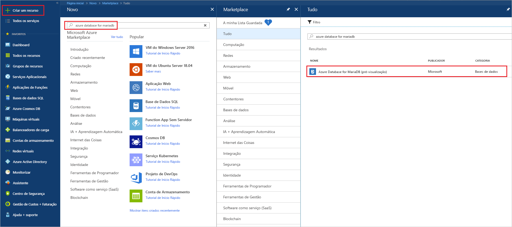
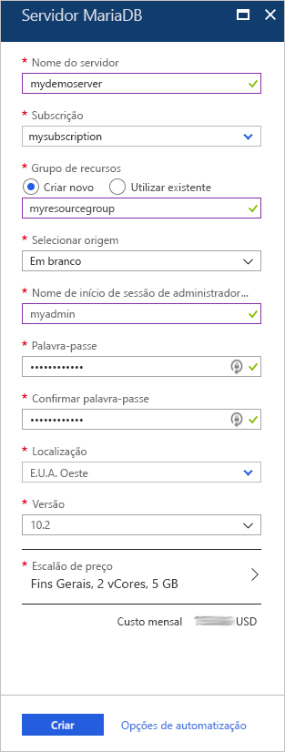
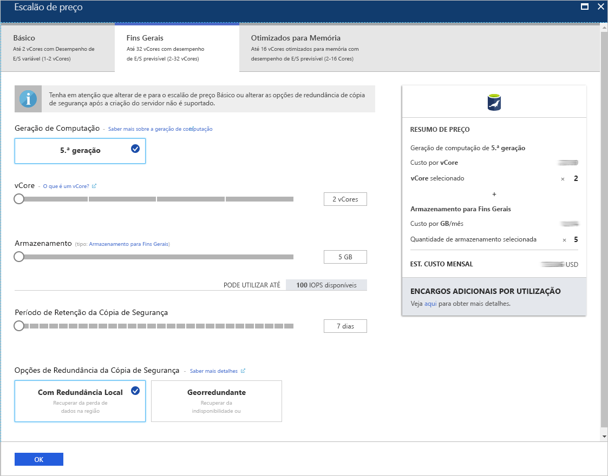
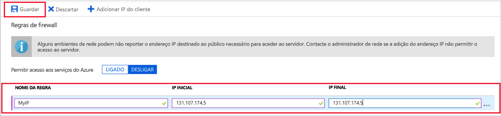
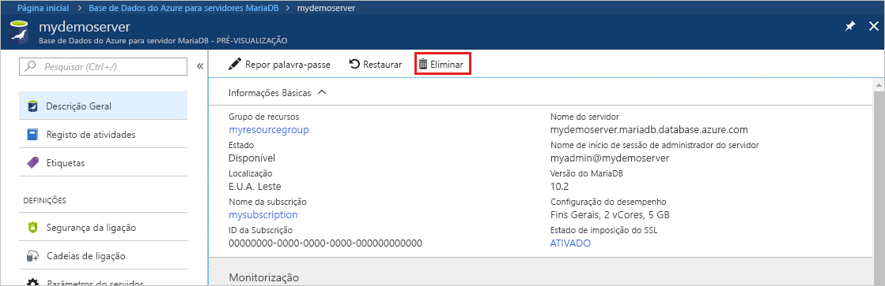

# <a name="create-an-azure-database-for-mariadb-server-by-using-the-azure-portal"></a>Criar um Azure Database for MariaDB Server com o portal do Azure

A Azure Database for MariaDB é um serviço gerido que utiliza para executar, gerir e dimensionar as Bases de Dados MariaDB de elevada disponibilidade na cloud. Este Guia de Início Rápido mostra-lhe como criar um Azure Database for MariaDB Server em cerca de cinco minutos com o portal do Azure.  

Se não tiver uma subscrição do Azure, crie uma [conta do Azure gratuita](https://azure.microsoft.com/free/) antes de começar.

## <a name="sign-in-to-the-azure-portal"></a>Iniciar sessão no portal do Azure
Abra o browser e, em seguida, avance para o [portal do Azure](https://portal.azure.com/). Introduza as suas credenciais para iniciar sessão no portal. A vista predefinida é o dashboard de serviço.

## <a name="create-an-azure-database-for-mariadb-server"></a>Criar um Azure Database for MariaDB Server
Irá criar um Azure Database for MariaDB Server com um conjunto definido de recursos de armazenamento e computação<!-- [compute and storage resources](./concepts-compute-unit-and-storage.md)-->. Irá criar o servidor dentro de um [grupo de recursos do Azure](../azure-resource-manager/resource-group-overview.md).

Siga estes passos para criar um Azure Database for MariaDB Server:

1. Selecione o botão (+) **Criar um recurso**, no canto superior esquerdo do portal.

2. Escreva **Azure Database for MariaDB** na caixa de pesquisa para encontrar o serviço.

   

3. Preencha o formulário com os detalhes do novo servidor com as seguintes informações:
   
   

    **Definição** | **Valor sugerido** | **Descrição do campo**
    ---|---|---
    Nome do servidor | Nome de servidor exclusivo | Escolha um nome exclusivo que identifique o seu Azure Database for MariaDB Server. Por exemplo, mydemoserver. O nome de domínio *.mariadb.database.azure.com* é anexado ao nome de servidor que indicar. O nome do servidor pode conter apenas letras minúsculas, números e o caráter de hífen (-). Tem de conter entre 3 e 63 carateres.
    Subscrição | A sua subscrição | Selecione a subscrição do Azure que quer utilizar para o servidor. Se tiver várias subscrições, escolha a subscrição na qual o recurso é cobrado.
    Grupo de recursos | *myresourcegroup* | Forneça um novo nome do grupo de recursos ou um existente.    Grupo de recursos|*myresourcegroup*| Um nome de grupo de recursos novo ou um já existente na sua subscrição.
    Selecionar origem | *Em branco* | Selecione *Em branco* para criar um novo servidor de raiz. (Selecione *Cópia de segurança* se estiver a criar um servidor a partir de uma cópia de segurança de área geográfica de um Azure Database for MariaDB Server existente).
    Início de sessão de administrador do servidor | myadmin | Uma conta de início de sessão para utilizar quando ligar ao servidor. O nome de início de sessão de administrador não pode ser **azure_superuser**, **admin**, **administrator**, **root**, **guest** ou **public**.
    Palavra-passe | *A sua escolha* | Forneça uma palavra-passe nova para a conta de administrador do servidor. Tem de conter entre 8 e 128 carateres. A palavra-passe tem de conter carateres das três categorias seguintes: letras em maiúscula inglesas, letras em minúscula inglesas, números (0 - 9) e carateres não alfanuméricos (!, $, #, %, etc.).
    Confirmar palavra-passe | *A sua escolha*| Confirme a palavra-passe da conta de administrador.
    Localização | *A região mais próxima dos seus utilizadores*| Escolha a localização que estiver mais próxima dos seus utilizadores ou das suas outras aplicações do Azure.
    Versão | *A versão mais recente*| A versão mais recente (a não ser que tenha requisitos específicos que exijam outra versão).
    Escalão de preço | **Fins Gerais**, **Geração 5**, **2 vCores**, **5 GB**, **7 dias**, **Geograficamente Redundante** | As configurações de computação, armazenamento e cópia de segurança do seu novo servidor. Selecione **Escalão de preço**. Em seguida, selecione o separador **Fins Gerais**. *Geração 5*, *2 vCores*, *5 GB* e *7 dias* são os valores predefinidos de **Geração de Computação**, **vCore**, **Armazenamento** e **Período de Retenção da Cópia de Segurança**. Pode deixar os controlos de deslize como estão. Para ativar as cópias de segurança do servidor no armazenamento georredundante, selecione **Geograficamente Redundante** nas **Opções de Redundância da Cópia de Segurança**. Para guardar a seleção deste escalão de preço, selecione **OK**. A captura de ecrã seguinte captura estas seleções.
  
    > [!IMPORTANT]
    > O início de sessão e a palavra-passe de administrador de servidor que especificar aqui serão necessários para iniciar sessão no servidor e nas respetivas bases de dados mais tarde neste Guia de Início Rápido. Lembre-se ou grave estas informações para utilização posterior.
    > 

   

4.  Selecione **Criar** para aprovisionar o servidor. O aprovisionamento pode demorar até 20 minutos.
   
5.  Selecione **Notificações** na barra de ferramentas (o ícone da campainha) para monitorizar o processo de implementação.
   
  Por predefinição, as seguintes bases de dados são criadas no seu servidor: **information_schema**, **mysql**, **performance_schema** e **sys**.

## <a name="configure-a-server-level-firewall-rule"></a>Configurar uma regra de firewall ao nível do servidor

O serviço Azure Database for MariaDB cria uma firewall ao nível do servidor. A mesma impede que as aplicações e ferramentas externas se liguem ao servidor e a quaisquer bases de dados no servidor, a menos que seja criada uma regra de firewall para abrir a firewall aos endereços IP específicos. 

1.   Depois de concluída a implementação, localize o seu servidor. Se for preciso, pode procurá-lo. Por exemplo, selecione **Todos os Recursos** no menu à esquerda. Em seguida, escreva o nome do servidor, como o exemplo **mydemoserver**, para procurar o servidor que acabou de criar. Selecione o nome do servidor da lista de resultados de pesquisa. É apresentada a página **Descrição Geral** do servidor, que fornece opções para configuração adicional.

2. Na página do servidor, selecione **Segurança da ligação**.

3.  No cabeçalho **Regras de firewall**, selecione a caixa de texto em branco na coluna **Nome da Regra** para começar a criar a regra de firewall. Especifique o intervalo de IP exato dos clientes que irão estabelecer ligação a este servidor.
   
   

4. Na barra de ferramentas superior da página **Segurança da ligação**, selecione **Guardar**. Aguarde até que a notificação apareça e indique que a atualização foi concluída com êxito antes de continuar. 

   > [!NOTE]
   > As ligações à Azure Database for MariaDB comunicam através da porta 3306. Se tentar ligar a partir de uma rede empresarial, o tráfego de saída através da porta 3306 poderá não ser permitido. Se for este o caso, não pode ligar ao servidor, a menos que o departamento de TI abra a porta 3306.
   > 

## <a name="get-the-connection-information"></a>Obter as informações da ligação
Para ligar ao seu servidor de bases de dados, precisa do nome completo do servidor e das credenciais de início de sessão de administrador. Poderá ter apontado esses valores anteriormente no artigo Guia de Início Rápido. Se não o tiver feito, pode encontrar facilmente o nome do servidor e as informações de início de sessão na página **Descrição Geral** do servidor ou na página **Propriedades** do portal do Azure.

Para localizar estes valores, siga os passos seguintes: 

1. Abra a página **Descrição Geral** do servidor. Anote o **Nome do servidor** e **Nome de início de sessão de administrador do servidor**. 

2. Coloque o cursor sobre cada campo e o ícone de cópia é apresentado à direita do texto. Selecione o ícone de cópia conforme necessário para copiar os valores.

Neste exemplo, o nome do servidor é **mydemoserver.mariadb.database.azure.com** e o início de sessão de administrador do servidor é **myadmin@mydemoserver**.

## <a name="connect-to-mariadb-using-mysql-command-line"></a>Ligar ao MariaDB com a linha de comandos mysql
Estão disponíveis diversas aplicações que pode utilizar para ligar ao seu Azure Database for MariaDB Server.

Vamos utilizar primeiro a ferramenta de linha de comandos [mysql](https://dev.mysql.com/doc/refman/5.7/en/mysql.html) para ilustrar como ligar ao servidor. Também pode utilizar um browser e o Azure Cloud Shell conforme descrito aqui sem instalar software adicional. Se tiver o utilitário mysql instalado localmente, também pode ligar a partir do mesmo.

1. Inicie o Azure Cloud Shell através do ícone de terminal (**>_**) no canto superior direito do portal do Azure.


2.  O Azure Cloud Shell é aberto no browser, onde pode escrever os comandos bash da shell.

   

3. Na linha de comandos do Cloud Shell, estabeleça ligação ao Azure Database for MariaDB Server ao escrever a linha de comandos mysql.

    Para ligar a um Azure Database for MariaDB Server com o utilitário mysql, utilize o seguinte formato:

    ```bash
    mysql --host <fully qualified server name> --user <server admin login name>@<server name> -p
    ```

    Por exemplo, o comando seguinte liga ao nosso servidor de exemplo:

    ```azurecli-interactive
    mysql --host mydemoserver.mariadb.database.azure.com --user myadmin@mydemoserver -p
    ```

    mysql parameter |Valor sugerido|Descrição
    ---|---|---
    --host | *Nome do servidor* | O valor do nome de servidor que foi utilizado quando criou anteriormente o Azure Database for MariaDB Server. O nosso servidor de exemplo é **mydemoserver.mariadb.database.azure.com**. Utilize o nome de domínio completamente qualificado (**\*.mariadb.database.azure.com**), conforme mostrado no exemplo. Se não se lembrar do nome do servidor, siga os passos na secção anterior para obter as informações da ligação.
    --user | *Nome de início de sessão de administrador do servidor* |O nome de utilizador de início de sessão de administrador do servidor que foi fornecido quando criou o Azure Database for MariaDB Server anteriormente. Se não se lembrar do nome de utilizador, siga os passos na secção anterior para obter as informações da ligação. O formato é *username@servername*.
    -p | *Aguarde até que seja pedido* |Quando lhe for pedido, forneça a palavra-passe que indicou quando criou o servidor. Tenha em conta que os carateres da palavra-passe introduzida não são apresentados na linha de comandos bash ao escrevê-los. Após introduzir a palavra-passe, selecione **Enter**.

   Assim que estiver ligado, o utilitário mysql apresenta uma linha de comandos `mysql>` onde pode escrever os comandos. 

   Segue-se um exemplo da saída mysql:

    ```bash
    Welcome to the MySQL monitor.  Commands end with ; or \g.
    Your MySQL connection id is 65505
    Server version: 5.6.39.0 MariaDB Server
    
    Copyright (c) 2000, 2017, Oracle and/or its affiliates. All rights reserved.
    
    Oracle is a registered trademark of Oracle Corporation and/or its
    affiliates. Other names may be trademarks of their respective
    owners.

    Type 'help;' or '\h' for help. Type '\c' to clear the current input statement.
    
    mysql>
    ```
    > [!TIP]
    > Se a firewall não estiver configurada para permitir o endereço IP do Azure Cloud Shell, ocorre o seguinte erro:
    >
    > ERROR 2003 (28000): Client with IP address 123.456.789.0 is not allowed to access the server. (ERRO 2003 (28000): o cliente com o endereço IP 123.456.789.0 não tem permissão para aceder ao servidor.)
    >
    > Para resolver o erro, certifique-se de que a configuração do servidor corresponde aos passos na secção "Configure a server-level firewall rule" (Configurar uma regra de firewall ao nível do servidor) do artigo.

4. Para garantir que a ligação está funcional, veja o estado do servidor escrevendo `status` na linha de comandos mysql>.

    ```sql
    status
    ```

   > [!TIP]
   > Para obter comandos adicionais, veja [MySQL 5.7 Reference Manual - Chapter 4.5.1](https://dev.mysql.com/doc/refman/5.7/en/mysql.html) (Manual de Referência do MySQL 5.7 - Capítulo 4.5.1).

5.  Crie uma base de dados vazia na linha de comandos **mysql>** escrevendo o seguinte comando:
    ```sql
    CREATE DATABASE quickstartdb;
    ```
    O comando pode demorar alguns minutos a concluir. 

    Dentro de um Azure Database for MariaDB Server, pode criar uma ou múltiplas bases de dados. Pode optar por criar uma base de dados por servidor para utilizar todos os recursos ou criar várias bases de dados para partilhar os recursos. Não há limite para o número de bases de dados que pode criar, mas múltiplas bases de dados partilham os mesmos recursos do servidor. 

6. Liste as bases de dados na linha de comandos **mysql>** escrevendo o seguinte comando:

    ```sql
    SHOW DATABASES;
    ```

7.  Escreva `\q` e, em seguida, selecione a tecla **Enter** para sair da ferramenta mysql. Pode fechar o Azure Cloud Shell depois de terminar.

Está agora ligado ao Azure Database for MariaDB Server e criou uma base de dados de utilizador vazia. Continue para a secção seguinte para um exercício semelhante. O exercício seguinte liga-se ao mesmo servidor ao utilizar outra ferramenta comum, Workbench do MySQL.

## <a name="connect-to-server-using-mysql-workbench"></a>Ligar ao servidor com o MySQL Workbench
Para ligar ao servidor com a ferramenta MySQL Workbench, siga os seguintes passos:

1. Abra a aplicação MySQL Workbench no computador cliente. Pode transferir e instalar o MySQL Workbench em [Transferir MySQL Workbench](https://dev.mysql.com/downloads/workbench/).

2. Crie uma nova ligação. Clique no ícone de sinal de adição (+) junto ao cabeçalho **MySQL Connections**.

3. Na caixa de diálogo **Configurar Ligação Nova**, introduza as informações de ligação do servidor no separador **Parâmetros**. Os valores de marcador de posição são apresentados como exemplo. Substitua o Nome do Anfitrião, o Nome de Utilizador e a palavra-passe pelos seus valores.

   

    |Definição |Valor sugerido|Descrição do campo|
    |---|---|---|
     Nome da ligação | Ligação de demonstração | Uma etiqueta para esta ligação. |
    Método de ligação | Standard (TCP/IP) | Standard (TCP/IP) é suficiente. |
    Nome de anfitrião | *Nome do servidor* | O valor do nome de servidor que foi utilizado quando criou anteriormente o Azure Database for MariaDB Server. O nosso servidor de exemplo é **mydemoserver.mariadb.database.azure.com**. Utilize o nome de domínio completamente qualificado (**\*.mariadb.database.azure.com**), conforme mostrado no exemplo. Se não se lembrar do nome do servidor, siga os passos na secção anterior para obter as informações da ligação.|
     Porta | 3306 | A porta a utilizar quando ligar ao seu Azure Database for MariaDB Server. |
    Nome de utilizador |  *Nome de início de sessão de administrador do servidor* | As informações de início de sessão de administrador do servidor que forneceu quando criou o Azure Database for MariaDB Server anteriormente. O nosso nome de utilizador de exemplo é **myadmin@mydemoserver**. Se não se lembrar do nome de utilizador, siga os passos na secção anterior para obter as informações da ligação. O formato é *username@servername*.
    Palavra-passe | *A sua palavra-passe* | Selecione o botão **Armazenar no Cofre...** para guardar a palavra-passe. |

4. Selecione **Testar Ligação** para testar se todos os parâmetros estão configurados corretamente. Em seguida, clique em **OK** para guardar a ligação. 

    > [!NOTE]
    > O SSL é aplicado por predefinição no seu servidor e requer uma configuração adicional para uma ligação com êxito. <!--For more information, see [Configure SSL connectivity in your application to securely connect to Azure Database for MariaDB](./howto-configure-ssl.md).--> Para desativar o SSL neste Guia de Início Rápido, aceda ao portal do Azure. Em seguida, selecione a página de segurança de Ligação para desativar o botão de alternar de ligação **Impor SSL**.

## <a name="clean-up-resources"></a>Limpar recursos
Pode limpar os recursos que criou no Início Rápido de duas formas. Pode eliminar o [grupo de recursos do Azure](../azure-resource-manager/resource-group-overview.md), que inclui todos os recursos no grupo de recursos. Se pretender manter os outros recursos intactos, elimine apenas o recurso de um servidor.

> [!TIP]
> Outros Inícios Rápidos desta coleção compilados com base neste Início Rápido. Se pretender continuar a trabalhar com Inícios Rápidos, não limpe os recursos que criou neste Início Rápido. Se não quiser continuar, utilize os passos seguintes para eliminar todos os recursos que criou com este Início Rápido.
>

Para eliminar o grupo de recursos inteiro, incluindo o servidor recentemente criado, siga os seguintes passos:

1.  Localize o grupo de recursos no portal do Azure. No menu do lado esquerdo, selecione **Grupos de recursos** e, em seguida, selecione o nome do grupo de recursos, (como o nosso exemplo **myresourcegroup**).

2.  Na página do grupo de recursos, selecione **Eliminar**. Em seguida, escreva o nome do grupo de recursos, (como o nosso exemplo **myresourcegroup**), na caixa para confirmar a eliminação e, em seguida, selecione **Eliminar**.

Para eliminar apenas o servidor recentemente criado, siga os passos seguintes:

1.  Localize o servidor no portal do Azure, se ainda não estiver aberto. No menu no lado esquerdo do Portal do Azure, selecione **Todos os recursos**. Em seguida, procure o servidor que criou.

2.  Na página **Descrição geral**, selecione **Eliminar**. 

   

3.  Confirme o nome do servidor que pretende eliminar e veja as bases de dados incluídas que são afetadas. Escreva o nome do servidor na caixa (como o nosso exemplo **mydemoserver**). Selecione **Eliminar**.

## <a name="next-steps"></a>Passos seguintes
- [Conceber a sua primeira base de dados da Azure Database for MariaDB](./tutorial-design-database-using-portal.md)
