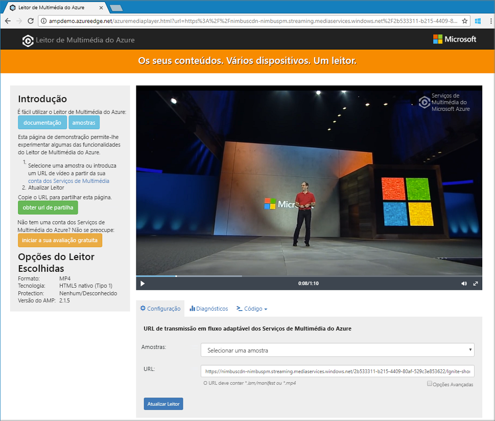

# <a name="quickstart-stream-video-files---cli"></a>Início rápido: Ficheiros de vídeo do Stream - CLI

Este início rápido mostra como é fácil codificar e começar a transmitir vídeos numa ampla variedade de browsers e dispositivos com os Serviços de Multimédia do Azure. Um conteúdo de entrada pode ser especificado com URLs HTTPS, URLs SAS ou caminhos de ficheiros localizados no Armazenamento de blobs do Azure.
O exemplo neste tópico codifica o conteúdo que torna acessível através de um URL HTTPS. Atualmente, o AMS v3 não suporta a codificação de transferência segmentada através de URLs HTTPS.

No final do início rápido, será capaz de transmitir um vídeo.  



[!INCLUDE [quickstarts-free-trial-note](../../../includes/quickstarts-free-trial-note.md)]

## <a name="create-a-media-services-account"></a>Criar uma conta dos Media Services

Para começar a utilizar os serviços de multimédia, terá de criar uma conta de Media Services. No momento em que cria uma conta de Media Services, também cria uma conta de armazenamento associado.

### <a name="create-a-resource-group"></a>Criar um grupo de recursos

```azurecli
az group create -n amsResourceGroup -l westus2
```

### <a name="create-an-azure-storage-account-general-purpose-v2-standard-ragrs"></a>Criar uma conta de armazenamento do azure, para fins gerais v2, RAGRS padrão

```azurecli
az storage account create -n amsstorageaccount --kind StorageV2 --sku Standard_RAGRS -l westus2 -g amsResourceGroup
```

### <a name="create-an-azure-media-service-account"></a>Criar um suporte de dados do azure conta de serviço

```azurecli
az ams account create --n amsaccount -g amsResourceGroup --storage-account amsstorageaccount -l westus2
```

```
{
  "id": "/subscriptions/<id>/resourceGroups/amsResourceGroup/providers/Microsoft.Media/mediaservices/amsaccount",
  "location": "West US 2",
  "mediaServiceId": "8b569c2e-d648-4fcb-9035-c7fcc3aa7ddf",
  "name": "amsaccount",
  "resourceGroup": "amsResourceGroupTest",
  "storageAccounts": [
    {
      "id": "/subscriptions/<id>/resourceGroups/amsResourceGroup/providers/Microsoft.Storage/storageAccounts/amsstorageaccount",
      "resourceGroup": "amsResourceGroupTest",
      "type": "Primary"
    }
  ],
  "tags": null,
  "type": "Microsoft.Media/mediaservices"
}
```

## <a name="start-streaming-endpoint"></a>Iniciar o ponto final de transmissão em fluxo

A CLI seguinte começa a predefinição **ponto final de transmissão em fluxo**.

```azurecli
az ams streaming-endpoint start  -n default -a amsaccount -g amsResourceGroup
```

Assim que ele é iniciado, obtém uma resposta semelhante ao seguinte:

```
az ams streaming-endpoint start  -n default -a amsaccount -g amsResourceGroup
{
  "accessControl": null,
  "availabilitySetName": null,
  "cdnEnabled": true,
  "cdnProfile": "AzureMediaStreamingPlatformCdnProfile-StandardVerizon",
  "cdnProvider": "StandardVerizon",
  "created": "2019-02-06T21:58:03.604954+00:00",
  "crossSiteAccessPolicies": null,
  "customHostNames": [],
  "description": "",
  "freeTrialEndTime": "2019-02-21T22:05:31.277936+00:00",
  "hostName": "amsaccount-usw22.streaming.media.azure.net",
  "id": "/subscriptions/<id>/resourceGroups/amsResourceGroup/providers/Microsoft.Media/mediaservices/amsaccount/streamingendpoints/default",
  "lastModified": "2019-02-06T21:58:03.604954+00:00",
  "location": "West US 2",
  "maxCacheAge": null,
  "name": "default",
  "provisioningState": "Succeeded",
  "resourceGroup": "amsResourceGroup",
  "resourceState": "Running",
  "scaleUnits": 0,
  "tags": {},
  "type": "Microsoft.Media/mediaservices/streamingEndpoints"
}
```

Se o ponto final de transmissão em fluxo já está em execução, obtém

```
(InvalidOperation) The server cannot execute the operation in its current state.
```

## <a name="create-a-transform-for-adaptive-bitrate-encoding"></a>Criar uma transformação para a codificação de velocidade de transmissão adaptável

Criar uma **transformar** para configurar as tarefas comuns de codificação ou analisar vídeos. Neste exemplo, queremos fazer uma codificação de velocidade de transmissão adaptável. Em seguida, enviará uma **tarefa** sob a transformação que criou. A tarefa é o pedido real para os serviços de multimédia para aplicar a transformação para um determinado conteúdo vídeo ou áudio de entrada.

```azurecli
az ams transform create --name testEncodingTransform --preset AdaptiveStreaming --description 'a simple Transform for Adaptive Bitrate Encoding' -g amsResourceGroup -a amsaccount
```

Obter uma resposta semelhante ao seguinte:

```
{
  "created": "2019-02-15T00:11:18.506019+00:00",
  "description": "a simple Transform for Adaptive Bitrate Encoding",
  "id": "/subscriptions/<id>/resourceGroups/amsResourceGroup/providers/Microsoft.Media/mediaservices/amsaccount/transforms/testEncodingTransform",
  "lastModified": "2019-02-15T00:11:18.506019+00:00",
  "name": "testEncodingTransform",
  "outputs": [
    {
      "onError": "StopProcessingJob",
      "preset": {
        "odatatype": "#Microsoft.Media.BuiltInStandardEncoderPreset",
        "presetName": "AdaptiveStreaming"
      },
      "relativePriority": "Normal"
    }
  ],
  "resourceGroup": "amsResourceGroup",
  "type": "Microsoft.Media/mediaservices/transforms"
}
```

## <a name="create-an-output-asset"></a>Criar um elemento de saída

Cria uma saída **Asset** que é utilizado como o resultado da tarefa de codificação.

```azurecli
az ams asset create -n testOutputAssetName -a amsaccount -g amsResourceGroup
```

Obter uma resposta semelhante ao seguinte:

```
{
  "alternateId": null,
  "assetId": "96427438-bbce-4a74-ba91-e38179b72f36",
  "container": null,
  "created": "2019-02-14T23:58:19.127000+00:00",
  "description": null,
  "id": "/subscriptions/<id>/resourceGroups/amsResourceGroup/providers/Microsoft.Media/mediaservices/amsaccount/assets/testOutputAssetName",
  "lastModified": "2019-02-14T23:58:19.127000+00:00",
  "name": "testOutputAssetName",
  "resourceGroup": "amsResourceGroup",
  "storageAccountName": "amsstorageaccount",
  "storageEncryptionFormat": "None",
  "type": "Microsoft.Media/mediaservices/assets"
}
```

## <a name="start-job-with-https-input"></a>Iniciar a tarefa com HTTPS de entrada

Em serviços de multimédia v3, quando submete tarefas para processar os seus vídeos, terá de informar os serviços de multimédia onde encontrar o vídeo de entrada. Uma das opções é especificar um URL HTTPS como uma tarefa de entrada (como mostrado neste exemplo). 

```azurecli
az ams job start --name testJob001 --transform-name testEncodingTransform --base-uri 'https://nimbuscdn-nimbuspm.streaming.mediaservices.windows.net/2b533311-b215-4409-80af-529c3e853622/' --files 'Ignite-short.mp4' --output-assets testOutputAssetName= -a amsaccount -g amsResourceGroup 
```

> [!TIP]
> Tenha em atenção que é necessário adicionar o "=" para o nome de ativos de saída, mesmo se não definir a propriedade label na tarefa de saídas.

Obter uma resposta semelhante ao seguinte:

```
{
  "correlationData": {},
  "created": "2019-02-15T05:08:26.266104+00:00",
  "description": null,
  "id": "/subscriptions/<id>/resourceGroups/amsResourceGroup/providers/Microsoft.Media/mediaservices/amsaccount/transforms/testEncodingTransform/jobs/testJob001",
  "input": {
    "baseUri": "https://nimbuscdn-nimbuspm.streaming.mediaservices.windows.net/2b533311-b215-4409-80af-529c3e853622/",
    "files": [
      "Ignite-short.mp4"
    ],
    "label": null,
    "odatatype": "#Microsoft.Media.JobInputHttp"
  },
  "lastModified": "2019-02-15T05:08:26.266104+00:00",
  "name": "testJob001",
  "outputs": [
    {
      "assetName": "testOutputAssetName",
      "error": null,
      "label": "",
      "odatatype": "#Microsoft.Media.JobOutputAsset",
      "progress": 0,
      "state": "Queued"
    }
  ],
  "priority": "Normal",
  "resourceGroup": "amsResourceGroup",
  "state": "Queued",
  "type": "Microsoft.Media/mediaservices/transforms/jobs"
}
```

### <a name="check-status"></a>Verificar o estado

No mínimo 5 verificar o estado da tarefa. Isto deve ser "concluído". Não é, check-in de alguns minutos. Quando for "concluído", vá para o passo seguinte e criar um **localizador de transmissão em fluxo**.

```azurecli
az ams job show -a amsaccount -g amsResourceGroup -t testEncodingTransform -n testJob001
```

## <a name="create-streaming-locator-and-get-path"></a>Criar o localizador de transmissão em fluxo e obter o caminho

Depois da codificação estiver concluída, a próxima etapa é tornar o vídeo no recurso de saída disponíveis para os clientes para a reprodução. Isso pode ser feito em duas etapas: primeiro, crie uma **localizador de transmissão em fluxo**e em segundo lugar, criar os URLs de transmissão em fluxo que os clientes podem utilizar.

### <a name="create-a-streaming-locator"></a>Criar um localizador de transmissão em fluxo

```azurecli
az ams streaming-locator create -n testStreamingLocator --asset-name testOutputAssetName --streaming-policy-name Predefined_ClearStreamingOnly  -g amsResourceGroup -a amsaccount 
```

Obter uma resposta semelhante ao seguinte:

```
{
  "alternativeMediaId": null,
  "assetName": "output-3b6d7b1dffe9419fa104b952f7f6ab76",
  "contentKeys": [],
  "created": "2019-02-15T04:35:46.270750+00:00",
  "defaultContentKeyPolicyName": null,
  "endTime": "9999-12-31T23:59:59.999999+00:00",
  "id": "/subscriptions/<id>/resourceGroups/amsResourceGroup/providers/Microsoft.Media/mediaservices/amsaccount/streamingLocators/testStreamingLocator",
  "name": "testStreamingLocator",
  "resourceGroup": "amsResourceGroup",
  "startTime": null,
  "streamingLocatorId": "e01b2be1-5ea4-42ca-ae5d-7fe704a5962f",
  "streamingPolicyName": "Predefined_ClearStreamingOnly",
  "type": "Microsoft.Media/mediaservices/streamingLocators"
}
```

### <a name="get-streaming-locator-paths"></a>Obter caminhos de localizador de transmissão em fluxo

```azurecli
az ams streaming-locator get-paths -a amsaccount -g amsResourceGroup -n testStreamingLocator
```

Obter uma resposta semelhante ao seguinte:

```
{
  "downloadPaths": [],
  "streamingPaths": [
    {
      "encryptionScheme": "NoEncryption",
      "paths": [
        "/e01b2be1-5ea4-42ca-ae5d-7fe704a5962f/ignite.ism/manifest(format=m3u8-aapl)"
      ],
      "streamingProtocol": "Hls"
    },
    {
      "encryptionScheme": "NoEncryption",
      "paths": [
        "/e01b2be1-5ea4-42ca-ae5d-7fe704a5962f/ignite.ism/manifest(format=mpd-time-csf)"
      ],
      "streamingProtocol": "Dash"
    },
    {
      "encryptionScheme": "NoEncryption",
      "paths": [
        "/e01b2be1-5ea4-42ca-ae5d-7fe704a5962f/ignite.ism/manifest"
      ],
      "streamingProtocol": "SmoothStreaming"
    }
  ]
}
```

Copie o caminho de Hls. Neste caso: `/e01b2be1-5ea4-42ca-ae5d-7fe704a5962f/ignite.ism/manifest(format=m3u8-aapl)`.

## <a name="build-url"></a>Crie o URL 

### <a name="get-streaming-endpoint-host-name"></a>Obter a transmissão em fluxo o nome de anfitrião do ponto final

```azurecli
az ams streaming-endpoint list -a amsaccount -g amsResourceGroup -n default
```

Copiar o `hostName` valor. Neste caso: `amsaccount-usw22.streaming.media.azure.net`.

### <a name="assemble-url"></a>Montar o URL

"https://" + &lt;valor de nome de anfitrião&gt; + &lt;Hls o valor do caminho&gt;

#### <a name="example"></a>Exemplo

`https://amsaccount-usw22.streaming.media.azure.net/7f19e783-927b-4e0a-a1c0-8a140c49856c/ignite.ism/manifest(format=m3u8-aapl)`

## <a name="play-back-with-azure-media-player"></a>Reproduzir com leitor de multimédia do Azure

Para testar a transmissão, este artigo utiliza o Leitor de Multimédia do Azure. 

> [!NOTE]
> Se um leitor estiver alojado num site de https, confirme que atualiza o URL para “https”.

1. Abra um browser e navegue para [https://aka.ms/azuremediaplayer/](https://aka.ms/azuremediaplayer/).
2. Na **URL:** caixa, cole o URL que criou na secção anterior. 
3. Prima **Atualizar Leitor**.

O Leitor de Multimédia do Azure pode ser utilizado para fins de teste, mas não deve ser utilizado num ambiente de produção. 

## <a name="clean-up-resources"></a>Limpar recursos

Se já não precisar de nenhum dos recursos presentes no grupo de recursos, incluindo a conta dos Serviços de Multimédia e a conta de armazenamento que criou neste Início Rápido, elimine o grupo de recursos.

Execute o seguinte comando da CLI:

```azurecli
az group delete --name amsResourceGroup
```

## <a name="next-steps"></a>Passos Seguintes

> [!div class="nextstepaction"]
> [Amostras de CLI](cli-samples.md)
