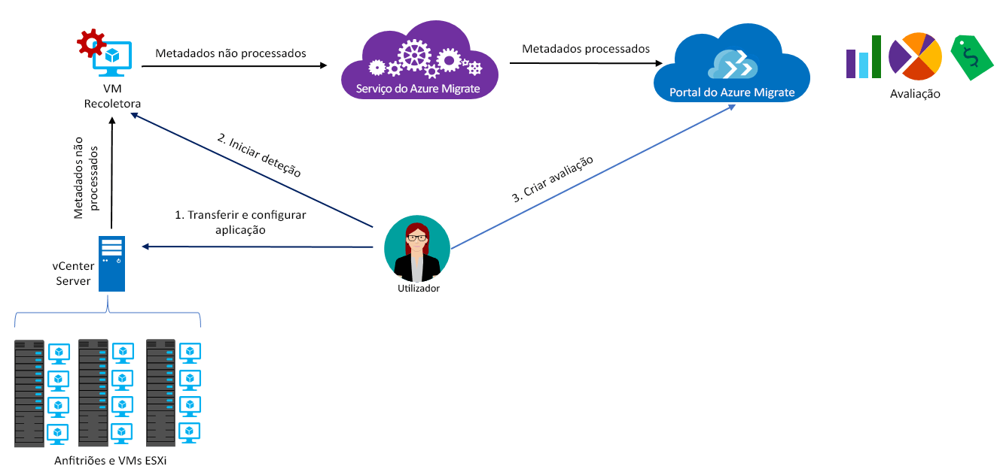

# Acerca do Azure Migrate

O serviço do Azure Migrate avalia as cargas de trabalho no local para migração para o Azure. O serviço avalia a adequabilidade de migração e o dimensionamento com base no desempenho e oferece estimativas de custos para executar as suas máquinas no local no Azure. Se estiver a considerar migrações lift-and-shift ou estiver nas primeiras etapas da migração, este serviço é para si. Após a avaliação, pode utilizar serviços como o Azure Site Recovery e o Azure Database Migration para migrar as máquinas para o Azure.

> [!NOTE]
> O Azure Migrate está atualmente em pré-visualização e suporta cargas de trabalho de produção.

## Porquê utilizar o Azure Migrate?

O Azure Migrate ajuda-o a:

- **Avaliar a preparação do Azure**: avaliar se as suas máquinas no local são adequadas para execução no Azure. 
- **Obter recomendações de tamanho**: obtenha recomendações de tamanho para as VMs do Azure, com base no histórico de desempenho das VMs no local. 
- **Estimar custos mensais**: obtenha custos estimados para executar máquinas no local no Azure.  
- **Migrar com confiança elevada**: visualize as dependências de máquinas no local para criar grupos de computadores que vai avaliar e migrar em conjunto. Pode ver com precisão as dependências de uma máquina específica ou de todas as máquinas de um grupo.

## Limitações atuais

- Atualmente, pode avaliar máquinas virtuais (VMs) do VMware no local para migração para VMs do Azure.

> [!NOTE]
> O suporte para o Hyper-V está nas previsões e será ativado brevemente. Até lá, recomendamos que utilize o [Planeador de Implementações do Azure Site Recovery](http://aka.ms/asr-dp-hyperv-doc) para planear a migração de cargas de trabalho do Hyper-V. 

- Pode detetar até 1000 VMs numa única deteção e até 1500 VMs num único projeto. Além disso, pode avaliar até 400 VMs numa única avaliação. Se precisar de detetar ou avaliar mais máquinas, pode aumentar o número de deteções ou de avaliações. [Saiba mais](how-to-scale-assessment.md).
- A VM que for avaliar tem de ser gerida por um vCenter Server, versão 5.5, 6.0 ou 6.5.
- Só pode criar projetos do Azure Migrate na região E.U.A. Centro-Oeste. No entanto, esta limitação não afeta a possibilidade de planear a sua migração para outra localização de destino do Azure. A localização do projeto de migração é utilizada apenas para armazenar os metadados detetados a partir do ambiente no local.
- O Azure Migrate só suporta discos geridos para avaliação de migrações.

## O que vou pagar?

O Azure Migrate está disponível sem custos adicionais. No entanto, durante a pré-visualização pública, podem ser aplicados custos adicionais de utilização de capacidades de visualização de dependências. Para suportar a [visualização de dependências](concepts-dependency-visualization.md), o Azure Migrate cria uma área de trabalho do Log Analytics por predefinição. Se utilizar a visualização de dependências ou utilizar a área de trabalho fora do Azure Migrate, a utilização da área de trabalho é cobrada. [Saiba mais](https://azure.microsoft.com/en-us/pricing/details/insight-analytics/) sobre os custos. Quando o serviço estiver disponível de modo geral, não haverá custos para a utilização das capacidades de visualização de dependências.

## Novidades nas avaliações

Uma avaliação ajuda-o a identificar a adequabilidade do Azure de VMs no local, obter recomendações de tamanho adequado e estimativas de custo para executar as VMs no Azure. As avaliações têm por base as definições resumidas na tabela abaixo. Pode modificar estas propriedades no portal do Azure Migrate. 

**Propriedade** | **Detalhes**
--- | ---
**Localização de destino** | A localização do Azure para a qual pretende migrar. Por predefinição, a localização de destino está definida para E.U.A. Oeste 2. 
**Redundância do armazenamento** | O tipo de armazenamento que as VMs do Azure vão utilizar após a migração. A predefinição é LRS.
**Planos de preços** | A avaliação tem em conta se está inscrito no Software Assurance e se pode utilizar o [Benefício de Utilização Híbrida do Azure](https://azure.microsoft.com/pricing/hybrid-use-benefit/). Também considera que ofertas do Azure serão aplicáveis e permite-lhe indicar descontos (%) específicos de subscrições, que pode acumular relativamente à oferta. 
**Escalão de preço** | Pode especificar o [escalão de preços (básico/standard)](../virtual-machines/windows/sizes-general.md) das VMs do Azure. Desta forma, pode migrar para uma família de VMs do Azure tendo em conta o facto de estar ou não num ambiente de produção. Por predefinição, é utilizado o escalão [standard](../virtual-machines/windows/sizes-general.md).
**Histórico de desempenho** | Por predefinição, o Azure Migrate avalia o desempenho das máquinas no local através de um mês do histórico, com um valor de percentil de 95%. Pode modificar esta definição.
**Fator de conforto** | O Azure Migrate considera uma memória intermédia (fator de conforto) durante a avaliação. Esta memória intermédia é aplicada em cima dos dados de utilização das VMs (CPU, memória, disco e rede). O fator de conforto dá conta de problemas como utilização sazonal, histórico de desempenho breve e prováveis aumentos na utilização futura.   Por exemplo, uma VM com 10 núcleos e 20% de utilização resulta, normalmente, numa VM de 2 núcleos. No entanto, com um fator de conforto de 2,0 x, o resultado é uma VM de 4 núcleos. A definição de conforto predefinida é 1,3x.

## Como funciona o Azure Migrate?

1.  Cria um projeto do Azure Migrate.
2.  O Azure Migrate utiliza uma VM no local, denominada aplicação recoletora, para detetar informações sobre as suas máquinas no local. Para criar a aplicação, transfira um ficheiro de configuração no formato Open Virtualization Appliance (.ova) e importe-o como VM no seu vCenter Server no local.
3.  Ao ligar-se à VM através da ligação de consola no vCenter Server, especifique uma nova palavra-passe para a VM durante a ligação e, em seguida, execute a aplicação de recoletor na VM para iniciar a deteção.
4.  O recoletor utiliza cmdlets do VMware PowerCLI para recolher os metadados da VM. A deteção é feita sem agentes e não instala nada nos anfitriões do VMware nem nas VMs. Os metadados recolhidos incluem informações da VM (núcleos, memória, discos, tamanhos de discos e adaptadores de rede). Também recolhe dados de desempenho das VMs, incluindo utilização da CPU e de memória, IOPS de disco, débito de disco (MBps) e saída de rede (MBps).
5.  Os metadados são enviados para o projeto do Azure Migrate. Pode vê-los no portal do Azure.
6.  Para efeitos da avaliação, agrupa as VMs detetadas em grupos. Por exemplo, pode agrupar VMs que executem a mesma aplicação. Para um agrupamento mais preciso, pode utilizar a visualização de dependências para ver as dependências de uma máquina específica ou para todas as máquinas de um grupo e refinar o grupo.
7.  Assim que o grupo é formado, crie uma avaliação para o grupo. 
8.  Depois de concluída a avaliação, pode vê-la no portal ou transferi-la no formato Excel.

  

## Quais são os requisitos de porta?

A tabela resume as portas necessárias para as comunicações do Azure Migrate.

|Componente          |Para comunicar com     |Porta necessária  |Razão   |
|-------------------|------------------------|---------------|---------|
|Recoletor          |Serviço do Azure Migrate   |TCP 443        |O recoletor liga-se ao serviço através da porta SSL 443|
|Recoletor          |vCenter Server          |Predefinição 9443   | Por predefinição, o recoletor liga-se ao vCenter Server na porta 9443. Se o servidore escutar noutra porta, esta deve ser configurada como porta de saída na VM do recoletor. |
|VM no local     | Área de trabalho do Operations Management Suite (OMS)          |[TCP 443](../log-analytics/log-analytics-windows-agent.md) |O agente MMA utiliza a TCP 443 para ligar ao Log Analytics. Só precisa desta porta se estiver a utilizar a funcionalidade de visualização de dependências e a instalar o MMA (Microsoft Monitoring Agent). |

  
## O que acontece após a avaliação?

Depois de avaliar as máquinas no local para migração com o serviço do Azure Migrate, pode utilizar algumas ferramentas para realizá-la:

- **Azure Site Recovery**: pode utilizar o Azure Site Recovery para migrar para o Azure, da seguinte forma:
  - Prepare os recursos do Azure, incluindo uma subscrição do Azure, uma rede virtual do Azure e uma conta de armazenamento.
  - Prepare os seus servidores VMware no local para a migração. Verifique os requisitos de suporte do VMware para o Site Recovery, prepare os servidores VMware para deteção e prepare a instalação do serviço Site Recovery Mobility nas VMs que vai migrar. 
  - Configure a migração. Vai configurar um cofre dos Serviços de Recuperação, as definições de migração de origem e de destino, uma política de replicação e vai ativar a replicação. Pode executar um teste de recuperação após desastre para confirmar que a migração das VMs para o Azure está a funcionar corretamente.
  - Execute uma ativação pós-falha para migrar máquinas no local para o Azure. 
  - [Saiba mais](../site-recovery/tutorial-migrate-on-premises-to-azure.md) no tutorial de migração do Site Recovery.

- **Azure Database Migration**: se as suas máquinas no local estiverem a executar uma base de dados, como SQL Server, MySQL ou Oracle, pode utilizar o serviço do Azure Database Migration para migrá-las para o Azure. [Saiba mais](https://azure.microsoft.com/campaigns/database-migration/).

## Passos seguintes 
[Siga o tutorial](tutorial-assessment-vmware.md) para criar uma avaliação para uma VM do VMware no local.