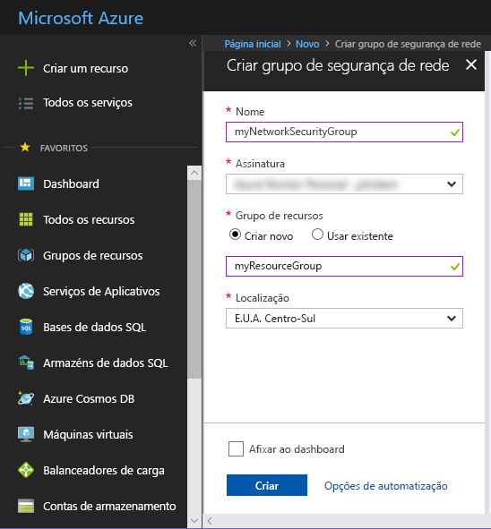
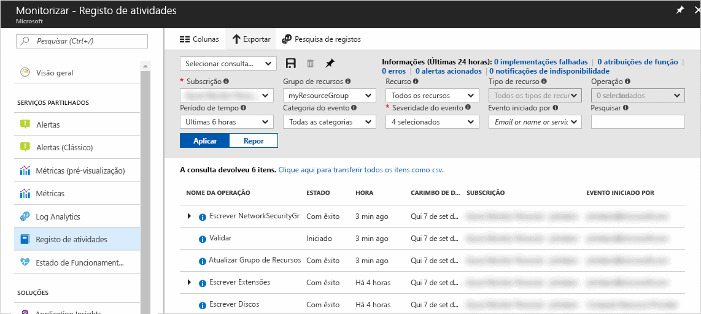
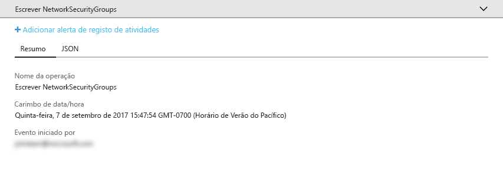
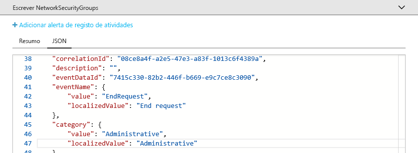
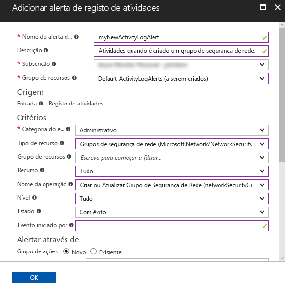
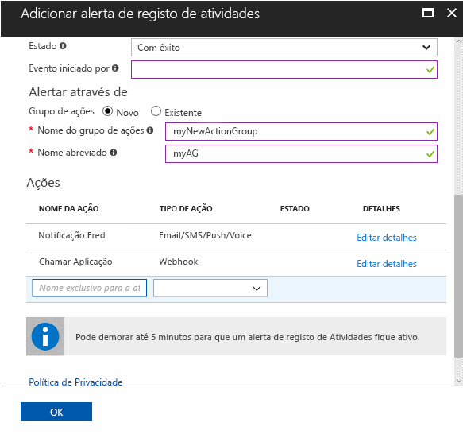

# Auditoria e receber notificações sobre ações importantes efetuadas na sua subscrição do Azure

O **Registo de Atividades do Azure** disponibiliza um histórico de eventos ao nível da subscrição no Azure. Fornece informações sobre *quem* criou, atualizou ou eliminou *que* recursos e *quando* o fizeram. Pode criar um **alerta de Registo de Atividades** para receber notificações por e-mail, SMS ou webhook quando ocorrer uma atividade que corresponda às suas condições de alerta. Este Início Rápido aborda a criação de um grupo de segurança de rede simples, a pesquisa no Registo de Atividades para compreender o evento ocorrido e a criação de um alerta de Registo de Atividades para ser notificado quando qualquer grupo de segurança de rede for criado.

Se não tiver uma subscrição do Azure, crie uma conta [gratuita](https://azure.microsoft.com/free/) antes de começar.

## Iniciar sessão no portal do Azure

Inicie sessão no [Portal do Azure](https://portal.azure.com/).

## Criar um grupo de segurança de rede

1. Clique no botão **Novo** localizado no canto superior esquerdo do portal do Azure.

2. Selecione **Rede**, selecione **Grupo de segurança de rede**.

3. Introduza "myNetworkSG" como **Nome** e crie um novo grupo de recursos chamado **myResourceGroup**. Clique no botão **Criar**.

    

## Procurar o Registo de Atividades no portal

Foi adicionado um evento ao Registo de Atividades que descreve a criação do grupo de segurança de rede. Utilize as instruções seguintes para identificar esse evento.

1. Clique no botão **Monitorizar** existente na lista de navegação esquerda. Abre a secção Registo de Atividades. Esta secção contém um histórico de todas as ações que os utilizadores executaram nos recursos da sua subscrição, filtrável por várias propriedades, tais como **Grupo de Recursos**, **Período de Tempo** e **Categoria**.

2. Na secção **Registo de Atividades**, clique na lista pendente **Grupo de Recursos** e selecione **myResourceGroup**. Altere a lista pendente **Período de Tempo** para **Última 1 hora**. Clique em **Aplicar**.

    

3. Clique no evento **Escrever NetworkSecurityGroups** na tabela de eventos apresentada.

## Procurar um evento no Registo de Atividades

A secção apresentada contém os detalhes básicos da operação efetuada, incluindo o nome, o período de tempo e o utilizador ou a aplicação que a efetuou.

Clique no separador **JSON** para ver os detalhes completos do evento. Isto inclui os detalhes sobre a forma como a aplicação ou o utilizador foi autorizado a efetuar a operação, a categoria e o nível do evento, e o estado da operação.

## Criar um alerta de Registo de Atividades

1. Clique no separador **Resumo** para voltar ao resumo de eventos.

2. Na secção de resumo apresentada, clique em **Adicionar alerta de registo de atividades**.

    

3. Na secção apresentada, dê um nome e uma descrição ao alerta de Registo de Atividades.

4. Em **Critérios**, certifique-se de que a **Categoria do evento** está definida como **Administrativa**, o **Tipo de recurso** está definido como **Grupos de segurança de rede**, o **Nome da operação** está definido como **Criar ou Atualizar Grupo de Segurança de Rede**, o **Estado** está definido como **Com êxito** e todos os outros campos de critérios estão em branco ou definidos como **Tudo**. Os critérios definem as regras utilizadas para determinar se o alerta deve ser ativado quando for apresentado um novo evento no Registo de Atividades.

    

5. Em **Alertar através de**, selecione **Novo** grupo de ação e forneça um **nome** e um **nome abreviado** para o grupo de ação. O grupo de ação define o conjunto de ações executadas quando o alerta é ativado (quando os critérios correspondem a um novo evento).

6. Em **Ações**, adicione 1 ou mais ações ao fornecer um **Nome** para a ação, o **Tipo de ação** (por exemplo, e-mail ou SMS) e os **Detalhes** para esse tipo de ação específico (por exemplo, um URL do webhook, endereço de e-mail ou número SMS).

    

7. Clique em **OK** para guardar o alerta de Registo de Atividades.

## Testar o alerta de Registo de Atividades

> [!NOTE]
> Demora cerca de 10 minutos para que um alerta de Registo de Atividades fique totalmente ativado. Os novos eventos ocorridos antes de o alerta de Registo de Atividades ficar totalmente ativado não geram notificações.
>
>

Para testar o alerta, repita a secção anterior para **Criar um grupo de segurança de rede**, mas dê um nome diferente este grupo de segurança de rede e reutilize o grupo de recursos existente. Decorridos alguns minutos, irá receber uma notificação de criação do grupo de segurança de rede.

## Limpar recursos

Quando deixar de ser necessário, elimine o grupo de recursos e o grupo de segurança de rede. Para tal, escreva o nome do grupo de recursos criado na caixa de pesquisa existente na parte superior do portal e clique no nome do grupo de recursos. Na secção apresentada, clique no botão **Eliminar grupo de recursos**, escreva o nome do grupo de recursos e clique em **Eliminar**.

## Passos seguintes

Neste início rápido, efetuou uma operação para gerar um evento de Registo de Atividades e, em seguida, criou um alerta de Registo de Atividades para ser notificado quando esta operação ocorrer novamente no futuro. Em seguida, testou o alerta efetuando novamente essa operação. O Azure disponibiliza os eventos do Registo de Atividades dos últimos 90 dias. Se precisar de reter os eventos mais de 90 dias, tente arquivar os dados do Registo de Atividades juntamente com outros dados de monitorização.

> [!div class="nextstepaction"]
> [Arquivamento dos dados de monitorização](./monitor-tutorial-archive-monitoring-data.md)
