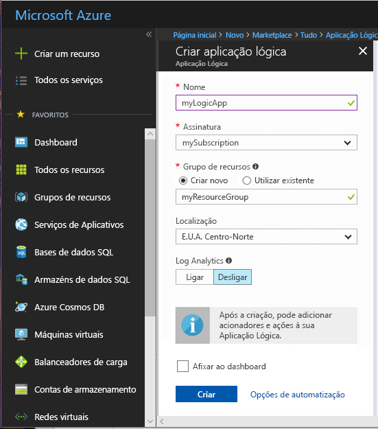
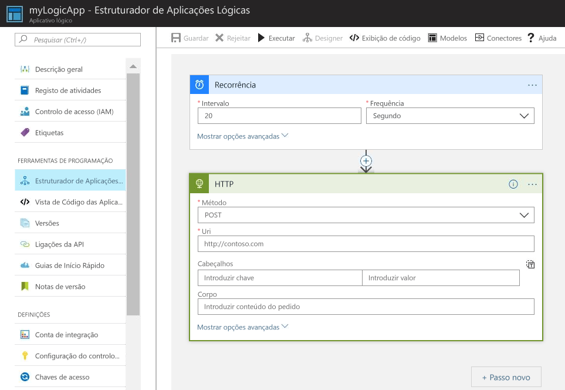
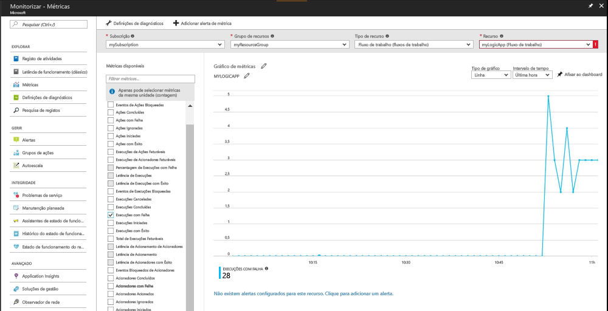
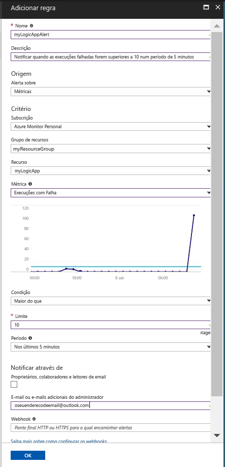

# Receber uma notificação quando um valor métrico cumpre uma condição

O Azure Monitor disponibiliza métricas para diversos recursos do Azure. Estas métricas são indicadoras do desempenho e do estado de funcionamento desses recursos. Em muitos casos, as métricas identificam um problema com um recurso. Pode criar alertas de métricas para monitorizar comportamento anormal e ser notificado se tal ocorrer. Este Início Rápido descreve a criação de uma Aplicação Lógica, a criação de uma tarefa e a visualização das métricas da aplicação lógica. Em seguida, aborda a criação de um alerta e a receção de uma notificação para uma métrica para o recurso da Aplicação Lógica.

Para obter mais informações sobre as métricas e os alertas de métricas, consulte [Descrição geral das métricas do Azure Monitor](./monitoring-overview-metrics.md) e [Descrição geral dos alertas do Azure Monitor](./monitoring-overview-alerts.md). 

Se não tiver uma subscrição do Azure, crie uma conta [gratuita](https://azure.microsoft.com/free/) antes de começar.

## Iniciar sessão no portal do Azure

Inicie sessão no [Portal do Azure](https://portal.azure.com/).

## Criar uma Aplicação Lógica

1. Clique no botão **Novo** localizado no canto superior esquerdo do portal do Azure.

2. Pesquise e selecione **Aplicação Lógica**. Crie um novo grupo de recursos chamado **myResourceGroup**. Utilize a localização predefinida. Clique no botão **Criar**.

3. Introduza as informações da aplicação lógica e selecione a opção **Afixar no Dashboard**. Quando terminar, clique em **Criar**.

      

4. A aplicação lógica deve ser afixada ao dashboard. Navegue para a aplicação lógica clicando na mesma.

5. No painel Aplicação Lógica, selecione o **Estruturador da Aplicação Lógica**

       

6. Configure os valores com base no diagrama seguinte.

    . 

7. No estruturador, selecione o acionador **Periodicidade**.

8. Defina um intervalo de 20 e uma frequência de segundo para garantir que a sua aplicação lógica é acionada a cada 20 segundos.

9. Clique no botão **Novo Passo** e selecione **Adicionar uma ação**.

10. Escolha a opção **HTTP** e selecione **HTTP-HTTP**.

11. Defina o **Método** como POST e o **Uri** para um endereço Web à sua escolha.

12. Clique em **Guardar**.

## Ver as métricas da aplicação lógica

1. Clique na opção **Monitorizar** existente no painel de navegação esquerdo.

2. Selecione o separador **Métricas**, preencha as informações de **Subscrição**, **Grupo de Recursos**, **Tipo de Recurso** e **Recurso** para a sua aplicação lógica.

3. Na lista de métricas, escolha **Execuções iniciadas**.

4. Modifique o **Intervalo de tempo** do gráfico para apresentar dados da última hora.

5. Agora, deverá ver um gráfico que representa o número total de execuções iniciadas pela aplicação lógica na última hora.

    

## Criar um alerta de métrica para a aplicação lógica

1.  Na parte superior direita do painel métricas, clique no botão **Adicionar alerta de métrica**.

2. Dê o nome "myLogicAppAlert" ao alerta de métrica e forneça uma breve descrição do alerta.

3. Defina a **Condição** do alerta de métrica como "Maior que", defina o **Limiar** como "10" e defina o **Período** como "Nos últimos 5 minutos".

4. Por fim, em **E-mail(s) adicional(is) do administrador**, introduza o seu endereço de e-mail. Este alerta garante que recebe uma mensagem de e-mail quando a aplicação lógica tiver mais de 10 execuções falhadas num período de 5 minutos.

    

## Receber notificações de alerta de métrica para a aplicação lógica
1. Decorridos alguns instantes, deverá receber uma mensagem de e-mail dos "Alertas do Microsoft Azure" para o informar de que o alerta foi "ativado".

2. Navegue para a aplicação lógica e modifique o acionador de periodicidade para um intervalo de 1 e uma frequência de hora.

3. Decorridos alguns minutos, deverá receber um e-mail dos "Alertas do Microsoft Azure" para o informar de que o alerta foi "resolvido".

## Limpar recursos

O conteúdo deste início rápido é aprofundado por outros inícios rápidos desta coleção. Se planeia continuar a trabalhar com inícios rápidos subsequentes ou com os tutoriais, não limpe os recursos criados neste início rápido. Se não pretender continuar, utilize os passos seguintes para eliminar todos os recursos criados por este guia de introdução no portal do Azure.

1. No menu esquerdo no portal do Azure, clique em **Monitorizar**.

2. Selecione o separador **Alertas**, localize o alerta que criou neste guia de início rápido e clique no mesmo.

3. No painel de alerta de métrica, clique em **Eliminar**.

4. No menu esquerdo no portal do Azure, pesquise **Aplicação Lógica** e, em seguida, clique em **Aplicações lógicas**.

5. No painel, clique na aplicação lógica que criou neste início rápido na caixa de texto e, em seguida, clique em **Eliminar**.

## Passos seguintes

Neste início rápido, aprendeu a criar um alerta de métrica para os seus recursos. Para obter mais informações sobre alertas de métricas, clique para aceder à descrição geral dos alertas.

> [!div class="nextstepaction"]
> [Alertas de ação de subscrição do Azure Monitor](./monitor-quick-audit-notify-action-in-subscription.md )
