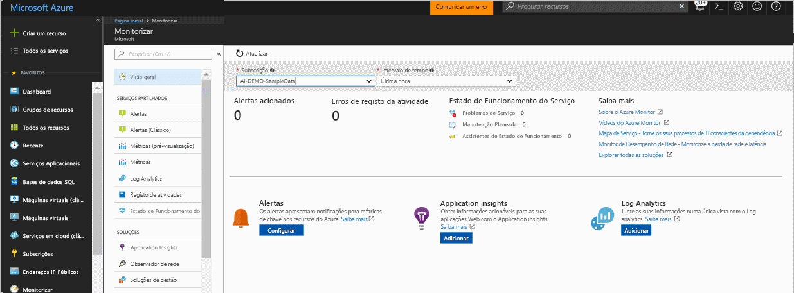
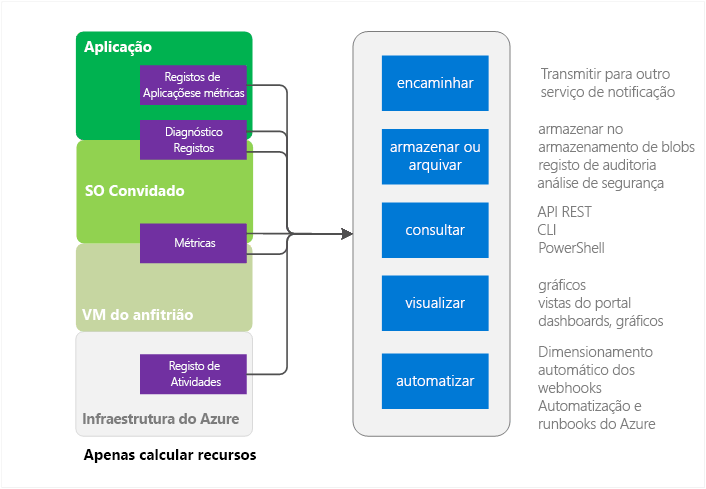
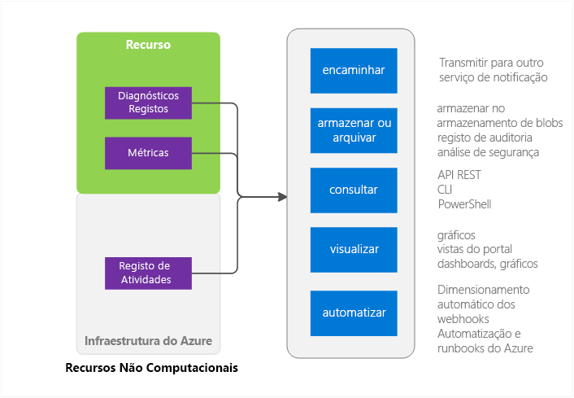

# Descrição geral do Azure Monitor
Este artigo disponibiliza uma descrição geral do serviço Azure Monitor no Microsoft Azure. Aborda aquilo que o Azure Monitor faz e fornece indicações para informações adicionais sobre como utilizar o Azure Monitor.  Se preferir uma introdução em vídeo, consulte as ligações de Passos seguintes na parte inferior deste artigo. 

## O Azure Monitor e os outros produtos de monitorização da Microsoft
O Azure Monitor fornece métricas de infraestrutura de nível base e registos para a maioria dos serviços do Microsoft Azure. Os serviços do Azure que ainda não inserem os seus dados no Azure Monitor irão fazê-lo no futuro.

A Microsoft fornece produtos e serviços adicionais que fornecem capacidades de monitorização adicionais para os programadores, DevOps ou operações de TI que também têm as instalações no local. Para uma descrição geral e a compreensão sobre como estes produtos e serviços diferentes funcionam em conjunto, consulte [Monitorização no Microsoft Azure](monitoring-overview.md).

## Página de descrição geral do portal

O Azure Monitor tem uma página de destino que ajuda os utilizadores: 
- A compreender as capacidades de monitorização oferecidas pelo Azure.
- A detetar, configurar e integrar a plataforma Azure e as suas capacidades de monitorização Premium.

A página é um ponto de partida para navegação, incluindo integração. Mostra problemas relevantes organizados de diferentes serviços e permite ao utilizador navegar até aos mesmos em contexto.
 

Quando abrir a página, pode selecionar de entre as subscrições a que tem acesso de leitura. Para uma subscrição selecionada, poderá ver:

- **Alertas acionados e origem dos alertas** — esta tabela mostra as contagens resumidas, origens de alerta, e quantas vezes os alertas foram acionados no período de tempo selecionado. Aplica-se tanto aos alertas mais antigos como aos mais recentes. Leia mais sobre os [alertas mais recentes do Azure](monitoring-overview-unified-alerts.md). 
- **Erros de registo de atividades** — se qualquer um dos seus recursos do Azure registar eventos com uma gravidade de nível de erro, poderá ver uma contagem de alto nível e clicar para ir à página de registo de atividades para investigar cada evento.
- **Azure Service Health** — pode ver uma contagem de problemas do serviço do Service Health, eventos de manutenção planeada e avisos de estado de funcionamento. O Azure Service Health fornece informação personalizada quando há problemas na infraestrutura Azure que afetam os serviços.  Consulte [Azure Service Health](../service-health/service-health-overview.md) para obter mais informações.  
- **Application Insights** — Consulte KPIs para cada recurso AppInsights na subscrição atual. Os KPIs estão otimizados para monitorização, entre as aplicações Web do ASP.NET, Java, Node e tipos gerais de aplicação. Os KPIs incluem métricas de taxa do pedido, duração de resposta, taxa de falhas e % de disponibilidade. 

Se ainda não integrou o Log Analytics ou o Application Insights, ou se não configurou quaisquer alertas do Azure na subscrição atual, a página fornece ligações para iniciar o processo de integração.

## Origens do Azure Monitor — Subconjunto de computação

Os serviços de computação aqui incluem 
- Serviços Cloud 
- Virtual Machines 
- Conjuntos de Dimensionamento de Máquinas Virtuais 
- Service Fabric

### Aplicação — Registos de diagnóstico, Registos de aplicações e Métricas
As aplicações podem ser executadas sobre o SO Convidado no modelo de computação. Estas emitem os seus próprios conjuntos de registos e métricas. O Azure Monitor baseia-se na extensão de diagnóstico do Azure (Windows ou Linux) para recolher a maioria dos registos e métricas ao nível de aplicação. Os tipos incluem

* Contadores de desempenho
* Registos de Aplicações
* Registos de Eventos do Windows
* Origem de evento de .NET
* Registos do IIS
* ETW com base em manifesto
* Informações de falha de sistema
* Registos de erros do cliente

Sem a extensão de diagnóstico, estão disponíveis apenas algumas métricas, como a utilização de CPU. 

### Métricas de anfitrião e convidado de VM
Os recursos de computação listados anteriormente têm uma VM anfitriã dedicada e um SO convidado com o qual interagem. A VM anfitriã e o SO convidado são equivalentes a VM de raiz e VM convidada no modelo de hipervisor Hyper-V. Pode recolher métricas em ambos. Também pode recolher registos de diagnóstico no SO convidado.   

### Registo de Atividades
Pode pesquisar o Registo de Atividades (anteriormente denominado Registo de Auditoria ou Operacional) para obter informações sobre o seu recurso tal como é visto pela infraestrutura do Azure. O registo contém informações como as horas a que os recursos são criados ou destruídos.  Para obter mais informações, consulte [Descrição geral do Registo de atividades](monitoring-overview-activity-logs.md). 

## Origens do Azure Monitor — tudo o resto

### Recurso — Métricas e Registos de Diagnóstico
Os registos de métricas e diagnóstico coletáveis variam com base no tipo de recurso. Por exemplo, as Aplicações Web fornecem estatísticas sobre E/S de disco e percentagem de CPU. Essas métricas não existem para uma fila do Microsoft Azure Service Bus que, em vez disso, fornece métricas como tamanho da fila e débito de mensagem. Uma lista de métricas coletáveis para cada recurso encontra-se disponível em [métricas suportadas](monitoring-supported-metrics.md). 

### Métricas de anfitrião e convidado de VM
Não há necessariamente um mapeamento de 1:1 entre o recurso e uma VM anfitriã ou convidada específica, portanto as métricas não estão disponíveis.

### Registo de Atividades
O registo de atividades é igual aos recursos de computação.  

## Utilizações para Dados de Monitorização
Depois de recolher os dados, pode fazer o seguinte com eles no Azure Monitor.

### Encaminhar
Pode transmitir em fluxo dados de monitorização para outras localizações. 

Os exemplos incluem:

- Enviar para o Application Insights para poder utilizar as suas ferramentas mais ricas de visualização e análise.
- Enviar para os Hubs de Eventos, para que possa encaminhar para as ferramentas de terceiros. 

### Armazenar e Arquivar
Alguns dados de monitorização já estão armazenados e disponíveis no Azure Monitor por um período de tempo definido. 
- As métricas ficam armazenadas durante 90 dias. 
- As entradas de registo de atividades são armazenadas durante 90 dias. 
- Os registos de diagnóstico não são armazenados. 

Se pretender armazenar dados por mais tempo do que os períodos listados acima, poderá utilizar um armazenamento do Azure. Os dados de monitorização são mantidos na sua conta de armazenamento com base na política de retenção que definir. Terá de pagar pelo espaço que os dados ocupam no armazenamento do Azure. 

Algumas formas de utilizar estes dados:

- Uma vez escritos, outras ferramentas dentro ou fora do Azure poderão lê-los e processá-los.
- Transferir os dados localmente para um arquivo local ou alterar a sua política de retenção na nuvem para manter os dados por períodos de tempo prolongados.  
- Deixar os dados no armazenamento do Azure indefinidamente para efeitos de arquivo. 

### Consulta
Pode utilizar a API REST do Azure Monitor, comandos de Interface de linha de comandos (CLI) para várias plataformas, os cmdlets do PowerShell ou o SDK do .NET para aceder aos dados no sistema ou armazenamento do Azure

Os exemplos incluem:

* Obter dados para uma aplicação de monitorização personalizada que escreveu
* Criar consultas personalizadas e enviar esses dados para uma aplicação de terceiros.

### Visualizar
Visualizar os seus dados de monitorização nos elementos visuais e gráficos ajuda-o a localizar tendências mais rapidamente do que analisando os dados propriamente ditos.  

Alguns métodos de visualização incluem:

* Utilizar o portal do Azure
* Encaminhar dados para o Azure Application Insights
* Encaminhar dados para o Microsoft PowerBI
* Encaminhar os dados para uma ferramenta de visualização de terceiros utilizando transmissão em fluxo em direto ou fazendo com que a ferramenta leia a partir de um arquivo no armazenamento do Azure

### Automatizar
> [!NOTE]
> Como parte da evolução em curso de alertas no Microsoft Azure, uma experiência unificada de alertas está agora disponível. Obter mais detalhes sobre os [novos alertas do Azure](monitoring-overview-unified-alerts.md)

Nos alertas do Azure, pode utilizar dados de monitorização para acionar alertas até processos inteiros. Os exemplos incluem:

* Utilizar dados para dimensionamento automático, reduzindo ou aumentando instâncias de computação com base na carga de aplicação.
* Enviar e-mails com base em condições de métricas ou de registo. 
* Chamar um URL de Web (webhook) para executar uma ação num sistema fora do Azure
* Iniciar um runbook na automatização do Azure para efetuar qualquer variedade de tarefas

## Métodos para aceder ao Azure Monitor
Em geral, pode manipular o rastreio, encaminhamento e obtenção de dados através de um dos seguintes métodos. Nem todos os métodos estão disponíveis para todas as ações ou tipos de dados.

* [Portal do Azure](https://portal.azure.com)
* [PowerShell](insights-powershell-samples.md)  
* [Interface de Linha de Comandos (CLI) de várias plataformas](insights-cli-samples.md)
* [API REST](https://docs.microsoft.com/rest/api/monitor/)
* [SDK do .NET](http://www.nuget.org/packages/Microsoft.Azure.Management.Monitor)

## Passos seguintes
Mais informações sobre
- Um vídeo com instruções apenas do Azure Monitor encontra-se disponível em  
[Introdução ao Azure Monitor](https://channel9.msdn.com/Blogs/Azure-Monitoring/Get-Started-with-Azure-Monitor). 
- Um vídeo a explicar um cenário em que pode utilizar o Azure Monitor está disponível em [explorar a monitorização e diagnóstico do Microsoft Azure](https://channel9.msdn.com/events/Ignite/2016/BRK2234) e [Azure Monitor num vídeo da Ignite 2016](https://myignite.microsoft.com/videos/4977).
- Examinar a interface do Azure Monitor em [Introdução ao Azure Monitor](monitoring-get-started.md)
- Configurar as [Extensões de Diagnóstico do Microsoft Azure](../azure-diagnostics.md) se está a tentar diagnosticar problemas no seu Serviço cloud, na VM, nos conjuntos de dimensionamento da Máquinas Virtuais ou na aplicação Service Fabric.
- O [Application Insights](https://azure.microsoft.com/documentation/services/application-insights/) – se estiver a tentar diagnosticar problemas na Aplicação Web do Serviço de Aplicações.
- [Resolução de problemas de Armazenamento do Microsoft Azure](../storage/common/storage-e2e-troubleshooting.md) ao utilizar Blobs, tabelas ou filas de armazenamento
- [Log Analytics](https://azure.microsoft.com/documentation/services/log-analytics/)
