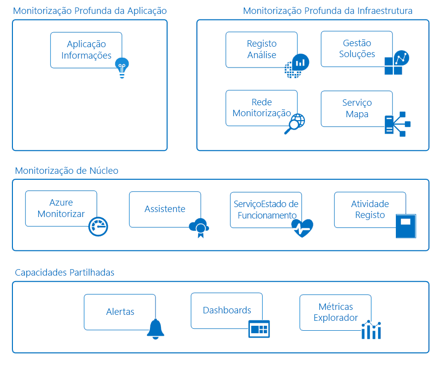

# Monitorizar aplicações e recursos do Azure

A monitorização é o ato de recolha e análise de dados para determinar o desempenho, o estado de funcionamento e a disponibilidade da sua aplicação empresarial e dos recursos de que esta depende. Uma estratégia de monitorização efetiva ajuda-o a compreender o funcionamento em detalhe dos componentes da sua aplicação. Também o ajuda a aumentar o tempo de atividade, através da notificação proativa dos problemas críticos, de modo a que possa resolvê-los antes que se tornem graves.

O Azure inclui vários serviços que efetuam individualmente uma tarefa ou função específica no espaço de monitorização. Em conjunto, estes serviços fornecem uma solução abrangente para recolher, analisar e atuar na telemetria da aplicação e dos recursos do Azure que a suportam. Podem também funcionar para monitorizar recursos críticos no local e fornecer um ambiente de monitorização híbrido. Compreender as ferramentas e os dados que estão disponíveis é o primeiro passo para o desenvolvimento de uma estratégia completa de monitorização para a sua aplicação.

O diagrama seguinte mostra uma vista conceptual dos componentes que funcionam em conjunto para fornecer a monitorização dos recursos do Azure. As secções seguintes descrevem estes componentes e fornecem ligações para informações técnicas detalhadas.

## Capacidades Partilhadas
O serviço de monitorização principal e aprofundada partilha a funcionalidade que fornece as seguintes capacidades.

### Alertas
Os [alertas do Azure](../monitoring-and-diagnostics/monitoring-overview-alerts.md) notificam-no de forma proativa de situações críticas e, potencialmente, tomam medidas corretivas. As regras de alertas podem utilizar dados de várias origens, incluindo métricas e registos. Utilizam [grupos de ação](../monitoring-and-diagnostics/monitoring-action-groups.md), que contêm conjuntos exclusivos de destinatários e ações em resposta a um alerta. Com base nos seus requisitos, pode ter alertas a iniciar ações externas através de webhooks e a integrarem-se com as ferramentas ITSM.

### Dashboards
Pode utilizar [dashboards do Azure](../azure-portal/azure-portal-dashboards.md) para combinar diferentes tipos de dados num painel único do [portal do Azure](https://portal.azure.com). Em seguida, pode partilhar o dashboard com outros utilizadores do Azure.

Por exemplo, pode criar um dashboard para combinar:
- Mosaicos que mostram um gráfico de métricas
- Uma tabela dos registos de atividades
- Um gráfico de utilização do Application Insights
- O resultado de uma pesquisa de registos no Log Analytics

Também pode exportar os dados do Log Analytics para o [Power BI](https://docs.microsoft.com/power-bi/). Aqui, pode tirar partido de visualizações adicionais. Também pode disponibilizar os dados para outras pessoas dentro e fora da sua organização.

### Explorador de Métricas
As [métricas](../monitoring-and-diagnostics/monitoring-overview-metrics.md) são valores numéricos gerados por um recurso do Azure para o ajudar a compreender a operação e o desempenho do recurso. Ao utilizar o Explorador de Métricas, pode enviar ao Log Analytics métricas para análise com dados de outras origens.

## Monitorização principal
A monitorização principal fornece monitorização fundamental e necessária em todos os recursos do Azure. Estes serviços necessitam de configuração mínima e recolhem telemetria de núcleo que os serviços de monitorização premium utilizam.    

### Azure Monitor
O [Azure Monitor](../monitoring-and-diagnostics/monitoring-overview-azure-monitor.md) permite a monitorização principal dos serviços do Azure, além da recolha de [métricas](../monitoring-and-diagnostics/monitoring-overview-metrics.md), de [registos de atividades](../monitoring-and-diagnostics/monitoring-overview-activity-logs.md) e de [registos de diagnóstico](../monitoring-and-diagnostics/monitoring-overview-of-diagnostic-logs.md). Por exemplo, o registo de atividade indica quando são criados ou modificados os novos recursos.

Estão disponíveis métricas que fornecem estatísticas de desempenho de recursos diferentes e, mesmo, do sistema operativo no interior de uma máquina virtual. Pode ver estes dados com um dos exploradores no portal do Azure e criar alertas com base nestas métricas. O Azure Monitor fornece o pipeline de métricas mais rápido (de 5 minutos a 1 minuto), pelo que deve utilizá-lo para notificações e alertas críticos de tempo.

Também pode enviar estas métricas e registos para o Log Analytics do Azure para a análise detalhada e das tendências ou para criar regras de alerta adicionais para o notificar proativamente de problemas críticos como resultado dessa análise.  

> [!NOTE]
> Atualmente, o envio de métricas multidimensionais para o Log Analytics através das definições de diagnóstico não é suportado. As métricas com dimensões são exportadas como métricas dimensionais simples e agregadas em valores de dimensões.
>
> *Por exemplo*: a métrica “Mensagens Recebidas” num hub do Hub de Eventos pode ser explorada e representada ao nível da linha. No entanto, se for exportada para o Log Analytics, a métrica será representada como todas as mensagens recebidas em todas as filas do Hub de Eventos.
>
>

### Azure Advisor
O [Assistente do Azure](../advisor/advisor-overview.md) monitoriza constantemente a telemetria de configuração e de utilização dos recursos. Fornece-lhe, em seguida, recomendações personalizadas com base nas melhores práticas. Seguir estas recomendações ajuda a melhorar o desempenho, a segurança e a disponibilidade dos recursos que suportam as aplicações.

### Service Health
O estado de funcionamento da aplicação baseia-se nos serviços do Azure de que depende. O [Azure Service Health](../service-health/service-health-overview.md) identifica quaisquer problemas com os serviços do Azure que podem afetar a aplicação. O Service Health também o ajuda a planear a manutenção agendada.

### Registo de Atividades
O [Registo de Atividades](../monitoring-and-diagnostics/monitoring-overview-activity-logs.md) fornece dados sobre o funcionamento de um recurso do Azure. Estas informações incluem:
- As alterações de configuração do recurso.
- Os incidentes do estado de funcionamento do serviço.
- As recomendações para uma melhor utilização dos recursos.
- As informações relacionadas com as operações de dimensionamento automático.

Pode ver os registos de um recurso específico na página do portal do Azure. Ou, pode ver os registos de vários recursos no Explorador de Registo de Atividades.

Também pode enviar entradas do registo de atividades para o Log Analytics. Aqui, pode analisar os registos através dos dados recolhidos por soluções de gestão, por agentes em máquinas virtuais e por outras origens.

## Serviços de monitorização aprofundada
Os seguintes serviços do Azure fornecem capacidades avançadas para recolher e analisar dados de monitorização a um nível mais aprofundado. Estes serviços baseiam-se na monitorização principal e tiram partido das funcionalidades comuns do Azure. Fornecem análises poderosas com os dados recolhidos para lhe dar informações exclusivas sobre as aplicações e a infraestrutura. Os dados são apresentados no contexto de cenários que são direcionados para diferentes públicos.

## Monitorização aprofundada de aplicações
### Application Insights
Pode utilizar o [Azure Application Insights](http://azure.microsoft.com/documentation/services/application-insights) para monitorizar a disponibilidade, o desempenho e a utilização da aplicação, quer esteja alojada na cloud quer no local.

Ao instrumentar a aplicação para funcionar com o Application Insights, pode obter conhecimentos aprofundados e implementar cenários de DevOps. Pode identificar e diagnosticar erros rapidamente sem ter de esperar que um utilizador os comunique. Com as informações que recolher, pode fazer escolhas informadas sobre a manutenção e as melhorias da aplicação.

O Application Insights tem um vasto conjunto ferramentas para interagir com os dados que recolhe. O Application Insights armazena os dados num repositório comum. Pode tirar partido de funcionalidades partilhadas como alertas, dashboards e a análise detalhada graças à linguagem de consulta do Log Analytics.

## Monitorização aprofundada das infraestruturas
### Log Analytics
O [Log Analytics](http://azure.microsoft.com/documentation/services/log-analytics) desempenha um papel central na monitorização do Azure através da recolha de dados de uma variedade de recursos (incluindo ferramentas de terceiros) num único repositório central. Aqui, pode analisar os dados ao utilizar uma linguagem de consulta poderosa.

O Application Insights e o Centro de Segurança do Azure armazenam os dados no arquivo de dados do Log Analytics e utilizam o seu motor de análise. Também são recolhidos dados do Azure Monitor, de soluções de gestão e de agentes instalados em máquinas virtuais na cloud ou no local. Esta funcionalidade partilhada ajuda-o a formar uma visão geral do seu ambiente.

### Soluções de gestão
As [soluções de gestão](../log-analytics/log-analytics-add-solutions.md) são conjuntos de lógica em pacote que fornecem informações para uma determinada aplicação ou serviço. Baseiam-se no Log Analytics para armazenar e analisar os dados de monitorização que recolhem.

As soluções de gestão são disponibilizadas pela Microsoft e parceiros para fornecer monitorização de vários serviços do Azure e de terceiros. Exemplos de monitorização de soluções:
* [Monitorização do Contentor](../log-analytics/log-analytics-containers.md), que o ajuda a ver e a gerir os anfitriões de contentor.
* [Análise de SQL do Azure](../log-analytics/log-analytics-azure-sql.md), que recolhe e visualiza métricas de desempenho de bases de dados SQL do Azure.

Pode ver todas as soluções de gestão disponíveis no Portal do Azure, no ecrã *Monitor*.

### Monitorização de Rede
Existem várias ferramentas que trabalham em conjunto para monitorizar diferentes aspetos da sua rede no Azure ou no local.  

O [Observador de Rede](../network-watcher/network-watcher-monitoring-overview.md) fornece monitorização e diagnósticos baseados em cenários para diferentes cenários de rede no Azure. Armazena os dados nas métricas e nos diagnósticos do Azure para análise adicional. Funciona com as seguintes soluções para monitorização de diferentes aspetos da rede.

O [Monitor de Desempenho de Rede (NPM)](../log-analytics/log-analytics-network-performance-monitor.md) é uma solução de monitorização de rede com base na cloud que monitoriza a conectividade entre nuvens públicas, centros de dados e ambientes no local.

O [Monitor do ExpressRoute](../expressroute/how-to-npm.md) é uma capacidade do NPM que monitoriza a conetividade ponto a ponto e o desempenho através de circuitos do ExpressRoute do Azure.

A [Análise de DNS](../log-analytics/log-analytics-dns.md) é uma solução que fornece informações relacionadas com a segurança, o desempenho e as operações, com base nos servidores DNS.

O [Monitor de Ponto Final de Serviço](../networking/network-monitoring-overview.md) testa a acessibilidade das aplicações e deteta os congestionamentos do desempenho no local, nas redes da operadora e nos centros de dados pribados/na cloud.

### Mapa de Serviços
O [Mapa de Serviços](../operations-management-suite/operations-management-suite-service-map.md) fornece informações sobre o ambiente IaaS ao analisar as máquinas virtuais com os seus diferentes processos e dependências noutros computadores e processos externos. Integra eventos, dados de desempenho e soluções de gestão no Log Analytics. Em seguida, pode ver estes dados no contexto de cada computador e a relação deles com o resto do ambiente.

O Mapa de Serviços é semelhante ao [Mapa da Aplicação no Application Insights](../application-insights/app-insights-app-map.md). Centra-se nos componentes da infraestrutura que suportam as aplicações.

## Cenários de exemplo
Seguem-se exemplos de alto nível que ilustram a forma como pode utilizar diferentes ferramentas de monitorização no Azure para diferentes cenários.

### Monitorizar uma aplicação Web
Considere uma aplicação Web implementada no Azure através do Serviço de Aplicações do Azure, do Armazenamento do Microsoft Azure e uma base de dados SQL. Começa por aceder às [métricas](../monitoring-and-diagnostics/monitoring-overview-metrics.md) e aos [registos de atividades](../monitoring-and-diagnostics/monitoring-overview-activity-logs.md) destes recursos nas páginas do portal do Azure. Procura informações críticas, tais como o número de pedidos enviados à aplicação e o tempo de resposta médio. Também identifica todas as alterações à configuração.

Em seguida, acede ao Monitor no portal para ver as métricas e os registos de diferentes recursos em conjunto. À medida que determina os parâmetros padrão das métricas, [cria regras de alertas](../monitoring-and-diagnostics/monitoring-overview-unified-alerts.md). Estas regras notificam-no proativamente quando, por exemplo, o tempo de resposta médio aumenta para além de um limiar. Para obter uma vista rápida do desempenho diário da aplicação, crie um dashboard do Azure para mostrar gráficos de métricas que representem os KPIs críticos.

Para efetuar uma monitorização mais aprofundada da aplicação, [configure-a para o Application Insights](../application-insights/quick-monitor-portal.md). Agora, pode recolher dados adicionais para fornecerem mais informações sobre o funcionamento e o desempenho da aplicação. O Application Insights deteta as relações subjacentes entre os componentes da aplicação. Permite a representação visual através do [Mapa da Aplicação](../application-insights/app-insights-app-map.md) conjugada com o [rastreio ponto-a-ponto](../application-insights/app-insights-transaction-diagnostics.md) para diagnosticar o componente exato, a dependência exata ou a exceção exata onde ocorreu um problema.

Cria [Testes de disponibilidade](../application-insights/app-insights-monitor-web-app-availability.md) para testar proativamente a aplicação de regiões diferentes. Para ajudar os programadores, deve [ativar o Profiler](../application-insights/enable-profiler-compute.md) para poder rastrear os pedidos e quaisquer exceções até uma linha de código específica. Para saber mais sobre os serviços utilizados na aplicação, adicione a [solução de Análise de SQL](../log-analytics/log-analytics-azure-sql.md) para recolher dados adicionais no Log Analytics.

Após algum tempo, decide investigar a causa raiz dos períodos em que o desempenho no site ficou abaixo de um limiar. Escreve uma consulta ao utilizar o Log Analytics. Ajuda-o a correlacionar os dados de utilização e desempenho recolhidos pelo Application Insights com a configuração e os dados de desempenho em todos os recursos do Azure que suportam a aplicação.

### Monitorizar máquinas virtuais
Tem uma mistura de máquinas de virtuais Windows e Linux em execução no Azure. Utiliza o Azure Monitor para ver os [registos de atividades](../monitoring-and-diagnostics/monitoring-overview-activity-logs.md) e as [métricas a nível do anfitrião](../monitoring-and-diagnostics/monitoring-overview-metrics.md). Adiciona a [extensão do Diagnóstico do Azure](../virtual-machines/linux/tutorial-monitoring.md#install-diagnostics-extension) às máquinas virtuais para recolher as métricas do sistema operativo convidado. Em seguida, cria [regras de alerta](../monitoring-and-diagnostics/monitoring-overview-unified-alerts.md) para o notificar proativamente quando as métricas básicas como a utilização do processador e memória ultrapassam os limiares.

Para recolher mais detalhes sobre as máquinas virtuais a executar uma aplicação empresarial, [cria uma área de trabalho do Log Analytics e ativa a extensão VM](../log-analytics/log-analytics-quick-collect-azurevm.md) em cada máquina. Configura a [recolha de origens de dados diferentes](../log-analytics/log-analytics-data-sources.md) para a aplicação e [cria vistas](../log-analytics/log-analytics-view-designer.md) para elaborar relatórios sobre o desempenho e a operação diários. Em seguida, [cria regras de alertas](../monitoring-and-diagnostics/monitoring-overview-unified-alerts.md) para o notificar quando são recebidos eventos de erros específicos.

Para monitorizar continuamente o estado de funcionamento do agente instalado, adiciona o [solução de gestão Funcionamento de Agente](../operations-management-suite/oms-solution-agenthealth.md). Para obter mais informações sobre a aplicação, [adiciona o agente de dependência](../operations-management-suite/operations-management-suite-service-map-configure.md) às máquinas virtuais para as adicionar ao [Mapa de Serviços](../operations-management-suite/operations-management-suite-service-map.md). O Mapa de Serviços deteta os processos críticos e identifica as ligações entre as máquinas e outros serviços.

Após uma falha comunicada, utiliza o Mapa de Serviços para efetuar exames forenses para identificar os computadores específicos onde o problema ocorreu. Em seguida, cria uma [consulta sobre os dados do Log Analytics](../log-analytics/log-analytics-log-search-new.md) para identificar o problema no futuro. E cria uma regra de alerta para o notificar proativamente quando a situação é detetada.

## Passos seguintes
Saiba mais sobre:

* O [Azure Monitor](https://azure.microsoft.com/services/monitor/) – para obter uma introdução às métricas de monitorização principais e aos alertas.
* O [Application Insights](https://azure.microsoft.com/documentation/services/application-insights/) – se estiver a tentar diagnosticar problemas na Aplicação Web do Serviço de Aplicações.
* O [Log Analytics](https://azure.microsoft.com/documentation/services/log-analytics/) – para analisar os dados de monitorização recolhidos e os registos.
