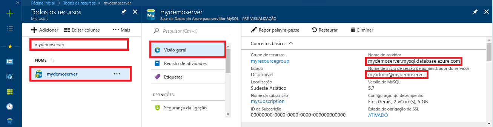

# <a name="azure-database-for-mysql-use-net-c-to-connect-and-query-data"></a>Base de Dados do Azure para MySQL: utilizar .NET (C#) para se ligar e consultar dados
Este guia de introdução explica como se pode ligar a uma Base de Dados do Azure para MySQL através de uma aplicação C#. Explica como utilizar as instruções SQL para consultar, inserir, atualizar e eliminar dados da base de dados. Este tópico pressupõe que está familiarizado com a programação com C# e que nunca trabalhou com a Base de Dados do Azure para MySQL.

## <a name="prerequisites"></a>Pré-requisitos
Este guia de início rápido utiliza os recursos criados em qualquer um desTes guias como ponto de partida:
- [Criar uma Base de Dados do Azure para o servidor MySQL com o portal do Azure](./quickstart-create-mysql-server-database-using-azure-portal.md)
- [Criar uma Base de Dados do Azure para o servidor MySQL com a CLI do Azure](./quickstart-create-mysql-server-database-using-azure-cli.md)

Também tem de:
- Instalar o [.NET](https://www.microsoft.com/net/download). Siga os passos no artigo ligado para instalar o .NET especificamente para a sua plataforma (Windows, Ubuntu Linux ou macOS). 
- Instalar o [Visual Studio](https://www.visualstudio.com/downloads/).

## <a name="create-a-c-project"></a>Criar um projeto em C#
Numa linha de comandos, execute:

```
mkdir AzureMySqlExample
cd AzureMySqlExample
dotnet new console
dotnet add package MySqlConnector
```

## <a name="get-connection-information"></a>Obter informações da ligação
Obtenha as informações de ligação necessárias para se ligar à Base de Dados do Azure para MySQL. Necessita do nome do servidor e das credenciais de início de sessão totalmente qualificados.

1. Inicie sessão no [Portal do Azure](https://portal.azure.com/).
2. No menu esquerdo do portal do Azure, clique em **Todos os recursos** e, em seguida, procure o servidor que acabou de criar, (por exemplo, **mydemoserver**).
3. Clique no nome do servidor.
4. No painel **Descrição geral** do servidor, tome nota do **Nome do servidor** e do **Nome de início de sessão de administrador do servidor**. Caso se esqueça da sua palavra-passe, também pode repor a palavra-passe neste painel.
 

## <a name="connect-create-table-and-insert-data"></a>Ligar, criar tabela e inserir dados
Utilize o código seguinte para se ligar e carregar os dados com as instruções SQL `CREATE TABLE` e `INSERT INTO`. O código utiliza a classe `MySqlConnection` com o método [OpenAsync()](https://docs.microsoft.com/en-us/dotnet/api/system.data.common.dbconnection.openasync#System_Data_Common_DbConnection_OpenAsync) para estabelecer uma ligação ao MySQL. Em seguida, o código utiliza o método [CreateCommand()](https://docs.microsoft.com/en-us/dotnet/api/system.data.common.dbconnection.createcommand), define a propriedade CommandText e chama o método [ExecuteNonQueryAsync()](https://docs.microsoft.com/en-us/dotnet/api/system.data.common.dbcommand.executenonqueryasync) para executar os comandos da base de dados. 

Substitua os parâmetros `Server`, `Database`, `UserID`, e `Password` pelos valores que especificou quando criar o servidor e a base de dados. 

```csharp
using System;
using System.Threading.Tasks;
using MySql.Data.MySqlClient;

namespace AzureMySqlExample
{
    class MySqlCreate
    {
        static async Task Main(string[] args)
        {
            var builder = new MySqlConnectionStringBuilder
            {
                Server = "YOUR-SERVER.mysql.database.azure.com",
                Database = "YOUR-DATABASE",
                UserID = "USER@YOUR-SERVER",
                Password = "PASSWORD",
                SslMode = MySqlSslMode.Required,
            };

            using (var conn = new MySqlConnection(builder.ConnectionString))
            {
                Console.WriteLine("Opening connection");
                await conn.OpenAsync();

                using (var command = conn.CreateCommand())
                {
                    command.CommandText = "DROP TABLE IF EXISTS inventory;";
                    await command.ExecuteNonQueryAsync();
                    Console.WriteLine("Finished dropping table (if existed)");

                    command.CommandText = "CREATE TABLE inventory (id serial PRIMARY KEY, name VARCHAR(50), quantity INTEGER);";
                    await command.ExecuteNonQueryAsync();
                    Console.WriteLine("Finished creating table");

                    command.CommandText = @"INSERT INTO inventory (name, quantity) VALUES (@name1, @quantity1),
                        (@name2, @quantity2), (@name3, @quantity3);";
                    command.Parameters.AddWithValue("@name1", "banana");
                    command.Parameters.AddWithValue("@quantity1", 150);
                    command.Parameters.AddWithValue("@name2", "orange");
                    command.Parameters.AddWithValue("@quantity2", 154);
                    command.Parameters.AddWithValue("@name3", "apple");
                    command.Parameters.AddWithValue("@quantity3", 100);

                    int rowCount = await command.ExecuteNonQueryAsync();
                    Console.WriteLine(String.Format("Number of rows inserted={0}", rowCount));
                }

                // connection will be closed by the 'using' block
                Console.WriteLine("Closing connection");
            }

            Console.WriteLine("Press RETURN to exit");
            Console.ReadLine();
        }
    }
}
```

## <a name="read-data"></a>Ler dados

Utilize o código seguinte para se ligar e ler os dados com uma instrução SQL `SELECT`. O código utiliza a classe `MySqlConnection` com o método [OpenAsync()](https://docs.microsoft.com/en-us/dotnet/api/system.data.common.dbconnection.openasync#System_Data_Common_DbConnection_OpenAsync) para estabelecer uma ligação ao MySQL. O código utiliza então o método [CreateCommand()](https://docs.microsoft.com/en-us/dotnet/api/system.data.common.dbconnection.createcommand) e o método [ExecuteReaderAsync()](https://docs.microsoft.com/en-us/dotnet/api/system.data.common.dbcommand.executereaderasync) para executar os comandos da base de dados. Em seguida, o código utiliza [ReadAsync()](https://docs.microsoft.com/en-us/dotnet/api/system.data.common.dbdatareader.readasync#System_Data_Common_DbDataReader_ReadAsync) para avançar para os registos nos resultados. Em seguida, o código utiliza GetInt32 e GetString para analisar os valores do registo.

Substitua os parâmetros `Server`, `Database`, `UserID`, e `Password` pelos valores que especificou quando criar o servidor e a base de dados. 

```csharp
using System;
using System.Threading.Tasks;
using MySql.Data.MySqlClient;

namespace AzureMySqlExample
{
    class MySqlRead
    {
        static async Task Main(string[] args)
        {
            var builder = new MySqlConnectionStringBuilder
            {
                Server = "YOUR-SERVER.mysql.database.azure.com",
                Database = "YOUR-DATABASE",
                UserID = "USER@YOUR-SERVER",
                Password = "PASSWORD",
                SslMode = MySqlSslMode.Required,
            };

            using (var conn = new MySqlConnection(builder.ConnectionString))
            {
                Console.WriteLine("Opening connection");
                await conn.OpenAsync();

                using (var command = conn.CreateCommand())
                {
                    command.CommandText = "SELECT * FROM inventory;";

                    using (var reader = await command.ExecuteReaderAsync())
                    {
                        while (await reader.ReadAsync())
                        {
                            Console.WriteLine(string.Format(
                                "Reading from table=({0}, {1}, {2})",
                                reader.GetInt32(0),
                                reader.GetString(1),
                                reader.GetInt32(2)));
                        }
                    }
                }

                Console.WriteLine("Closing connection");
            }

            Console.WriteLine("Press RETURN to exit");
            Console.ReadLine();
        }
    }
}
```

## <a name="update-data"></a>Atualizar dados
Utilize o código seguinte para se ligar e ler os dados com uma instrução SQL `UPDATE`. O código utiliza a classe `MySqlConnection` com o método [OpenAsync()](https://docs.microsoft.com/en-us/dotnet/api/system.data.common.dbconnection.openasync#System_Data_Common_DbConnection_OpenAsync) para estabelecer uma ligação ao MySQL. Em seguida, o código utiliza o método [CreateCommand()](https://docs.microsoft.com/en-us/dotnet/api/system.data.common.dbconnection.createcommand), define a propriedade CommandText e chama o método [ExecuteNonQueryAsync()](https://docs.microsoft.com/en-us/dotnet/api/system.data.common.dbcommand.executenonqueryasync) para executar os comandos da base de dados. 

Substitua os parâmetros `Server`, `Database`, `UserID`, e `Password` pelos valores que especificou quando criar o servidor e a base de dados. 

```csharp
using System;
using System.Threading.Tasks;
using MySql.Data.MySqlClient;

namespace AzureMySqlExample
{
    class MySqlUpdate
    {
        static async Task Main(string[] args)
        {
            var builder = new MySqlConnectionStringBuilder
            {
                Server = "YOUR-SERVER.mysql.database.azure.com",
                Database = "YOUR-DATABASE",
                UserID = "USER@YOUR-SERVER",
                Password = "PASSWORD",
                SslMode = MySqlSslMode.Required,
            };

            using (var conn = new MySqlConnection(builder.ConnectionString))
            {
                Console.WriteLine("Opening connection");
                await conn.OpenAsync();

                using (var command = conn.CreateCommand())
                {
                    command.CommandText = "UPDATE inventory SET quantity = @quantity WHERE name = @name;";
                    command.Parameters.AddWithValue("@quantity", 200);
                    command.Parameters.AddWithValue("@name", "banana");

                    int rowCount = await command.ExecuteNonQueryAsync();
                    Console.WriteLine(String.Format("Number of rows updated={0}", rowCount));
                }

                Console.WriteLine("Closing connection");
            }

            Console.WriteLine("Press RETURN to exit");
            Console.ReadLine();
        }
    }
}
```

## <a name="delete-data"></a>Eliminar dados
Utilize o código seguinte para se ligar e eliminar os dados com uma instrução SQL `DELETE`. 

O código utiliza a classe `MySqlConnection` com o método [OpenAsync()](https://docs.microsoft.com/en-us/dotnet/api/system.data.common.dbconnection.openasync#System_Data_Common_DbConnection_OpenAsync) para estabelecer uma ligação ao MySQL. Em seguida, o código utiliza o método [CreateCommand()](https://docs.microsoft.com/en-us/dotnet/api/system.data.common.dbconnection.createcommand), define a propriedade CommandText e chama o método [ExecuteNonQueryAsync()](https://docs.microsoft.com/en-us/dotnet/api/system.data.common.dbcommand.executenonqueryasync) para executar os comandos da base de dados. 

Substitua os parâmetros `Server`, `Database`, `UserID`, e `Password` pelos valores que especificou quando criar o servidor e a base de dados. 

```csharp
using System;
using System.Threading.Tasks;
using MySql.Data.MySqlClient;

namespace AzureMySqlExample
{
    class MySqlDelete
    {
        static async Task Main(string[] args)
        {
            var builder = new MySqlConnectionStringBuilder
            {
                Server = "YOUR-SERVER.mysql.database.azure.com",
                Database = "YOUR-DATABASE",
                UserID = "USER@YOUR-SERVER",
                Password = "PASSWORD",
                SslMode = MySqlSslMode.Required,
            };

            using (var conn = new MySqlConnection(builder.ConnectionString))
            {
                Console.WriteLine("Opening connection");
                await conn.OpenAsync();

                using (var command = conn.CreateCommand())
                {
                    command.CommandText = "DELETE FROM inventory WHERE name = @name;";
                    command.Parameters.AddWithValue("@name", "orange");

                    int rowCount = await command.ExecuteNonQueryAsync();
                    Console.WriteLine(String.Format("Number of rows deleted={0}", rowCount));
                }

                Console.WriteLine("Closing connection");
            }

            Console.WriteLine("Press RETURN to exit");
            Console.ReadLine();
        }
    }
}
```

## <a name="next-steps"></a>Passos seguintes
> [!div class="nextstepaction"]
> [Migrar a sua base de dados MySQL para a Dase de Dados do Azure para MySQL através da funcionalidade de captura e restauro](concepts-migrate-dump-restore.md)
