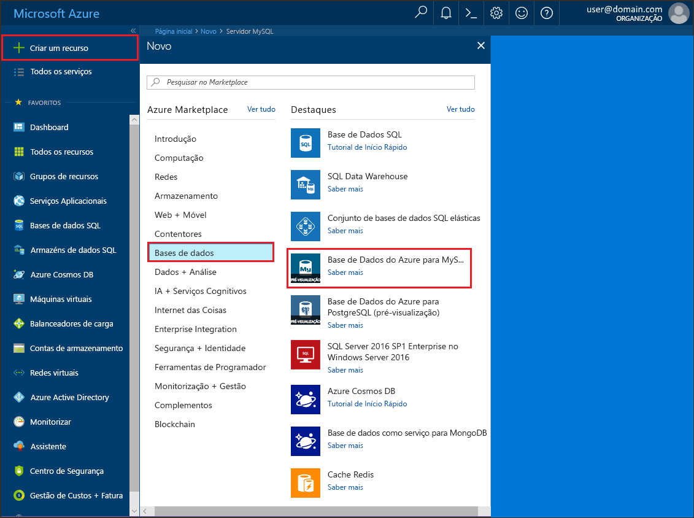
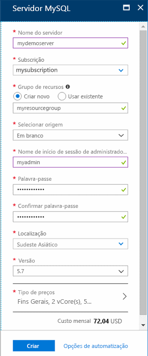
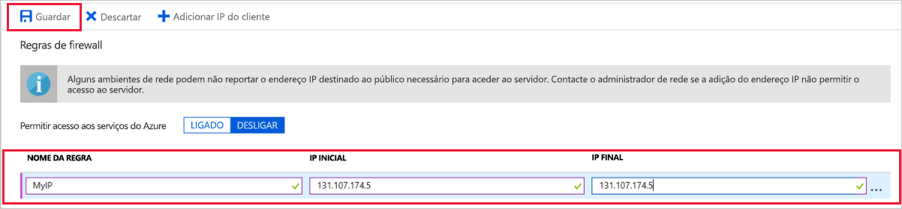

# <a name="create-an-azure-database-for-mysql-server-by-using-the-azure-portal"></a>Criar uma Base de Dados do Azure para o servidor MySQL com o portal do Azure

A Base de Dados do Azure para MySQL é um serviço gerido que utiliza para executar, gerir e dimensionar as Bases de Dados MySQL de elevada disponibilidade na cloud. Este Início Rápido mostra-lhe como criar um servidor da Base de Dados do Azure para MySQL em cerca de cinco minutos com o portal do Azure.  

Se não tiver uma subscrição do Azure, crie uma [conta do Azure gratuita](https://azure.microsoft.com/free/) antes de começar.

## <a name="sign-in-to-the-azure-portal"></a>Iniciar sessão no portal do Azure
Abra o browser e, em seguida, avance para o [portal do Azure](https://portal.azure.com/). Introduza as suas credenciais para iniciar sessão no portal. A vista predefinida é o dashboard de serviço.

## <a name="create-an-azure-database-for-mysql-server"></a>Criar uma Base de Dados do Azure para o servidor MySQL
Irá criar uma Base de Dados do Azure para o servidor MySQL com um conjunto definido de [recursos de armazenamento e computação](./concepts-compute-unit-and-storage.md). Irá criar o servidor dentro de um [grupo de recursos do Azure](../azure-resource-manager/resource-group-overview.md).

Siga estes passos para criar uma Base de Dados do Azure para o servidor MySQL:

1. Selecione o botão (+) **Criar um recurso**, no canto superior esquerdo do portal.

2. Selecione **Bases de Dados** > **Base de Dados do Azure para MySQL**. Também pode escrever **MySQL** na caixa de pesquisa para encontrar o serviço.

   

3. Preencha o formulário com os detalhes do novo servidor com as seguintes informações:
   
   

    **Definição** | **Valor sugerido** | **Descrição do campo** 
    ---|---|---
    Nome do servidor | Nome de servidor exclusivo | Escolha um nome exclusivo que identifique a sua Base de Dados do Azure para o servidor MySQL. Por exemplo, mydemoserver. O nome de domínio *.mysql.database.azure.com* é acrescentado ao nome de servidor que indicar. O nome do servidor pode conter apenas letras minúsculas, números e o caráter de hífen (-). Tem de conter entre 3 e 63 carateres.
    Subscrição | A sua subscrição | Selecione a subscrição do Azure que quer utilizar para o servidor. Se tiver várias subscrições, escolha a subscrição na qual o recurso é cobrado.
    Grupo de recursos | *myresourcegroup* | Forneça um novo nome do grupo de recursos ou um existente.    Grupo de recursos|*myresourcegroup*| Um nome de grupo de recursos novo ou um já existente na sua subscrição.
    Selecionar origem | *Em branco* | Selecione *Em branco* para criar um novo servidor de raiz. (Selecione *Cópia de segurança* se estiver a criar um servidor a partir de uma cópia de segurança geo de um servidor da Base de Dados do Azure para MySQL existente).
    Início de sessão de administrador do servidor | myadmin | Uma conta de início de sessão para utilizar quando ligar ao servidor. O nome de início de sessão de administrador não pode ser **azure_superuser**, **admin**, **administrator**, **root**, **guest** ou **public**.
    Palavra-passe | *A sua escolha* | Forneça uma palavra-passe nova para a conta de administrador do servidor. Tem de conter entre 8 e 128 carateres. A palavra-passe tem de conter carateres de três das seguintes categorias: Letras em maiúscula letras, em minúscula inglesas, números (0-9) e carateres não alfanuméricos (!, $, #, % e assim por diante).
    Confirmar palavra-passe | *A sua escolha*| Confirme a palavra-passe da conta de administrador.
    Localização | *A região mais próxima dos seus utilizadores*| Escolha a localização que estiver mais próxima dos seus utilizadores ou das suas outras aplicações do Azure.
    Versão | *A versão principal mais recente*| A versão principal mais recente (a não ser que tenha requisitos específicos que exijam outra versão).
    Escalão de preço | **Fins Gerais**, **Geração 4**, **2 vCores**, **5 GB**, **7 dias**, **Geograficamente Redundante** | As configurações de computação, armazenamento e cópia de segurança do seu novo servidor. Selecione **Escalão de preço**. Em seguida, selecione o separador **Fins Gerais**. *Geração 4*, *2 vCores*, *5 GB* e *7 dias* são os valores predefinidos de **Geração de Computação**, **vCore**, **Armazenamento** e **Período de Retenção da Cópia de Segurança**. Pode deixar os controlos de deslize como estão. Para ativar as cópias de segurança do servidor no armazenamento georredundante, selecione **Geograficamente Redundante** nas **Opções de Redundância da Cópia de Segurança**. Para guardar a seleção deste escalão de preço, selecione **OK**. A captura de ecrã seguinte captura estas seleções.
  
    > [!IMPORTANT]
    > O início de sessão e a palavra-passe de administrador de servidor que especificar aqui serão necessários para iniciar sessão no servidor e nas respetivas bases de dados mais tarde neste Guia de Introdução. Lembre-se ou grave estas informações para utilização posterior.
    > 

   

4.  Selecione **Criar** para aprovisionar o servidor. O aprovisionamento pode demorar até 20 minutos.
   
5.  Selecione **Notificações** na barra de ferramentas (o ícone da campainha) para monitorizar o processo de implementação.
   
  Por predefinição, as seguintes bases de dados são criadas no seu servidor: **information_schema**, **mysql**, **performance_schema** e **sys**.

## <a name="configure-a-server-level-firewall-rule"></a>Configurar uma regra de firewall ao nível do servidor

A Base de Dados do Azure para o serviço MySQL cria uma firewall ao nível do servidor. A mesma impede que as aplicações e ferramentas externas se liguem ao servidor e a quaisquer bases de dados no servidor, a menos que seja criada uma regra de firewall para abrir a firewall aos endereços IP específicos. 

1.   Depois de concluída a implementação, localize o seu servidor. Se for preciso, pode procurá-lo. Por exemplo, selecione **Todos os Recursos** no menu à esquerda. Em seguida, escreva o nome do servidor, como o exemplo **mydemoserver**, para procurar o servidor que acabou de criar. Selecione o nome do servidor da lista de resultados de pesquisa. É apresentada a página **Descrição Geral** do servidor, que fornece opções para configuração adicional.

2. Na página do servidor, selecione **Segurança da ligação**.

3.  No cabeçalho **Regras de firewall**, selecione a caixa de texto em branco na coluna **Nome da Regra** para começar a criar a regra de firewall. Introduza o intervalo precisas de IPs de clientes que irão aceder neste servidor.
   
   


4. Na barra de ferramentas superior da página **Segurança da ligação**, selecione **Guardar**. Aguarde até que a notificação apareça e indique que a atualização foi concluída com êxito antes de continuar. 

   > [!NOTE]
   > As ligações à base de dados do Azure para MySQL comunicam através da porta 3306. Se tentar ligar a partir de uma rede empresarial, o tráfego de saída através da porta 3306 poderá não ser permitido. Se for este o caso, não pode ligar ao servidor, a menos que o departamento de TI abra a porta 3306.
   > 

## <a name="get-the-connection-information"></a>Obter as informações da ligação
Para ligar ao seu servidor de bases de dados, precisa do nome completo do servidor e das credenciais de início de sessão de administrador. Poderá ter apontado esses valores anteriormente no artigo Guia de Introdução. Se não o tiver feito, pode encontrar facilmente o nome do servidor e as informações de início de sessão na página **Descrição Geral** do servidor ou na página **Propriedades** do portal do Azure.

Para localizar estes valores, siga os passos seguintes: 

1. Abra a página **Descrição Geral** do servidor. Anote o **Nome do servidor** e **Nome de início de sessão de administrador do servidor**. 

2. Coloque o cursor sobre cada campo e o ícone de cópia é apresentado à direita do texto. Selecione o ícone de cópia conforme necessário para copiar os valores.

Neste exemplo, o nome do servidor é **mydemoserver.mysql.database.azure.com** e o início de sessão de administrador do servidor é **myadmin@mydemoserver**.

## <a name="connect-to-mysql-by-using-the-mysql-command-line-tool"></a>Ligar ao MySQL com a ferramenta de linha de comandos mysql
Ligue ao servidor com a ferramenta de linha de comandos **mysql.exe**. Pode transferir o MySQL [aqui](https://dev.mysql.com/downloads/) e instalá-lo no seu computador. 

1. Para ligar a uma Base de Dados do Azure para o servidor MySQL com o utilitário mysql, utilize o seguinte formato:

    ```bash
    mysql --host <fully qualified server name> --user <server admin login name>@<server name> -p
    ```

    Por exemplo, o comando seguinte liga ao nosso servidor de exemplo:

    ```bash
    mysql --host mydemoserver.mysql.database.azure.com --user myadmin@mydemoserver -p
    ```

    mysql parameter |Valor sugerido|Descrição
    ---|---|---
    --host | *Nome do servidor* | O valor de nome de servidor que foi utilizado anteriormente quando criou a Base de Dados do Azure para o servidor MySQL. O nosso servidor de exemplo é **mydemoserver.mysql.database.azure.com**. Utilize o nome de domínio completamente qualificado (**\*.mysql.database.azure.com), conforme mostrado no exemplo. Se não se lembrar do nome do servidor, siga os passos na secção anterior para obter as informações da ligação. 
    --user | *Nome de início de sessão de administrador do servidor* |O nome de utilizador de início de sessão de administrador do servidor que foi fornecido quando criou a Base de Dados do Azure para o servidor MySQL anteriormente. Se não se lembrar do nome de utilizador, siga os passos na secção anterior para obter as informações da ligação. O formato é *username@servername*.
    -p | *Aguarde até que seja pedido* |Quando lhe for pedido, forneça a palavra-passe que indicou quando criou o servidor. Tenha em conta que os carateres da palavra-passe introduzida não são apresentados na linha de comandos bash ao escrevê-los. Após introduzir a palavra-passe, selecione **Enter**.

   Assim que estiver ligado, o utilitário mysql apresenta uma linha de comandos `mysql>` onde pode escrever os comandos. 

   Segue-se um exemplo da saída mysql:

    ```bash
    Welcome to the MySQL monitor.  Commands end with ; or \g.
    Your MySQL connection id is 65505
    Server version: 5.6.26.0 MySQL Community Server (GPL)
    
    Copyright (c) 2000, 2017, Oracle and/or its affiliates. All rights reserved.
    
    Oracle is a registered trademark of Oracle Corporation and/or its
    affiliates. Other names may be trademarks of their respective
    owners.

    Type 'help;' or '\h' for help. Type '\c' to clear the current input statement.
    
    mysql>
    ```
    > [!TIP]
    > Se a firewall não estiver configurada para permitir o endereço IP do seu cliente, ocorre o seguinte erro:
    >
    > ERRO 2003 (28000): Cliente com o endereço IP 123.456.789.0 não tem permissão para aceder ao servidor.
    >
    > Para resolver o erro, certifique-se de que a configuração do servidor corresponde aos passos na secção "Configure a server-level firewall rule" (Configurar uma regra de firewall ao nível do servidor) do artigo.

4. Para garantir que a ligação está funcional, veja o estado do servidor escrevendo `status` na linha de comandos mysql>.

    ```sql
    status
    ```

   > [!TIP]
   > Para obter comandos adicionais, veja [MySQL 5.7 Reference Manual - Chapter 4.5.1](https://dev.mysql.com/doc/refman/5.7/en/mysql.html) (Manual de Referência do MySQL 5.7 - Capítulo 4.5.1).

5.  Crie uma base de dados vazia na linha de comandos **mysql>** escrevendo o seguinte comando:
    ```sql
    CREATE DATABASE quickstartdb;
    ```
    O comando pode demorar alguns minutos a concluir. 

    Dentro de uma Base de Dados do Azure para o servidor MySQL, pode criar uma ou várias bases de dados. Pode optar por criar uma base de dados por servidor para utilizar todos os recursos ou criar várias bases de dados para partilhar os recursos. Não há limite para o número de bases de dados que pode criar, mas múltiplas bases de dados partilham os mesmos recursos do servidor. 

6. Liste as bases de dados na linha de comandos **mysql>** escrevendo o seguinte comando:

    ```sql
    SHOW DATABASES;
    ```

7.  Escreva `\q` e, em seguida, selecione a tecla **Enter** para sair da ferramenta mysql. 

Está agora ligado à Base de Dados do Azure para o servidor MySQL e criou uma base de dados de utilizador vazia. Continue para a secção seguinte para um exercício semelhante. O exercício seguinte liga-se ao mesmo servidor ao utilizar outra ferramenta comum, Workbench do MySQL.

## <a name="connect-to-the-server-by-using-the-mysql-workbench-gui-tool"></a>Ligar ao servidor com a ferramenta Workbench GUI do MySQL
Para ligar ao servidor com a ferramenta Workbench GUI do MySQL, siga os passos seguintes:

1.  Abra a aplicação MySQL Workbench no computador cliente. Pode transferir e instalar o MySQL Workbench em [Transferir MySQL Workbench](https://dev.mysql.com/downloads/workbench/).

2. Crie uma nova ligação. Clique no ícone de sinal de adição (+) junto ao cabeçalho **MySQL Connections**.

3. Na caixa de diálogo **Configurar Ligação Nova**, introduza as informações de ligação do servidor no separador **Parâmetros**. Os valores de marcador de posição são apresentados como exemplo. Substitua o Nome do Anfitrião, o Nome de Utilizador e a palavra-passe pelos seus valores.

   

    |Definição |Valor sugerido|Descrição do campo|
    |---|---|---|
     Nome da ligação | Ligação de demonstração | Uma etiqueta para esta ligação. |
    Método de ligação | Standard (TCP/IP) | Standard (TCP/IP) é suficiente. |
    Nome de anfitrião | *Nome do servidor* | O valor de nome de servidor que foi utilizado quando criou anteriormente a Base de Dados do Azure para o servidor MySQL. O nosso servidor de exemplo é **mydemoserver.mysql.database.azure.com**. Utilize o nome de domínio completamente qualificado (**\*.mysql.database.azure.com), conforme mostrado no exemplo. Se não se lembrar do nome do servidor, siga os passos na secção anterior para obter as informações da ligação.|
     Porta | 3306 | A porta a utilizar quando ligar à Base de Dados do Azure para o servidor MySQL. |
    Nome de utilizador |  *Nome de início de sessão de administrador do servidor* | As informações de início de sessão de administrador do servidor que forneceu quando criou a Base de Dados do Azure para o servidor MySQL anteriormente. O nosso nome de utilizador de exemplo é **myadmin@mydemoserver**. Se não se lembrar do nome de utilizador, siga os passos na secção anterior para obter as informações da ligação. O formato é *username@servername*.
    Palavra-passe | *A sua palavra-passe* | Selecione o botão **Armazenar no Cofre...** para guardar a palavra-passe. |

4. Selecione **Testar Ligação** para testar se todos os parâmetros estão configurados corretamente. Em seguida, clique em **OK** para guardar a ligação. 

    > [!NOTE]
    > O SSL é aplicado por predefinição no seu servidor e requer uma configuração adicional para uma ligação com êxito. Para obter mais informações, veja [Configure SSL connectivity in your application to securely connect to Azure Database for MySQL](./howto-configure-ssl.md) (Configurar a conectividade SSL na sua aplicação para ligar em segurança à Base de Dados do Azure para MySQL). Para desativar o SSL neste Guia de Introdução, aceda ao portal do Azure. Em seguida, selecione a página de segurança de Ligação para desativar o botão de alternar de ligação **Impor SSL**.

## <a name="clean-up-resources"></a>Limpar recursos
Pode limpar os recursos que criou no Guia de Introdução de duas formas. Pode eliminar o [grupo de recursos do Azure](../azure-resource-manager/resource-group-overview.md), que inclui todos os recursos no grupo de recursos. Se pretender manter os outros recursos intactos, elimine apenas o recurso de um servidor.

> [!TIP]
> Outros Guias de Introdução desta coleção compilados com base neste Guia de Introdução. Se pretender continuar a trabalhar com Guias de Introdução, não limpe os recursos que criou neste Guia de Introdução. Se não quiser continuar, utilize os passos seguintes para eliminar todos os recursos que criou com este Guia de Introdução.
>

Para eliminar o grupo de recursos inteiro, incluindo o servidor recentemente criado, siga os seguintes passos:

1.  Localize o grupo de recursos no portal do Azure. No menu do lado esquerdo, selecione **Grupos de recursos** e, em seguida, selecione o nome do grupo de recursos, (como o nosso exemplo **myresourcegroup**).

2.  Na página do grupo de recursos, selecione **Eliminar**. Em seguida, escreva o nome do grupo de recursos, (como o nosso exemplo **myresourcegroup**), na caixa para confirmar a eliminação e, em seguida, selecione **Eliminar**.

Para eliminar apenas o servidor recentemente criado, siga os passos seguintes:

1.  Localize o servidor no portal do Azure, se ainda não estiver aberto. No menu no lado esquerdo do Portal do Azure, selecione **Todos os recursos**. Em seguida, procure o servidor que criou.

2.  Na página **Descrição geral**, selecione **Eliminar**. 

   

3.  Confirme o nome do servidor que pretende eliminar e veja as bases de dados incluídas que são afetadas. Escreva o nome do servidor na caixa (como o nosso exemplo **mydemoserver**). Selecione **Eliminar**.

## <a name="next-steps"></a>Passos Seguintes

> [!div class="nextstepaction"]
> [Design your first Azure Database for MySQL database](./tutorial-design-database-using-portal.md) (Conceber a sua primeira Base de Dados do Azure para a base de dados MySQL)

