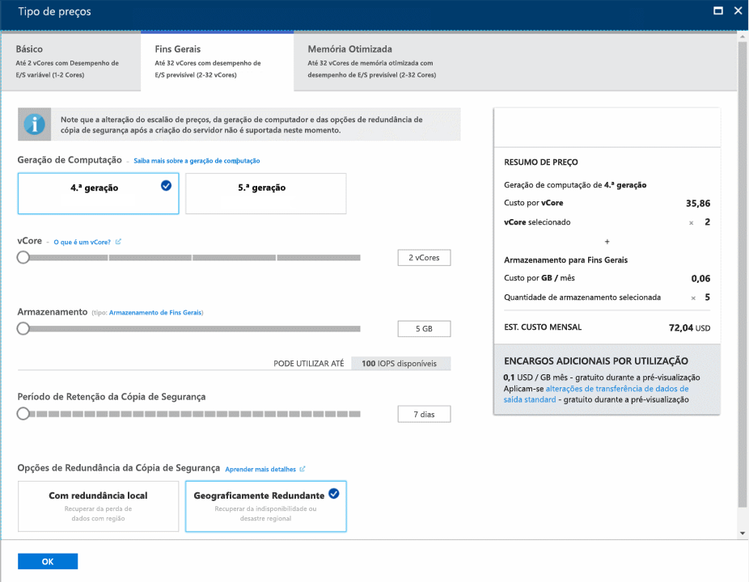
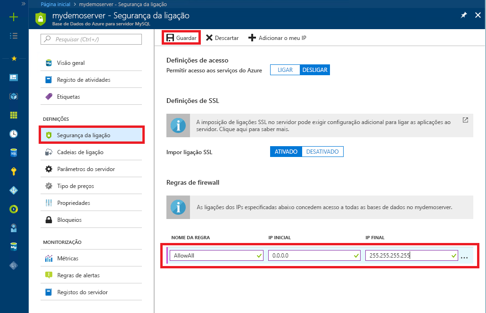

# <a name="tutorial-design-an-azure-database-for-mysql-database-using-the-azure-portal"></a>Tutorial: Conceber uma Base de Dados do Azure para base de dados MySQL com o portal do Azure
A Base de Dados do Azure para MySQL é um serviço gerido que lhe permite executar, gerir e dimensionar as bases de dados MySQL de alta disponibilidade na cloud. No portal do Azure, pode facilmente gerir o seu servidor e criar uma base de dados.

Neste tutorial, irá utilizar o Portal do Azure para aprender a:

> [!div class="checklist"]
> * Criar uma Base de Dados do Azure para MySQL
> * Configurar a firewall do servidor
> * Utilize a ferramenta da linha de comandos mysql para criar uma base de dados
> * Carregar os dados de exemplo
> * Consultar dados
> * Atualizar dados
> * Restaurar dados

## <a name="sign-in-to-the-azure-portal"></a>Iniciar sessão no portal do Azure
Abra o browser favorito e visite o [portal do Microsoft Azure](https://portal.azure.com/). Introduza as suas credenciais para iniciar sessão no portal. A vista predefinida é o dashboard de serviço.

## <a name="create-an-azure-database-for-mysql-server"></a>Criar uma Base de Dados do Azure para o servidor MySQL
É criada uma Base de Dados do Azure para o servidor MySQL com um conjunto definido de [recursos de armazenamento e computação](./concepts-compute-unit-and-storage.md). O servidor é criado dentro de um [grupo de recursos do Azure](https://docs.microsoft.com/azure/azure-resource-manager/resource-group-overview).

1. Navegue para **Bases de Dados** > **Base de Dados do Azure para MySQL**. Se não encontrar o servidor MySQL na categoria **Bases de Dados**, clique em **Ver tudo**, para mostrar todos os serviços de bases de dados disponíveis. Também pode escrever **Base de Dados do Azure para MySQL** na caixa de pesquisa para encontrar rapidamente o serviço.
   
   

2. Clique no mosaico **Base de Dados do Azure para MySQL** e, em seguida, clique em **Criar**. Preencha o formulário da Base de Dados do Azure para MySQL.
   
   

    **Definição** | **Valor sugerido** | **Descrição do campo** 
    ---|---|---
    Nome do servidor | Nome de servidor exclusivo | Escolha um nome exclusivo que identifique a sua Base de Dados do Azure para o servidor MySQL. Por exemplo, mydemoserver. O nome de domínio *.mysql.database.azure.com* é acrescentado ao nome de servidor que indicar. O nome do servidor pode conter apenas letras minúsculas, números e o caráter de hífen (-). Tem de conter entre 3 e 63 carateres.
    Subscrição | A sua subscrição | Selecione a subscrição do Azure que quer utilizar para o servidor. Se tiver várias subscrições, escolha a subscrição na qual o recurso é cobrado.
    Grupo de recursos | *myresourcegroup* | Forneça um novo nome do grupo de recursos ou um existente.    Grupo de recursos|*myresourcegroup*| Um nome de grupo de recursos novo ou um já existente na sua subscrição.
    Selecionar origem | *Em branco* | Selecione *Em branco* para criar um novo servidor de raiz. (Selecione *Cópia de segurança* se estiver a criar um servidor a partir de uma cópia de segurança geo de um servidor da Base de Dados do Azure para MySQL existente).
    Início de sessão de administrador do servidor | myadmin | Uma conta de início de sessão para utilizar quando ligar ao servidor. O nome de início de sessão de administrador não pode ser **azure_superuser**, **admin**, **administrator**, **root**, **guest** ou **public**.
    Palavra-passe | *A sua escolha* | Forneça uma palavra-passe nova para a conta de administrador do servidor. Tem de conter entre 8 e 128 carateres. A palavra-passe tem de conter carateres das três categorias seguintes: letras em maiúscula inglesas, letras em minúscula inglesas, números (0 - 9) e carateres não alfanuméricos (!, $, #, %, etc.).
    Confirmar palavra-passe | *A sua escolha*| Confirme a palavra-passe da conta de administrador.
    Localização | *A região mais próxima dos seus utilizadores*| Escolha a localização que estiver mais próxima dos seus utilizadores ou das suas outras aplicações do Azure.
    Versão | *A versão mais recente*| A versão mais recente (a não ser que tenha requisitos específicos que exijam outra versão).
    Escalão de preço | **Fins Gerais**, **Geração 4**, **2 vCores**, **5 GB**, **7 dias**, **Geograficamente Redundante** | As configurações de computação, armazenamento e cópia de segurança do seu novo servidor. Selecione **Escalão de preço**. Em seguida, selecione o separador **Fins Gerais**. *Geração 4*, *2 vCores*, *5 GB* e *7 dias* são os valores predefinidos de **Geração de Computação**, **vCore**, **Armazenamento** e **Período de Retenção da Cópia de Segurança**. Pode deixar os controlos de deslize como estão. Para ativar as cópias de segurança do servidor no armazenamento georredundante, selecione **Geograficamente Redundante** nas **Opções de Redundância da Cópia de Segurança**. Para guardar a seleção deste escalão de preço, selecione **OK**. A captura de ecrã seguinte captura estas seleções.
    
   

3. Clique em **Criar**. Num ou dois minutos, uma nova Base de Dados do Azure para o servidor MySQL estará em execução na cloud. Pode clicar no botão **Notificações** na barra de ferramentas para monitorizar o processo de implementação.

## <a name="configure-firewall"></a>Configurar a firewall
As Bases de Dados do Azure para MySQL estão protegidas por uma firewall. Por predefinição, todas as ligações ao servidor e as bases de dados dentro do servidor são rejeitadas. Antes de ligar à Base de Dados do Azure para MySQL pela primeira vez, configure a firewall para adicionar o endereço IP de rede público do computador do cliente (ou um intervalo de endereços IP).

1. Clique no servidor acabado de criar e clique em **Segurança da ligação**.
   
   
2. Pode **Adicionar o Meu IP** ou configurar regras de firewall aqui. Não se esqueça de clicar em **Guardar** depois de criar a regras.
Já pode ligar ao servidor através da ferramenta de linha de comandos mysql ou da ferramenta da GUI MySQL Workbench.

> [!TIP]
> A Base de Dados do Azure para o servidor MySQL comunica através da porta 3306. Se estiver a tentar ligar a partir de uma rede empresarial, o tráfego de saída através da porta 3306 poderá não ser permitido pela firewall da rede. Se assim for, não poderá ligar ao servidor MySQL do Azure, a menos que o departamento de TI abra a porta 3306.

## <a name="get-connection-information"></a>Obter informações da ligação
Obtenha o **Nome do servidor** completamente qualificado e o **Nome de início de sessão de administração do servidor** para a sua Base de Dados do Azure para o servidor MySQL a partir do portal do Azure. Utilize o nome de servidor totalmente qualificado para ligar ao seu servidor com a ferramenta de linha de comandos mysql. 

1. No [portal do Azure](https://portal.azure.com/), clique em **Todos os recursos**, no menu do lado esquerdo, escreva o nome e pesquise a sua Base de Dados do Azure para o servidor MySQL. Selecione o nome do servidor para ver os detalhes.

2. Na página **Descrição geral**, aponte o **Nome do Servidor** e o **Nome do Início de Sessão de Administrador do Servidor**. Pode clicar no botão Copiar, junto a cada campo, para copiar para a área de transferência.
   

Neste exemplo, o nome do servidor é *mydemoserver.mysql.database.azure.com* e o início de sessão de administrador do servidor é *myadmin@mydemoserver*.

## <a name="connect-to-the-server-using-mysql"></a>Ligar ao servidor com o mysql
Utilize a [ferramenta de linha de comandos do mysql](https://dev.mysql.com/doc/refman/5.7/en/mysql.html) para estabelecer uma ligação à base de dados do Azure para o servidor MySQL. Pode executar a ferramenta de linha de comandos do mysql a partir do Azure Cloud Shell no navegador ou a partir do seu computador com as ferramentas do mysql instaladas localmente. Para iniciar o Azure Cloud Shell, clique no botão `Try It` num bloco de código neste artigo ou visite o portal do Azure e clique no ícone `>_` da barra de ferramentas superior à direita. 

Escreva o comando para estabelecer a ligação:
```azurecli-interactive
mysql -h mydemoserver.mysql.database.azure.com -u myadmin@mydemoserver -p
```

## <a name="create-a-blank-database"></a>Criar uma base de dados vazia
Assim que estiver ligado ao servidor, crie uma base de dados vazia para trabalhar.
```sql
CREATE DATABASE mysampledb;
```

Na linha de comandos, execute o comando seguinte para mudar a ligação para a base de dados recentemente criada:
```sql
USE mysampledb;
```

## <a name="create-tables-in-the-database"></a>Criar tabelas na base de dados
Agora que sabe como ligar à Base de Dados do Azure para MySQL, pode concluir algumas tarefas básicas:

Em primeiro lugar, crie uma tabela e carregue-a com alguns dados. Vamos criar uma tabela que armazena informações de inventário.
```sql
CREATE TABLE inventory (
    id serial PRIMARY KEY, 
    name VARCHAR(50), 
    quantity INTEGER
);
```

## <a name="load-data-into-the-tables"></a>Carregar dados para as tabelas
Agora que tem uma tabela, insira alguns dados na mesma. Na janela da linha de comandos aberta, execute a seguinte consulta para inserir algumas linhas de dados.
```sql
INSERT INTO inventory (id, name, quantity) VALUES (1, 'banana', 150); 
INSERT INTO inventory (id, name, quantity) VALUES (2, 'orange', 154);
```

Tem agora duas linhas de dados de exemplo nas tabelas que criou anteriormente.

## <a name="query-and-update-the-data-in-the-tables"></a>Consultar e atualizar os dados nas tabelas
Execute a seguinte consulta para obter informações da tabela de base de dados.
```sql
SELECT * FROM inventory;
```

Também pode atualizar os dados nas tabelas.
```sql
UPDATE inventory SET quantity = 200 WHERE name = 'banana';
```

A linha é atualizada em conformidade ao obter dados.
```sql
SELECT * FROM inventory;
```

## <a name="restore-a-database-to-a-previous-point-in-time"></a>Restaurar uma base de dados para um ponto anterior no tempo
Imagine que eliminou acidentalmente uma tabela de base de dados importante e não consegue recuperar os dados facilmente. A Base de Dados do Azure para MySQL permite restaurar o servidor num momento específico, ao criar uma cópia das bases de dados no novo servidor. Pode utilizar este servidor novo para recuperar os dados eliminados. Os passos seguintes restauram o servidor de exemplo para um ponto antes da tabela ter sido adicionada.

1. No portal do Azure, encontre a Base de Dados do Azure para MySQL. Na página **Descrição geral**, clique em **Restaurar** na barra de ferramentas. É aberta a página Restaurar.

   

2. Preencha o formulário **Restaurar** com as informações necessárias.
   
   
   
   - **Ponto de restauro**: selecione um momento específico em que pretende restaurar, durante o período de tempo listado. Certifique-se de que converte o fuso horário local para UTC.
   - **Restaurar para novo servidor**: indique um novo nome de servidor para o qual pretende restaurar.
   - **Localização**: a região é a mesma que o servidor de origem e não pode ser alterada.
   - **Escalão de preço**: o escalão de preço é o mesmo que o servidor de origem e não pode ser alterado.
   
3. Clique em **OK** para restaurar o servidor para [ e restaurar para um momento específico](./howto-restore-server-portal.md) antes da tabela ter sido eliminada. Restaurar um servidor cria uma nova cópia do servidor, a partir do momento específico que especificar. 

## <a name="next-steps"></a>Passos seguintes
Neste tutorial, utilizou o portal do Azure para aprender a:

> [!div class="checklist"]
> * Criar uma Base de Dados do Azure para MySQL
> * Configurar a firewall do servidor
> * Utilize a ferramenta da linha de comandos mysql para criar uma base de dados
> * Carregar os dados de exemplo
> * Consultar dados
> * Atualizar dados
> * Restaurar dados

> [!div class="nextstepaction"]
> [Como ligar aplicações à Base de Dados do Azure para MySQL](./howto-connection-string.md)
