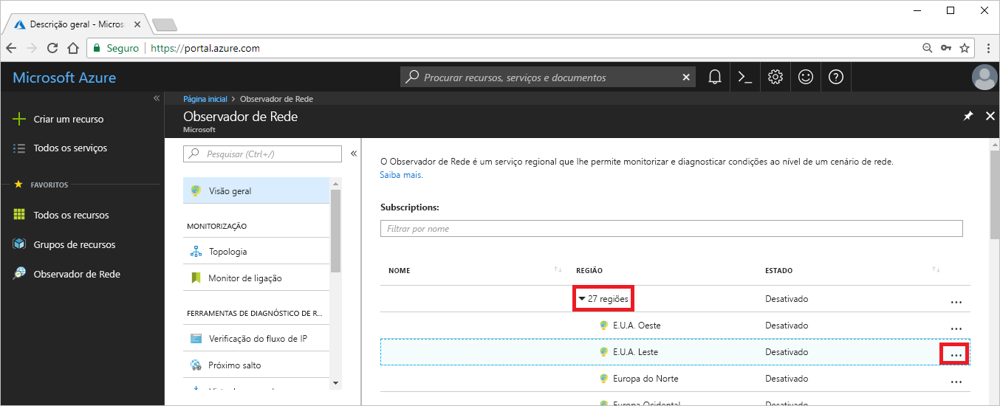

# Tutorial: diagnosticar um problema de encaminhamento de rede de máquina virtual com o Portal do Azure

Quando implementa uma máquina virtual (VM), o Azure cria várias rotas predefinidas para a mesma. Pode criar rotas personalizadas para substituir as rotas predefinidas do Azure. Por vezes, uma rota personalizada pode fazer com que uma VM não consiga comunicar com outros recursos. Neste tutorial, ficará a saber como:

> [!div class="checklist"]
> * Criar uma VM
> * Testar a comunicação com um URL com a funcionalidade de próximo salto do Observador de Rede
> * Testar a comunicação com um endereço IP
> * Diagnosticar um problema de encaminhamento e saber como resolvê-lo

Se preferir, pode diagnosticar um problema de encaminhamento de rede de máquina virtual com a [CLI do Azure](diagnose-vm-network-routing-problem-cli.md) ou o [Azure PowerShell](diagnose-vm-network-routing-problem-powershell.md).

Se não tiver uma subscrição do Azure, crie uma [conta gratuita](https://azure.microsoft.com/free/?WT.mc_id=A261C142F) antes de começar.

## Iniciar sessão no Azure

Inicie sessão no portal do Azure em https://portal.azure.com.

## Criar uma VM

1. Selecione **+ Criar um recurso**, disponível no canto superior esquerdo do Portal do Azure.
2. Selecione **Computação** e, em seguida, selecione **Windows Server 2016 Datacenter** ou **VM do Ubuntu Server 17.10**.
3. Introduza ou selecione as seguintes informações, aceite as predefinições para as restantes definições e, em seguida, selecione **OK**:

    |Definição|Valor|
    |---|---|
    |Nome|myVm|
    |Nome de utilizador| Introduza um nome de utilizador à sua escolha.|
    |Palavra-passe| Introduza uma palavra-passe à sua escolha. A palavra-passe tem de ter, pelo menos, 12 carateres e cumprir os [requisitos de complexidade definidos](../virtual-machines/windows/faq.md?toc=%2fazure%2fnetwork-watcher%2ftoc.json#what-are-the-password-requirements-when-creating-a-vm).|
    |Subscrição| Selecione a sua subscrição.|
    |Grupo de recursos| Selecione **Criar novo** e introduza **myResourceGroup**.|
    |Localização| Selecione **E.U.A. Leste**.|

4. Escolha um tamanho para a VM e selecione **Selecionar**.
5. Em **Definições**, aceite todas as predefinições e selecione **OK**.
6. Em **Criar** no **Resumo**, selecione **Criar** para iniciar a implementação da VM. A implementação da VM demora alguns minutos. Aguarde que a VM conclua a implementação antes de continuar com os restantes passos.

## Testar a comunicação de rede

Para testar a comunicação de rede com o Observador de Rede, primeiro tem de ativar um observador de rede em, pelo menos, uma região do Azure e, em seguida, utilizar a funcionalidade de próximo salto do Observador de Rede para testar a comunicação.

### Ativar o observador de rede

Se já tiver um observador de rede ativado em pelo menos uma região, avance para [Utilizar o próximo salto](#use-next-hop).

1. No portal, selecione **Todos os serviços**. Na caixa **Filtro**, introduza *Observador de Rede*. Quando a opção **Observador de Rede** aparecer nos resultados, selecione-a.
2. Selecione **Regiões**, para expandir e, em seguida, selecione **...** à direita de **E.U.A. Leste**, conforme apresentado na seguinte imagem:

    

3. Selecione **Ativar o Observador de Rede**.

### Utilizar o próximo salto

O Azure cria automaticamente rotas para destinos predefinidos. Pode criar rotas personalizadas que substituem as rotas predefinidas. Por vezes, as rotas personalizadas podem causar falhas na comunicação. Utilize a funcionalidade de próximo salto do Observador de Rede para determinar que rota o Azure está a utilizar para encaminhar o tráfego.

1. No portal do Azure, selecione **Próximo salto**, em **Observador de Rede**.
2. Selecione a sua subscrição, introduza ou selecione os seguintes valores e, em seguida, selecione **Próximo salto**, conforme apresentado na imagem que se segue:

    |Definição                  |Valor                                                   |
    |---------                |---------                                               |
    | Grupo de recursos          | Selecionar myResourceGroup                                 |
    | Máquina virtual         | Selecionar myVm                                            |
    | Interface de rede       | myvm – o nome de interface de rede pode ser diferente.   |
    | Endereço IP de origem       | 10.0.0.4                                               |
    | Endereço IP de destino  | 13.107.21.200 – um dos endereços para www.bing.com. |

    

    Após alguns segundos, o resultado informa que o tipo de próximo salto é **Internet** e que o **ID da tabela de rotas** é **Rota de Sistema**. Este resultado permite-lhe saber que existe uma rota de sistema válida para o destino.

3. Altere o **Endereço IP de destino** para *172.31.0.100* e selecione **Próximo salto** novamente. O resultado devolvido informa que **Nenhum** é o **Tipo de próximo salto** e que o **ID da tabela de rotas** é também **Rota de Sistema**. Este resultado permite-lhe saber que, embora exista uma rota de sistema válida para o destino, não há um próximo salto para encaminhar o tráfego para o destino.

## Ver detalhes de uma rota

1. Para analisar ainda mais o encaminhamento, reveja as rotas efetivas para a interface de rede. Na caixa de pesquisa na parte superior do portal, introduza *myvm* (ou qualquer que seja o nome da interface de rede que selecionou). Quando a opção **myvm** aparecer nos resultados de pesquisa, selecione-a.
2. Selecione **Rotas efetivas** em **SUPORTE + RESOLUÇÃO DE PROBLEMAS**, conforme apresentado na seguinte imagem:

    

    Quando executou o teste com 13.107.21.200 em [Utilizar próximo salto](#use-next-hop), a rota com o prefixo de endereço 0.0.0.0/0 foi utilizada para encaminhar tráfego para o endereço, uma vez que nenhuma rota inclui o endereço. Por predefinição, todos os endereços não especificados no prefixo de endereço de outra rota são encaminhados para a Internet.

    No entanto, quando executou o teste com 172.31.0.100, o resultado informou que não existia um tipo de próximo salto. Como pode ver na imagem anterior, embora exista uma rota predefinida para o prefixo 172.16.0.0/12, que inclui o endereço 172.31.0.100, o **TIPO DE PRÓXIMO SALTO** é **Nenhum**. O Azure cria uma rota predefinida para 172.16.0.0/12, mas não especifica um tipo de próximo salto até que haja um motivo para isso. Se, por exemplo, tiver adicionado o intervalo de endereços 172.16.0.0/12 ao espaço de endereço da rede virtual, o Azure muda o **TIPO DE PRÓXIMO SALTO** para **Rede virtual** para a rota. Uma verificação iria mostrar **Rede virtual** como o **TIPO DE PRÓXIMO SALTO**.

## Limpar recursos

Quando já não for necessário, elimine o grupo de recursos e todos os recursos contidos no mesmo:

1. Introduza *myResourceGroup* na caixa **Pesquisar** na parte superior do portal. Quando vir o **myResourceGroup** nos resultados da pesquisa, selecione-o.
2. Selecione **Eliminar grupo de recursos**.
3. Introduza *myResourceGroup* em **ESCREVER O NOME DO GRUPO DE RECURSOS:** e selecione **Eliminar**.

## Passos seguintes

Neste tutorial, criou uma VM e diagnosticou o encaminhamento de rede a partir da VM. Aprendeu que o Azure cria várias rotas predefinidas e testa o encaminhamento para dois destinos diferentes. Saiba mais sobre o [encaminhamento no Azure](../virtual-network/virtual-networks-udr-overview.md?toc=%2fazure%2fnetwork-watcher%2ftoc.json) e como [criar rotas personalizadas](../virtual-network/manage-route-table.md?toc=%2fazure%2fnetwork-watcher%2ftoc.json#create-a-route).

Para ligações de VM de saída, também pode determinar a latência, o tráfego de rede permitido e recusado entre a VM e um ponto final, e a rota utilizada para um ponto final, ao utilizar a funcionalidade de [resolução de problemas de ligação](network-watcher-connectivity-portal.md) do Observador de Rede. Saiba como monitorizar a comunicação entre uma VM e um ponto final, tal como um endereço IP ou URL, ao longo do tempo com a funcionalidade de monitorização de ligação do Observador de Rede.

> [!div class="nextstepaction"]
> [Monitorizar uma ligação de rede](connection-monitor.md)