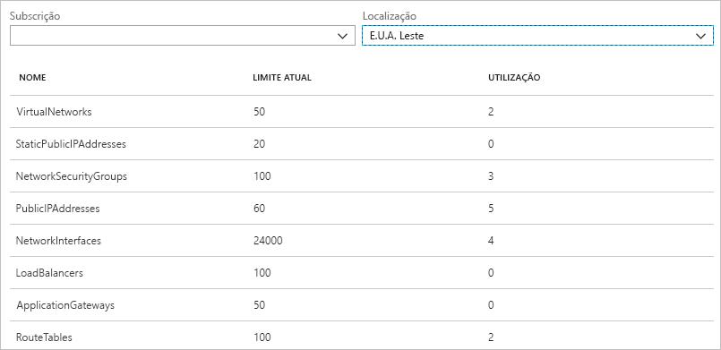
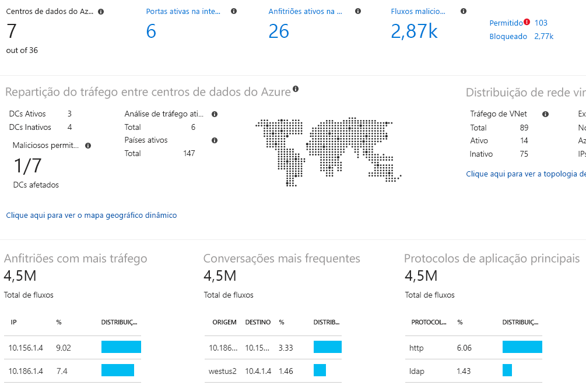

# O que é o Observador de Rede do Azure?

O Observador de Rede do Azure oferece ferramentas para monitorizar, diagnosticar, ver métricas e ativar ou desativar registos de recursos numa rede virtual do Azure.

## Monitorização

### Monitorizar a comunicação entre uma máquina virtual e um ponto final

Os pontos finais podem ser outra máquina virtual (VM), um nome de domínio completamente qualificado (FQDN), um identificador de recursos uniforme (URI) ou um endereço IPv4. A capacidade de *monitorização da ligação* monitoriza a comunicação em intervalos regulares e informa-o do alcance, da latência e das alterações à topologia de rede entre a VM e o ponto final. Por exemplo, pode ter uma VM de servidor Web que comunica com uma VM de servidor de bases de dados. Sem o seu conhecimento, uma pessoa da sua organização poderá aplicar uma rota personalizada ou uma regra de segurança de rede à VM de servidor Web ou de servidor de bases de dados ou à sub-rede.

Se um ponto final ficar inacessível, a resolução de problemas de ligações informa-o do motivo. Alguns possíveis motivos são um problema na resolução de nomes DNS, a CPU, a memória ou a firewall dentro do sistema operativo de uma VM, ou o tipo de salto de uma rota personalizada ou regra de segurança para a VM ou sub-rede da ligação de saída. Saiba mais sobre as [regras de segurança](../virtual-network/security-overview.md?toc=%2fazure%2fnetwork-watcher%2ftoc.json#security-rules) e os [tipos de salto de rotas](../virtual-network/virtual-networks-udr-overview.md?toc=%2fazure%2fnetwork-watcher%2ftoc.json) no Azure.

A monitorização da ligação também disponibiliza a latência mínima, média e máxima registada ao longo do tempo. Depois de determinar a latência de uma ligação, pode constatar que pode diminuí-la ao mover os seus recursos do Azure para outras regiões do Azure. Saiba mais sobre como determinar as [latências relativas entre regiões do Azure e fornecedores de serviços de Internet](#determine-relative-latencies-between-azure-regions-and-internet-service-providers) e como monitorizar a comunicação entre uma VM e um ponto final com o [monitor da ligação](connection-monitor.md). Se preferir testar uma ligação num ponto no tempo, em vez de ao longo do tempo, tal como faz com a monitorização da ligação, utilize a capacidade de [resolução de problemas de ligação](#connection-troubleshoot).

O monitor de desempenho de rede é uma solução de monitorização da rede híbrida baseada na cloud que ajuda a monitorizar o desempenho da rede entre vários pontos na sua infraestrutura de rede. Ajuda também a monitorizar a conectividade da rede ao serviço e pontos finais da aplicação, bem como o desempenho do Azure ExpressRoute. O monitor de desempenho de rede deteta problemas de rede como bloqueio de tráfego, erros de encaminhamento e problemas que os métodos de monitorização de rede convencionais não têm capacidade de detetar. A solução gera alertas e notifica-o quando existir uma falha do limiar de uma ligação de rede. Também garante a deteção atempada de problemas de desempenho de rede e localiza a origem do problema num dispositivo ou segmento de rede específico. Saiba mais sobre o [monitor de desempenho de rede](../log-analytics/log-analytics-network-performance-monitor.md?toc=%2fazure%2fnetwork-watcher%2ftoc.json).

### Ver recursos numa rede virtual e respetivas relações

À medida que são adicionados recursos a uma rede virtual, pode ser mais difícil compreender que recursos são esses e como estão relacionados entre si. A capacidade de *topologia* permite-lhe gerar um diagrama visual dos recursos numa rede virtual e as relações entre os mesmos. A imagem seguinte mostra um diagrama de topologia de exemplo para uma rede virtual que tem três sub-redes, duas VMs, interfaces de rede, endereços IP públicos, grupos de segurança de rede, tabelas de rotas e as relações entre os recursos:

Pode transferir uma versão editável da imagem em formato svg. Saiba mais sobre a [vista da topologia](view-network-topology.md).

## Diagnóstico

### Diagnosticar problemas de filtragem de tráfego de rede de ou para uma VM

Quando implementa uma VM, o Azure aplica várias regras de segurança predefinidas que permitem ou negam o tráfego de ou para a mesma. Pode substituir as regras predefinidas do Azure ou criar regras adicionais. Num determinado momento, uma VM poderá deixar de conseguir comunicar com outros recursos, devido a uma regra de segurança. A capacidade de *verificação de fluxo de IP* permite-lhe especificar um endereço IPv4 de origem e de destino, uma porta, um protocolo (TCP ou UDP) e o sentido do tráfego (entrada ou saída). Em seguida, a verificação de fluxo de IP testa a comunicação e informa-o se a ligação tiver êxito ou fracassar. Se falha, a verificação de fluxo de IP diz-lhe que regra de segurança permitiu ou negou a comunicação, para que possa resolver o problema. Saiba mais sobre verificar o fluxo IP ao concluir o tutorial [Diagnosticar um problema de filtro de tráfego de rede de máquina virtual](diagnose-vm-network-traffic-filtering-problem.md).

### Diagnosticar problemas de encaminhamento de rede a partir de uma VM

Quando cria uma rede virtual, o Azure cria várias rotas de saída predefinidas para o tráfego de rede. O tráfego de saída de todos os recursos, como VMs, implementados numa rede virtual, são encaminhados com base nas rotas predefinidas do Azure. Pode substituir as rotas predefinidas do Azure ou criar rotas adicionais. Pode aperceber-se de que uma VM já não consegue comunicar com outros recursos devido a uma rota específica. A capacidade de *próximo salto* permite-lhe especificar um endereço IPv4 de origem e de destino. Depois, o próximo salto testa a comunicação e informa-o do tipo de próximo salto que é utilizado para encaminhar o tráfego. Pode, em seguida, remover, alterar ou adicionar uma rota, para resolver um problema de encaminhamento. Saiba mais sobre a capacidade de [próximo salto](diagnose-vm-network-routing-problem.md).

### Diagnosticar ligações de saída a partir de uma VM

A capacidade de *resolução de problemas de ligação* permite-lhe testar uma ligação entre uma VM e outra VM, um FQDN, um URI ou um endereço IPv4. O teste devolve informações semelhantes às que são devolvidas quando é utilizada a capacidade de [monitorização da ligação](#connection-monitor), mas testa a ligação num ponto no tempo, em vez de a monitorizar ao longo do tempo, que é o que acontece com a monitorização da ligação. Saiba mais sobre como resolver problemas de ligações com a [resolução de problemas de ligações](network-watcher-connectivity-overview.md).

### Capturar pacotes de e para uma VM

As opções de filtragem avançadas e os controlos otimizados, como a possibilidade de definir limites de tempo e tamanho, proporcionam versatilidade. A captura pode ser armazenada no Armazenamento do Azure, no disco da VM ou em ambos. Depois, pode analisar o ficheiro da captura com várias ferramentas de análise de captura de rede padrão. Saiba mais sobre a [captura de pacotes](network-watcher-packet-capture-overview.md).

### Diagnosticar problemas com ligações e um gateway de rede virtual do Azure

Os gateways de rede virtual oferecem conectividade entre recursos no local e redes virtuais do Azure. Monitorizar os gateways e respetivas ligações é fundamental para garantir que a comunicação não é interrompida. A capacidade de *diagnóstico de VPN* proporciona a capacidade de diagnosticar gateways e ligações. O diagnóstico de VPN diagnostica o estado de funcionamento do gateway, ou da ligação do gateway, e informa-o se estiver disponível um gateway ou uma ligação de gateway. Se o gateway ou a ligação não estiverem disponíveis, o diagnóstico de VPN indica-lhe o motivo, para que possa resolver o problema. Saiba mais sobre os diagnósticos de VPN ao concluir o tutorial [Diagnosticar um problema de comunicação entre redes](diagnose-communication-problem-between-networks.md).

### Determinar as latências relativas entre regiões do Azure e os fornecedores de serviços de Internet

Pode consultar o Observador de Rede para obter informações de latência entre regiões do Azure e nos fornecedores de serviços de Internet. Saber as latências entre regiões do Azure e nos fornecedores de serviços de Internet permite-lhe implementar os recursos do Azure de modo a otimizar o tempo de resposta da rede. Saiba mais sobre as [latências relativas](view-relative-latencies.md).

### Ver as regras de segurança de uma interface de rede

As regras de segurança eficazes para uma interface de rede são uma combinação de todas as regras de segurança aplicadas à interface de rede e à sub-rede na qual a interface de rede se encontra.  A capacidade de *visualização de grupo de segurança* mostra-lhe todas as regras de segurança aplicadas à interface de rede, à sub-rede na qual a interface de rede se encontra e o agregado de ambos. Tendo conhecimento das regras que estão aplicadas a uma interface de rede, pode adicionar, remover ou alterar as regras, caso estejam a permitir ou a negar tráfego que pretenda mudar. Saiba mais sobre a [visualização de grupo de segurança](network-watcher-security-group-view-overview.md).

## Métricas

Existem [limites](../azure-subscription-service-limits.md?toc=%2fazure%2fnetwork-watcher%2ftoc.json#azure-resource-manager-virtual-networking-limits) ao número de recursos de rede que pode criar numa subscrição e numa região do Azure. Caso atinja os limites, não poderá criar mais recursos na subscrição ou região. A capacidade de *limite de subscrição de rede* disponibiliza um resumo da quantidade de cada recurso de rede que implementou numa subscrição e numa região, bem como o limite desses recursos. A imagem seguinte mostra a saída parcial para recursos de rede implementados na região E.U.A. Leste numa subscrição de exemplo:

As informações são úteis para planear implementações de recursos futuras.

## Registos

### Analisar o tráfego de ou para um grupo de segurança de rede

Os grupos de segurança de rede (NSG) permitem ou negam o tráfego de entrada ou de saída para uma interface de rede numa VM. A capacidade de *registo de fluxo de NSG* permite-lhe registar o endereço IP de origem e de destino, a porta, o protocolo e se o tráfego foi permitido ou negado por um NSG. Pode analisar os registos com diversas ferramentas, como o PowerBI e a capacidade de *análise de tráfego*. A análise de tráfego proporciona visualizações ricas dos dados escritos nos registos de fluxo de NSG. A imagem seguinte mostra algumas das informações e visualizações que a análise de tráfego apresenta a partir dos dados de registo de fluxo de NSG:

Saiba mais sobre os registos de fluxo do NSG ao concluir o tutorial [Registar o tráfego de rede de/para uma máquina virtual](network-watcher-nsg-flow-logging-portal.md) e como implementar a [análise de tráfego](traffic-analytics.md).

### Ver registos de diagnóstico de recursos de rede

Pode ativar o registo de diagnóstico para recursos de rede do Azure, como grupos de segurança de rede, endereços IP públicos, balanceadores de carga, gateways de rede virtual e gateways de aplicação. A capacidade de *registos de diagnóstico* oferece uma interface única para ativar e desativar os registos de diagnóstico de recursos de rede para qualquer recurso de rede existente que gere um registo de diagnóstico. Pode ver os registos de diagnóstico com ferramentas como o Microsoft PowerBI e o Azure Log Analytics. Para saber mais sobre como analisar os registos de diagnóstico de rede do Azure, veja [Azure network solutions in Log Analytics](../log-analytics/log-analytics-azure-networking-analytics.md?toc=%2fazure%2fnetwork-watcher%2ftoc.json) (Soluções de rede do Azure no Log Analytics).

## Passos seguintes

Tem agora uma descrição geral do Observador de Rede do Azure. Para começar a utilizar o Observador de Rede, utilize a verificação de fluxo de IP para diagnosticar um problema de comunicação comum de e para uma máquina virtual. Para saber como, veja o início rápido [Diagnose a virtual machine network traffic filter problem](diagnose-vm-network-traffic-filtering-problem.md) (Diagnosticar problemas de filtro de tráfego de rede de uma máquina virtual).
