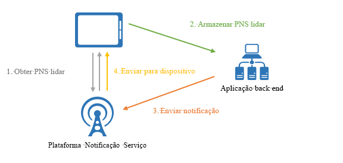
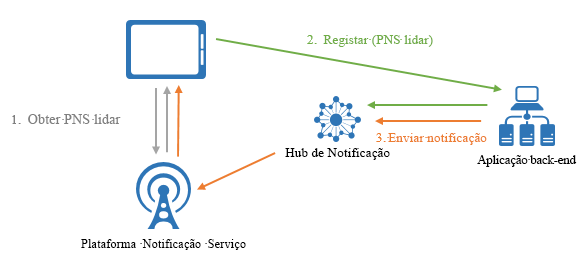

# O que são os Hubs de Notificação do Azure?
Os Hubs de Notificação do Azure oferecem um motor de envio de escalamento horizontal e utilização fácil que lhe permite enviar notificações para qualquer plataforma (iOS, Android, Windows, Kindle, Baidu, etc.) a partir de qualquer back-end (cloud ou no local). Os Hubs de Notificação funcionam perfeitamente para cenários de utilização empresarial e de consumo. Eis alguns exemplos de cenários:

- Enviar notificações de notícias de última hora para milhões com baixa latência.
- Enviar cupões com base na localização a segmentos de utilizadores interessados.
- Enviar notificações relacionadas com eventos a utilizadores ou grupos para aplicações de multimédia/desporto/finanças/jogos.
- Enviar conteúdos promocionais às aplicações, para interação e comercialização junto dos clientes.
- Notificar os utilizadores de eventos da empresa, como mensagens e itens de trabalho novos.
- Enviar códigos para a autenticação multifator.

## O que são as notificações push?
As notificações push são uma forma de comunicação da aplicação para o utilizador, através das quais os utilizadores de aplicações móveis recebem notificações de determinadas informações em que estão interessados, geralmente num pop-up ou numa caixa de diálogo. Regra geral, os utilizadores podem optar por ver ou dispensar as mensagens. Se escolherem ver, a aplicação móvel que comunicou a notificação é aberta.

As notificações push são essenciais para as aplicações de consumidor, para aumentar a interação e a utilização da aplicação, e para as aplicações empresariais, para comunicar informações da empresa atualizadas. É a melhor comunicação da aplicação para o utilizador, pois é eficiente em termos de energia para os dispositivos móveis, flexível para os remetentes das notificações e está disponível quando as aplicações correspondentes não estão ativas.

Para obter mais informações sobre as notificações push para algumas plataformas populares, veja os tópicos seguintes: 
* [iOS](https://developer.apple.com/notifications/)
* [Android](https://developer.android.com/guide/topics/ui/notifiers/notifications.html)
* [Windows](http://msdn.microsoft.com/library/windows/apps/hh779725.aspx)

## Como funcionam as notificações push?
As notificações push são entregues através de infraestruturas específicas da plataforma denominadas *Sistemas de Notificação de Plataforma* (PNS). Oferecem funcionalidades de push barebone para entregar mensagens a dispositivos com um identificador fornecido e não têm uma interface comum. Para enviar uma notificação a todos os clientes nas versões iOS, Android e Windows de uma aplicação, o programador tem de utilizar o Apple Push Notification Service (APNS), o Firebase Cloud Messaging (FCM) e o Windows Notification Service (WNS).

A um nível elevado, eis como o push funciona:

1. A aplicação cliente decide que pretende receber notificações. Por conseguinte,-contacta o PNS correspondente para obter o respetivo identificador de push exclusivo e temporário. O tipo de identificador depende do sistema (por exemplo, o WNS tem URIs, ao passo que o APNS tem tokens).
2. A aplicação cliente armazena este identificador no back-end ou no fornecedor da aplicação.
3. Para enviar uma notificação push, o back-end da aplicação contacta o PNS com o identificador para segmentar uma aplicação cliente específica.
4. O PNS reencaminha a notificação para o dispositivo especificado pelo identificador.

## Os desafios das notificações push
Os PNS são poderosos. Contudo, deixam muito trabalho ao programador da aplicação para implementar até mesmo cenários de notificações push comuns, como difundi-las para utilizadores segmentados.

O envio de notificações exige uma infraestrutura complexa que não está relacionada com a lógica de negócio principal da aplicação. Alguns dos desafios em termos de infraestrutura são:

- **Dependência da plataforma**
    - O back-end tem de ter uma lógica dependente da plataforma, complexa e de manutenção difícil, para enviar notificações a dispositivos em várias plataformas, uma vez que os PNS não estão unificados.
- **Dimensionamento**
    - De acordo com as diretrizes do PNS, os tokens dos dispositivos têm de ser atualizados sempre que a aplicação é iniciada. O back-end está a lidar com uma grande quantidade de tráfego e acesso a bases de dados apenas para manter os tokens atualizados. Se o número de dispositivos aumentar para centenas e milhares de milhões, o custo de criar e manter essa infraestrutura é enorme.
    - A maioria dos PNS não suporta a difusão para vários dispositivos. Uma simples difusão para um milhão de dispositivos resulta num milhão de chamadas para os PNS. Dimensionar esta quantidade de tráfico com latência mínima não é algo trivial.
- **Encaminhamento** 
    - Embora os PNS proporcionem uma forma de enviar mensagens para dispositivos, a maioria das notificações das aplicações são segmentadas para os utilizadores ou para grupos de interesses. O back-end tem de manter um registo para associar os dispositivos aos grupos de interesses, utilizadores, propriedades, etc. Esta sobrecarga soma-se ao tempo de comercialização e aos custos de manutenção das aplicações.

## Porquê utilizar os Hubs de Notificação?
Os Hubs de Notificação eliminam todas as complexidades associadas ao envio de notificações manual a partir do back-end da sua aplicação. A infraestrutura de notificações push de escalamento horizontal e multiplataforma reduz a programação relacionada com pushes e simplifica o seu back-end. Com os Hubs de Notificação, os seus dispositivos são meramente responsáveis pelo registo dos respetivos identificadores do PNS hum hub, ao passo que o back-end envia mensagens aos utilizadores ou grupos de interesse, conforme mostrado na seguinte figura:

Os Hubs de Notificação são o seu motor pronto a usar e oferecem as seguintes vantagens:

- **Várias plataformas**
    - Suporte para todas as principais plataformas de push, incluindo iOS, Android, Windows, Kindle e Baidu.
    - Uma interface comum para enviar para todas plataformas em formatos específicos para uma plataforma ou formatos independentes de plataforma sem qualquer trabalho para uma plataforma específica.
    - Gestão de identificadores dos dispositivos num único local.
- **Vários back-ends**
    - Cloud ou no local
    - .NET, Node.js, Java, etc.
- **Conjunto de padrões de entrega rico**
    - Difunda para uma ou várias plataformas. Pode difundir imediatamente para milhões de dispositivos em diferentes plataformas com uma única chamada à API.
    - Enviar para dispositivo: pode segmentar notificações para dispositivos individuais.
    - Enviar para o utilizador: as funcionalidades de etiquetas e modelos ajudam a alcançar todos os dispositivos dos utilizadores nas várias plataformas.
    - Enviar para segmento com etiquetas dinâmicas: a funcionalidade de etiquetas ajuda a segmentar os dispositivos e a enviar para os mesmos de acordo com as suas necessidades, quer esteja a enviar para um segmento ou para uma expressão de segmentos (por exemplo ativo E vive em Seattle NÃO é utilizador novo). Em vez de estar limitado a publicação-subscrição, pode atualizar as etiquetas dos dispositivos em qualquer lugar e em qualquer altura.
    - Push localizado: a funcionalidade de modelos ajuda a obter a localização sem comprometer o código do back-end.
    - Push silencioso: pode ativar o padrão push-to-pull ao enviar notificações silenciosas para os dispositivos e acioná-las para concluir determinadas extrações ou ações.
    - Push agendado: pode agendar o envio de notificações a qualquer altura.
    - Push direto: pode ignorar o registo dos dispositivos no serviço Hubs de Notificação e enviar por lotes diretamente para uma lista de identificadores de dispositivos.
    - Push personalizado: as variáveis de push dos dispositivos ajudam-no a enviar notificações push personalizadas específicas de dispositivo com pares de chaves-valores personalizados.
- **Telemetria avançada**
    - Está disponível telemetria de pushes, dispositivos, erros e operações no portal do Azure e programaticamente.
    - A Telemetria por Mensagem regista cada push a partir da chamada de pedido inicial ao serviço Hubs de Notificação, processando os pushes por lotes corretamente.
    - O Feedback do Sistema de Notificação de Plataforma comunica todos os feedbacks do Sistema de Notificação de Plataforma, para ajudar na depuração.
- **Escalabilidade** 
    - Enviar mensagens rápidas para milhões de dispositivos sem alterar a arquitetura ou fragmentar os dispositivos.
- **Segurança**
    - Segredo de Acesso Partilhado (SAS) ou autenticação federada.

## Integração com as Aplicações Móveis do Serviço de Aplicações
Para facilitar uma experiência totalmente integrada e unificadora em todos os serviços do Azure, as [Aplicações Móveis do Serviço de Aplicações](../app-service-mobile/app-service-mobile-value-prop.md) têm suporte incorporado para notificações push com os Hubs de Notificação. As [Aplicações Móveis do Serviço de Aplicações](../app-service-mobile/app-service-mobile-value-prop.md) oferecem uma plataforma de desenvolvimento de aplicações móveis altamente dimensionável e globalmente disponível para Programadores Empresariais e Integradores de Sistemas, que fornece um conjunto completo de capacidades para programadores móveis.

Os programadores de Mobile Apps podem utilizar Notification Hubs com o fluxo de trabalho seguinte:

1. Obter o identificador PNS do dispositivo
2. Registar o dispositivo nos Hubs de Notificação através da conveniente API de registo do SDK de Cliente das Aplicações Móveis

    > [!NOTE]
    > Tenha em atenção que, por motivos de segurança, as Mobile Apps eliminam todas as etiquetas ao registarem-se. Trabalhar com Notification Hubs diretamente no seu back-end para associar etiquetas a dispositivos.
1. Enviar notificações a partir do seu back-end de aplicação com Notification Hubs

Aqui estão algumas das conveniências que esta integração proporciona a programadores:

- **SDKs de Cliente de Aplicações Móveis**: estes SDKs multiplataforma proporcionam APIs simples para registar e falar automaticamente com o hub de notificação ligado à aplicação móvel. Os programadores não precisam de analisar a fundo as credenciais dos Notification Hubs e trabalham com um serviço adicional.
    - *Enviar para o utilizador*: os SDKs etiquetam automaticamente o dispositivo especificado com o ID de Utilizador autenticado das Aplicações Móveis para permitir o cenário de envio para o utilizador.
    - *Enviar para o dispositivo*: os SDKs utilizam automaticamente o ID de Instalação das Aplicações Móveis como o GUID para se registarem nos Hubs de Notificação, poupando aos programadores o trabalho de manterem GUIDs para vários serviços.
- **Modelo de instalação**: as Aplicações Móveis funcionam com o modelo push mais recente dos Hubs de Notificação para representar todas as propriedades de push associadas a um dispositivo numa instalação JSON que se alinha com os Serviço de Notificações Push e é fácil de utilizar.
- **Flexibilidade**: os programadores podem sempre optar por trabalhar diretamente com os Hubs de Notificação, mesmo com a integração instalada.
- **Experiência integrada no [portal do Azure](https://portal.azure.com)**: o push como capacidade está representado visualmente nas Aplicações Móveis e os programadores podem trabalhar facilmente com o hub de notificação associado através daquelas.

## Passos seguintes

Seguir [Tutorial: Enviar notificações para aplicações móveis](notification-hubs-android-push-notification-google-fcm-get-started.md) para aprender a criar e a utilizar hubs de notificação. 

[0]: ./media/notification-hubs-overview/registration-diagram.png

[1]: ./media/notification-hubs-overview/notification-hub-diagram.png

[How customers are using Notification Hubs]: http://azure.microsoft.com/services/notification-hubs

[Notification Hubs tutorials and guides]: http://azure.microsoft.com/documentation/services/notification-hubs

[iOS]: http://azure.microsoft.com/documentation/articles/notification-hubs-ios-get-started

[Android]: http://azure.microsoft.com/documentation/articles/notification-hubs-android-get-started

[Windows Universal]: http://azure.microsoft.com/documentation/articles/notification-hubs-windows-store-dotnet-get-started

[Windows Phone]: http://azure.microsoft.com/documentation/articles/notification-hubs-windows-phone-get-started

[Kindle]: http://azure.microsoft.com/documentation/articles/notification-hubs-kindle-get-started

[Xamarin.iOS]: http://azure.microsoft.com/documentation/articles/partner-xamarin-notification-hubs-ios-get-started

[Xamarin.Android]: http://azure.microsoft.com/documentation/articles/partner-xamarin-notification-hubs-android-get-started

[Microsoft.WindowsAzure.Messaging.NotificationHub]: http://msdn.microsoft.com/library/microsoft.windowsazure.messaging.notificationhub.aspx

[Microsoft.ServiceBus.Notifications]: http://msdn.microsoft.com/library/microsoft.servicebus.notifications.aspx

[App Service Mobile Apps]: https://azure.microsoft.com/documentation/articles/app-service-mobile-value-prop/

[templates]: notification-hubs-templates-cross-platform-push-messages.md

[Azure portal]: https://portal.azure.com

[tags]: (http://msdn.microsoft.com/library/azure/dn530749.aspx)
