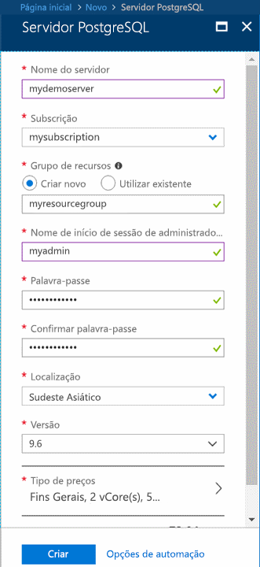
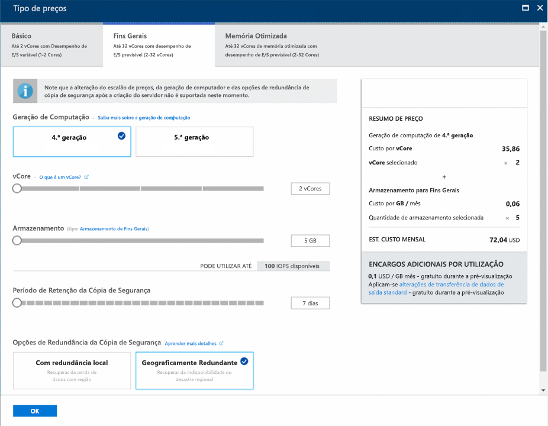
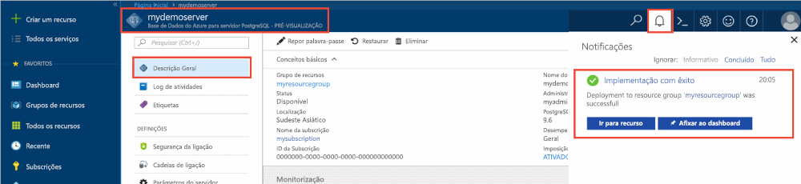
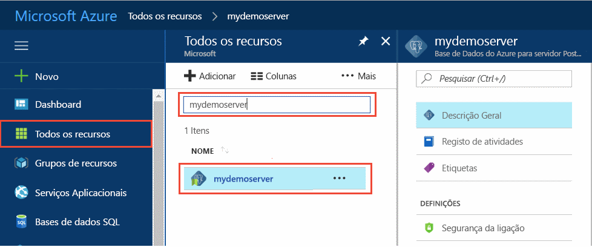
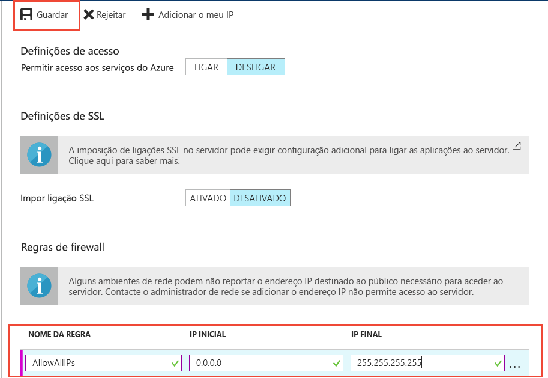
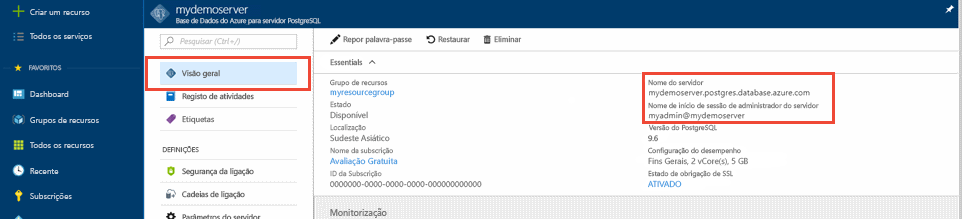
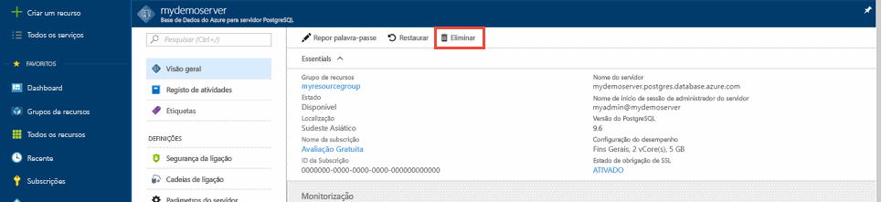

# <a name="quickstart-create-an-azure-database-for-postgresql-server-in-the-azure-portal"></a>Início Rápido: Criar um servidor da Base de Dados do Azure para PostgreSQL no portal do Azure

A Base de Dados do Azure para o PostgreSQL é um serviço gerido com o qual pode executar, gerir e dimensionar as bases de dados de elevada disponibilidade do PostgreSQL na cloud. Este Início Rápido mostra-lhe como criar um servidor da Base de Dados do Azure para PostgreSQL no portal do Azure em cerca de cinco minutos.

Se não tiver uma subscrição do Azure, crie uma [conta do Azure gratuita](https://azure.microsoft.com/free/) antes de começar.

## <a name="sign-in-to-the-azure-portal"></a>Iniciar sessão no portal do Azure
Abra o browser e aceda ao [portal do Azure](https://portal.azure.com/). Introduza as suas credenciais para iniciar sessão no portal. A vista predefinida é o dashboard de serviço.

## <a name="create-an-azure-database-for-postgresql-server"></a>Criar uma Base de Dados do Azure para o servidor PostgreSQL

É criado um servidor da Base de Dados do Azure para PostgreSQL com um conjunto de [recursos de armazenamento e computação](./concepts-pricing-tiers.md) configurado. O servidor é criado dentro de um [grupo de recursos do Azure](../azure-resource-manager/resource-group-overview.md).

Para criar uma Base de Dados do Azure para o servidor PostgreSQL, siga os passos abaixo:
1. Selecione o botão (+) **Criar um recurso**, no canto superior esquerdo do portal.

2. Selecione **Bases de Dados** > **Base de Dados do Azure para PostgreSQL**.

    

3. Preencha o formulário com os detalhes do novo servidor com as seguintes informações:

    

    Definição|Valor sugerido|Descrição
    ---|---|---
    Nome do servidor |*mydemoserver*|Um nome exclusivo que identifique a sua Base de Dados do Azure para o servidor PostgreSQL. O nome de domínio *postgres.database.azure.com* é acrescentado ao nome de servidor que indicar. O servidor só pode conter letras minúsculas, números e o caráter de hífen (-). Tem de conter, pelo menos, 3 a 63 carateres.
    Subscrição|Nome da sua subscrição|A subscrição do Azure que quer utilizar para o servidor. Se tiver várias subscrições, escolha a subscrição na qual o recurso é cobrado.
    Grupo de recursos|*myresourcegroup*| Um nome de grupo de recursos novo ou um já existente na sua subscrição.
    Selecionar origem | *Em branco* | Selecione *Em branco* para criar um novo servidor de raiz. (Selecione *Cópia de segurança* se estiver a criar um servidor a partir de uma cópia de segurança geo de um servidor da Base de Dados do Azure para PostgreSQL existente).
    Início de sessão de administrador do servidor |*myadmin*| A sua própria conta de início de sessão quando se ligar ao servidor. O nome de início de sessão de administrador não pode ser **azure_superuser**, **azure_pg_admin**, **admin**, **administrator**, **root**, **guest** ou **public**. Não pode começar por **pg_**.
    Palavra-passe |A sua palavra-passe| Uma palavra-passe nova para a conta de administrador do servidor. Tem de conter entre 8 e 128 carateres. A sua palavra-passe tem de conter carateres de três das categorias seguintes: letras em maiúscula inglesas, letras em minúscula inglesas, números (0 a 9) e carateres não alfanuméricos (!, $, #, %, etc.).
    Localização|A região mais próxima dos seus utilizadores| A localização que esteja mais próxima dos seus utilizadores.
    Versão|A versão mais recente| A versão mais recente do PostgreSQL, a não ser que tenha requisitos específicos.
    Escalão de preço | **Fins Gerais**, **Geração 4**, **2 vCores**, **5 GB**, **7 dias**, **Geograficamente Redundante** | As configurações de computação, armazenamento e cópia de segurança do seu novo servidor. Selecione **Escalão de preço**. Em seguida, selecione o separador **Fins Gerais**. *Geração 4*, *2 vCores*, *5 GB* e *7 dias* são os valores predefinidos de **Geração de Computação**, **vCore**, **Armazenamento** e **Período de Retenção da Cópia de Segurança**. Pode deixar os controlos de deslize como estão. Para ativar as cópias de segurança do servidor no armazenamento georredundante, selecione **Geograficamente Redundante** nas **Opções de Redundância da Cópia de Segurança**. Para guardar a seleção deste escalão de preço, selecione **OK**. A captura de ecrã seguinte captura estas seleções.

    > [!IMPORTANT]
    > O início de sessão e a palavra-passe de administrador de servidor que especificar aqui serão necessários para iniciar sessão no servidor e nas respetivas bases de dados mais tarde neste Guia de Introdução. Lembre-se ou grave estas informações para utilização posterior.

    

4. Selecione **Criar** para aprovisionar o servidor. Esta operação poderá demorar alguns minutos.

5. Na barra de ferramentas, selecione o ícone **Notificações** (um sino) para monitorizar o processo de implementação. Uma vez concluída a implementação, pode selecionar **Afixar ao dashboard**, o que cria um mosaico para este servidor no dashboard do portal do Azure como um atalho para a página **Descrição geral** do servidor. Selecionar **Ir para recurso** abre a página **Descrição geral** do servidor.

    
   
   Por predefinição, é criada uma base de dados **postgres** no servidor. A base de dados [postgres](https://www.postgresql.org/docs/9.6/static/app-initdb.html) é uma base de dados predefinida que se destina a ser utilizada por utilizadores, utilitários e aplicações de terceiros. (A outra base de dados predefinida é **azure_maintenance**. A sua função é separar os processos de serviço geridos das ações dos utilizadores. Não pode aceder a esta base de dados.)

## <a name="configure-a-server-level-firewall-rule"></a>Configurar uma regra de firewall ao nível do servidor

A Base de Dados do Azure para o PostgreSQL cria uma firewall ao nível do servidor. Impede que as aplicações e ferramentas externas se liguem ao servidor e a quaisquer bases de dados no mesmo, a menos que crie uma regra de firewall para abrir a firewall aos endereços IP específicos. 

1. Depois de concluída a implementação, localize o seu servidor. Se necessário, pode procurá-lo. Por exemplo, no menu do lado esquerdo, selecione **Todos os recursos**. Escreva o nome do servidor, como o exemplo **mydemoserver**, para procurar o servidor que acabou de criar. Selecione o nome do servidor na lista de resultados de pesquisa. É apresentada a página **Descrição Geral** do servidor, que fornece opções para configuração adicional.
 
    

2. Na página do servidor, selecione **Segurança da ligação**.

3. Em **Regras da firewall**, na coluna **Nome da Regra**, selecione a caixa de texto em branco para começar a criar a regra da firewall. 

    Neste Início Rápido, vamos permitir todos os endereços IP no servidor. Preencha a caixa de texto em cada coluna com os valores seguintes:

    Nome da regra | IP de início | IP de fim 
    ---|---|---
    AllowAllIps | 0.0.0.0 | 255.255.255.255

     

4. Na barra de ferramentas superior da página **Segurança da ligação**, selecione **Guardar**. Antes de continuar, aguarde até que a notificação apareça e indique que a atualização da segurança da ligação foi concluída com êxito.

    > [!NOTE]
    > As ligações à Base de Dados do Azure para o servidor PostgreSQL comunicam através da porta 5432. Quando tenta ligar a partir de uma rede empresarial, a firewall da rede poderá não permitir o tráfego de saída através da porta 5432. Se for este o caso, não pode ligar ao servidor, a menos que o seu departamento de TI abra a porta 5432.
    >

## <a name="get-the-connection-information"></a>Obter as informações da ligação

Quando cria a Base de Dados do Azure para o servidor PostgreSQL, também é criada uma base de dados predefinida, com o nome **postgres**. Para ligar ao seu servidor de bases de dados, precisa do nome completo do servidor e as credenciais de início de sessão de administrador. Poderá ter apontado esses valores anteriormente no artigo Guia de Introdução. Se não, pode encontrar facilmente o nome do servidor e as informações de início de sessão na página **Descrição Geral** do servidor, no portal.

Abra a página **Descrição Geral** do servidor. Anote o **Nome do servidor** e o **Nome de início de sessão de administrador do servidor**. Coloque o cursor sobre cada campo e o símbolo de cópia é apresentado à direita do texto. Selecione o símbolo de cópia conforme necessário para copiar os valores.

 

## <a name="connect-to-the-postgresql-database-by-using-psql-in-cloud-shell"></a>Utilizar psql para ligar à Base de Dados do PostgreSQL no Cloud Shell

Estão disponíveis diversas aplicações para ligar à sua Base de Dados do Azure para o servidor PostSQL. Vamos utilizar primeiro o utilitário de linha de comandos psql para ilustrar como ligar ao servidor. Pode utilizar um browser e o Azure Cloud Shell conforme descrito aqui sem ter de instalar software adicional. Se tiver o utilitário de psql instalado localmente no seu computador, pode também ligar a partir do mesmo.

1. No painel de navegação superior, selecione o símbolo de terminal para abrir o Cloud Shell.

   

2. O Cloud Shell é aberto no browser, onde pode escrever os comandos Bash da shell.

   

3. Na linha de comandos do Cloud Shell, ligue a uma base de dados na sua Base de Dados do Azure para o servidor PostgreSQL, ao introduzir a linha de comandos psql.

    Para ligar a uma Base de Dados do Azure para o servidor PostgreSQL com o utilitário [psql](https://www.postgresql.org/docs/9.6/static/app-psql.html), utilize o formato seguinte:
    ```bash
    psql --host=<yourserver> --port=<port> --username=<server admin login> --dbname=<database name>
    ```

    Por exemplo, o comando seguinte liga a um servidor de exemplo:

    ```bash
    psql --host=mydemoserver.postgres.database.azure.com --port=5432 --username=myadmin@mydemoserver --dbname=postgres
    ```

    parâmetro psql |Valor|Descrição
    ---|---|---
    --host | Nome do servidor | O valor do nome de servidor que foi utilizado quando criou anteriormente a Base de Dados do Azure para o servidor PostgreSQL. O servidor de exemplo mostrado é **mydemoserver.postgres.database.azure.com.** Utilize o nome de domínio completamente qualificado (**\*.postgres.database.azure.com**), conforme mostrado no exemplo. Se não se lembrar do nome do servidor, siga os passos na secção anterior para obter as informações da ligação. 
    --port | 5432 | A porta a utilizar quando se liga à Base de Dados do Azure para o servidor PostgreSQL. 
    --username | Nome de início de sessão de administrador do servidor |O nome de utilizador de início de sessão de administrador do servidor que foi fornecido quando criou a Base de Dados do Azure para o servidor PostgreSQL anteriormente. Se não se lembrar do nome de utilizador, siga os passos na secção anterior para obter as informações da ligação. O formato é *username@servername*.
    --dbname | *postgres* | O nome da base de dados predefinido e gerado pelo sistema que foi criado para a primeira ligação. Mais tarde, vai criar a sua própria base de dados.

    Depois de executar o comando psql, com os seus próprios valores de parâmetros, é-lhe pedido que introduza a palavra-passe de administrador do servidor. Esta palavra-passe é a mesma que indicou quando criou o servidor. 

    parâmetro psql |Valor sugerido|Descrição
    ---|---|---
    palavra-passe | A sua palavra-passe de administrador | Os carateres da palavra-passe introduzida não são apresentados na linha de comandos de bash. Depois de escrever todos os carateres, prima a tecla Enter para se autenticar e ligar.

    Quando estiver ligado, o utilitário psql apresenta uma linha de comandos postgres onde escreve os comandos de sql. Na saída da ligação inicial, poderá aparecer um aviso, porque o psql no Cloud Shell pode ter uma versão diferente da versão do servidor da Base de Dados do Azure para PostgreSQL. 
    
    Exemplo de saída psql:
    ```bash
    psql (9.5.7, server 9.6.2)
    WARNING: psql major version 9.5, server major version 9.6.
        Some psql features might not work.
    SSL connection (protocol: TLSv1.2, cipher: ECDHE-RSA-AES256-SHA384, bits: 256, compression: off)
    Type "help" for help.
   
    postgres=> 
    ```

    > [!TIP]
    > Se a firewall não estiver configurada para permitir o endereço IP do Cloud Shell, ocorre o seguinte erro:
    > 
    > "psql: FATAL:  no pg_hba.conf entry for host "0.0.0.0", user "myadmin", database "postgres", SSL on FATAL: SSL connection is required. Especifique as opções de SSL e volte a tentar.
    > 
    > Para resolver o erro, certifique-se de que a configuração do servidor corresponde aos passos na secção "Configure a server-level firewall rule" (Configurar uma regra de firewall ao nível do servidor) deste artigo.

4. Crie uma base de dados vazia com o nome "mypgsqldb" ao escrever o seguinte comando:
    ```bash
    CREATE DATABASE mypgsqldb;
    ```
    O comando pode demorar alguns minutos a concluir. 

5. Na linha de comandos, execute o comando seguinte para mudar a ligação para a base de dados **mypgsqldb** recentemente criada:
    ```bash
    \c mypgsqldb
    ```

6. Escreva `\q` e selecione a tecla Enter para sair do psql. Pode fechar o Cloud Shell depois de terminar.

Ligou-se ao servidor da Base de Dados do Azure para PostgreSQL através do psql no Cloud Shell e criou uma base de dados de utilizador em branco. Avance para a secção seguinte para se ligar com outra ferramenta comum, pgAdmin.

## <a name="connect-to-the-postgresql-server-using-pgadmin"></a>Ligar-se ao Servidor PostgreSQL com pgAdmin

pgAdmin é uma ferramenta de código aberto utilizada com o PostgreSQL. Pode instalar a pgAdmin a partir do site da [pgAdmin](http://www.pgadmin.org/). A versão de pgAdmin que estiver a utilizar poderá ser diferente da utilizada neste Início Rápido. Leia a documentação de pgAdmin se precisar de orientação adicional.

1. Abra a aplicação pgAdmin no computador cliente.

2. Na barra de ferramentas, vá a **Objeto**, paire o rato sobre **Criar** e selecione **Servidor**.

3. Na caixa de diálogo **Criar - Servidor**, no separador **Geral**, introduza um nome amigável exclusivo para o servidor, tal como **mydemoserver**.

    

4. Na caixa de diálogo **Criar - Servidor**, no separador **Ligação**, preencha a tabela de definições.

   

    parâmetro pgAdmin |Valor|Descrição
    ---|---|---
    Nome/endereço do anfitrião | Nome do servidor | O valor do nome de servidor que foi utilizado quando criou anteriormente a Base de Dados do Azure para o servidor PostgreSQL. O nosso servidor de exemplo é **mydemoserver.postgres.database.azure.com.** Utilize o nome de domínio completamente qualificado (**\*.postgres.database.azure.com**), conforme mostrado no exemplo. Se não se lembrar do nome do servidor, siga os passos na secção anterior para obter as informações da ligação. 
    Porta | 5432 | A porta a utilizar quando se liga à Base de Dados do Azure para o servidor PostgreSQL. 
    Base de dados de manutenção | *postgres* | O nome predefinido da base de dados gerado pelo sistema.
    Nome de utilizador | Nome de início de sessão de administrador do servidor | O nome de utilizador de início de sessão de administrador do servidor que foi fornecido quando criou a Base de Dados do Azure para o servidor PostgreSQL anteriormente. Se não se lembrar do nome de utilizador, siga os passos na secção anterior para obter as informações da ligação. O formato é *username@servername*.
    Palavra-passe | A sua palavra-passe de administrador | A palavra-passe que escolheu quando criou o servidor anteriormente neste Início Rápido.
    Função | Deixar em branco | Não é necessário indicar um nome de função neste momento. Deixe o campo em branco.
    Modo SSL | *Requerer* | Pode definir o modo SSL no separador SSL de pgAdmin. Por predefinição, todos os servidores da Base de Dados do Azure para PostgreSQL são criados com a imposição de SSL ativada. Para desativar a imposição de SSL, veja [Impor SSL](./concepts-ssl-connection-security.md).
    
5. Selecione **Guardar**.

6. No painel **Browser** do lado esquerdo, expanda o nó **Servidores**. Selecione o seu servidor, como, por exemplo, **mydemoserver**. Clique para ligar ao mesmo.

7. Expanda o nó de servidor e, em seguida, expanda **Bases de Dados** sob o mesmo. A lista deve incluir a sua base de dados *postgres* existente e quaisquer outras bases de dados que tenha criado. Pode criar várias bases de dados por servidor com a Base de Dados do Azure para PostgreSQL.

8. Clique com o botão direito em **Bases de Dados**, escolha o menu **Criar** e selecione **Base de Dados**.

9. Escreva um nome de base de dados à sua escolha no campo **Base de Dados**, como **mypgsqldb2**.

10. Selecione o **Proprietário** da base de dados na caixa de listagem. Escolha o nome de início de sessão de administrador do servidor, como o exemplo **my admin**.

   

11. Seleione **Guardar** para criar uma base de dados vazia nova.

12. No painel **Browser**, pode ver a base de dados que criou na lista de bases de dados, no nome do seu servidor.


## <a name="clean-up-resources"></a>Limpar recursos
Pode limpar os recursos que criou no Início Rápido de duas formas. Pode eliminar o [grupo de recursos do Azure](../azure-resource-manager/resource-group-overview.md), que inclui todos os recursos no grupo de recursos. Se quiser manter os outros recursos intactos, elimine apenas o recurso do servidor.

> [!TIP]
> Outros Guias de Introdução desta coleção compilados com base neste Guia de Introdução. Se pretender continuar a trabalhar com Guias de Introdução, não limpe os recursos que criou neste Guia de Introdução. Se não quiser continuar, siga estes passos para eliminar os recursos criados por este Início Rápido no portal.

Para eliminar o grupo de recursos inteiro, incluindo o servidor criado recentemente:
1. Localize o grupo de recursos no portal. No menu do lado esquerda, selecione **Grupos de recursos**. Em seguida, selecione o nome do grupo de recursos, como o exemplo **myresourcegroup**.

2. Na página do grupo de recursos, selecione **Eliminar**. Escreva o nome do grupo de recursos, como o exemplo **myresourcegroup**, na caixa de texto para confirmar a eliminação. Selecione **Eliminar**.

Para eliminar o servidor criado recentemente:
1. Localize o seu servidor no portal, se não estiver aberto. No menu do lado esquerdo, selecione **Todos os recursos**. Em seguida, procure o servidor que criou.

2. Na página **Descrição geral**, selecione **Eliminar**.

    

3. Confirme o nome do servidor que quer eliminar e veja as bases de dados incluídas que são afetadas. Escreva o nome do seu servidor na caixa de texto, como o exemplo **mydemoserver**. Selecione **Eliminar**.

## <a name="next-steps"></a>Passos seguintes
> [!div class="nextstepaction"]
> [Migrar a base de dados com Exportar e Importar](./howto-migrate-using-export-and-import.md)
