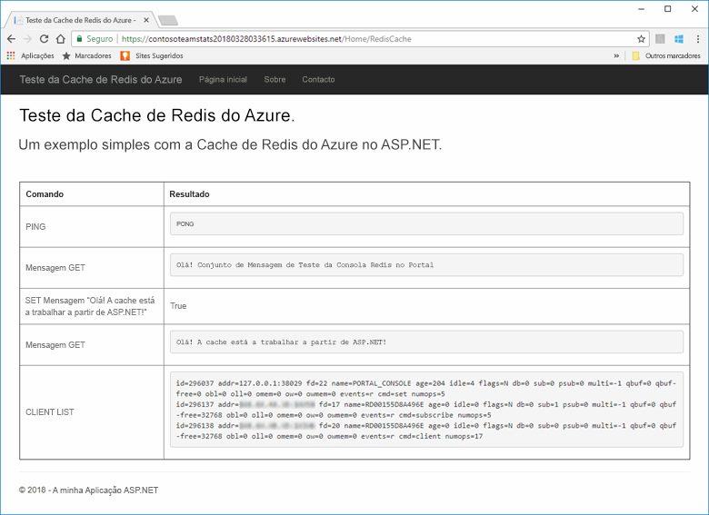
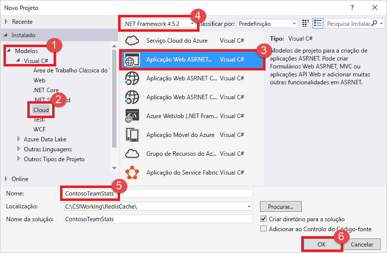
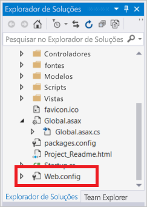
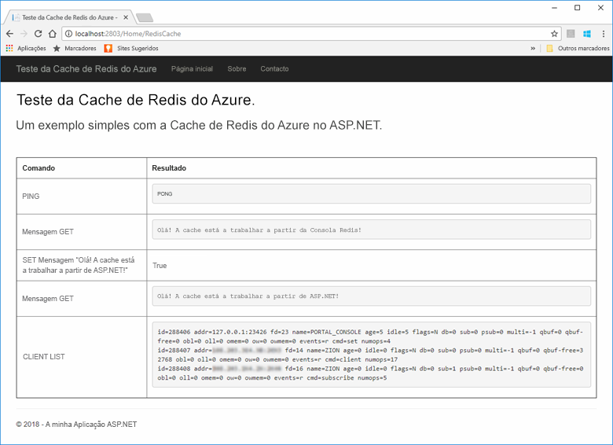
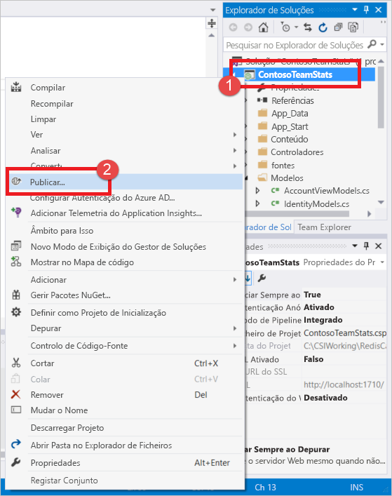
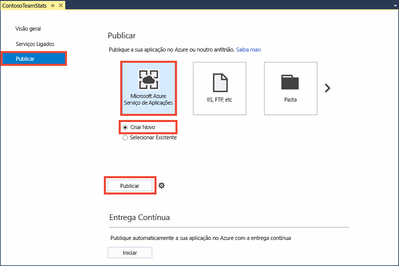
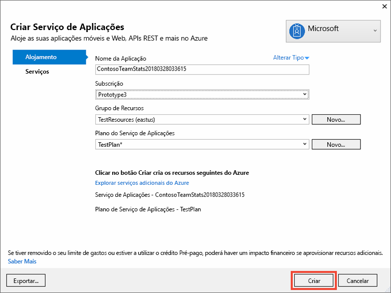
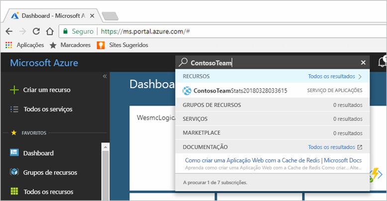
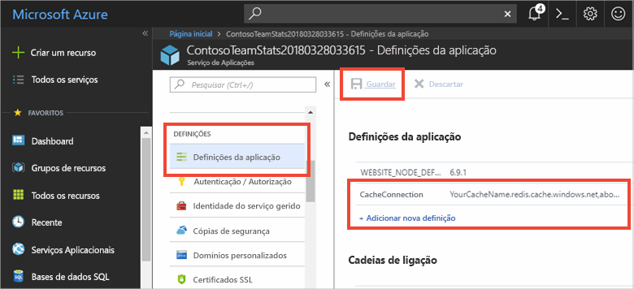
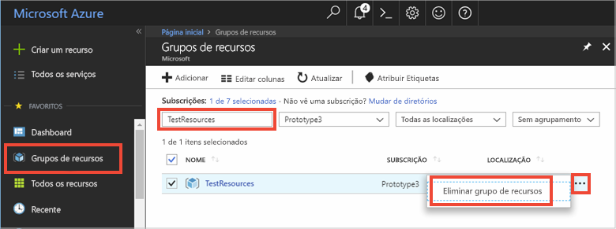

# <a name="quickstart-create-a-aspnet-web-app-with-redis-cache"></a>Início Rápido: Criar uma aplicação Web ASP.NET com a Cache de Redis

> [!div class="op_single_selector"]
> * [.NET](cache-dotnet-how-to-use-azure-redis-cache.md)
> * [ASP.NET](cache-web-app-howto.md)
> * [Node.js](cache-nodejs-get-started.md)
> * [Java](cache-java-get-started.md)
> * [Python](cache-python-get-started.md)
>

## <a name="introduction"></a>Introdução

Este início rápido mostra como criar e implementar uma aplicação Web ASP.NET num Serviço de Aplicações do Azure com o Visual Studio 2017. A aplicação de exemplo liga-se a uma Cache de Redis do Azure para armazenar e obter dados da cache. Quando concluir o início rápido, terá uma aplicação Web funcional, alojada no Azure, que lê e escreve numa Cache de Redis do Azure.



## <a name="prerequisites"></a>Pré-requisitos

Para concluir o início rápido, deve ter os seguintes pré-requisitos:

* Instale o [2017 do Visual Studio](https://www.visualstudio.com/downloads/) com as seguintes cargas de trabalho:
    * Desenvolvimento ASP.NET e Web
    * Desenvolvimento do Azure

[!INCLUDE [quickstarts-free-trial-note](../../includes/quickstarts-free-trial-note.md)]

## <a name="create-the-visual-studio-project"></a>Criar o projeto do Visual Studio

Abra o Visual Studio e clique em **Ficheiro**, **Novo**, **Projeto**.



Na caixa de diálogo Novo Projeto, siga os passos seguintes:

1. Expanda o nó **Visual C#** na lista **Modelos**
1. Selecione **Cloud**
1. Clique em **Aplicação Web ASP.NET**
1. Confirme que está selecionado o **.NET Framework 4.5.2** ou superior
1. Dê um nome ao projeto na caixa de texto **Nome**; neste exemplo, utilizámos **ContosoTeamStats**
1. Clique em **OK**.

Será apresentado um ecrã com a Nova Aplicação Web ASP.NET:


Selecione **MVC** como tipo de projeto.

Certifique-se de que **Sem Autenticação** está especificado para as definições **Autenticação**. Dependendo da versão do Visual Studio, a predefinição pode ser outra. Para alterá-la, clique em **Alterar Autenticação** e selecione **Sem Autenticação**.

Clique em **OK** para criar o projeto.

## <a name="create-a-cache"></a>Criar uma cache

Em seguida, crie a cache para a aplicação.

[!INCLUDE [redis-cache-create](../../includes/redis-cache-create.md)]

[!INCLUDE [redis-cache-access-keys](../../includes/redis-cache-access-keys.md)]

No computador, crie um ficheiro denominado *CacheSecrets.config* e coloque-o numa localização onde não será registado com o código fonte da aplicação de exemplo. Para este início rápido, o ficheiro *CacheSecrets.config* está localizado aqui: *C:\AppSecrets\CacheSecrets.config*.

Edite o ficheiro *CacheSecrets.config* e adicione os seguintes conteúdos:

```xml
<appSettings>
    <add key="CacheConnection" value="<cache-name>.redis.cache.windows.net,abortConnect=false,ssl=true,password=<access-key>"/>
</appSettings>
```

Substitua `<cache-name>` pelo nome do anfitrião da cache.

Substitua `<access-key>` pela chave primária da sua cache.

> [!TIP]
> A chave de acesso secundária é utilizada durante a rotação da chave como uma chave alternativa enquanto regenera a chave de acesso primária.
>

Guarde o ficheiro.

## <a name="update-the-mvc-application"></a>Atualizar a aplicação MVC

Nesta secção, vai atualizar a aplicação para suportar uma nova vista para apresentar um teste simples de uma Cache de Redis do Azure.

* [Atualizar o ficheiro web.config com uma definição de aplicação para a cache](#Update-the-webconfig-file-with-an-app-setting-for-the-cache)
* [Configurar a aplicação para utilizar o cliente StackExchange.Redis](#configure-the-application-to-use-stackexchangeredis)
* [Atualizar o HomeController e o Esquema](#update-the-homecontroller-and-layout)
* [Adicionar uma nova vista da RedisCache](#add-a-new-rediscache-view)

### <a name="update-the-webconfig-file-with-an-app-setting-for-the-cache"></a>Atualizar o ficheiro web.config com uma definição de aplicação para a cache

Quando executar a aplicação localmente, as informações em *CacheSecrets.config* são utilizadas para estabelecer ligação à sua instância da Cache de Redis do Azure. Posteriormente, vai implementar esta aplicação no Azure. Nessa altura, vai configurar uma definição de aplicação no Azure que a aplicação utilizará para obter as informações de ligação da cache em vez deste ficheiro. Uma vez que o ficheiro *CacheSecrets.config* não está implementado no Azure com a sua aplicação, só pode utilizá-lo durante o teste da aplicação localmente. Deve manter estas informações o mais seguras possíveis para impedir o acesso malicioso aos seus dados em cache.

Em **Explorador de Soluções**, faça duplo clique no ficheiro *web.config* para o abrir.



No ficheiro *web.config*, localize o elemento `<appSetting>` e adicione o seguinte atributo `file`. Se utilizou um nome de ficheiro ou localização diferentes, substitua estes valores pelos valores mostrados no exemplo.

* Antes: `<appSettings>`
* Depois: ` <appSettings file="C:\AppSecrets\CacheSecrets.config">`

O tempo de execução do ASP.NET une o conteúdo do ficheiro externo e a marcação no elemento `<appSettings>`. O tempo de execução ignora o atributo de ficheiro se não for possível localizar o ficheiro especificado. Os segredos (a cadeia de ligação para a cache) não são incluídos como parte do código fonte da aplicação. Quando implementa a aplicação Web no Azure, o ficheiro *CacheSecrests.config* não é implementado.

### <a name="configure-the-application-to-use-stackexchangeredis"></a>Configurar a aplicação para utilizar o StackExchange.Redis

Para configurar a aplicação para utilizar o pacote NuGet [StackExchange.Redis](https://github.com/StackExchange/StackExchange.Redis) para o Visual Studio, clique em **Ferramentas > Gestor de Pacotes NuGet > Consola do Gestor de Pacotes**.

Execute o seguinte comando a partir da janela `Package Manager Console`:

```powershell
Install-Package StackExchange.Redis
```

O pacote NuGet transfere e adiciona as referências de assemblagem necessárias para a sua aplicação cliente aceder à Cache de Redis do Azure com o cliente de cache StackExchange.Redis. Se preferir utilizar uma versão com um nome forte da biblioteca de cliente `StackExchange.Redis`, instale o pacote `StackExchange.Redis.StrongName`.

### <a name="update-the-homecontroller-and-layout"></a>Atualizar o HomeController e o Esquema

No **Explorador de Soluções**, expanda a pasta **Controladores** e abra o ficheiro *HomeController.cs*.

Adicione as duas instruções `using` abaixo na parte superior do ficheiro para suportar as definições da aplicação e do cliente da cache.

```csharp
using System.Configuration;
using StackExchange.Redis;
```

Adicione o seguinte método à classe `HomeController` para suportar uma nova ação `RedisCache` que executa alguns comandos numa nova cache.

```csharp
    public ActionResult RedisCache()
    {
        ViewBag.Message = "A simple example with Azure Redis Cache on ASP.NET.";

        var lazyConnection = new Lazy<ConnectionMultiplexer>(() =>
        {
            string cacheConnection = ConfigurationManager.AppSettings["CacheConnection"].ToString();
            return ConnectionMultiplexer.Connect(cacheConnection);
        });

        // Connection refers to a property that returns a ConnectionMultiplexer
        // as shown in the previous example.
        IDatabase cache = lazyConnection.Value.GetDatabase();

        // Perform cache operations using the cache object...

        // Simple PING command
        ViewBag.command1 = "PING";
        ViewBag.command1Result = cache.Execute(ViewBag.command1).ToString();

        // Simple get and put of integral data types into the cache
        ViewBag.command2 = "GET Message";
        ViewBag.command2Result = cache.StringGet("Message").ToString();

        ViewBag.command3 = "SET Message \"Hello! The cache is working from ASP.NET!\"";
        ViewBag.command3Result = cache.StringSet("Message", "Hello! The cache is working from ASP.NET!").ToString();

        // Demostrate "SET Message" executed as expected...
        ViewBag.command4 = "GET Message";
        ViewBag.command4Result = cache.StringGet("Message").ToString();

        // Get the client list, useful to see if connection list is growing...
        ViewBag.command5 = "CLIENT LIST";
        ViewBag.command5Result = cache.Execute("CLIENT", "LIST").ToString().Replace(" id=", "\rid=");

        lazyConnection.Value.Dispose();

        return View();
    }
```

No **Explorador de Soluções**, expanda a pasta **Vistas**>**Partilhadas** e abra o ficheiro *_Layout.cshtml*.

Substituir:

```csharp
@Html.ActionLink("Application name", "Index", "Home", new { area = "" }, new { @class = "navbar-brand" })
```

Por:

```csharp
@Html.ActionLink("Azure Redis Cache Test", "RedisCache", "Home", new { area = "" }, new { @class = "navbar-brand" })
```

### <a name="add-a-new-rediscache-view"></a>Adicionar uma nova vista da RedisCache

No **Explorador de Soluções**, expanda a pasta **Vistas** e, em seguida, clique com o botão direito do rato na pasta **Raiz**. Escolha **Adicionar** > **Vista...**

Na caixa de diálogo Adicionar vista, introduza **RedisCache** para o Nome da Vista e clique em **Adicionar**.

Substitua o código no ficheiro *RedisCache.cshtml* pelo código seguinte:

```csharp
@{
    ViewBag.Title = "Azure Redis Cache Test";
}

<h2>@ViewBag.Title.</h2>
<h3>@ViewBag.Message</h3>
<br /><br />
<table border="1" cellpadding="10">
    <tr>
        <th>Command</th>
        <th>Result</th>
    </tr>
    <tr>
        <td>@ViewBag.command1</td>
        <td><pre>@ViewBag.command1Result</pre></td>
    </tr>
    <tr>
        <td>@ViewBag.command2</td>
        <td><pre>@ViewBag.command2Result</pre></td>
    </tr>
    <tr>
        <td>@ViewBag.command3</td>
        <td><pre>@ViewBag.command3Result</pre></td>
    </tr>
    <tr>
        <td>@ViewBag.command4</td>
        <td><pre>@ViewBag.command4Result</pre></td>
    </tr>
    <tr>
        <td>@ViewBag.command5</td>
        <td><pre>@ViewBag.command5Result</pre></td>
    </tr>
</table>
```

## <a name="run-the-app-locally"></a>Executar a aplicação localmente

Por predefinição, o projeto está configurado para alojar a aplicação localmente em [IIS Express](https://docs.microsoft.com/iis/extensions/introduction-to-iis-express/iis-express-overview) para testes e depuração.

No Visual Studio, no menu, clique em **Depurar** > **Iniciar Depuração** para criar e iniciar a aplicação localmente para testes e depuração.

No browser, clique em **Teste da Cache de Redis do Azure** na barra de navegação.

No exemplo abaixo, pode ver que a chave `Message` tinha anteriormente um valor em cache, o qual foi definido com a Consola Redis no portal. A aplicação atualizou esse valor em cache. A aplicação também executou os comandos `PING` e `CLIENT LIST`.



## <a name="publish-and-run-in-azure"></a>Publicar e executar no Azure

Assim que tiver testado com êxito a aplicação localmente, implemente a aplicação no Azure e execute-a na cloud.

### <a name="publish-the-app-to-azure"></a>Publicar a aplicação no Azure

No Visual Studio, clique com o botão direito do rato no nó do projeto no Explorador de Soluções e selecione **Publicar**.



Clique em **Serviço de Aplicações do Microsoft Azure**, escolha **Criar Novo** e clique em **Publicar**.



Na caixa de diálogo **Criar Serviço de Aplicações**, faça as seguintes alterações:

| Definição | Valor Recomendado | Descrição |
| ------- | :---------------: | ----------- |
| **Nome da Aplicação** | Utilizar predefinição | O nome da aplicação será o nome do anfitrião da aplicação quando for implementada no Azure. O nome pode ter um sufixo de carimbo de data/hora adicionado ao mesmo, caso seja necessário torná-lo exclusivo. |
| **Subscrição** | Escolher a sua subscrição do Azure | Esta subscrição será debitada relativamente a quaisquer custos de alojamento relacionados. Se tiver várias subscrições do Azure, verifique se a subscrição desejada está selecionada.|
| **Grupo de Recursos** | Utilize o mesmo grupo de recursos onde criou a cache. Por exemplo, *TestResourceGroup*. | O grupo de recursos ajuda-o caso pretenda gerir todos os recursos como um grupo. Mais tarde, quando pretender eliminar a aplicação, basta apenas eliminar o grupo. |
| **App Service Plan** (Plano do Serviço de Aplicações) | Clique em **Novo** e crie um novo plano do Serviço de Aplicações com o nome *TestingPlan*. <br />Utilize a mesma **Localização** que serviu para criar a cache. <br />Escolha **Gratuito** para o tamanho. | Um plano de Serviço de Aplicações define um conjunto de recursos de computação para a execução da aplicação Web. |



Depois de configurar as definições de alojamento do Serviço de Aplicações, clique em **Criar** para criar um novo Serviço de Aplicações para a sua aplicação.

Monitorize a janela **Saída** no Visual Studio para ver o estado da publicação no Azure. Quando a publicação for concluída com êxito, o URL para o Serviço de Aplicações é registado como mostrado abaixo:


### <a name="add-the-app-setting-for-the-cache"></a>Adicionar a definição da aplicação à cache

Depois de concluída a publicação para o novo Serviço de Aplicações, adicione uma nova definição de aplicação. Esta definição será utilizada para armazenar as informações de ligação da cache. Escreva o nome da aplicação na barra de pesquisa, na parte superior do portal do Azure, para localizar o novo Serviço de Aplicações que acabou de criar.



Adicione uma nova definição de aplicação denominada **CacheConnection** para a aplicação utilizar para se ligar à cache. Utilize o mesmo valor que configurou para `CacheConnection` no ficheiro *CacheSecrets.config*. O valor contém o nome do anfitrião da cache e a chave de acesso.



### <a name="run-the-app-in-azure"></a>Executar a aplicação no Azure

No browser, navegue até ao URL do Serviço de Aplicações. O URL é mostrado nos resultados da operação de publicação na janela Saída no Visual Studio. Também é fornecido no portal do Azure na página Descrição geral do Serviço de Aplicações que criou.

Clique em **Teste da Cache de Redis do Azure** na barra de navegação para testar o acesso à cache.


## <a name="clean-up-resources"></a>Limpar recursos

Se avançar para o próximo tutorial, pode manter os recursos que criou neste início rápido e reutilizá-los.

Caso contrário, se tiver concluído a aplicação de exemplo do início rápido, poderá eliminar os recursos do Azure criados neste início rápido, para evitar encargos. 

> [!IMPORTANT]
> A eliminação de um grupo de recursos é irreversível e o grupo de recursos e todos os recursos nele contidos serão permanentemente eliminados. Confirme que não elimina acidentalmente o grupo de recursos ou recursos errados. Se tiver criado os recursos para alojar este exemplo num grupo de recursos existente que contém os recursos que pretende manter, poderá eliminar cada recurso individualmente nos respetivos painéis em vez de eliminar o grupo de recursos.
>

Inicie sessão no [Portal do Azure](https://portal.azure.com) e clique em **Grupos de recursos**.

Na caixa de texto **Filtrar por nome...**, escreva o nome do grupo de recursos. As instruções neste tópico utilizaram um grupo de recursos denominado *TestResources*. No grupo de recursos na lista de resultados, clique em **...** e em **Eliminar grupo de recursos**.



É-lhe pedido que confirme a eliminação do grupo de recursos. Escreva o nome do grupo de recursos para confirmar e clique em **Eliminar**.

Após alguns instantes, o grupo de recursos e todos os recursos nele contidos serão eliminados.

## <a name="next-steps"></a>Passos seguintes

Neste próximo tutorial, vai utilizar a Cache de Redis do Azure num cenário de mundo real para melhorar o desempenho de uma aplicação. Vai atualizar esta aplicação com os resultados de classificação da cache com o padrão cache-aside com ASP.NET e uma base de dados.

> [!div class="nextstepaction"]
> [Criar uma classificação cache-aside no ASP.NET](cache-web-app-cache-aside-leaderboard.md)
